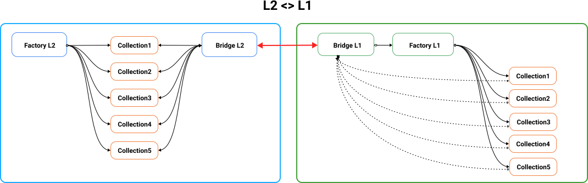
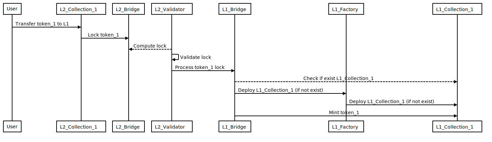
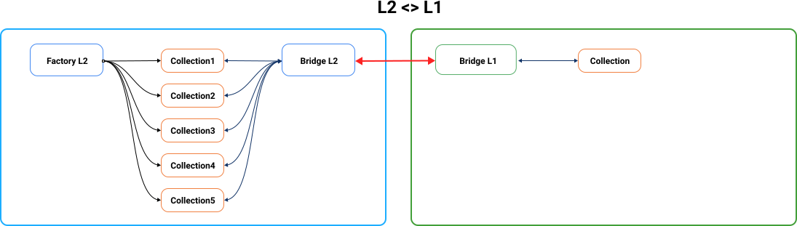
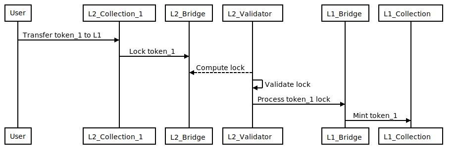

# Collections architecture in L1 & L2

## Context and Problem Statement

Collections will be a key in the Decentraland ecosystem. To bring more scalability and reduce costs the L2 will be seen as the main chain, and L1, as the gateway for collectors to use/buy/sell tokens in other platforms.

L1 could be seen as Ethereum mainnet and L2 any other sidechain EVM compatible as Matic or xDai.

Each collection follows the ERC721 standard. Every token transferred between layers will keep a reference of itself in the main chain:

- Collection address in L2. E.g: `0x2dac71c8c8a4b9547b53c1e1838152ca3277ce76`
- Token Id in L2. E.g: `1`
- Token URI in L2 (URI used for Decentraland and other platforms to know how the token looks like). E.g: `https://peer.decentraland.org/lambdas/collections/standard/erc721/0x2dac71c8c8a4b9547b53c1e1838152ca3277ce76/0`

This document presents 2 alternatives on how to manage the collections between L1 & L2.

## Alternatives

### Alternative 1: Exact Collections' replication



Collections will be created through a Collection factory by users.

Collections in L1 will have the same address and the tokens will have the same id that they have in L2.

For example, if a user has the token with id `1` for the collection `0x326923D43226d9824aab694A3C1C566FeDa50AEb` on L2, after transferring the token to L1, he will have the same token with the same id for the same collection in L1:

```
# L2:
- L2_Collection_1: 0x326923D43226d9824aab694A3C1C566FeDa50AEb
- token id: 1

- L2_Collection_2: 0x5B02123189F7F9251b5E57c390695c0d3B46e640
- token id: 1

# L1:
- L1_Collection_1: 0x326923D43226d9824aab694A3C1C566FeDa50AEb
- token id: 1

- L1_Collection_2: 0x5B02123189F7F9251b5E57c390695c0d3B46e640
- token id: 1
```

#### L2 to L1



#### L1 to L2


### Alternative 2: Minimalist Collection replication



Collections will be created through a Collection factory by users.

Collections in L2 will be represented by a sole and unique collection in L1. The id of each token **must be** unique inside a collection. To avoid token ids collision, the id of each token will be the result of applying a hash function to the original token data.

For example, iif a user has the token with id `1` for the collection `0x326923D43226d9824aab694A3C1C566FeDa50AEb` and the token id `1` for the collection `0x5B02123189F7F9251b5E57c390695c0d3B46e640` on L2, after transferring the token to L1, he will have a token id: _`hash(0x326923D43226d9824aab694A3C1C566FeDa50AEb, 1)`_ and the token id: _`hash(0x5B02123189F7F9251b5E57c390695c0d3B46e640, 1)`_ for the collection `0xF2a7755CFC27cedcb2BB9C65bf7B7dB380B54d63`:

```
# L2:
- L2_Collection_1: 0x326923D43226d9824aab694A3C1C566FeDa50AEb
- token id: 1

- L2_Collection_2: 0x5B02123189F7F9251b5E57c390695c0d3B46e640
- token id: 1

- L2_Collection_2: 0x5B02123189F7F9251b5E57c390695c0d3B46e640
- token id: 2

# L1:
- L1_Collection: 0xF2a7755CFC27cedcb2BB9C65bf7B7dB380B54d63
- token id: hash(0x326923D43226d9824aab694A3C1C566FeDa50AEb, 1)

- L1_Collection: 0xF2a7755CFC27cedcb2BB9C65bf7B7dB380B54d63
- token id: hash(0x5B02123189F7F9251b5E57c390695c0d3B46e640, 1)

- L1_Collection: 0xF2a7755CFC27cedcb2BB9C65bf7B7dB380B54d63
- token id: hash(0x5B02123189F7F9251b5E57c390695c0d3B46e640, 2)
```

#### L2 to L1



#### L1 to L2


## Decision Outcome

#### Alternative 1

#### Pro

- Keep the same address and token ids between layers.

#### Cons

- Need to send N transactions for each collection to set authorizations. This is needed to use tokens in marketplaces. At Decentraland users need to approve the marketplace contract to use tokens on your behalf per each contract (collection).

#### Alternative 2

##### Pro

- Users will need to send only one transaction per marketplace to authorize the usage of tokens.
- We can use the unique collection as a valid and the official one for Decentraland in L1.

##### Cons

- Users won't be able to map the token by only seeing the address and the token id.
