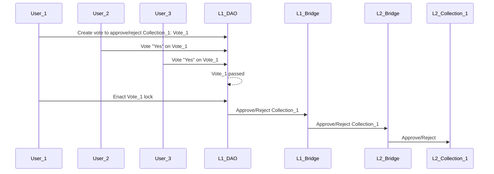
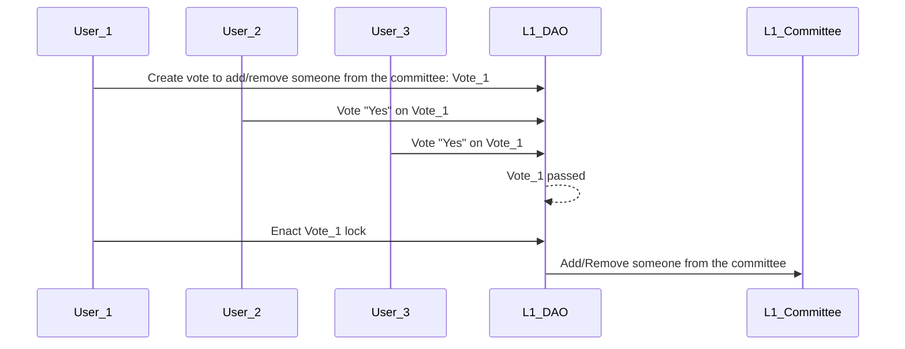
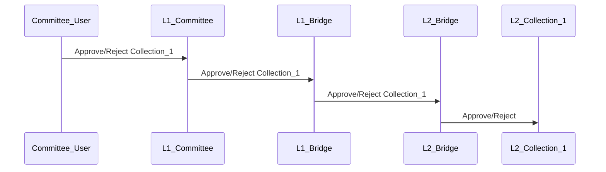
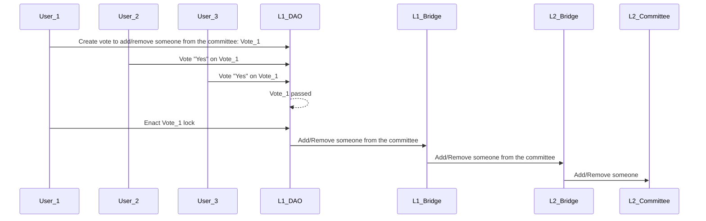
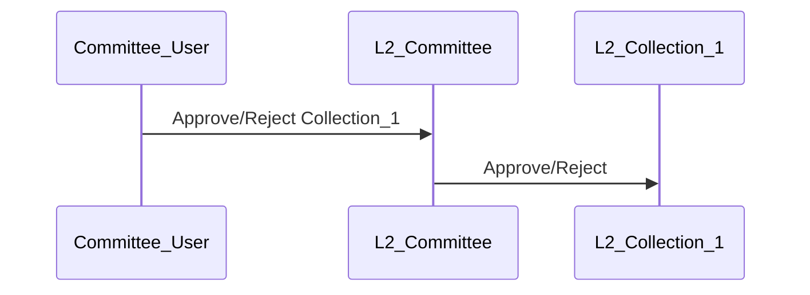
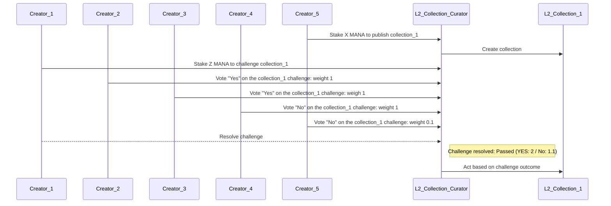

## Context and Problem Statement

A way to moderate the content of the Decentraland collections is needed to prevent spam, abuse, clone and copyright. The Decentraland's collections will be created in a L2, where the expected cost of creating a collection is (almost) 0 USD.

This document presents alternatives on how Decentraland collection moderation will work.

This document use as base a committee/board explained [here](https://forum.decentraland.org/t/proposal-wearables-committee-of-curators/320): https://forum.decentraland.org/t/proposal-wearables-committee-of-curators/320

## Alternatives

### Alternative 1. Entity in L1 moderates collections in L2

The management of L2's collections could be handle by the DAO or by a special on-chain entity.

```x-dot
digraph {
    rankdir=TB
    graph [fontname = "arial", fontsize="10", color="grey", fontcolor="grey"]
    node [fontname = "arial",fontsize="10", shape="box", style="rounded"]
    edge [fontname = "arial",color="blue", fontcolor="black",fontsize="10"]

    subgraph clusterL1 {
        color=green
        label="L1 Ethereum"

        bridge_l1 [label="Bridge L1"]
        entity [label="Entity"]

        edge [fontname = "arial",color="blue", fontcolor=green, fontsize="10"];
        entity -> bridge_l1 [color=green, fontColor="green", label="  Act on L2   "]
    }

     subgraph clusterL2 {
        color=blue
        label="L2 Main chain"
        bridge_l2 [label="bridge L2"]
        collection_1 [label="Collection_1 L2"]
        collection_2 [label="Collection_2 L2"]
        collection_3 [label="Collection_3 L2"]
        collection_4 [label="Collection_4 L2"]

        edge [fontname = "arial",color="blue", fontcolor=blue,fontsize="10"];
        bridge_l2 -> collection_1 [color=blue, label=" approve/reject "]
        bridge_l2 -> collection_2 [color=blue, label=" approve/reject "]
        bridge_l2 -> collection_3 [color=blue, label=" approve/reject "]
        bridge_l2 -> collection_4 [color=blue, label=" approve/reject "]
    }

    bridge_l1 -> bridge_l2
    bridge_l2 -> bridge_l1
}
```

#### With DAO

_**Entity** = DAO_

##### Manage Collections ( > 2 transaction)

- A vote to approve/reject a collection in L2 must be started in the Decentraland's DAO in L1.
- At vote enactment, a message will be forwarded from L1 to L2 by a bridge ending up with the collection approved/rejected in L2.



#### With Committee/Board

_**Entity** = Committee smart contract which will check if the sender of the transaction has balance of an specific token controlled by the Dencetraland's DAO as the SAB token_

##### Add/Remove Members ( > 2 transaction)

- A member of the community creates a vote to add/remove someone from the committe/board on the Decentraland DAO.
- Once the vote is encated, that person will be add/removed from the committe.



##### Manage Collections (1 transaction)

- A member of the committee sends a transaction to the Committee smart contract in L1, to approve/reject a collection in L2.
- The transaction creates a message that will be forwarded from L1 to L2 by a bridge, ending up with the collection approved/rejected in L2.



### Alternative 2. DAO in L1 manage an entity, moderation happens in L2

The management of L2's collections will be done by an **Entity** in L2. The **Entity** will be managed by the Decentraland's DAO.

```x-dot
digraph {
    rankdir=TB
    graph [fontname = "arial", fontsize="10", color="grey", fontcolor="grey"]
    node [fontname = "arial",fontsize="10", shape="box", style="rounded"]
    edge [fontname = "arial",color="blue", fontcolor="black",fontsize="10"]

    subgraph clusterL1 {
        color=green
        label="L1 Ethereum"

        bridge_l1 [label="Bridge L1"]
        dao [label="DAO"]

        edge [fontname = "arial",color="blue", fontcolor=green, fontsize="10"];
        dao -> bridge_l1 [color=green, fontColor="green", label="  Manage entity   "]
    }

     subgraph clusterL2 {
        color=blue
        label="L2 Main chain"
        bridge_l2 [label="bridge L2"]
        entity [label="Entity"]
        collection_1 [label="Collection L2"]
        collection_2 [label="Collection L2"]
        collection_3 [label="Collection L2"]
        collection_4 [label="Collection L2"]

        edge [fontname = "arial",color="blue", fontcolor=blue,fontsize="10"];
        bridge_l2 -> entity [color=blue, label="  Manage entity   "]
        entity -> collection_1 [color=blue, label=" approve/reject "]
        entity -> collection_2 [color=blue, label=" approve/reject "]
        entity -> collection_3 [color=blue, label=" approve/reject "]
        entity -> collection_4 [color=blue, label=" approve/reject "]
    }

    bridge_l1 -> bridge_l2
    bridge_l2 -> bridge_l1
}
```

#### Use cases

_**Entity** = Committee smart contract which will check if the sender of the transaction is part of the committee chosen on L1. If so, it will forward the message to the collections_

##### Add/Remove Members ( > 2 transaction)

- A member of the community creates a vote to add/remove someone from the committe/board on the Decentraland DAO.

- At vote enactment, a message will be forwarded from L1 to L2 by a bridge ending up with the member added/removed from the **Entity** in L2.



##### Manage Collections (1 transaction)

- A member of the committee sends a transaction to the Committee smart contract to approve/reject a collection in L2.

- The transaction creates a message that will be forwarded to the collection, ending up with the collection approved/rejected.



### Alternative 3. Collections curated by staking and challenging

The management of L2's collections will be done by creator in L2. Protocol parameters will be handled by the DAO in L1

```x-dot
digraph {
    rankdir=TB
    graph [fontname = "arial", fontsize="10", color="grey", fontcolor="grey"]
    node [fontname = "arial",fontsize="10", shape="box", style="rounded"]
    edge [fontname = "arial",color="blue", fontcolor="black",fontsize="10"]

    subgraph clusterL1 {
        color=green
        label="L1 Ethereum"

        bridge_l1 [label="Bridge L1"]
        dao [label="DAO"]

        edge [fontname = "arial",color="blue", fontcolor=green, fontsize="10"];
        dao -> bridge_l1 [color=green, fontColor="green", label="  Set protocol parameters   "]
    }


     subgraph clusterL2 {
        color=blue
        label="L2 Main chain"
        bridge_l2 [label="bridge L2"]
        collections_curator [label="Collections Curator"]
        collection_1 [label="Collection L2"]
        collection_2 [label="Collection L2"]
        collection_3 [label="Collection L2"]
        collection_4 [label="Collection L2"]

        edge [fontname = "arial",color="blue", fontcolor=blue,fontsize="10"];
        bridge_l2 -> collections_curator [color=blue, label="Set protocol parameters              "]
        collections_curator -> collection_1 [color=blue, label=" approve/reject "]
        collections_curator -> collection_2 [color=blue, label=" approve/reject "]
        collections_curator -> collection_3 [color=blue, label=" approve/reject "]
        collections_curator -> collection_4 [color=blue, label=" approve/reject "]
    }

    creator_1 [label="creator"]
    creator_2 [label="creator"]
    creator_3 [label="creator"]
    creator_4 [label="creator"]

    creator_1 -> collections_curator [color=black, label="  Publish/Vote/Challenge"]
    creator_2 -> collections_curator [color=black, label="  Publish/Vote/Challenge"]
    creator_3 -> collections_curator [color=black, label="  Publish/Vote/Challenge"]
    creator_4 -> collections_curator [color=black, label="  Publish/Vote/Challenge"]


    bridge_l1 -> bridge_l2
}
```

#### Submit a collection

- Creators stake X amount of MANA in order to publish a collection Colllection Curator smart contract.
- A collection has a grace period of Y days before it can start minting items if no challenge happened.
- Any creator that has created a collection can challenge another collection, at any time (even if the grace period has ended).
- When a collection is challenged, the challenger has to stake Z amount of MANA.
- Any creator that has created a collection can vote.
- Each creator has one vote per each collection created, and the weight of the vote is the square root of the amount of time (or blocks) the collection has existed.
- After N amounts of days, anyone can resolve the challenge.
- If the challenger wins, an amount of Z MANA (from the reserve) is distributed among the creators who voted to remove the collection.
- If the challenger loses, an amount of Z MANA (from the reserve) is distributed among the creators who rejected the challenge.



There are two kinds of challenge: **PAUSE**, and **CLAIM** a collection.

The **PAUSE** challenge should use a small % of the staked MANA.

The **CLAIM** challenge should use 100% of the staked MANA.

**DEPRECATED**

- The **FIX** challenge should use a small % of the staked MANA.
- The **REJECT** challenge should use 100% of the staked MANA.

#### Pause example:

- A creator published a collection by staking `X MANA` in the Colllection Curator smart contract.
- Another creator notices one model is broken, so he challenges to pause the collection until fixed by staking `0.1 * X MANA` (10% of original stake).
- Other creators vote during a 7 day period -> the challenge is successful.
- The collection is paused, it cannot mint new tokens anymore.
- `0.1 * X MANA` from the reserve are distributed among the successful challengers.
- `0.1 * X MANA` is returned to the challenger.
- The creators fixes the broken model, and publishes the collection again. He needs to add `0.1 * X MANA` to the stake in order to publish it again.

#### Claim example:

- The collection has been **paused** for N time with no response of the current creator.
- Another creator wants to fix the collection cause the current owner seems to don't care about fixing it. So, he stakes `X MANA` to fix the collection.
- Other creators vote during a 7 day period -> the challenge is successful.
- The collection is transferred to the new creator. Now, the challenger can upload the old correct models again to fix the collection.
- `0.9 * X MANA` (balance of the **paused** collection) from the reserve are distributed among the successful challengers.
- `X MANA` is staked for the new creator

**DEPRECATED**

#### Reject example

- A creator published a collection by staking `X MANA` in the Colllection Curator smart contract.
- Another creator notices the collection is a copycat of another existing one, so he challeges to remove the collection by staking `X MANA`.
- Other creators vote during a 7 day period -> the challenge is successful.
- The collection is rejected permanently.
- `X MANA` from the reserve are distributed among the successful challengers.
- `X MANA` is returned to the challenger.

# Decision Outcome

## Alternative 1

### DAO

### Pros

- N/A

### Cons

- Every yes/no vote cost ~ 3 dollars

- DAO votes could take too long

### Implications

As votes can take more than 1 week to pass through all the stages, and collections will be created dinamically and faster by users in L2.

The rejection of a collection will take longer than the grace period, leaving collections approved where they should not.

### Committee DAO App

### Pros

- Committee decision won't need a vote.

### Cons

- Every approval/rejection cost ~ 3 dollars

## Alternative 2 ✅

### Pros

- Committee decision won't need a vote.

- Every approval/rejection will cost (almost) 0 dollars.

### Cons

- N/A

---

Based on risk reduction (L2 is new for Decentraland) and resources cointraints we will go with the Alternative X and later, with the **Alternative 3**. The implementation of the alternative chosen should allow and easy way to iterate.

---

**We decided the alternative 2 is the best approach to set the place where the governance of the collections will happen, in L2.**

This decision may be revisited once we define the economics and anti-spam mechanisms that would compromise the stability and operations of the committee.

# Open questions

- Can we pre-approve submissions before the creator start working on the collection? like a pre-approved project

- Should we need to care about the rarity?

  - Define guidelines

  - Send money to the fundation

---

- In alternative 2, can any user propose a collection?:

  Yes, there is no limit. It can be abused.

  - If you lock mana in the collection itself. If the price of the NFT goes below the mana locked, the NFT could be burned to unlock its inner MANA.
