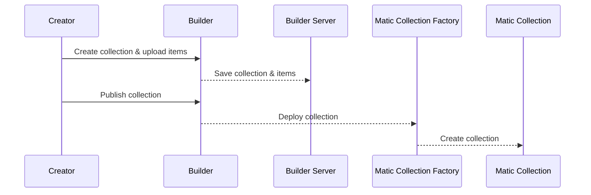
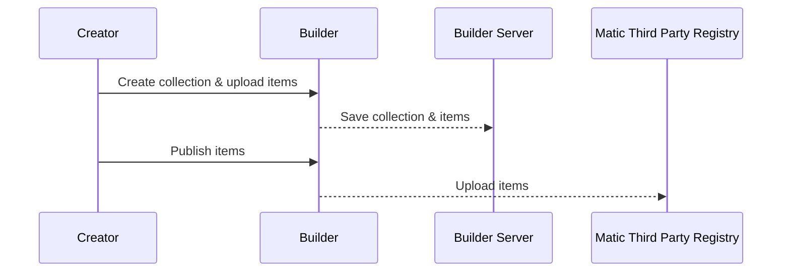
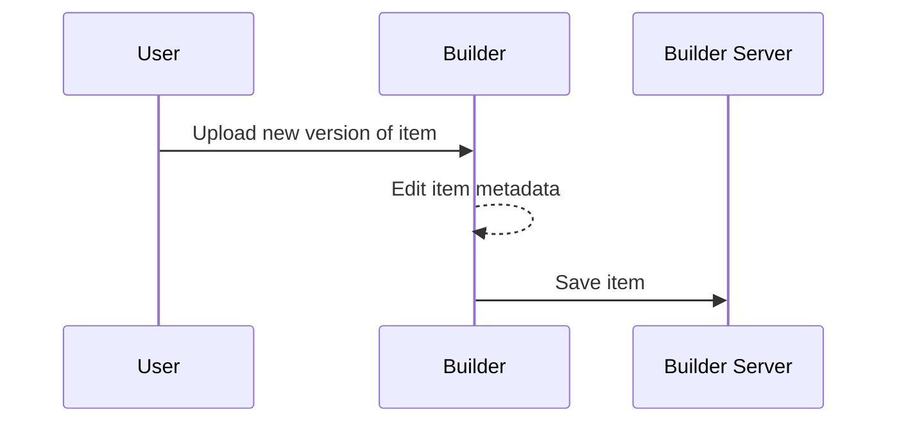
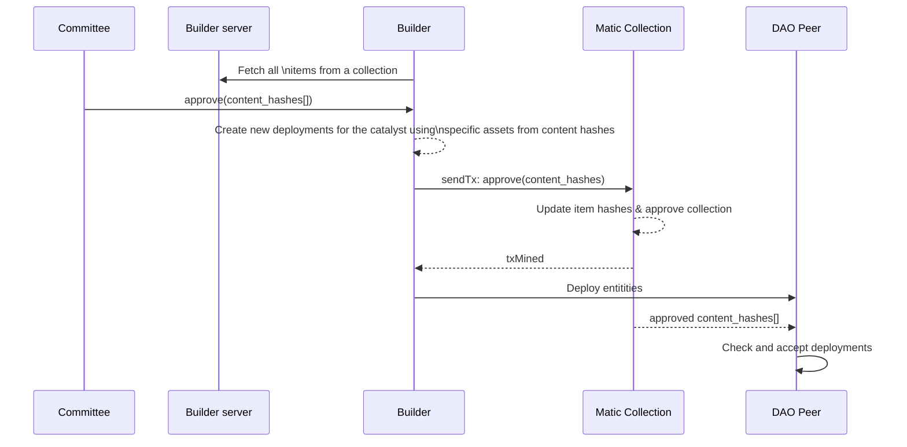
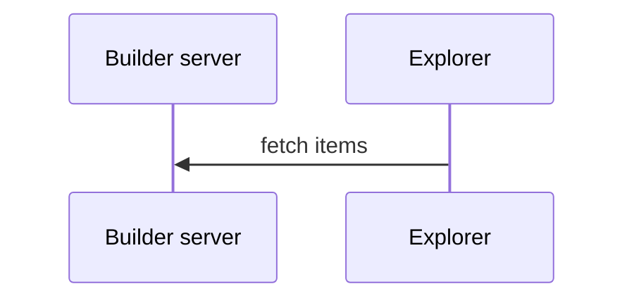
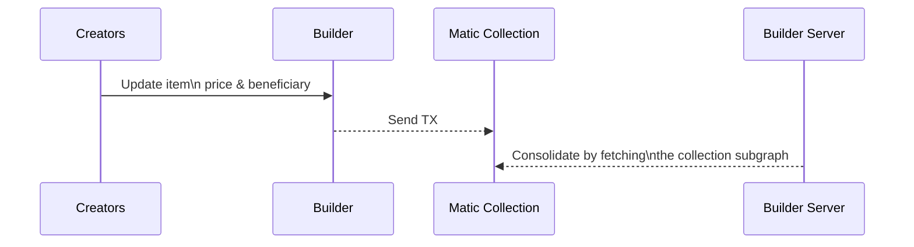
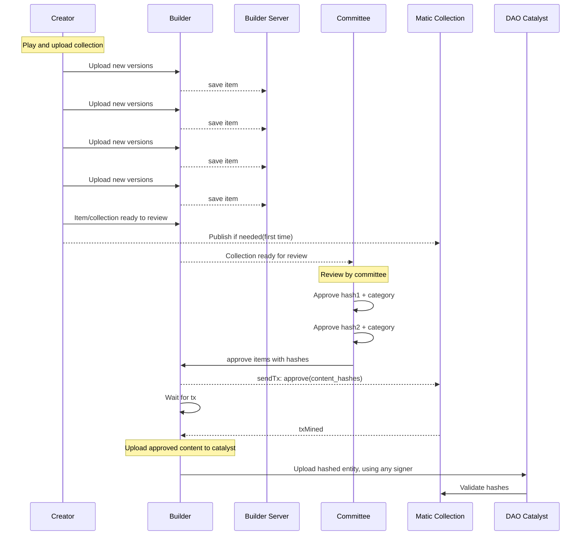

## Statement of the problem

The Catalysts accepts **only**:

- Deployments of rejected in-blockchain collection entities, and from an authorized collection address (Creator or Managers).
- Deployments by a committtee member if the collection entity content hash is in the blockchain.

The first one is risky because the catalyst does not have a way to validate the content submitted and someone can submit as many contents as they wish flooding the storage. All the content submitted to the catalyst must be validated by content hashing.

### Consensus changes

The consensus rules of the catalyst will modify the validations to the deployment of collection entities, that validation will now verify that:

- The hash of the deployed entity matches the approved hash on the blockchain

## Alternative A ✅

- Collections are uploaded as they are right now while they are not published.

- Once the collection is published, the creator can flag their collections as ready for review. Creators can still perform changes to the collection. Those changes will be stored in the builder-server. If any item of the collection has a change after it was approved. The collection & the item will be displayed as _dirty_. The creator can set the collection for review if any of the items is _dirty_.

- The collection smart contract won't suffer any changes. The committee members will use the `rescueItem` method to put the content hash of each item. For the time being the rescue method is only used to [revert an item to a previous version](https://github.com/decentraland/adr/blob/main/docs/ADR-32-wearable-committee-reverts.md)

- The committee members will do:

  1. The committee members will send a transaction using the methods `rescuesItem`. To set the item's content hash.
  2. The committee members will upload the items to the catalyst. The items must have the some content hash submitted to the blockchain.
  3. The committee member will send a transaction using the method `setApproved` to approve the collection after the items are uploaded to the catalyst.

_These two transactions will simulate an `approve(hash)`._

Check [here](https://github.com/decentraland/wearables-contracts/blob/master/Collections_V2_Actors.md) for further reference of smart contracts.

- The catalyst will accept entities (items) if the content hashes are reflected in the blockchain. The entity will be deployed without signature restrictions, that is, any account can sign the deployment. Changes will be needed [here](https://github.com/decentraland/catalyst/blob/3098701a42f0656dc595e653694abf4f7f418bee/content/src/service/access/AccessCheckerForWearables.ts#L119). Catalysts will need to hash the metadata and the contents of the entitiy as stated in [ADR-32](/adr/ADR-32) (`contentHash`). This way, when the user deploys the entity to the catalyst, the catalyst will check if the item's content hash in the blockchain is equal to the `contentHash` in the same timestamp/block where the deployment occurs.

### Create a Decentraland collection

### Create third party Item

### Create and update items

### Propagate deployments to Cataysts

### Get (non-catalyst) content to test in-world

### Change editable parameters from items (Decentraland Collections only)

_beneficiary, price, name, description, category, body shapes_.

### Approve process (committee)

## Alternative B

Using non-DAO catalyst with new flags to provide a decentralized way of storing the items instead of the builder-server.

This alternative is not needed for the time being cause the builder-server is already used when the collection items are not published yet.

## Development proposed

### Milestone 1

- Committee members will start submitting collection item's content hash on chain.

- The catalyst will remove the check where only the committee members can submit entities if they has a content hash on chain.

### Milestone 2

- The catalyst will start accepting **only** deployments for collection entities with content hash on chain.
