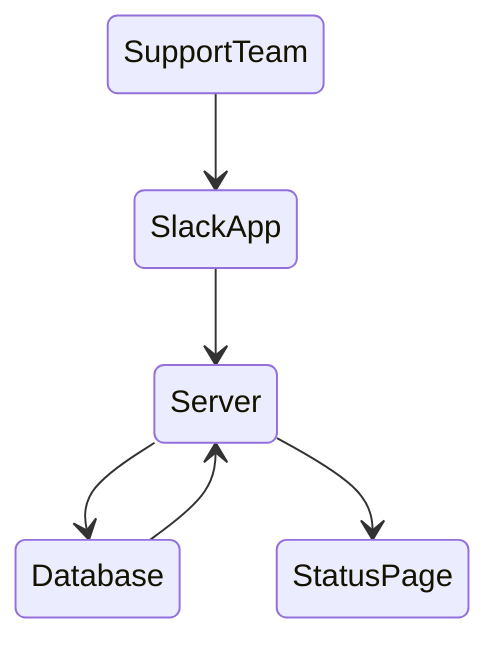

## Context and Problem Statement

Given the growth of the community, the roadmap, and the new members of the product-engineering teams, the amount of entropy introduced into the system increased exponentially causing an inconvenient effect that affects the reliability of the system. Even though for teams that hold a really high technical bar based on automated and mature processes and mechanisms, the number of incidents tends to increase at a logarithmic scale with the organization size, providing visibility on those incidents to the rest of the organization and the systems’ users is key.

Nowadays, the #crash slack channel is where the incidents are communicated, updated, resolved, using the channel`s subject as a status display. This is only visible to people with access to decentraland's slack workspace (decentraland employees), there is a lack of transparency there, anyone should be able to know the status of our incidents, community members need to. Also, it can get messy or difficult to read, specially if there are more than one incident ocurring simultaneously. For this reasons, a more sophisticated (and automated) incident management process must be implemented.

## Goals

Boost internal communications and alignment on incident management-related matters by automating the process while at the same time we increase the transparency and visibility of the platform status with the community.

## Proposed solution

crashbot: a service that acts as an interface with slack for incident’s contact and point to update the incident information, while collecting information that can be shared with the community.

The crashbot scope will include the following:

- Slack integration for users to report an incident, update an incident, and resolve it. The information to be submitted is associated with the incident properties and lifecycle:
    - Report an incident
    - Update an incident
    - Close an incident
    - Update closed incident with RCA link
- Storage for tracking the lifecycle of the incident, this information will be later used for calculating metrics like:
    - Mean time to acknowledge (MTTA): is the average time it takes from when an alert is triggered to when work begins on the issue. This metric is useful for tracking the team’s responsiveness and the alert system’s effectiveness
    - Mean time to resolve (MTTR): is the average time it takes to fully resolve a failure. This includes not only the time spent detecting the failure, diagnosing the problem, and repairing the issue, but also the time spent ensuring that the failure won’t happen again.
    - Incidents count total, incidents count per severity
- Status page to share publicly with the community, populated by the incidents’ information storaged.

### Design

1. SupportTeam communicate to the service via commands in a slack app like `/create`, `/update` and `/close`.
2. Slack app calls the corresponding server's endpoint
3. Server updates the database
4. Status page hits server's endpoint `/list` and receives a json to populate