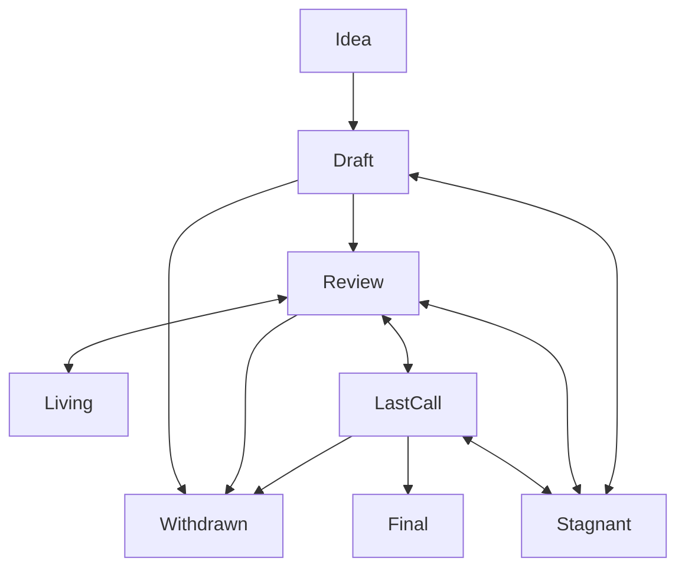

## What is an ADR?

ADR stands for _Architecture Decision Record_. An ADR is a design document providing information to the Decentraland community, or describing a new feature for Decentraland or its processes or environment. The ADR should provide a concise technical specification of the feature and a rationale for the feature. The ADR author is responsible for building consensus within the community and documenting dissenting opinions.

## How do ADRs work?

Read [the ADR explaining the rationale](/content/ADR-1-adr-process.md) for a detailed explanation.

### ADR Process

The following is the standardization process for all ADRs in all tracks:

## ADR Types

There are three types of ADRs:

- A **Standards Track** ADR describes any change that affects most or all Decentraland implementations, such as—a change to the synchronzation protocol, a change in deployments validity rules, proposed application standards/conventions, or any change or addition that affects the interoperability of applications using Decentraland. Standards Track ADRs consist of three parts—a design document, an implementation, and (if warranted) an update to the [formal specification](https://github.com/decentraland/yellowpaper).

- A **Meta** ADR describes a process surrounding Decentraland or proposes a change to (or an event in) a process. Process ADRs are like Standards Track ADRs but apply to areas other than the Decentraland protocol itself.

- An **RFC** describes a Decentraland design issue, or provides general guidelines or information to the Decentraland community. RFCs do not necessarily represent Decentraland community consensus or a recommendation, so users and implementers are free to ignore RFCs or follow their advice.
    Final --> Deprecated
