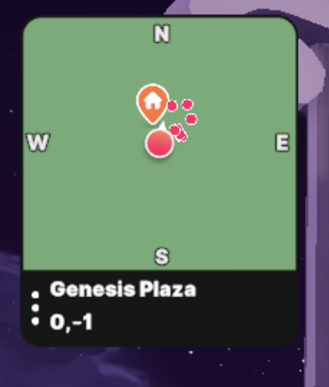

# Abstract

This document describes how a Scene Preview Service can be created using minimal versions of the Content Server and Comms.

# Introduction

Today users that don't own a land or are not ready to push their content to production need to use a Heroku application container to be able to preview and share a scene with different stakeholders. This solution requires some extra configuration steps and, on the other hand, it will stop being free according to the [latest Heroku news](https://blog.heroku.com/next-chapter). To ease the life of the content creators, a new scene preview server will be created, leveraging the same steps than when uploading content to the Catalyst network and enabling an easy way to validate and experience the content before it is finally uploaded to the Genesis City.  
 
## Approach

The solution for the scenes preview will be done in stages

### Stage 1: Preview Server  

Create a BETA program where the technical feasibility of the project can be evaluated and test the experience from the content creators perspective.  

Scope of the BETA: 
- Open to users owning a Decentraland name 
- Only one scene per Decentraland name would be allowed 
- Scenes deployment to the preview server will have the same disk space limitations than the Content Servers hosted on the Catalyst network 
- Besides scene size and owning a name, no other validations will be made as this is just a preview
- Explorer mini map won't be displayed
- Explorer skybox light can be set up for the scene
- Display a Jump to Genesis Ctity button to leave the scene preview 
- Validated by hosting a scene with the new onboarding experience


#### The Solution 

This implementation will allow content creators to deploy a scene in a preview server and join the scene with a maximum number of concurrent users. The solution is composed of three areas, the CLI, the backend infrastructure and the Explorer experience which will be detailed below. 

#### Content Creators 

From the Content Creators point of view, the experience will be very simple, only run the same deploy command but adding as a target the URL of the new preview server, e.g.  

`dcl deploy -t https://example-url-for-dcl-preview-server`  
 
 The output of this command should contain a link that can be shared and used to jump in to the scene preview, e.g. `https://play.decentraland.org/?PREVIEW_SERVER=...&SCENE=...&COMMS=....` 

 #### Architecture 

The Explorer client in order to work needs to resolve scenes, users identity (avatar, wearables, emotes, etc) and communications between peers. Unlike production where all of them are obtained from the same realm, here a Preview Content Server and a Comms Preview Server will be needed. 
The scenes assets and information that the client needs will be resolved from the Preview Content Server and the communications orchestration between peers joining a preview will be handled by the Comms Preview Server. On the other hand, users identity will continue to be retrieved from a DAO Catalyst node.    
For this to work, the client will receive several new parameters: **preview content server** from which to resolve the scene assets, **scene identifier**, and the **comms preview server URL**. 

```mermaid
flowchart TD
    B["Explorer Client"]
    C(Preview Content Server) -- scene-id --> B
    D(Preview Comms Server)-->B
    E("Catalyst/Realm") -- avatars -->B
```

#### Explorer Client

When the Client loads a scene from the Preview server, the experience should be slightly different as the **mini map** should not be loaded. The scene is going to be isolated from the Genesis City. Besides this, there should be a way to control the skybox settings so that creators can test their scenes with day light and night light.
To accomplish this, a new `worldConfiguration` field should be added to the `scene.json`. 

**scene.json**
```json 
"worldConfiguration" : {
     "skybox" : "time"
     "miniMapVisible" : "false"
}
```





#### Benefit

As a result: 
- The experience to use the preview will be the same as when deploying content to Decentraland
- Scenes content can be tested multi-player and isolated from the Genesis City   
- The preview UX can be tested with a subset of content creators   
- As the access will be limited, all the focus is going to be on the experience and scalability will come on the following stage
- Fosters the decentralization by having an alternative solution to the Heroku application container 


### Stage 2: Preview Server Scalability  

After BETA testing, incorporating feedback and fine tunning the experience, the GA of the preview Server can be planned. 

Based on the BETA testing: 
- Define Hardware requirements for the Preview Content Server (Disk space/CPU)
- Define the max number of concurrent users allowed in a Preview
- Implement a Garbage Collection 
- Define strategy to open the Preview to all content creators


### Stage 3: Run your own Preview Servers 

With all the pieces in place, it should be simple to provide an easy way to run preview server that Content Creators can use to share scenes in a private environments.  


---
