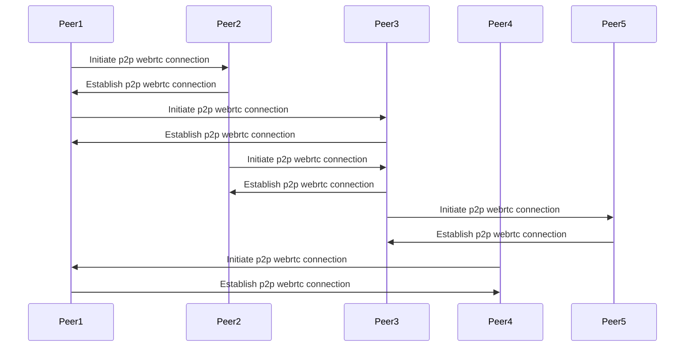
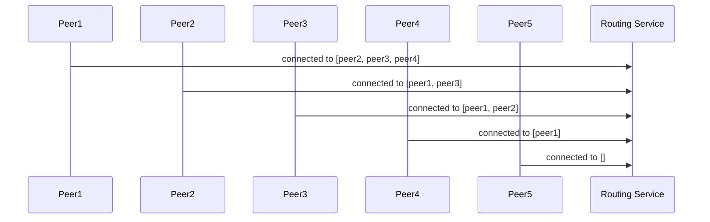
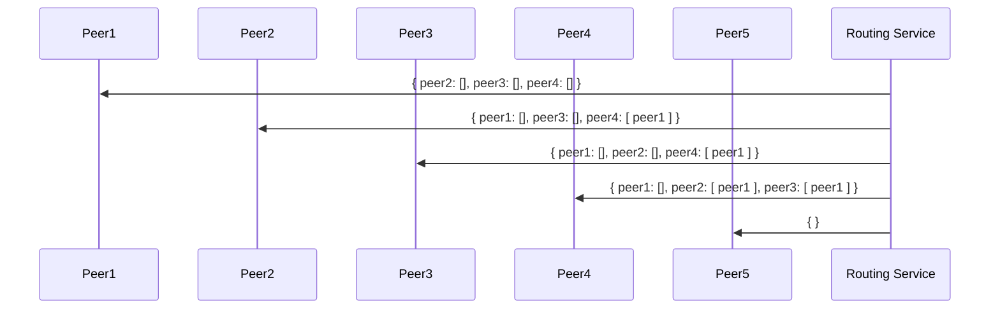
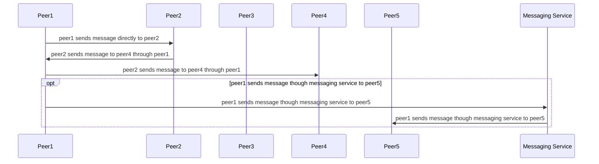

## Abstract

This document describes a possible implementation for a p2p adapter using a routing service. For more information about what and adapter is, check [ADR-81](/ADR/ADR-81-minimum-comms-transport.md)

Although this implementation requires a server, it tries to maxize the usage of p2p connections, while also keeping in mind that peers may run in a constraint enviroment (like a browser) in which not always is possible to have a lot of open connections.

As defined in [ADR-81](/ADR/ADR-81-minimum-comms-transport.md), each peer will known the ids of the peers around him through the information provided by the CommunicationsDirector.

This implementation requires two extra services (the implementator may choose to combine them in one, or even implement them as part of the [BFF](link)):

- Messaging service: in charge of sending messages between specific peers.
- Routing service: in charge of keeping track of the connections between peer and given them back routing information.

The basic idea of this implementation is for peers to connect randomly to each other forming a mesh, and reporting this connections to the routing service. The routing service will build routing tables for each peer to connect to every other, and when no relay is possible between the p2p mesh, it will use the messaging service as a fallback mechanism.

## Definitions

```typescript

type Address = string
```

## Messaging service

```typescript
interface MessagingService {
  /**
   * The .send method is used to send the message `message` to the peers provided in the `to` field.
   */
    send(message: Uint8Array, to: Address[]): void
}
```

To establish a p2p webrtc connection, peers will exchange signals with each other using the messaging service. This service will act as a fallback when no p2p route is available to deliver a message.

This service has same level of trust than any peer in the network, this means it has no specific authentication requirements, and any trust feature has to be built in the message itself. That been said implementators may choose to add some extra validation when doing high level clustering (like [real-time clustering of users in Islands (ADR-35)](/adr/ADR-35)), for clusters to remain isolated.

## Routing service

```typescript
type PeerStatus = {
    room: string,
    connectedTo: Address[]
}

interface RoutingService {

  /**
   * The .updatePeerStatus method is used to update the peer status in the service.
   */
   updatePeerStatus(status: PeerStatus): void

  /**
   * Event emitter (mitt) with all the events produced by the service.
   */
  events: Emmiter<{
    newPeerRoutingTable: NewPeerRoutingTableEvent
  }>
}

// A route is a list of peer ids. It doesn't contain the source or destination, so for example if a->b->c
// the route between a and c is [ b ]
// and the route between b and c is []
type Route = Address[]

// A map between peer and a route. If a peer is missing, it means there is no direct or indirect p2p connection to the peer, so the messaging server should be used
type PeerRoutingTable = Map<Address, Route>

// NewPeerRoutingTableEvent
type NewPeerRoutingTableEvent = {
  // the new peer routing table
  routingTable: PeerRoutingTable
}
```

### Peers establish random connections with their known peers.



### Each peer report its connections to the routing service



### The routing service create a routing table for each peer



### Each peer uses the routing table to send messages



## Packet

```typescript

type Packet = {
  source: Address
  to: Record<Address, Route>
}
```

A packet contains a source (peer id) and map specifying to whom the packet is for and the route to follow to reach it.

## Peer

The peer will send a message to every known peer using the routing table, sending it once to each peer. Let's say peer1 is connected to peer2 and peer2 to peer3, when broadcasting to the network peer1 will send:

```typescript
{ 
  source: 'peer1', 
  to: { 'peer2': [], 'peer3': ['peer2'] }
}
```

This means each peer will check the `to` field, if they are one of the recipent of the messages the message will be processed, otherwise it will be relayed in the way the route value indicates.

Notice the peer relaying the message is not expected to remove itself either as a recipent or as a hop in the route, since this will require encoding the package again. 

# Example scenarios

TODO 

# Notes

This proposal has some interesting properties:

- Since we provide an specific routing table for each message, there is no need to expires message or count hops. If a route is cut, the message will not be delivered by the mesh, this means the message should be discarded or use the messaging service fallback instead.
- The messaging service fallback provide a safety guarantee against network clusters.
- A given implementation can be optimized by suggesting peers to connect to certain others in order to avoid clustering and minimize messaging service usage. This is out of the scope for this document.
- Since the routing service will know the status of the mesh at all times, it's easy to graph and debug network problems. 


# Challenges

TODO
