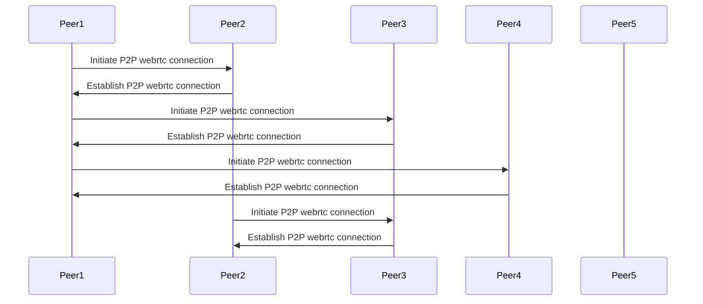
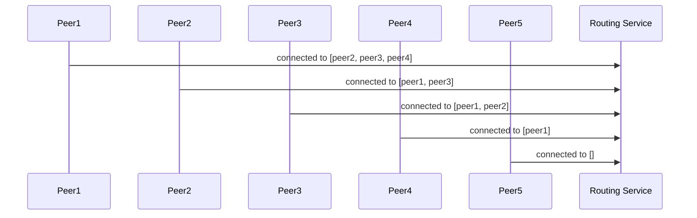
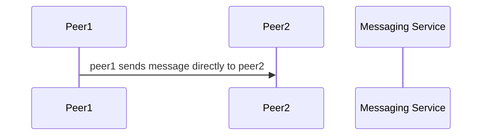
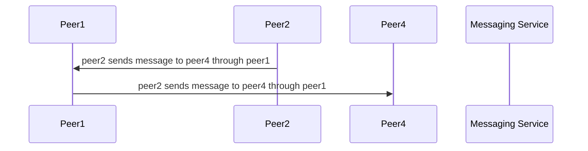
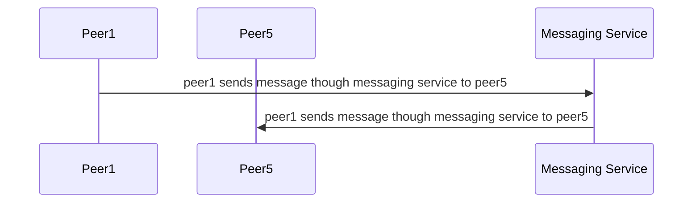
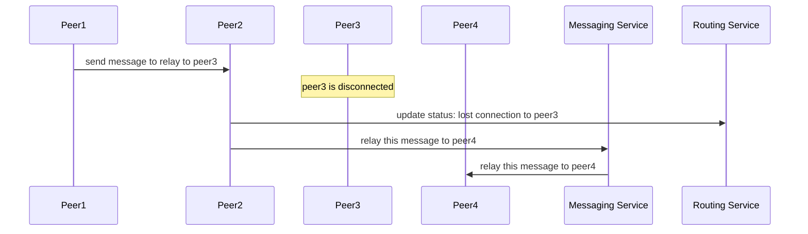

## Abstract

This document describes a possible implementation for a P2P adapter using a fallback messaging service. For more information about what an adapter is, check [ADR-81](/ADR/ADR-81-minimum-comms-transport.md).

## Need

A P2P adapter is needed in order to provide a light mechanism for comms (compared to [RFC-5: comms service using websocket](/RFC/RFC-5-ws-comms.md)). This adapter should guarantee the delivery of a message to any peer in the network (or cluster, [real-time clustering of users in Islands (ADR-35)](/adr/ADR-35)).

## Approach

This approach is simple, it should be easy to debug and it could be refined in the future for performance if needed. 

This implementation requires two extra services:

- Messaging service: in charge of sending messages between specific peers.
- Routing service: in charge of keeping track of the connections between peers and providing them routing information.

As defined in [ADR-81](/ADR/ADR-81-minimum-comms-transport.md), each peer will know the ids of the peers around them using the information provided by the `CommunicationsDirector`.

The basic idea of this implementation is for peers to connect randomly to a subset of the others forming a mesh, and reporting their connections to the routing service. The routing service will build routing tables for each peer to connect to every other. Each peer will receive from the routing service the path to all other connected peers. When a peer needs to deliver a message, it will use the path provided by the routing table, and if there is not any, it will fallback to the messaging service.

Although this implementation requires a server, it tries to maximize the usage of P2P connections, while also keeping in mind that peers may run in a constrained environment (like a browser) in which it is not always possible to have a lot of open connections.

## Flow example

### 1. Peers establish random connections with their known peers.



### 2. Each peer report its connections to the routing service



### 3. The routing service create a routing table for each peer

A route is a list of peer ids. It doesn't contain the source or destination, so for example if a->b->c:
- the route between a and c is [ b ]
- and the route between b and c is []


### Peer1 sends a message directly to peer2



### Peer2 sends message to peer4 through peer1



### Peer1 sends message though messaging service to peer5



## Example: A connection is lost while relaying a package

Let's assume the mesh is connected as: `peer1 <-> peer2 <-> peer3 <-> peer4`, and peer1 needs to send a message to peer4



## Definitions

```typescript

type Address = string

// A route is a list of peer ids. It doesn't contain the source or destination, so for example if a->b->c
// the route between a and c is [ b ]
// and the route between b and c is []
type Route = Address[]

// A map between peer and a route. If a peer is missing, it means there is no direct or indirect P2P connection to the peer, so the messaging server should be used
type PeerRoutingTable = Map<Address, Route>
```

## Messaging service

To establish a P2P webrtc connection, peers will exchange signals with each other using the messaging service. This service will act as a fallback when no P2P route is available to deliver a message.

This service has same level of trust than any peer in the network, this means it has no specific authentication requirements, and any trust feature has to be built in the message itself. That been said implementators may choose to add some extra validation when doing high level clustering (like [real-time clustering of users in Islands (ADR-35)](/adr/ADR-35)), for clusters to remain isolated.

## Routing service

This service will receive peer status updates including the connections to other peers, and will return the routing table which specifies the routes to every other peer in the mesh.

## Interfaces

```typescript
interface MessagingService {
  /**
   * The .send method is used to send the message `message` to the peers provided in the `to` field.
   */
    send(message: Uint8Array, to: Address[]): void
}

type PeerStatus = {
    timestamp: number,
    room: string,
    connectedTo: Address[]
}

interface RoutingService {

  /**
   * The .updatePeerStatus method is used to update the peer status in the service.
   */
   updatePeerStatus(status: PeerStatus): void

  /**
   * Event emitter (mitt) with all the events produced by the service.
   */
  events: Emmiter<{
    newPeerRoutingTable: NewPeerRoutingTableEvent
  }>
}

// NewPeerRoutingTableEvent
type NewPeerRoutingTableEvent = {
  // the new peer routing table
  routingTable: PeerRoutingTable
}
```

Reference implementation:

```typescript
type Route = string[] | 'server'
type PeerRoutingTable = Map<string, Route>

function calculateRoutingTables(mesh: Map<string, Set<string>>) {
  const routingTables = new Map<string, PeerRoutingTable>()

  const getOrCreateRoutingTable = (peerId: string) => {
    let table = routingTables.get(peerId)
    if (!table) {
      table = new Map<string, Route>()
      routingTables.set(peerId, table)
    }
    return table
  }

  function calculateRouteBeetwen(fromPeer: string, toPeer: string, _excluding: string[]): Route {
    const excluding = new Set<string>(_excluding)

    const calculatedRoutes = getOrCreateRoutingTable(fromPeer)

    const calculatedRoute = calculatedRoutes.get(toPeer)
    if (calculatedRoute) {
      return calculatedRoute
    }

    let route: Route = 'server'

    const fromPeerConnections = mesh.get(fromPeer)
    if (!fromPeerConnections) {
      route = 'server'
    } else if (fromPeerConnections?.has(toPeer)) {
      route = []
    } else {
      for (const p of fromPeerConnections) {
        if (excluding.has(p)) {
          continue
        }
        let relayedRoute = calculateRouteBeetwen(p, toPeer, [p, ..._excluding])
        if (relayedRoute !== 'server') {
          relayedRoute = [p, ...relayedRoute]
          if (route === 'server' || route.length > relayedRoute.length) {
            route = relayedRoute
          }
        }
      }
    }

    calculatedRoutes.set(toPeer, route)

    // NOTE: routes are bidirectional
    getOrCreateRoutingTable(toPeer).set(fromPeer, route === 'server' ? route : Array.from(route).reverse())
    return route
  }

  const peers = new Set<string>()

  for (const [peer, connections] of mesh) {
    peers.add(peer)
    for (const connection of connections) {
      peers.add(connection)
    }
  }

  for (const peerFrom of peers) {
    for (const peerTo of peers) {
      if (peerFrom === peerTo) {
        continue
      }

      calculateRouteBeetwen(peerFrom, peerTo, [])
    }
  }

  return routingTables
}
```

## Packet

A packet contains a source (peer id) and map specifying to whom the packet is for and the route to follow to reach it.

```typescript

type Packet = {
  source: Address
  to: Record<Address, Route>
}
```

## Peer

The peer will send a message to every known peer using the routing table, sending it once to each peer. Let's say peer1 is connected to peer2 and peer2 to peer3, when broadcasting to the network peer1 will send:

```typescript
{ 
  source: 'peer1', 
  to: { 'peer2': [], 'peer3': ['peer2'] }
}
```

This means each peer will check the `to` field, if they are one of the recipent of the messages the message will be processed, otherwise it will be relayed in the way the route value indicates.

Notice the peer relaying the message is not expected to remove itself either as a recipent or as a hop in the route, since this will require encoding the package again. 

# Benefits

- Since there is a specific routing table for each message, there is no need to expire message or count hops. If a route is cut, the message will not be delivered by the mesh, this means the message should be relayed using the messaging service (if reliable) or discarded (if unreliable).
- The messaging service fallback provide a safety guarantee against network cluster partitions.
- A given implementation can be optimized by suggesting peers to connect to certain others in order to avoid clustering and minimize messaging service usage. This is out of the scope for this document.
- Since the routing service will know the status of the mesh at all times, it's easy to graph and debug network problems. 

# Competition (alternatives)

- One simple solution using a P2P mesh, in which peers broadcast to others, and upon receiving a message, they relay to their connections. The problem with this solution is there is the possibility of messages going thought the network after the same message is deliver, which implies the need to build a mechanism to discard old messages (using time or hops). Another problem is the possibility of clusters in the mesh, which may cause certain group of peers, to not see the ones in another group.

# Non-goals

- The route representation is not as efficient as it could be, since uses Address (string) as a peer identification. This should be possible to improve, by assiging numeric alias for every peer. However, detailing how to do that is out of the scope of this document, and doesn't change the overall proposed solution.

# Key dependencies and Open questions

- Why not let each peer calculate the best routing table, by broadcasting each peer status to the network?.
  - This solution will consume a lot of resources from each client, since the table needs to be updated (or verified) every time there is a change.
  - This solution is somehow more difficult to debug, since routing tables have no source of truth, and different peers may build them differently. 
