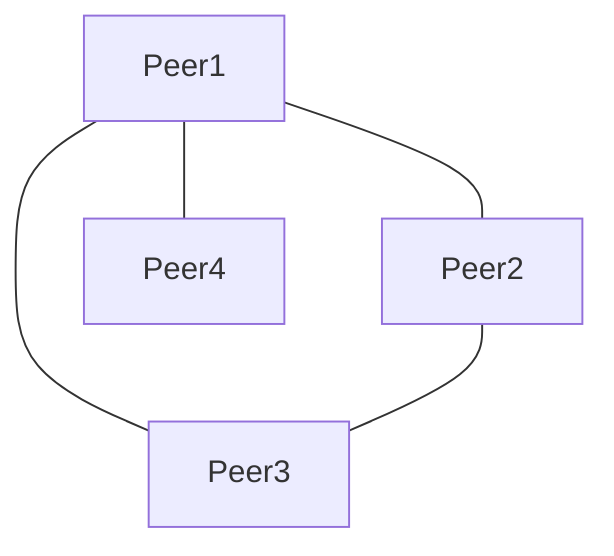
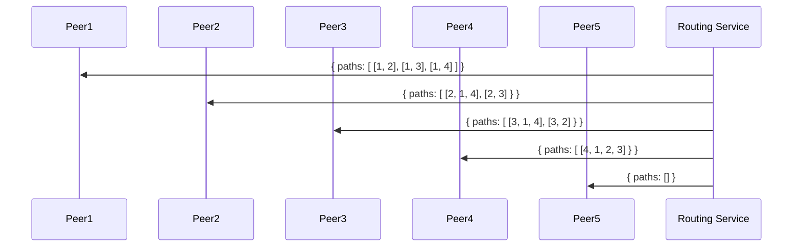
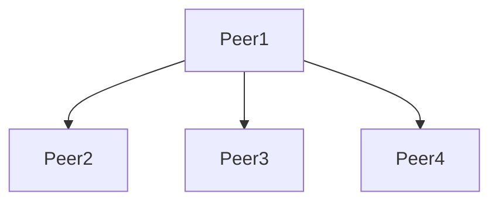
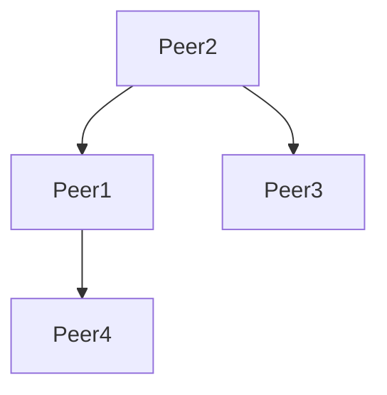
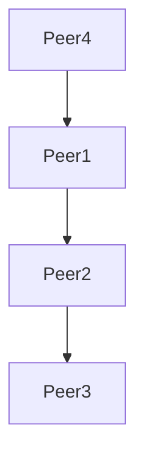
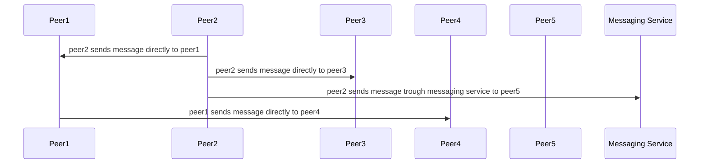
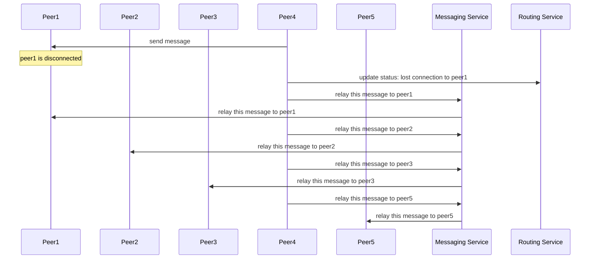

## Abstract

This document describes a possible implementation for a P2P adapter using a fallback messaging service. For more information about what an adapter is, check [ADR-81](/ADR/ADR-81-minimum-comms-transport.md).

## Need

A P2P adapter is needed in order to provide a light mechanism for comms (compared to [RFC-5: comms service using websocket](/RFC/RFC-5-ws-comms.md)). This adapter should guarantee the delivery of a message to any peer in the network (or cluster, [real-time clustering of users in Islands (ADR-35)](/adr/ADR-35)).

The new implementation should solve the problems in the old version[link]:

- When two peers are unable to see each other, it's hard to identify if there is a network failure or they are in different clusters, or a bug in the client.
- Since all peers broadcast information on an ever-changing logical mesh (every tick the relay changes), it's almost impossible to measure latency. The impact of the number of packages that are circulating around the network or even how many are been currently relayed isn't measurable. The relay suspension mechanism that prevents the network to be flooded with packages also prevents the stabilization of the mesh.
- We don't have a way to measure the impact of the "suspension relay" heuristic, which means we don't know if the available routes are efficient.
- There are two unhandled scenarios that may cause messages to not be delivered:
  - if there are two clusters (or more), peers will be completely isolated from each other, and no communication using the P2P mesh is possible.
  - At some point, relay suspension may suspend the only peer that is able to deliver a message. This is a temporal failure, since the next time the mesh is negotiated, the delivery will be resumed. 

## Approach

This approach focuses on addressing the problems mentioned above:
  1. Handle clusters: identifying peers outside of the current mesh, and providing a fallback service to deliver the messages. Optionally (outside of the scope of this RFC), this service could provide hints to the peers in order to connect separated clusters.
  2. Efficient usage of resources: messages are received only once, they are decoded only once, they are relayed using only the most efficient route and thus avoiding flooding the network. There is also no additional expiration ttl, or hops ttl since the route is already determined.
  3. Since the server has knowledge of the topology of the network, metrics can be used to understand its status, identify where optimizations are required and improve based on real data. 
  4. Eventually (outside of the scope of this RFC), the server can refine its algorithm, and consider other factors, like latency, in order to choose the best route.
  5. This solution aims to have a stable mesh, so is possible to have a consistent latency between peers.

## The solution

This implementation requires two extra services:

- Routing service: in charge of keeping track of the connections between peers and providing them with routing information for each message (the route the message needs to follow).
- Messaging service: in charge of sending messages between specific peers, when either the connection between two peers is cut, or when the target is in another cluster.

Note: *As defined in [ADR-81](/ADR/ADR-81-minimum-comms-transport.md), each peer will know the ids of the peers around them*

The basic idea of this implementation is for peers to connect randomly to a subset of the others forming a mesh, and reporting their connections to the routing service. The routing service will build the routing information needed for each peer to distribute messages to every other. Each peer will receive from the routing service the minimal set of paths that cover all the connected peers. When a peer needs to deliver a message, it will use the paths provided by the routing service, and if the connection to the neighbor fails, it will fallback to the messaging service for all the pending peers.

Although this implementation requires a messaging service, it tries to maximize the usage of P2P connections. Also, each peer needs to decode the package to parse it but they don't make changes to it, so there is no cost associated to the encoding of each package.

This approach is simple, it should be easy to debug and it could be refined in the future for performance, if needed. 

## Flow example

### 1. Peers establish random connections with their known peers.





### 2. Each peer reports its connections to the routing service


### 3. The routing service creates a routing table for each peer

It is a list of all the needed paths so that the whole network can be notified by the message. As every message is broadcast, each peer needs to know the smallest set of paths that covers all the nodes. It will also notify the unreachable nodes, so the peer can do the relay by the Messaging Service. To calculate all the unreachable nodes, each peer will make a diff of the complete list of known peers against all the other peers mentioned in all the paths.




Paths for Peer1

Paths for Peer2

Paths for Peer3

Paths for Peer4

Empty Paths for Peer5

### Peer2 sends a message

First the peer2 creates and encodes a package that contains its own paths, so all the peers obey that rule.

Paths for Peer2


```
{
  source: 2
  payload,
  targets: [[2, 1, 4], [2, 3]]
}
```

When each peer receives a package, it checks if it is contained in any of the paths and continues the relay with the given order.



## Example: A connection is lost while relaying a package

Let's assume peer4 needs to distribute a package, but loses the connection to peer1 while trying to send the package. Then it will relay the message to all the missing nodes trough the Messaging Service.
Note: A message received by the Messaging Service is never relayed.


Paths for Peer4


```
{
  source: 4
  payload,
  targets: [[4, 1, 2, 3]]
}
```




## Definitions

```typescript

type Address = string

// A route is a list of peer ids.
type Route = Address[]

// A list of all the paths that need to be covered to broadcast the network
type PeerRoutingTable = Route[]
```

## Messaging service

To establish a P2P webrtc connection, peers will exchange signals with each other using the messaging service. This service will act as a fallback when no P2P route is available to deliver a message.

This service has same level of trust than any peer in the network, this means it has no specific authentication requirements, and any trust feature has to be built in the message itself.

## Routing service

This service will receive peer status updates including the connections to other peers, and will return the routing table which specifies the routes to every other peer in the mesh.

## Interfaces

```typescript
interface MessagingService {
  /**
   * The .send method is used to send the message `message` to the peers provided in the `to` field.
   */
    send(message: Uint8Array, to: Address[]): void
}

type PeerStatus = {
    timestamp: number,
    room: string,
    connectedTo: Address[]
}

interface RoutingService {

  /**
   * The .updatePeerStatus method is used to update the peer status in the service.
   */
   updatePeerStatus(status: PeerStatus): void

  /**
   * Event emitter (mitt) with all the events produced by the service.
   */
  events: Emmiter<{
    newPeerRoutingTable: NewPeerRoutingTableEvent
  }>
}

// NewPeerRoutingTableEvent
type NewPeerRoutingTableEvent = {
  // the new peer routing table
  routingTable: PeerRoutingTable
}
```

## Packet

A packet contains a source (peer id) and a target specifying to whom the packet is for and the route to follow to reach it.

```typescript

type Packet = {
  source: Address
  target: Route[]
}

## Peer

Each time a package needs to be sent, then the peer will create it using its own paths as routing table and will make the network to obey that flow.

```typescript
{ 
  source: 'peer1', 
  target: [ ['peer2', 'peer3'] ]
}
```

This means each peer will check the `target` field, always the message will be processed, and then it will be relayed in the way the route value indicates.

Notice the peer relaying the message is not expected to remove itself either as a recipient or as a hop in the route, since this will require encoding the package again. 

# Benefits

- Since there is a specific routing table for each message, there is no need to expire message or count hops. If a route is cut, the message will not be delivered by the mesh, this means the message should be relayed using the messaging service (if reliable) or discarded (if unreliable).
- The messaging service fallback provide a safety guarantee against network cluster partitions.
- A given implementation can be optimized by suggesting peers to connect to certain others in order to avoid clustering and minimize messaging service usage. This is out of the scope for this document.
- Since the routing service will know the status of the mesh at all times, it's easy to graph and debug network problems. 

# Risks

- Potentially the messages may be too big, if they include all the routes. Mitigation: if bandwidth becomes a problem, it is possible to encode the message again by removing the current peer from the routing paths, this way the message is small but the process will consume more CPU instead. 
- Routing service cost to keep the routes updated. Mitigation: based on metrics we can adjust the parameters: frequency of the routes calculation, the routing algorithm, how we store the graph in memory. 

# Competition (alternatives)

- One simple solution using a P2P mesh, in which peers broadcast to others, and upon receiving a message, they relay to their connections. The problem with this solution is there is the possibility of messages going through the network after the same message is delivered, which implies the need to build a mechanism to discard old messages (using time or hops). Another problem is the possibility of clusters in the mesh, which may cause certain group of peers to not see the ones in another group (partitioned).
- Keep the current implementation with the problems described in the "Need" section.

# Non-goals

- The route representation is not as efficient as it could be, since it uses `Address` (string) as a peer identification. This should be possible to improve, by assigning a numeric alias to every peer. However, detailing how to do that is out of the scope of this document, and doesn't change the overall proposed solution.

# Key dependencies and Open questions

- Why not let each peer calculate the best routing table, by broadcasting each peer status to the network?
  - This solution will consume a lot of resources from each client, since the table needs to be updated (or verified) every time there is a change.
  - This solution is somehow more difficult to debug, since routing tables have no source of truth, and different peers may build them differently. 
- Can we replace the messaging service by providing alternatives routes for broadcasting a message?
  - This won't solve the cluster partitions problem.
  - By looking at the metrics of the messaging service usage, is possible to conclude the service is not solving a frequent enough problem, and then it can be removed or replaced.