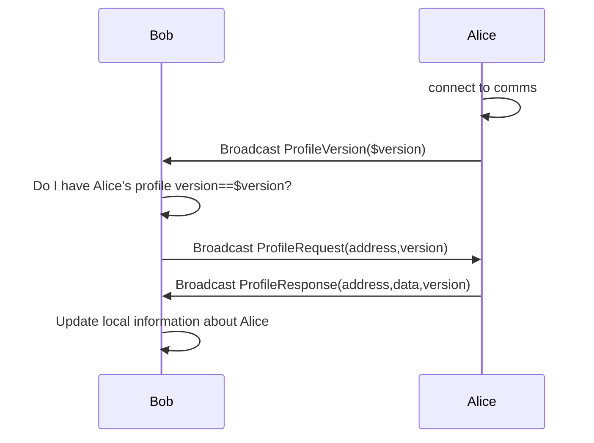
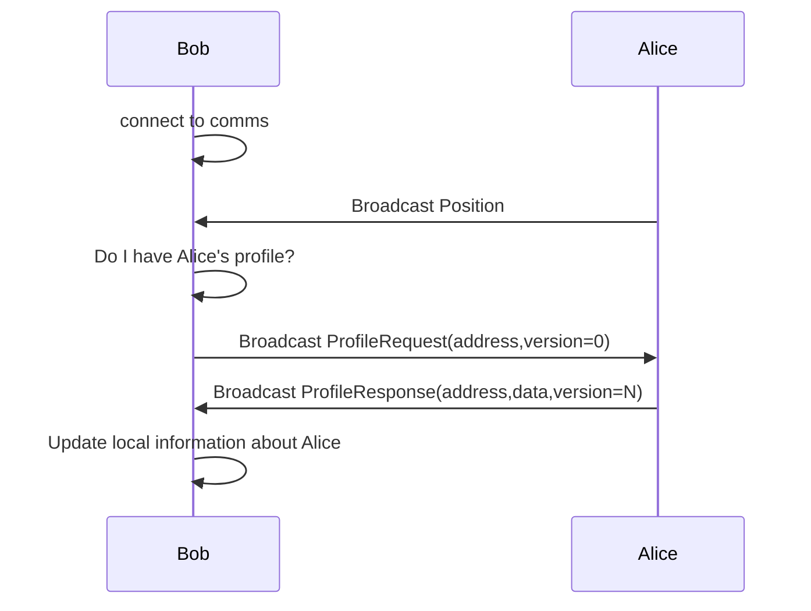
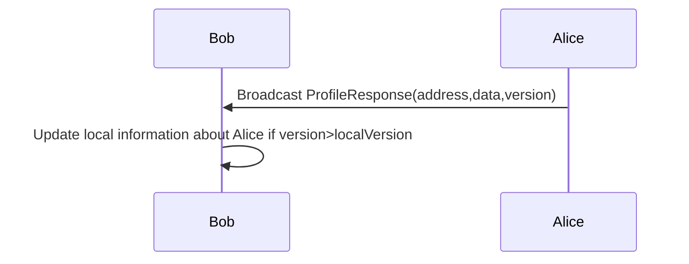

# Abstract

This document describes the minimum protocol for comms to connect explorers with each other and see other people in the world. It does not describe the transport layers or connection topologies.

## Wire protocol

Protocol messages are serialized using protocolbuffers, this document also uses the protobuf language to specify the schemas.

All messages are assumed to be broadcast to all peers at all times. That is, there are no one-to-one messages in any topology. As a side note, optimizations on top of this protocol are possible; an example is Archipelago (ADR-35) which connects peers all-to-all in a island-based topology to optimize resource allocations based on physical (in-world) location.

All of those messages are part of an envelope message called `CommsPacket` which is used to differentiate all kinds of user-sent packages using the `oneof` feature of protobuf.

```protobuf
syntax = "proto3";

message CommsPacket {
  oneof message {
    Position position = 2;
    Profile profile = 3;
    ProfileRequest profile_request = 4;
    ProfileResponse profile_response = 5;
    Chat chat = 6;
    Scene scene = 7;
    Voice voice = 8;
  }
}
```

The transports have the responsibility to also provide the address of the sender. The suggested interface to listen for messages from a transport could look like this:

```typescript
type PacketMetadata = {
  sender_address: string
}

type OnPacketDelegate = (packet: CommsPacket, meta: PacketMetadata) => void
```

## Seeing other people

To see other people around you, it is necessary to know both their `Position` and their `Profile` (wearables, name, emotes, colors, etc...). To that extent, when you log-in, your avatar's position needs to be broadcast using the `Position` message. The Profile instead is sent through comms on a need-to-know basis to optimize network and CPU resources.

> Note: For simplicity the following diagram has two actors but indeed all messages are broadcast all-to-all

### Resolving profile information when a third party (Alice) is connected



### Resolving profile information when I receive a position from an unknown peer

This case happens when Alice was already connected to the server and therefore, I couldn't listen to the `ProfileVersion` packet. In this opportunity I will become aware of Alice via Position messages directly.

> Note: This process can be triggered by any message received from a remote peer except for `ProfileResponse`




### Caching ProfileResponse messages

Assuming that other peers are also exchanging ProfileRequest and ProfileResponses, it is convenient to process those ProfileResponses because those may become handy if the version is greater than the one cached locally.



## Position message

Position messages MAY be "Unreliable" in the UDP way of unreliable, that is unordered and with legal packet loss. That configuration should be provided to the transport as a hint, since it is not mandatory.

Position messages are suggested to be sent at 10Hz when the player is moving (changing any of the values of the Position message). And 1Hz when the player is still.

To interpolate and correct errors, a command number `index` is sent in every position message. This applies the semantics of Overwatch net code, being the command number a monotonic counter that grows with every sent message.

The position message looks like this:

```protobuf
message Position {
  // command number
  uint32 index = 1;
  // world position
  float position_x = 3;
  float position_y = 4;
  float position_z = 5;
  // quaternion
  float rotation_x = 6;
  float rotation_y = 7;
  float rotation_z = 8;
  float rotation_w = 9;
}
```

## Chat message

Chat message is used to send text messages to all the people connected to the same comms as we are. It is the simplest message containing only the string of the message to be sent.

```protobuf
message Chat {
  string message = 1;
  uint32 time = 2;
}
```

## Voice message

The voice message is used to send compressed voice samples to other peers. At the time of writing this specification the only supported codec is OPUS, which is the codec number 0 in the enum of enabled codecs. The voice message MUST also be hinted as UNRELIABLE to prevent network congestion.

The voice message also contains an "index" field which is a monotinic counter of voice messages, used to concatenate and order de incoming messages in the audio encoder.

```protobuf
message Voice {
  bytes encoded_samples = 1;
  uint32 index = 2;
  VoiceCodec codec = 3;
  enum VoiceCodec {
    VoiceCodec_OPUS = 0;
  }
}
```

## Scene message

Scene messages are like chat messages that are sent between instances of the same scene running in peer's machines. The message contains the id of the scene that is sending and receiving the message (URN) and a binary payload. Like voice messages, SceneMessages SHOULD have low priority and need to be considered UNRELIABLE when the transport supports it to prevent network congestions caused by the code of the scene.

```protobuf
message SceneMessage {
  string scene_id = 1; // urn
  bytes payload = 2;
}
```
