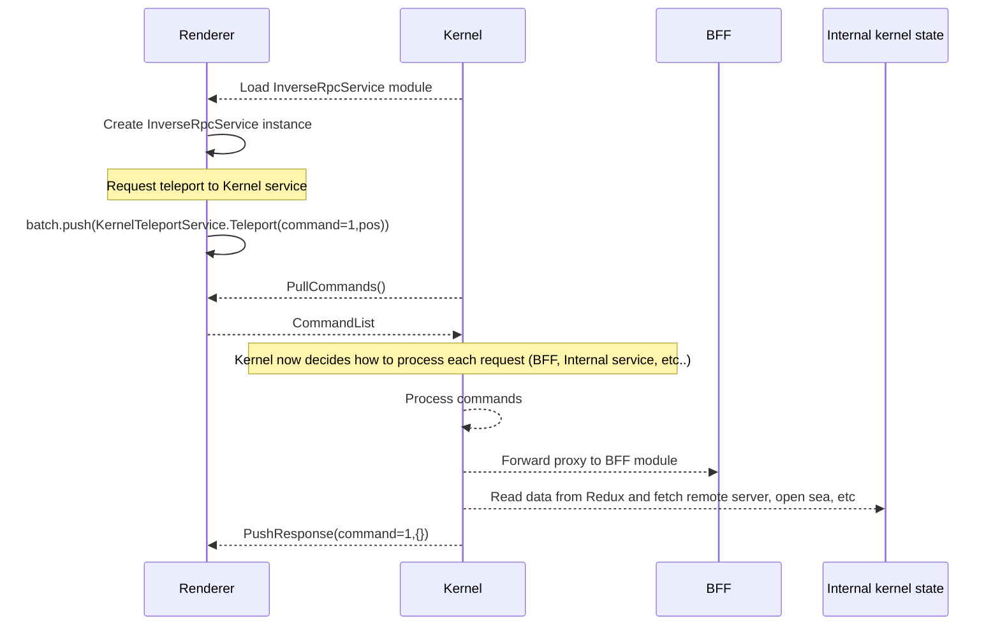

# Abstract

This document describes the protocol and code generation for Kernel and BFF services accessible from Renderer.

## Wire protocol

Protocol messages are serialized using protocolbuffers, this document also uses the protobuf language to specify the schemas.

The Renderer may generate services to be exposed to kernel using the already established RPC code generation. For cases in which the Renderer needs to perform calls directly to Kernel or BFF, a new service will be generated.

To make this services available, the RPC code generation will be used as a trampoline high-order protocol.

```protobuf
// This file will be implemented as a regular RPC Module in the Renderer.
// Kernel will use regular code-generation from @dcl/rpc to interact with
// this service
syntax = "proto3";

import "shared/Common.proto";

service InverseRpcService {
  rpc PullCommands(Empty) returns (CommandList) {}
  rpc PushResponse(CommandResponse) returns (Empty) {}
}

message CommandList {
  repeated Command commands = 1;
}

message Command {
  // command_id is used for the request/response
  uint32 command_id = 1;
  string module_name = 2;
  string module_method = 3;
  bytes  request_payload = 4;
}

message CommandResponse {
  uint32 command_id = 1;
  oneof response {
    bytes response_payload = 2;
    string error = 3;
  }
}
```



```protobuf
syntax = "proto3";

service KernelTeleportService {
  rpc RequestTeleportToCrowd(Empty) returns (Empty) {}
  rpc RequestTeleportToMagic(Empty) returns (Empty) {}
  rpc RequestTeleportTo(RequestTeleport) returns (Empty) {}
  rpc JumpIn(JumpIn) returns (Empty) {}
}

message RequestTeleport {
  string destination = 1;
}

message JumpIn {
  string realm = 1;
  int32 parcel_x = 2;
  int32 parcel_y = 3;
}
```