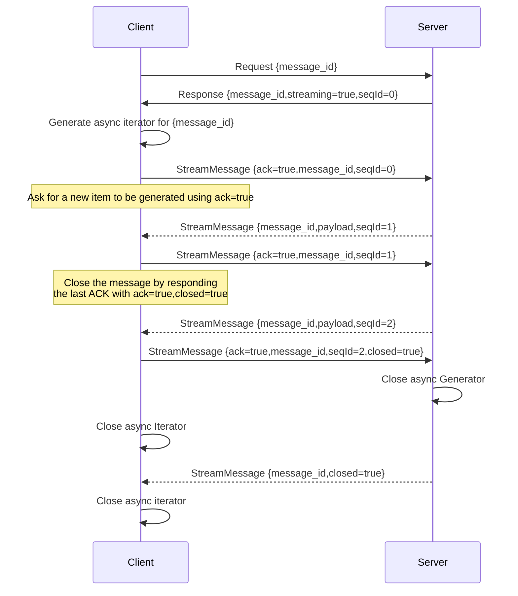
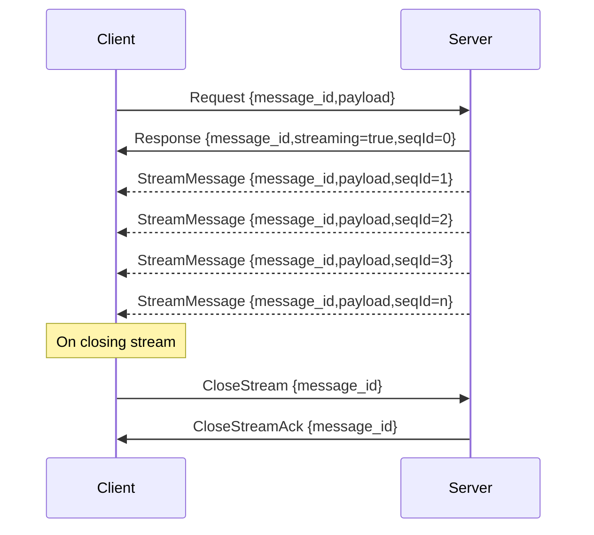
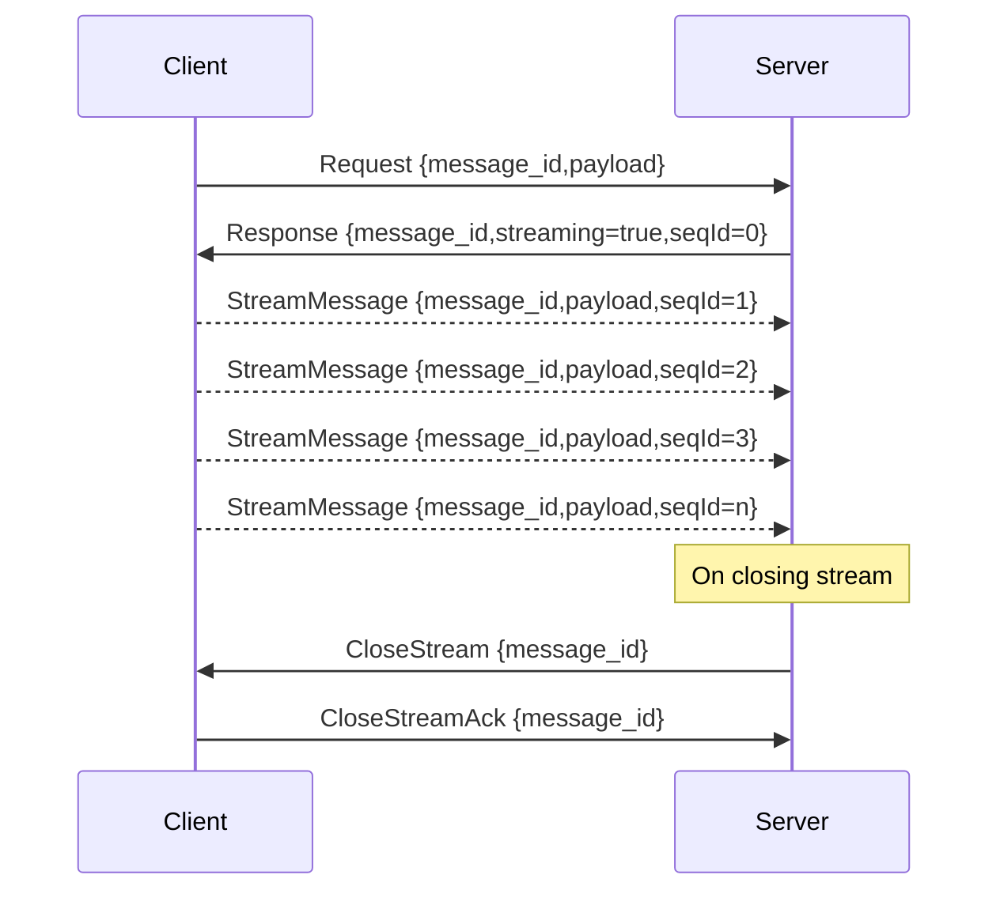
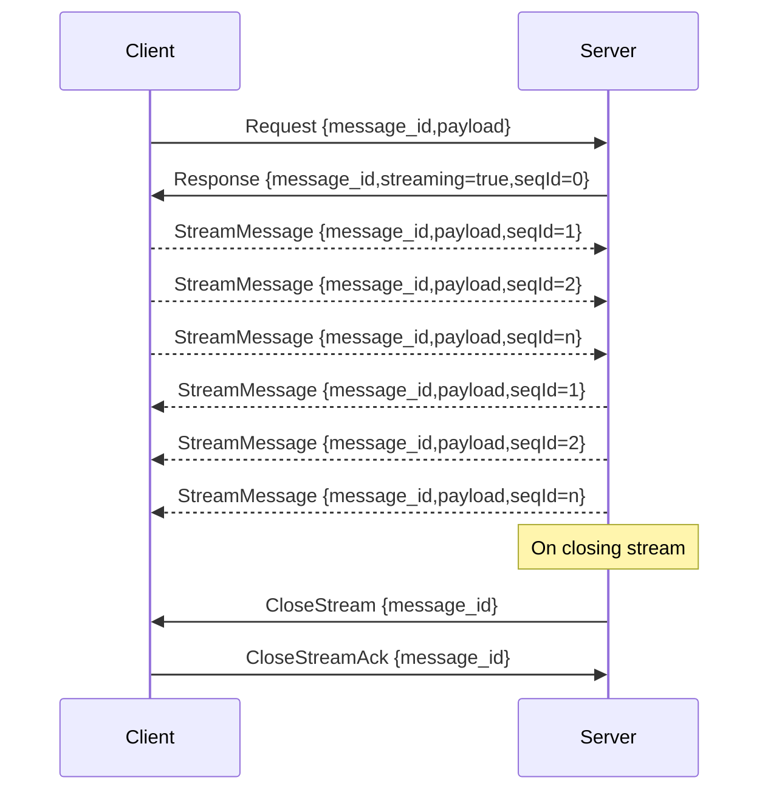
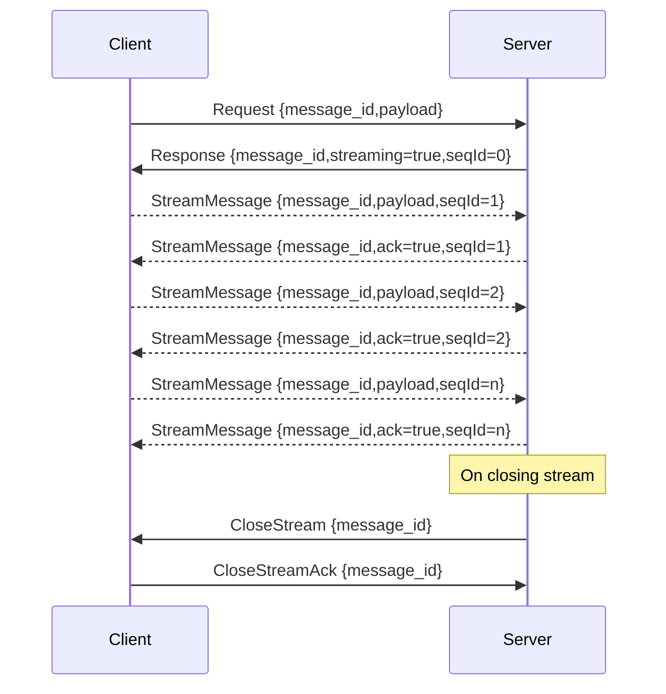

# Abstract

This document describes the changes for Decentraland RPC (@dcl/rpc) in the streams.

# Introduction

The current implementation of the RPC Streams works, confirming with an `ack=true` every message that is sent from the Server.
It's like the `Client` requesting the messages of the `Server`.

Current implementation sequence:



The main idea of this implementation is to forget about the possible congestion that the transport can have. And generate messages at the time that is being requested.

But with this implementation, we can't send a continuous sequence of messages from the `Server` to the `Client` or vice-versa. And the streams are very slow due to the waiting sequence.
This document will refer to this implementation as `the stream with ack` from now on.

# Proposal

Having this in mind, this proposal wants to change how streams work and have a use-case like `the stream with ack` but using bidirectional streams.

The main idea is to have:

- Server Streams
- Client Streams
- Bidirectional Streams
## Server Stream

The client opens the Stream, and the Server starts sending messages independently.



Protobuf specification for Server Stream:
```
service {
  rpc ServerStream(Request) returns (stream StreamResponse)
}
```

## Client Stream

It's exactly how `Server Stream` works, but the other way around. The client streams the messages.



Protobuf specification for Client Stream:
```
service {
  rpc ClientStream(stream StreamRequest) returns (Response)
}
```

## Bidirectional Stream

In the case of Bidirectional streams, the Client and the Server can send messages independently without any synchronization.



Protobuf specification for Bidirectional Streams:
```
service {
  rpc ClientStream(stream StreamRequest) returns (stream StreamResponse)
}
```

### Bidirectional Stream (`the stream with ack`)

If the developer wants to have a behaviour like `the stream with ack`. It can just send a `StreamMessage` after you receive one of them. Like this sequence diagram describes:

