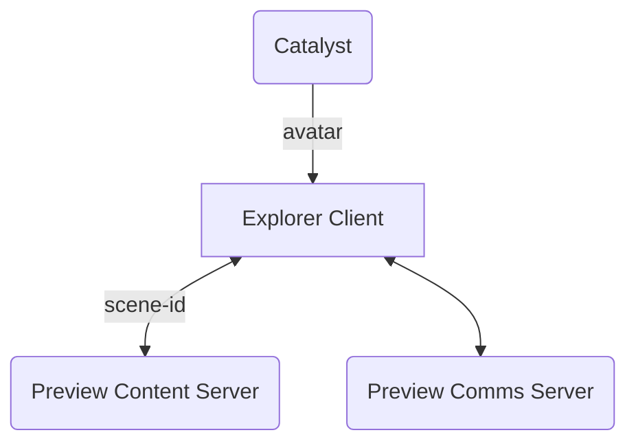
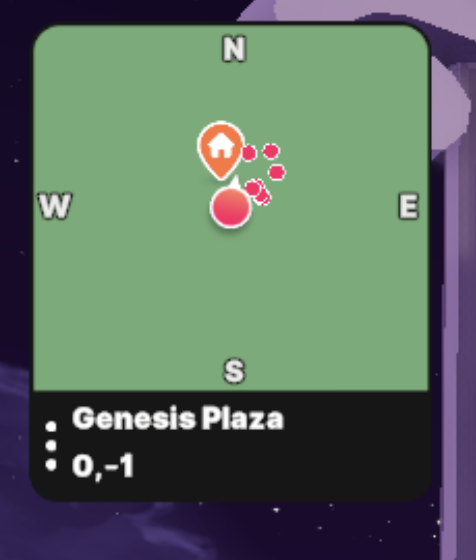

# Abstract

Today users that don't own a land or are not ready to push their content to production need to use a Heroku application container to be able to preview and share a scene with different stakeholders. This solution requires some extra configuration steps and, on the other hand, it will stop being free according to the [latest Heroku news](https://blog.heroku.com/next-chapter). To ease the life of the content creators, a new scene preview server will be created, leveraging the same steps than when uploading content to the Catalyst network and enabling an easy way to validate and experience the content before it is finally uploaded to the Genesis City.  
 
## Approach

The solution for the scenes preview will be done in stages

### Stage 1: Preview Server BETA 

Create a BETA program where the technical feasibility of the project can be evaluated and test the experience from the content creators perspective.  

Scope of the BETA: 
- Open to users owning a Decentraland name 
- Only one scene per Decentraland name would be allowed on the preview 
- Scenes deployment to the preview server will have the same disk space limitations that the Content Servers hosted on the Catalyst network 
- Besides scene size and owning a name, no other validations will be made as this is just a preview
- 10 concurrent users allowed to join a scene preview

#### The Solution 

From the Content Creators point of view, the experience will be very simple, only run the same deploy command but adding as a target the URL of the new preview server, e.g.  

`dcl deploy -t https://example-url-for-dcl-preview-server`  
 
 The output of this command should contain a link that can be shared and used to jump in to the scene preview, e.g. `https://play.decentraland.org/?PREVIEW_SERVER=...&SCENE=...&COMMS=....` 

From the Client and Services side, this will work very similar as with the existing Catalyst nodes. The client will receive several new parameters: **server** from which to resolve the scene, **scene identifier**, and the **comms server URL**, in charge of managing the communications between users visiting the scene preview. On the other hand, the existing Catalyst network will be used to resolve the users digital identity, retrieving their avatars and wearables.  

When the Client loads a scene from the Preview server, the Mini map should not be loaded as the scene is going to be isolated from the Genesis City.

As a result: 
- The learning experience to upload and preview a scene will be minimal 
- Scenes content can be tested multi-player and isolated from the Genesis City   
- The preview UX can be tested with a subset of content creators   
- As the access will be limited, all the focus is going to be on the experience and scalability will come on the following stage
- Fosters the decentralization by having an alternative solution to the Heroku application container 

### Stage 2: Preview Server Scalability  

After BETA testing, incorporating feedback and fine tunning the experience, the GA of the preview Server can be planned. 

Based on the BETA testing: 
- Define Hardware requirements for the Preview Content Server (Disk space/CPU)
- Define the max number of concurrent users allowed in a Preview
- Implement a Garbage Collection 
- Determine the cost of running the Server for all content creators

### Stage 3: Run your own Preview Servers 

With all the pieces in place, it should be simple to provide an easy to run preview server that Content Creators can use to share scenes in a private network.  

---
