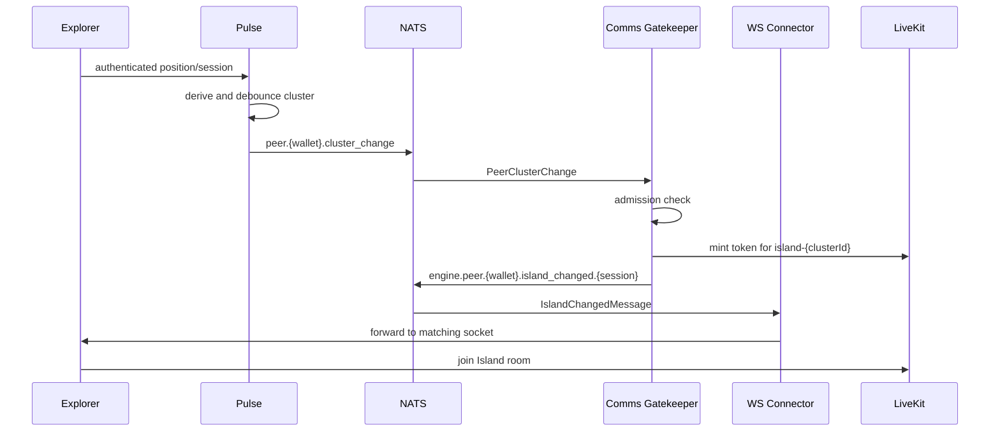

## Abstract

This ADR moves authorship of Decentraland's proximity groups from Archipelago
Core to Pulse. Pulse derives realm-scoped clusters from the same spatial state
used for area-of-interest delivery, publishes topology and per-wallet assignment
changes through NATS, and leaves LiveKit authorization and token minting in
Comms Gatekeeper. WS Connector continues to carry the existing
`IslandChangedMessage` to Explorer, but routes it to a specific authenticated
session when that information is available. Archipelago Core is removed in
iteration 1; heartbeat-backed statistics remain temporarily and move in a later
iteration.
The decision also defines duplicate-session behavior for the Island room. The
newest Pulse session for a wallet becomes authoritative, the displaced session
is identified explicitly, and Comms Gatekeeper isolates it before issuing
credentials to the replacement. This updates only the Island-room portion of
[ADR-204](/adr/ADR-204); Scene-room assignment, permissions, and moderation are
unchanged.

## Context, Reach & Prioritization

[ADR-35](/adr/ADR-35) introduced proximity-based islands, and
[ADR-204](/adr/ADR-204) retained an Archipelago Island room alongside the Scene
room. Before this decision, Archipelago Core reconstructed player positions from
WS Connector heartbeats, calculated islands, minted LiveKit credentials, and
published island assignments. Pulse independently maintained fresher position
and realm state for area-of-interest delivery.

Maintaining two spatial authorities had several costs:

- Island membership and Pulse visibility could disagree because they were
  calculated from different pipelines and cadences.
- Archipelago Core duplicated position state that Pulse already owned.
- Archipelago's 100-peer cap and pairwise-distance heuristics could split a
  connected crowd in ways that did not match Pulse's area of interest.
- Retiring Archipelago Core required relocating both topology publication and
  LiveKit credential minting without moving token authority into Pulse.
- A wallet can authenticate from two sessions. Wallet-only assignment subjects
  could deliver the replacement's credentials to the displaced socket, or let
  both sessions publish conflicting assignments.

In this ADR, a **cluster** is Pulse's realm-scoped proximity component. An
**island** is the LiveKit room and the legacy wire/API vocabulary exposed to
clients and statistics. A cluster maps to one Island room, but being in the same
cluster does not imply that every member is mutually visible: area-of-interest
filtering remains independent.

### Scope

Iteration 1 includes:

- cluster derivation and stable cluster IDs in Pulse;
- publication of cluster topology, service discovery, and per-wallet assignment
  changes;
- LiveKit credential minting in Comms Gatekeeper;
- session-addressed delivery through WS Connector;
- deterministic duplicate-session takeover for the Island room; and
- removal of Archipelago Core.

Iteration 1 does not change:

- Scene-room selection, authorization, moderation, or CRDT traffic;
- the client-facing `IslandChangedMessage` schema;
- heartbeat-backed `/peers`, `/parcels`, and `/hot-scenes` statistics; or
- the Scene and Island dual-room model established by ADR-204.

Moving entity-level statistics to Pulse and retiring the remaining
heartbeat/disconnect feed are deferred to iteration 2.

## Solution Space Exploration

### Keep Archipelago Core

This minimizes migration work but preserves duplicated spatial state, two
sources of proximity truth, and an additional service whose main input is data
Pulse already owns.

### Let Pulse Mint LiveKit Credentials

Pulse could publish `IslandChangedMessage` directly. This was rejected because
the message contains a signed LiveKit credential and admission depends on
platform bans and deny lists. Those are token-issuer responsibilities already
owned by Comms Gatekeeper. Giving Pulse those secrets and policies would broaden
its security boundary.

### Bridge Pulse Through Archipelago Core

Archipelago Core could consume a Pulse HTTP or NATS feed and continue minting
assignments. This preserves the old client path but retains a service that no
longer makes an architectural decision. It also adds a hop and makes removal
depend on a later migration.

### Repartition Clusters in Comms Gatekeeper

Gatekeeper could cap or shard large clusters before creating LiveKit rooms. This
was rejected because it would create a second cluster authority. One Pulse
cluster maps to one LiveKit room; any future bound or split belongs in Pulse.

### Rely on a Native LiveKit Identity Collision

The replacement could be steered into the displaced session's room and rely on
LiveKit to disconnect the older participant with `DUPLICATE_IDENTITY`. This was
rejected. A reconnect by the same client can also rejoin a room it already
holds, producing a self-collision, and successive assignment events can race
before the first room join completes. Explicit session identity and explicit
takeover provide a deterministic server-side decision.

### Pulse Clusters; Gatekeeper Authorizes — **CHOSEN**

This is the selected design. Pulse is the sole cluster author and publishes
facts it owns. Comms Gatekeeper applies access policy and mints credentials. WS
Connector routes the result to the intended authenticated session while
preserving the existing client packet.

## Specification

### Responsibilities

- **Pulse** derives clusters, chooses stable cluster IDs, identifies the
  authoritative wallet session, and publishes topology and assignment facts.
- **Comms Gatekeeper** applies Island admission policy, isolates displaced
  sessions, mints LiveKit credentials, and publishes `IslandChangedMessage`.
- **WS Connector** authenticates comms sockets, publishes session-start events,
  and forwards an island assignment only to its addressed session.
- **Archipelago Stats** continues serving heartbeat-backed peer endpoints and
  consumes Pulse topology and discovery.
- **Explorer** consumes the existing island assignment and operates the Island
  LiveKit room.

### Cluster Derivation

Pulse MUST derive clusters from its existing realm spatial grids rather than
maintaining a second position index.

The iteration-1 reference algorithm:

1. runs once per `Clusters:PassIntervalMs`, which defaults to 1,000 ms;
2. partitions peers structurally by realm;
3. treats occupied spatial cells as nodes and unions eight-directionally
   adjacent cells;
4. uses the configured 100-unit area-of-interest cell size;
5. assigns one cluster to each connected component without a participant cap;
6. preserves a previous cluster ID where possible; and
7. waits for `Clusters:DwellPasses`, default 3, before publishing an ordinary
   reassignment.

First assignment, teleport, realm change, and disappearance of the previously
published cluster bypass the dwell delay.

Only the peer that Pulse's identity board currently binds to a wallet MUST be
collected. A displaced peer can remain in a spatial grid while its asynchronous
transport disconnect completes; it MUST NOT appear in topology or publish an
assignment during that interval.

Cluster IDs are generated as `C{n}` in the reference implementation. They are
opaque identifiers: consumers MUST NOT parse them or infer distance, capacity,
or lifetime from them.

### NATS Contracts

Wallet address tokens in subjects MUST be lower-cased.

- `peer.{wallet}.cluster_change`: Pulse publishes an edge-triggered
  `decentraland.pulse.PeerClusterChange` after assignment debounce. Comms
  Gatekeeper consumes it.
- `engine.islands`: Pulse publishes the latest
  `kernel.comms.v3.IslandStatusMessage` topology snapshot once per pass.
  Archipelago Stats consumes it.
- `engine.discovery`: Pulse publishes a
  `kernel.comms.v3.ServiceDiscoveryMessage` health heartbeat. Archipelago Stats
  consumes it.
- `peer.{wallet}.connect`: WS Connector publishes the UTF-8 session key after
  authenticating a socket. Comms Gatekeeper consumes it.
- `engine.peer.{wallet}.island_changed.{session}`: Comms Gatekeeper publishes an
  existing `IslandChangedMessage` addressed to one session. WS Connector
  consumes it.
- `engine.peer.{wallet}.island_changed`: Comms Gatekeeper publishes this
  compatibility form when an assignment has no usable session key. WS Connector
  consumes it.
- `peer.{wallet}.heartbeat`: WS Connector publishes the existing heartbeat for
  iteration-1 statistics. Archipelago Stats consumes it.
- `peer.{wallet}.disconnect`: WS Connector publishes the existing disconnect
  signal for iteration-1 statistics. Archipelago Stats consumes it.

`PeerClusterChange` has the following logical fields:

```protobuf
message PeerClusterChange {
  string cluster_id = 1;
  string realm = 2;
  string session = 3;
  string displaced_session = 4;
  string displaced_cluster_id = 5;
}
```

`session` is the lower-cased ephemeral signer address from the authentication
chain. When the chain has no delegation, the wallet address is used. It
identifies an authenticated credential lineage, not an individual WebSocket
connection.

`displaced_session` and `displaced_cluster_id` MUST be empty for ordinary
changes and same-session reconnects. They MUST be set on the first publish of a
different session while the previous session's assignment is retained. Pulse
retains that assignment for `Clusters:SessionRetentionPasses`, default 300; zero
disables the annotation.

The assignment's `cluster_id` MUST always be the authoritative session's own
cluster. Pulse MUST NOT temporarily steer the replacement into the displaced
session's cluster.

### Normal Assignment Flow



Comms Gatekeeper MUST map a cluster to the LiveKit room `island-{clusterId}` and
MUST NOT shard it. The `islandId` field sent to Explorer is that room name,
`peers` is empty, and `fromIslandId` MAY contain the previously published room.

Gatekeeper MUST perform the wallet's admission checks before minting. Pulse MUST
NOT receive LiveKit signing credentials or platform-ban storage access.

### Reconnect Without a Cluster Change

The Pulse assignment feed is edge-triggered. Therefore, after a WS Connector
handshake succeeds and its welcome is sent, WS Connector MUST publish
`peer.{wallet}.connect` with the session key.

Gatekeeper MUST keep a bounded, expiring mirror of the latest assignment on
every replica. Exactly one replica SHOULD process a connect event for minting,
while every replica observes cluster changes to refresh its mirror.

For a connect event:

- if no assignment is known, Gatekeeper MUST leave the event unresolved rather
  than inventing a cluster;
- if the connecting session is the current session and LiveKit does not hold it
  in the room, Gatekeeper MUST mint and re-announce the current assignment;
- if LiveKit already holds that session in the room, Gatekeeper MUST suppress
  the re-announcement to avoid a same-client identity collision;
- if holder state cannot be determined, the check MUST fail closed; and
- if the connecting session is known to be displaced while another session is
  authoritative, it MUST NOT receive credentials for the shared Island room.

### Duplicate-Session Takeover

Two sessions are distinct only when their session keys differ. A second socket
using the same wallet and the same session key is a reconnect of the same
credential lineage, not a cross-device takeover.

When a different session authenticates to Pulse for a wallet that already has an
authoritative peer:

1. Pulse MUST make the new peer authoritative and disconnect the previous Pulse
   peer with `DUPLICATE_SESSION`.
2. Pulse MUST immediately stop collecting the displaced peer, even if transport
   cleanup has not completed.
3. The new peer's first published assignment MUST name the previous session and
   its last cluster in `displaced_session` and `displaced_cluster_id`.
4. Gatekeeper MUST prevent the displaced session from remaining in or rejoining
   that shared Island room before it delivers credentials to the replacement.
5. Gatekeeper MUST mint the replacement's credential after any revocation cutoff
   used for the displaced session, so the replacement cannot be born with an
   invalid token.
6. Gatekeeper MUST publish the replacement's assignment only on its
   session-addressed subject.
7. WS Connector MUST forward the assignment only to the socket registered for
   that `(wallet, session)` pair.

The reference implementation gives a valid displaced session an assignment to a
private parking room before removing it from the shared room. This uses the
normal `IslandChangedMessage` path and prevents a retrying legacy client from
re-entering the live cluster. LiveKit credentials also carry the session key as
a participant attribute so Gatekeeper can distinguish current and displaced
holders during reconnect recovery.

An explicit LiveKit `RemoveParticipant` operation reports `PARTICIPANT_REMOVED`;
it cannot manufacture LiveKit's native `DUPLICATE_IDENTITY` reason. Explorers
that expose duplicate-session termination SHOULD treat `PARTICIPANT_REMOVED`
from the Island room as the server-enforced equivalent. Server-side isolation
MUST remain correct even when that client behavior or its feature flag is
absent.

A previously displaced session MAY become authoritative later through a new
Pulse takeover, for example after the current session has disconnected. Until
then, reconnecting its WS Connector socket MUST NOT make it authoritative by
itself.

### Delivery and Failure Semantics

Pulse's NATS path is publish-only and fail-soft. Failure to resolve or reach
NATS MUST NOT stop clustering or the simulation. It does delay or lose
Island-room assignment delivery.

Delivery is at most once:

- topology uses one latest-wins slot because a newer snapshot replaces an older
  one completely;
- assignment changes coalesce independently per wallet; and
- sustained overload beyond `Nats:ChannelCapacity` can drop an assignment for
  one wallet.

Topology SHOULD be published before assignment changes from the same pass, but
consumers MUST tolerate cross-subject and cross-replica reordering. Per-wallet
work in Gatekeeper SHOULD be serialized, and takeover processing MUST be
idempotent because queue groups do not provide wallet affinity.

No periodic full assignment replay is required in iteration 1. The
`peer.{wallet}.connect` path is the reconciliation mechanism for a session whose
cluster has not changed.

### Compatibility and Rollout

Explorer continues to receive the existing `IslandChangedMessage`; no new client
protobuf is introduced.

The services MUST be deployed in this order:

1. deploy WS Connector support for session-key registration and the five-token
   `island_changed` subject;
2. deploy Comms Gatekeeper support with its cluster subscriber disabled or with
   no Pulse feed yet;
3. deploy Pulse with the extended `PeerClusterChange` fields;
4. enable the Gatekeeper subscriber and Pulse NATS publication; and
5. stop Archipelago Core so only one component authors Island assignments.

An older Pulse omits session fields. Gatekeeper MAY publish the four-token
compatibility subject, which WS Connector sends to the newest socket for the
wallet. This preserves basic assignment delivery but does not provide
deterministic cross-session takeover.

An older WS Connector does not understand the session-addressed subject, so
Gatekeeper MUST NOT begin five-token publication before WS Connector is
upgraded.

Explorer support for treating `PARTICIPANT_REMOVED` as a duplicate-session
termination improves the user experience but is not the server-side exclusivity
mechanism. Older clients may retry; they MUST still be prevented from receiving
credentials for the authoritative session's shared room.

### Configuration and Rollback

The relevant defaults are:

- `Clusters:Enabled` is `true` and enables Pulse cluster derivation.
- `Clusters:PassIntervalMs` is `1000` and controls cluster pass cadence.
- `Clusters:DwellPasses` is `3` and controls reassignment debounce.
- `Clusters:SessionRetentionPasses` is `300` and controls the takeover
  annotation window; `0` disables it.
- `Nats:Url` is empty. An empty value disables Pulse publication while
  clustering continues.
- `Nats:DiscoveryIntervalMs` is `10000` and controls discovery heartbeat
  cadence.
- `Nats:ChannelCapacity` is `1024` and bounds distinct wallets with pending
  assignment changes.
- `CLUSTER_SUBSCRIBER_ENABLED` is unset and off in Gatekeeper's service
  defaults. Deployment configuration enables it after cutover.

Clearing Pulse's NATS URL stops the new feed but does not restore Archipelago
Core. Because Core is removed from the repository and deployment workflows, a
full rollback requires disabling Gatekeeper publication first, restoring and
deploying Core, and then verifying that exactly one assignment author is active.
A rollback therefore requires a rebuild and MUST be planned rather than treated
as an immediate configuration flip.

### Observability

Operators SHOULD monitor at least:

- Pulse cluster count, pass duration, reassignments, takeovers, NATS connection,
  publish failures, drops, and superseded outbox entries;
- Gatekeeper cluster events, tokens minted, publishes, publish failures,
  reconnect classifications, and takeover outcomes; and
- WS Connector session-addressed misses and duplicate `island_changed`
  suppression.

The takeover counters distinguish successful eviction or isolation, an already
absent participant, and terminal failure. A rise in unresolved reconnects
indicates a cold or expired Gatekeeper assignment mirror. A non-zero Pulse NATS
drop counter means a wallet may remain in its previous Island room until it
reconnects or changes assignment.

## Consequences

### Positive

- Pulse becomes the single source of proximity grouping and uses the same realm
  and position state as area-of-interest delivery.
- Archipelago Core and its duplicated position/clustering state are removed.
- LiveKit secrets, admission checks, and token policy remain in Comms
  Gatekeeper.
- The Explorer wire message remains compatible.
- Session-addressed delivery prevents one wallet's assignment from being
  forwarded to the wrong device.
- Duplicate-session takeover no longer depends on two clients racing to join the
  same LiveKit room.

### Negative and Known Limitations

- Pulse's algorithm is intentionally not topology-compatible with Archipelago
  Core. The 100-unit cell grid and lack of a 100-peer cap generally create
  fewer, larger clusters.
- At high realm occupancy, eight-neighbor cell connectivity can percolate into a
  very large cluster and therefore a very large LiveKit room. Any bound must be
  implemented in Pulse.
- Cluster IDs are process-local monotonic values and reset after a Pulse
  restart. A surviving LiveKit room with the same generated name can collide
  with a new cluster.
- NATS delivery is at most once, and iteration 1 has no periodic assignment
  replay.
- Gatekeeper's assignment mirror is replica-local and expiring. A new replica
  may not resolve reconnects until it observes a cluster change.
- Queue groups do not provide per-wallet affinity, so implementations must
  tolerate cross-replica ordering.
- Two Explorer processes that share the same cached ephemeral signer also share
  a session key and cannot be distinguished by this design.
- `GET /islands` exposes Pulse cluster IDs such as `C1`, while the client
  receives room names such as `island-C1`.
- `engine.islands` reports `max_peers = 0` because iteration-1 clusters are
  uncapped.
- No shadow comparison was required before removing Core, so live topology
  metrics are the first measurement of the behavioral change.
- A full rollback is slower than disabling a feature because the removed Core
  service must be restored.

## Security Considerations

Pulse publishes cluster and session identifiers but never LiveKit connection
strings or signing secrets. Comms Gatekeeper remains the only component that
mints Island-room credentials and MUST perform the existing platform-access
checks before doing so.

Session keys are routing identifiers, not bearer credentials. They MUST be
validated before being inserted into NATS subject tokens or trusted as LiveKit
participant attributes.

Takeover processing MUST ensure that a revocation timestamp cannot invalidate
the replacement token. When explicit revocation is used, the cutoff must be
captured before minting the replacement, and the replacement must be minted only
after the displaced-session action has completed or been classified as absent.

## Deferred Work

Iteration 2 may:

- replace heartbeat/disconnect statistics with a Pulse presence feed;
- serve realm, peer, parcel, and island entity APIs from Pulse;
- move `/hot-scenes` to a service that owns Catalyst metadata;
- remove the remaining heartbeat-only Archipelago Stats paths; and
- provide a durable reconciliation mechanism for at-most-once assignment loss.

Cluster-size policy, globally unique cluster IDs, and wallet-affine event
processing remain separate architectural decisions.

## RFC 2119 and RFC 8174

> The key words "MUST", "MUST NOT", "REQUIRED", "SHALL", "SHALL NOT", "SHOULD",
> "SHOULD NOT", "RECOMMENDED", "NOT RECOMMENDED", "MAY", and "OPTIONAL" in this
> document are to be interpreted as described in RFC 2119 and RFC 8174.
