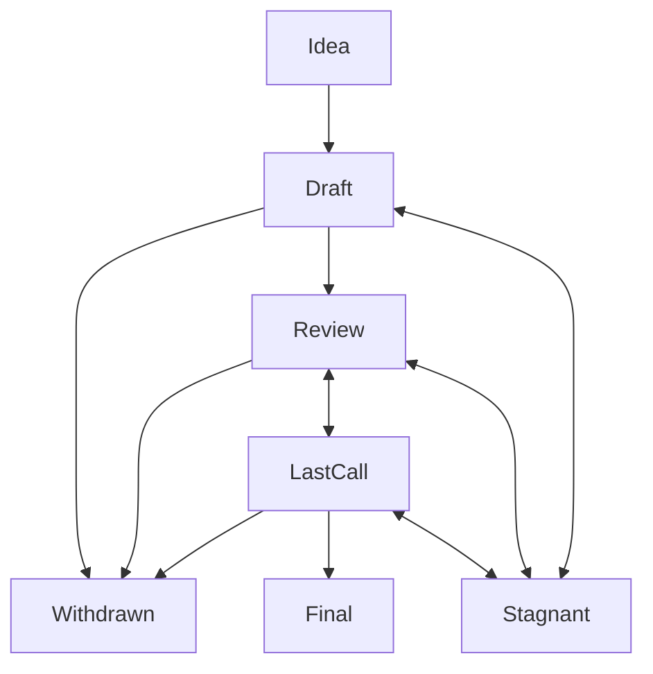

## What is an ADR?

ADR stands for Architecture Decision Record. An ADR is a design document providing information to the Decentraland community, or describing a new feature for Decentraland or its processes or environment. The ADR should provide a concise technical specification of the feature and a rationale for the feature. The ADR author is responsible for building consensus within the community and documenting dissenting opinions.

## ADR Rationale

ADRs are heavily inspired in Ethereum Improvement Proposals (EIPs).

We intend ADRs to be the primary mechanisms for proposing new features, for collecting community technical input on an issue, and for documenting the design decisions that have gone into Decentraland. Because the ADRs are maintained as text files in a versioned repository, their revision history is the historical record of the feature proposal.

For Decentraland implementers, ADRs are a convenient way to track the progress of their implementation. Ideally each implementation maintainer would list the ADRs that they have implemented. This will give end users a convenient way to know the current status of a given implementation or library.

## ADR Types

There are three types of ADR:

- A **Standards Track** ADR describes any change that affects most or all Decentraland implementations, such as—a change to the synchronzation protocol, a change in deployments validity rules, proposed application standards/conventions, or any change or addition that affects the interoperability of applications using Decentraland. Standards Track ADRs consist of three parts—a design document, an implementation, and (if warranted) an update to the [formal specification](https://github.com/decentraland/yellowpaper).

- A **Meta** ADR describes a process surrounding Decentraland or proposes a change to (or an event in) a process. Process ADRs are like Standards Track ADRs but apply to areas other than the Decentraland protocol itself.

- An **RFC** describes a Decentraland design issue, or provides general guidelines or information to the Decentraland community. RFCs do not necessarily represent Decentraland community consensus or a recommendation, so users and implementers are free to ignore RFCs or follow their advice.

It is highly recommended that a single ADR contain a single key proposal or new idea. The more focused the ADR, the more successful it tends to be.

An ADR must meet certain minimum criteria. It must be a clear and complete description of the proposed enhancement. The enhancement must represent a net improvement. The proposed implementation, if applicable, must be solid and must not complicate the protocol unduly.

## ADR Work Flow

### Shepherding an ADR

Before you begin writing a formal ADR, you should vet your idea. Ask the Ethereum community first if an idea is original to avoid wasting time on something that will be rejected based on prior research. It is thus recommended to open a discussion thread on [the ADR discussionshttps://github.com/decentraland/adr/discussions) to do this.

Once the idea has been vetted, your next responsibility will be to present (by means of an ADR) the idea to the reviewers and all interested parties, invite editors, developers, and the community to give feedback on the aforementioned channels. You should try and gauge whether the interest in your ADR is commensurate with both the work involved in implementing it and how many parties will have to conform to it.

### ADR Process

The following is the standardization process for all ADRs in all tracks:

**Idea** - An idea that is pre-draft. This is not tracked within the ADR Repository as a text file, it is recommended to start with an issue or discussion.

**Draft** - The first formally tracked stage of an ADR in development. An ADR is merged by an ADR Editor into the ADR repository when properly formatted.

**Review** - An ADR Author marks an ADR as ready for and requesting Peer Review.

**Last Call** - This is the final review window for an ADR before moving to `Final`. An ADR editor will assign `Last Call` status and set a review end date (`last-call-deadline`), typically 14 days later.

If this period results in necessary normative changes it will revert the ADR to `Review`.

**Final** - This ADR represents the final standard. A Final ADR exists in a state of finality and should only be updated to correct errata and add non-normative clarifications.

**Stagnant** - Any ADR in `Draft` or `Review` or `Last Call` if inactive for a period of 6 months or greater is moved to `Stagnant`. An ADR may be resurrected from this state by Authors or ADR Editors through moving it back to `Draft` or it's earlier status. If not resurrected, a proposal may stay forever in this status.

**Withdrawn** - The ADR Author(s) have withdrawn the proposed ADR. This state has finality and can no longer be resurrected using this ADR number. If the idea is pursued at later date it is considered a new proposal.

**Living** - A special status for ADRs that are designed to be continually updated and not reach a state of finality. This includes most notably ADR-1.

## What belongs in a successful ADR?

Each ADR should have the following parts:

- Preamble - RFC 822 style headers containing metadata about the ADR, including the ADR number, a short descriptive title (limited to a maximum of 44 characters), a description (limited to a maximum of 140 characters), and the author details. Irrespective of the category, the title and description should not include ADR number.
- Abstract - Abstract is a multi-sentence (short paragraph) technical summary. This should be a very terse and human-readable version of the specification section. Someone should be able to read only the abstract to get the gist of what this specification does.
- Need - Why is this ADR needed? Briefly describe the need motivating this proposed artifact to be created or work be done. What problem does it solve?
- Specification - The technical specification should describe the syntax and semantics of any new feature.
- Approach - How do you intend on addressing the need? Describe what you plan on doing and the rationale behind the decisions you propose. The level of detail here has to be enough to give the reader a clear understanding of the solution. Further detail can be addressed to satisfy comments and increase clarity.
- Copyright Waiver - All ADRs must be in the public domain. The copyright waiver MUST link to the license file and use the following wording: `Copyright and related rights waived via [CC0](/LICENSE).`

## Picking an ADR number

The pull request number that adds the file to the [decentraland/adr](https://github.com/decentraland/adr) **MUST** be used as the final ADR number.

## ADR Formats and Templates

ADRs should be written in [markdown](https://github.com/adam-p/markdown-here/wiki/Markdown-Cheatsheet) format. There is a [template](https://github.com/decentraland/adr/blob/main/content/.TEMPLATE.md) to follow.

## ADR Header Preamble

Each ADR must begin with an [RFC 822](https://www.ietf.org/rfc/rfc822.txt) style header preamble, preceded and followed by three hyphens (`---`). This header is also termed ["front matter" by Jekyll](https://jekyllrb.com/docs/front-matter/). The headers must appear in the following order.

`adr`: *ADR number* (this is determined by the ADR editor)

`title`: *The ADR title is a few words, not a complete sentence*

`description`: *Description is one full (short) sentence*

`authors`: *The list of the author's GitHub username(s).*

`discussion`: *The url pointing to the official discussion thread*

`status`: *Draft, Review, Last Call, Final, Stagnant, Withdrawn, Living*

`last-call-deadline`: *The date last call period ends on* (Optional field, only needed when status is `Last Call`)

`type`: *One of `Standards Track`, `Meta`, or `ADR`*

`date`: *Date the ADR was created on*

`withdrawal-reason`: *A sentence explaining why the ADR was withdrawn.* (Optional field, only needed when status is `Withdrawn`)

Headers that permit lists must separate elements with commas.

Headers requiring dates will always do so in the format of ISO 8601 (yyyy-mm-dd).

### `authors` header

The `authors` header lists the GitHub usernames of the authors.

> @menduz

### `discussion` header

While an ADR is a draft, a `discussion` header will indicate the URL where the ADR is being discussed.

The preferred discussion URL is an issue or discussion on the [ADR repository](https://github.com/decentraland/adr). The URL cannot point to Github pull requests, any URL which is ephemeral, and any URL which can get locked over time (i.e. Reddit topics).

### `type` header

The `type` header specifies the type of ADR: Standards Track, Meta, or RFC.

### `date` header

The `date` header records the date that the ADR was assigned a number. Both headers should be in yyyy-mm-dd format, e.g. 2020-02-20.

## Linking to External Resources

Links to external resources **SHOULD NOT** be included. External resources may disappear, move, or change unexpectedly.

## Linking to other ADRs

References to other ADRs should follow the format `ADR-N` where `N` is the ADR number you are referring to. Each ADR that is referenced in an ADR **MUST** be accompanied by an absolute markdown link to the absolute rendered path i.e. `/adr/ADR-1`.

<!--  Each ADR that is referenced in an ADR **MUST** be accompanied by a relative markdown link the first time it is referenced, and **MAY** be accompanied by a link on subsequent references. The link **MUST** always be done via relative paths so that the links work in this GitHub repository, forks of this repository, the main ADRs site, mirrors of the main ADR site, etc.  For example, you would link to this ADR as `/adr/ADR-1`. -->

## Auxiliary Files

Images, diagrams and auxiliary files should be included in a subdirectory of the `public/resources` folder for that ADR as follows: `public/resources/ADR-N` (where **N** is to be replaced with the ADR number). When linking to an image in the ADR public/resources, use absolute links such as `/resources/ADR-1/image.png`.

## Style Guide

### Titles

The `title` field in the preamble:

- Should not include the word "standard" or any variation thereof; and
- Should not include the ADR's number.

### ADR numbers

When referring to an ADR by number, it should be written in the hyphenated form `ADR-X` where `X` is the ADR's assigned number.

### RFC 2119 and RFC 8174

ADRs are encouraged to follow [RFC 2119](https://www.ietf.org/rfc/rfc2119.html) and [RFC 8174](https://www.ietf.org/rfc/rfc8174.html) for terminology and to insert the following at the beginning of the Specification section:

> The key words "MUST", "MUST NOT", "REQUIRED", "SHALL", "SHALL NOT", "SHOULD", "SHOULD NOT", "RECOMMENDED", "NOT RECOMMENDED", "MAY", and "OPTIONAL" in this document are to be interpreted as described in RFC 2119 and RFC 8174.

## History

This document was derived heavily from [Ethereum EIPs](https://github.com/ethereum/eips) which was also derived from [Bitcoin's BIP-0001](https://github.com/bitcoin/bips) written by Amir Taaki which in turn was derived from [Python's PEP-0001](https://peps.python.org/). In many places text was simply copied and modified. Although the PEP-0001 text was written by Barry Warsaw, Jeremy Hylton, and David Goodger.

The initial document for ADRs for Decentraland can be found in the git history of this file and it was derived from [Documenting Architecture Decisions](https://cognitect.com/blog/2011/11/15/documenting-architecture-decisions) by Michael Nygard

1. [Importance of architecture decisions](http://www.computer.org/portal/web/csdl/doi/10.1109/MS.2009.52)
2. [Documenting software architectures](http://www.sei.cmu.edu/library/abstracts/books/0321552687.cfm)
