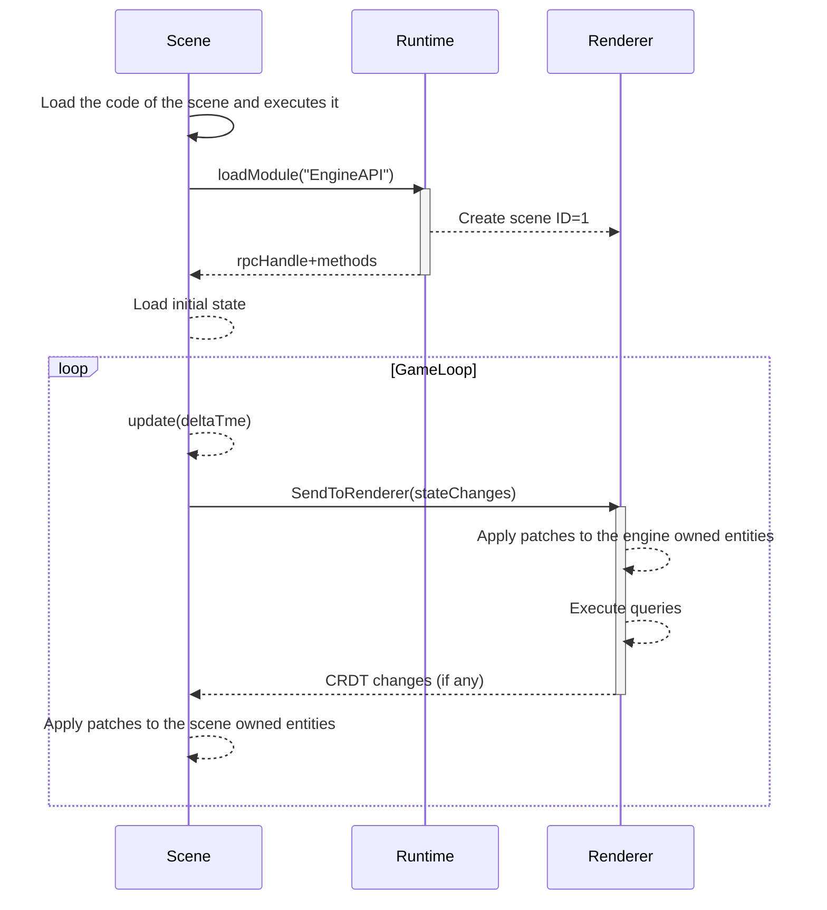

# Abstract

This document serves as reference to outline the boundaries of what the Decentraland protocol for Explorers _is_. It defines the common mechanisms and protocols (sometimes including its messages and serializations) to make that information available to implementers willing to create their own versions of the Explorer.

## What is Decentraland?

Decentraland is an open platform to socialize based on Web3 and public key cryptography. The users of the platform own the assets and both the governance process and the decisions made through it. Many different products can be considered part of Decentraland, including but not limited to a 3D explorer of the world created by the users and its rendering, content, replication and communication layers. This document focuses on a particular use case and subset of Decentraland, its _Explorer_ and the protocols required to make it work.

# Layers of the Explorer protocol

To describe the Explorer protocol, the layers described in the [Decentraland Whitepaper (2017)](https://decentraland.org/whitepaper.pdf "Decentraland Whitepaper") will be quoted. The initial layers were the first three, this document will also introduce a forth layer: Runtime layer

1. **Consensus layer**: Track land ownership and its content.
2. **Content layer**: Download assets using a decentralized distribution system.
3. **Real-time layer**: Enable users’ world viewers to connect to each other.
4. **Runtime layer**: Execute experiences the explorer.

## Consensus layer

Decentraland uses smart contracts to maintain a ledger of ownership of each of the (ownable) assets for the Explorer. The original whitepaper was scoped only to the LAND contract, that scope increased with the passing of time and the addition of new asset types like Wearables and Emotes, Names and Estates.

### LAND

The [LAND contract](https://etherscan.io/address/0xf87e31492faf9a91b02ee0deaad50d51d56d5d4d) establishes the ownership in the Ethereum network of parcels of land, those are non-fungible tokens that map 1-to-1 with the Decentraland Map, each token encodes a signed `(x,y)` position in the map. We call the map of the LAND contract "Genesis City". The whitepaper established that each plot of LAND corresponds to 10x10 meters of virtual land. This was changed to 16x16 meters [using the first governance app](https://agora.decentraland.org/polls/5fa066aa-bbd7-42bd-a8e6-a6c2c1965801).

<figure>
  
</figure>

### Names

Names are a crucial part of the Identity, to prevent impersonation and to continue leveraging smart contracts, Decentraland uses tokenized names using an Ethereum Name Service (ENS) subdomain `.dcl.eth`. These names are ERC-721 tokens, that makes them owneable and transferrable, and they live in Ethereum Mainnet.

### Wearables

Wearables are built on top of a variety of smart contracts deployed both to Ethereum (Mainnet) and Polygon. The first era of wearables still live in Ethereum, we call them L1. Those were convenient but expensive to operate. To supass this limitation a new technology was developed "L2 Collections".

_Collections_ are a set of smart contracts deployed to Polygon (or other EVM compatible networks) to create, manage and own a list of Items.

_Items_ are ERC-721 compatible tokens. Those can be limited in supply and share a common representation. The representation is the same for each item of the same kind, and it is used to locate the content of the item for applications like the Explorer or the Marketplace.

Collections are generic smart contracts that are designed to fulfill a wide variety of use cases. Starting with wearables, collections were configured to depend on a Wearables committee to approve/reject the content (representation) of each item. This process is governed by the [Decentraland DAO](https://governance.decentraland.org/ "Decentraland DAO"). That means that the community decides from the publication and secondary sales fees to the [group of people](https://governance.decentraland.org/transparency/) that curates the content of the wearables. The curation process happens in the [Builder](https://builder.decentraland.org "Decentraland Builder") tool and it is connected to the [forum](https://forum.decentraland.org/c/community-wearables/12).

### DAO

Historically, there were many implementations of governance apps for Decentraland. Starting with [Agora](https://agora.decentraland.org "Agora, the first governance app") (off-chain signatures), then Aragon and lastly a [snapshot-based](https://snapshot.org/#/snapshot.dcl.eth). Nowadays, the governance process happens entirely in the [Governance App](https://governance.decentraland.org/ "Decentraland DAO") and on-chain proposals are enacted using Aragon by the [DAO Committee](https://governance.decentraland.org/transparency). Their principal responsibility is to enact binding proposals on-chain like listing Point of Interests, sending Grants, and any other operations involving the DAO's smart contracts.

## Content layer

The Decentraland Explorer and other applications render representations of the assets from the consensus layer. The content layer defines the mechanisms in which the content is:

1. **Signed**, **validated** and **uploaded** to a node
2. **Replicated** to other nodes and
3. **Served** to the final users

To do so, a [content-server](https://github.com/decentraland/catalyst) was created. It is a service that runs inside a Catalyst.

> A _catalyst node_ is a bundle of services that self-contain a copy of Decentraland. The DAO [governs a curated list of trusted catalysts](https://governance.decentraland.org/?type=catalyst) that hold a working copy of Decentraland. It contains everything necessary to make the Explorer work.

The content server stores and synchronizes _Entities_. When a new wearable is created, or when a user uploads a scene to their LAND/parcel, all necessary files (3d models, textures, music, etc) are uploaded to a `Content Server`. Each server will verify against the blockchain that the user making the upload is actually allowed to do so. For example, in the case of scenes, the server will check that the deployer address has permissions for all the parcels they are trying to modify.

And the most important part is that all content servers will then sync with each other. So, for example, if a scene is modified in one server, the update itself will be broadcasted to the other ones. Then, in the case a content server goes down for some reason, all content will still be present in the other ones.

### Entities

An [Entity](https://github.com/decentraland/common-schemas/blob/be7213b40a2180a9a99035eb87e8a5d4b8438e7f/src/platform/entity.ts#L21-L37) is a signed data structure holding a list of content files, a deployment date and pointers. An entity is the minimal object used to organize the content. An entity can represent an scene, a wearable, a profile, a user store, an emote, etc.

An entity has the following properties:

- A type (one of scenes, profiles or wearables, etc
- Content (files that are referenced or used by the entity)
- Metadata (for example in the case of profiles, it could be a description)
- Pointers (indices that reference the entity)
- A timestamp (when the entity was created)

Entities are immutable. That means that if any of these properties were to change, then the updated version is considered as a completely new entity.

### Pointers

The identifier of the entity is named `pointer`, a unique string. A pointer is a human readable "shortcut" to the entity, i.e. the [`0,0`](https://peer.decentraland.org/content/entities/scenes?pointer=0,0) is the pointer representation of a LAND associated to a scene.

Every time an entity is deployed and accepted by the network, the pointers for that entity will now point to the newest entity for that set of pointers. That is the mechanism used to change the content of the land, wearables and emotes, the entity with the biggest timestamp is the one considered as active.

Unlike LAND, wearables and emotes have [URN pointers](https://github.com/decentraland/urn-resolver/blob/b11aeb677e06e1a9e1d7994efa98a5f11867f854/test/urn.spec.ts#L138-L147). URN are used to reference any asset inside Decentraland, the technology was selected in pursue of a common identifier that enables [extensibility to other networks or remote assets](https://github.com/decentraland/urn-resolver/blob/b11aeb677e06e1a9e1d7994efa98a5f11867f854/test/urn.spec.ts#L269-L280) and [interoperability](https://github.com/common-metaverse/urn-namespaces) with other platforms.

### Entities format

Entities must be compliant with the defined schema in [Entities Schemas](https://github.com/decentraland/common-schemas/blob/main/src/platform/entity.ts) acording to [ADR-45](/adr/ADR-45)

The schema of the entities is:

```typescript
const entityJsonSchema = {
  version: { type: "string", enum: ["v3"] },
  id: { type: "string", oneOf: [IPFSv1.schema, IPFSv2.schema] },
  type: { type: "string" },
  pointers: { type: "array", items: { type: "string", minLength: 1 } },
  timestamp: { type: "number", minimum: 0 },
  content: { type: "array", items: ContentMapping.schema },
  metadata: { type: "object", nullable: true },
}
```

### Entities Content Restrictions

Each entity type has its own restrictions on the data that is present in the JSON. All the required validations are listed in [ADR-51](/adr/ADR-51), [ADR-62](/adr/ADR-62), [ADR-74](/adr/ADR-74).

### IPFS CIDs

The identifier of the entity is the Hash of its content, the algorithm used is [IPFS with cid version 1](https://github.com/decentraland/hashing).

Every file referenced in the entity is also identified by its hash.

### Auth Chain

> Note: this section should be moved to an ADR since it is considered stable

Every entity uploaded to the content server must be signed by the deployer, in order to prove ownership of the pointers that they want to modify.

An auth chain is a chain of signatures, where:

- The first element of the chain is the original signer, and the one who will be used to validate against the blockchain
- The last element of the chain contains the entity hash and a signature
- In between are [ephemeral keys](https://nvlpubs.nist.gov/nistpubs/SpecialPublications/NIST.SP.800-57pt2r1.pdf) that can be used for signing, every ephemeral key is signed with the previous one generating a trust chain. All keys and their signatures conform the AuthChain.

The idea is that the user signs an ephemeral key with a certain expiration date. Then that key can be used for signing entities for as long as it remains valid. Therefore, the user only has to sign once until the ephemeral key expires.

In order for the server to validate the authenticity of a deployment, the client will need to send the full chain of signatures. This is an example:

```json
[
  { "type": "SIGNER", "payload": "0x716954738e57686a08902d9dd586e813490fee23" },
  {
    "type": "ECDSA_EPHEMERAL",
    "payload": "Decentraland Login\nEphemeral address: 0x90a43461d3e970785B945FFe8f7628F2BC962D6a\nExpiration: 2021-07-10T20:55:42.215Z",
    "signature": "0xe64e46fdd7d8789c0debec54422ae77e31b77e5a28287e072998e1114e252c57328c17756400d321e9e77032347c9d05e63fb59a3b6c3ab754565f9db86b8c481b"
  },
  {
    "type": "ECDSA_SIGNED_ENTITY",
    "payload": "QmNMZBy7khBxdigikA8mcJMyv6yeBXfMv3iAcUiBr6n72C",
    "signature": "0xbed22719dcdc19580353108027c41c65863404879592c65014d806efa961c629777adc76986193eaee4e48f278ec59feb1c289827254230af85b2955157ec8061b"
  }
]
```

### Endpoints that are part of the protocol

#### `GET /contents/:cid` Download an entity or content file

Used to download the content files. This endpoint is used by the content-server synchronization and by the explorer.

#### `POST /entity` Upload a new entity

The `POST /entity` must run validations to either accept or reject an entity. Depending on its type and querying the Consensus layer.

This endpoint is used by the tooling to upload content (like scenes and wearables) and the explorer (for profiles).

#### `POST /entities/active` Query active entities

Used to discover the map and all the assets as other profiles and wearables around the user. This endpoint is used by the explorer.

### Identity Storage

- To store profiles with their avatars the endpoint `POST /content/entities` is the one used.
- To retrieve profiles the endpoint `POST /entities/active` with the addresses of the users is the one that needs to be used, that will retrieve the latest stored version of the profile so the ownership of the assets may have changed in the Blockchain.

## Interactive layer

### Chat

To have a complete social experience Explorers need to support some kind of chat among users. There will be three types of chats, private dms, channels and global.

Global chat (as in chatting with people around in world) will be supported by the comms service, leveraging the P2P protocol which connects people within a single island (or whatever virtual network available). Everyone is allowed to talk in the global chat, even guests.

The [Matrix protocol](https://matrix.org/) will be leveraged for private and channel support, explorers should connect to a Matrix [homeserver](https://matrix.org/faq/#can-i-write-a-matrix-homeserver%3F) and all interactions will be saved in a single Matrix instance (as expected by the protocol), data will not be shared amongst Matrix instances. So, if a given explorer is connected to a Matrix instance, when switching homeservers, the data will not be synchronized between instances.

On the homeserver side the main responsibility, besides implementing the Matrix protocol, is to support authentication via an AuthChain. This will enable login using a wallet, allowing explorers to use different devices maintaining the same information. Since a wallet is used for login, users will be required to own one for chatting with other users via this method.

### Communication Service (comms)

A minimum communications protocol for Explorer is defined in the [RFC-4](/rfc/RFC-4). It describes the minimum to connect explorers together and see other people in the world. It does not describe the transport layers or connection topologies. Indeed, it assumes that all connections are made via a unified echo server that allows broadcasts of messages with all the people around you.

In a more production-like environment, the communications are managed by the Archipielago server in the Catalyst, it's the orchestrator of islands. The islands are the minimal unit of users groups. The universe that a user can see, talk and interact with is delimeted by the island. There will be available [ADR-70: different transports to support this communication: P2P, livekit and websocket](/adr/ADR-70).

When an user is connected through P2P with the others in the same island, and they change their profile, then that change and the new profile entity itself is sent through comms to avoid the explorer to request the Catalysts servers.

## Runtime layer

Decentraland Explorers are often compared with operative systems that run programs, those are the scenes. Each scene in Decentraland is bound to a program that runs in a sandboxed environment. A set of functions is exposed to this sandboxed environment to enable the scene to communicate with the Rendering engine.

_The Rendering Engine_ is a component of the explorer that is in charge of interpreting messages of scenes and convert those bits of information into a 3D representation of the scene. It is also in charge of managing the load/unload of resources and of forwarding input and player information back to the scenes for interactivity.

> TODO: Write about the lifecycle of a scene and how it is loaded

### Loading scenes

As explained above, scenes are programs written in JavaScript. The deployed scenes must comply with the Scene schema defined in [ADR-51](/adr/ADR-51). Entities can be loaded as scenes if their metadata matches the `scene.json`. For the sake of simplicity in this specification, we are assuming a minimum interface `{"main": "bin/scene.js"}` to illustrate how to load and run the code.

First the information of the entity to be executed as scene is fetched. As stated avobe, the entities contain a list of all files deployed and the metadata for that entity (scene.json).

Based on that information, the renderer and runtime will know how to resolve assets. To start, the runtime will create an isolated runtime environment for the scene, and then it will fetch the compiled scene `bin/scene.js` and run it. After that first eval, the runtime will start a main loop.

### Resolving files in an entity

The mechanism to resolve files based on deployed entities is explained in detail in [ADR-79](/adr/ADR-79).

### Hooking to the main loop

Among the functions exposed to the scene runtime, a special function is exposed to register a callback for the main loop. This function must be called only once, to pass on a callback used to run the main loop.

```ts
declare function onUpdate(callback: (deltaTimeSeconds: number) => Promise<void>): void

// The following example only illustrates an hypothetic scenario,
// since it is a low-level API and it shouldn't be used this way
let rotation = 0
onUpdate(async function (deltaTimeSeconds) {
  const speed = 0.001
  rotation += deltaTimeSeconds * speed
  updateEntityRotation(rotation)
  await sendUpdatesToRenderer()
})
```

> TODO: explain how to hook to other runtime events

### Loading RPC modules in the scenes

The scene runtime exposes two asynchronous functions `loadModule` and `callRpc`. Those are the key entrypoint to communicate the scenes with other modules like the renderer. The exposed modules are defined in the [protocol repository](https://github.com/decentraland/protocol/blob/main/proto/decentraland/kernel/apis/engine_api.proto).

```ts
// loadModule instantiates a remote module
declare function loadModule(moduleName: string): Promise<ModuleDescriptor>

// the callRpc function takes a rpcHandle from loadModule result and a
// methodName from the same result, combined with a list of arguments
// it returns a promise executed in the remote module.
declare function callRpc(rpcHandle: string, methodName: string, args: any[]): Promise<ProxyModule>

declare type MethodDescriptor = { name: string }
declare type ModuleDescriptor = {
  rpcHandle: string
  methods: MethodDescriptor[]
}
```

> TODO: define and document naming conventions about code generation for modules

### Synchronizing scene's entities with the renderer

The scenes synchronize with the renderer via the `EngineAPI.SendToRenderer` RPC using the CRDT protocol defined in [ADR-117](/rpc/ADR-117). The renderer will keep a local copy of all the entities and components required for rendering. Those components are in their majority serialized using protobuf as defined in [ADR-123](/rpc/ADR-123).

The `EngineAPI.SendToRenderer` response includes a list of CRDT messages to be applied in the local scene, that is used to send back information from the renderer like the position of the player.



<details open="">
    <summary>Pseudocode example of a scene</summary>

```typescript
const engineApi = await loadModule("EngineAPI")
async function sendToRenderer(crdtMessage: Uint8Array[]) {
  await callRpc(engineApi.rpcHandle, "SendToRenderer", [{ data: crdtMessage }])
}

// this is a lamport timestamp, required by the CRDT rules
let timestamp = 0

// entities are now numbers
const entityId = 1234

// component numbers, defined in .proto files
const transformId = 1
const rendererMeshId = 2

const transform = Transform.serialize({ position, rotation, scale })
const mesh = RendererMesh.serialize({ box: {} })

// now we are sending the component messages from the LWW-ElementSet
// this sets the transform & meshRenderer for the entity
const messagesBackFromRenderer = await sendToRenderer([
  CRDT.PutMessage(entityId, transformId, transform, timestamp++),
  CRDT.PutMessage(entityId, rendererMeshId, mesh, timestamp++),
])
```

</details>

# Appendix

## Ephemeral keys

Ethereum accounts are globally used in Decentraland to identify the users. Public key cryptography and signatures are leveraged to trust that they (the users) performed an action because they are the only ones capable of [signing](https://github.com/ethereum/EIPs/blob/master/EIPS/eip-1271.md) a message. That is the same mechanism used by many other platforms to perform on and off-chain actions.

In order to protect the assets of the community, to keep a reasonable level of trust with user actions, and to enhance the UX of the platform e.g. not needing the users to accept a transaction every time they want to open a door. An [ephemeral key](https://en.wikipedia.org/wiki/Ephemeral_key) is created and signed using their Ethereum account. That establishes a certified trust chain. This way, messages can be signed with the in-memory ephemeral key. Both the initial signature of the ephemeral key by the real account, and the message signed with the ephemeral key are used as the [AuthChain](https://github.com/decentraland/decentraland-crypto) to authorize requests across all services required to make Decentraland work.

> Note: this section should be moved to an ADR since it is considered stable
