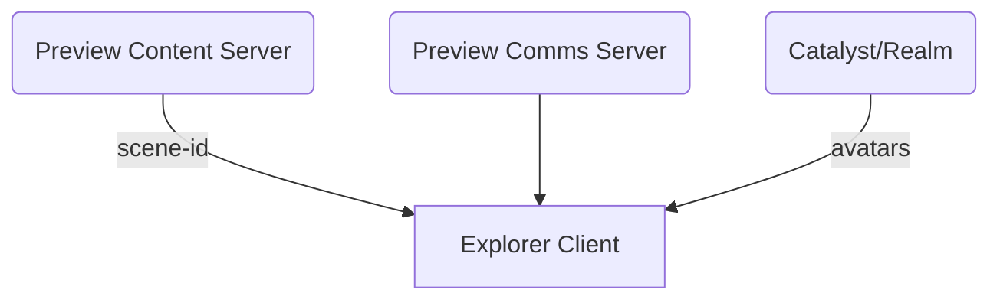

# Abstract

This document describes how a Scene Preview Service can be created using minimal versions of the Content Server and Comms.

# Introduction

Today users that don't own a LAND or are not ready to push their content to production need to use a Heroku application container to be able to preview and share a scene with different stakeholders. This solution requires some extra configuration steps and, on the other hand, it will stop being free according to the [latest Heroku news](https://blog.heroku.com/next-chapter). To ease the life of the content creators, a new scene preview server will be created, leveraging the same steps than when uploading content to the Catalyst network and enabling an easy way to validate and experience the content before it is finally uploaded to the Genesis City.

## Approach

The solution for the scenes preview will be done in stages

### Stage 1: Preview Server

Create a BETA program where the technical feasibility of the project can be evaluated and test the experience from the content creators perspective.

WARNINGS:

- This stage is a Proof of Concept: do not build a production product on top of this or make this feature, as it is, a dependency on other product.
- In order to go out form the BETA state and for this to scale, some restrictions may be needed besides owning a name as this can scale fast in terms of resources needed to run the preview server.

Scope of the BETA:

- Open to users owning a Decentraland NAME
- Only one scene per Decentraland NAME would be allowed
- Scenes deployment to the preview server will have the same disk space limitations than the Content Servers hosted on the Catalyst network
- Besides scene size and owning a NAME, no other validations will be made as this is just a preview
- Explorer mini map won't be displayed
- Explorer skybox light can be set up for the scene
- Display a Jump to Genesis City button to leave the scene preview
- Validated by hosting a scene with the new onboarding experience

#### The Solution

This implementation will allow content creators to deploy a scene in a preview server and join the scene with a maximum number of concurrent users. The solution is composed of three areas, the CLI, the backend infrastructure and the Explorer experience which will be detailed below.

Some common language considerations to have in mind while reading the next sections:

- A scene hosted outside the Genesis City is called a World, and will be identified by a [Decentraland NAME](https://builder.decentraland.org/names)
- When connected to Decentraland, you can only interact with users connected to the same **Realm**.
- In this stage and context, a Realm is equivalent to a World

#### Content Creators

From the Content Creators point of view, the experience will be very simple, only run the same deploy command but adding as a target the URL of the new preview server, e.g.

`dcl deploy --target-content https://worlds-content-server.decentraland.org`

The output of this command should contain a link that can be shared and used to jump in to the scene preview, e.g. `https://play.decentraland.org/?reaml=yourname.dcl.eth`

Adding the Decentraland NAME value to the **realm** queryParameter will take you to the uploaded World, or joining Decentraland and typing `/changerealm yourname.dcl.eth` will have the same effect.

#### Architecture

The Explorer client in order to work needs to resolve scenes, users identity (avatar, wearables, emotes, etc) and communications between peers. Unlike production where all of them are obtained from the same [Catalyst Node](https://docs.decentraland.org/contributor/catalyst/about/), here a Preview Content Server and a Comms Preview Server will be needed.
The scenes assets and information that the client needs will be resolved from the Preview Content Server and the communications orchestration between peers joining a preview will be handled by the Comms Preview Server. On the other hand, users identity will continue to be retrieved from a DAO Catalyst node.  
For this to work, the client will receive several new parameters: **preview content server** from which to resolve the scene assets, **scene identifier**, and the **comms preview server URL**.



#### Realm

In order to run, the Client needs to connect to a Realm. In this case, the Preview Content Server will act as Realm implementing the endpoint `/about` documented in [ADR-110](/adr/ADR-110).

This way the Client will load:

- The URNs from `configurations.scenesUrn`
- The wearables from `content.publicUrl`
- The profiles from `lambdas.publicUrl`
- The minimap configuration from `configurations.minimap` (loaded from the scene.json)

Example:

```json
{
  "healthy": true,
  "configurations": {
    "networkId": 1,
    "globalScenesUrn": [],
    "scenesUrn": [
      "urn:decentraland:entity:bafkreifdgd7qccas3r2tywzgzo74mpr4i3vcq?baseUrl=https://worlds-content-server.decentraland.org/ipfs/"
    ],
    "city_loader_content_server": ""
  },
  "content": {
    "healthy": true,
    "publicUrl": "https://peer.decentraland.org/content"
  },
  "lambdas": {
    "healthy": true,
    "publicUrl": "https://peer.decentraland.org/lambdas"
  }
}
```

#### Explorer Client

When the Client loads a scene from the Preview server, the experience should be slightly different as the **mini map** should not be loaded. The scene is going to be isolated from the Genesis City. Besides this, there should be a way to control the skybox settings so that creators can test their scenes with day light and night light.
To accomplish this, a new `worldConfiguration` field should be added to the `scene.json`.

**scene.json**

```json
{
  "worldConfiguration": {
    "skybox": 36000,
    "minimapVisible": false
  }
}
```

`skybox`: This property indicates how many seconds have passed (in Decentraland time) since the start of the day, assuming the full cycle lasts 24 hours. Divide the seconds value by 60 to obtain minutes, and by 60 again to obtain the hours since the start of the day. For example, if the seconds value is 36000, it corresponds to 10 AM.

`minimapVisible`: this boolean property will determine whether or not to show the Genesis City mini map when loading the scene.

These properties will only be processed by the Hosted Scene preview service and be ignored if they are present in any scene deployed to the Genesis City.


###### Chat commands

The Explorer Client needs to support the commands `/goto` and `/changerealm`.

- For the `/goto <parcel>` command, then the scene will reload to the corresponding parcel of a DAO Realm.
- For the `/changerealm <realm>` command, then the scene will reload to the 0,0 parcel of the corresponding Realm.

###### Navbar

To load the navbar with the `Explore`, `Backpack`, `Map` and `Settings` one Realm will be chosen. So, when loading the map the users connected shown there will correspond to that Realm. So if the user want to jump in to a hot-scene, then the Explorer Client will reload that corresponding scene of the chosen Realm.

#### Benefit

As a result:

- The experience to use the preview will be the same as when deploying content to Decentraland
- Scenes content can be tested multi-player and isolated from the Genesis City
- The preview UX can be tested with a subset of content creators
- As the access will be limited, all the focus is going to be on the experience and scalability will come on the following stage
- Fosters the decentralization by having an alternative solution to the Heroku application container

### Stage 2: Preview Server Scalability

After BETA testing, incorporating feedback and fine tunning the experience, the GA of the preview Server can be planned.

Based on the BETA testing:

- Define Hardware requirements for the Preview Content Server (Disk space/CPU)
- Define the max number of concurrent users allowed in a Preview
- Implement a Garbage Collection
- Define strategy to open the Preview to all content creators
- Support deploying a World to a specific Decentraland NAME so that accounts with more than one name can have support for different scenes
- Review the signing deployment experience in the dApp as it currently displays the Genesis City map

### Stage 3: Run your own Preview Servers

With all the pieces in place, it should be simple to provide an easy way to run preview server that Content Creators can use to share scenes in a private environments.

---
