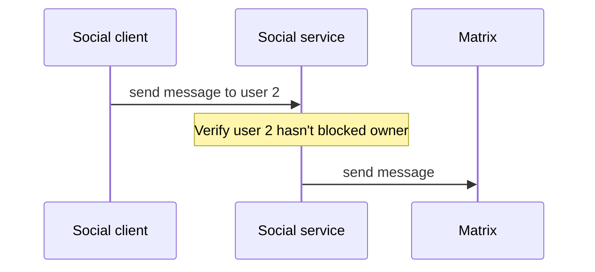
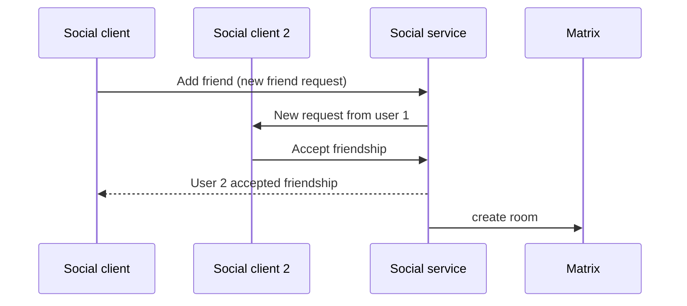
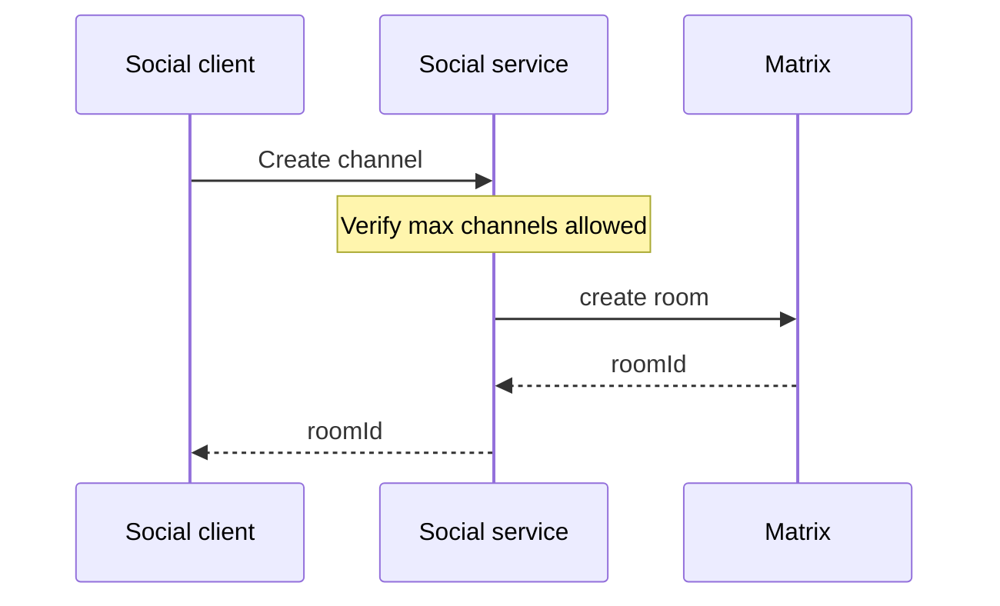
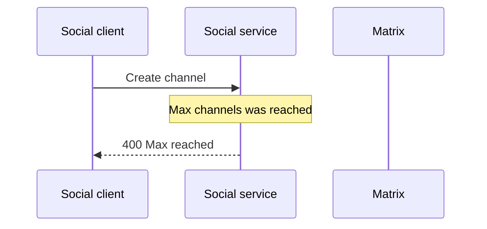
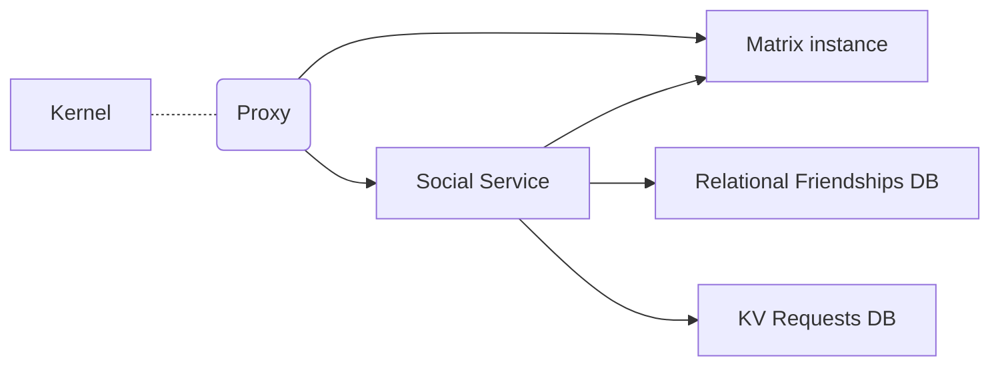

## Abstract

<!--
Insert here a brief paragraph summarizing the RFC in its current state.
This section shall provide an overview of whether this is a settled
decision, alternatives explored and a short summary of relevant
background information and key insights.
-->

All current social features are implemented via abstractions on the client side, this poses a big problem when trying to add new features or apply business logic on top of features (i.e. max amount of friends) since with an API call any change can override any logic that the client has. This RFC proposes to have a new service on top of Matrix that will contain business logic, security policies, and will allow extracting the current abstractions from Matrix.

## Need

<!--
Why is this RFC needed?  Briefly describe the need motivating this
proposed artifact to be created or work be done.  What problem does it
solve? Include an estimate of actual or perceived effort/gain.
-->

Whenever a new feature regarding social interaction between users is envisioned currently, Matrix is seen as a blocker (or the integration with it), for example there’s currently no way to know the friends of a certain user, the only user case currently supported is knowing a users’ own friends (when logged in)

Some features that can’t be correctly implemented with the current status of the feature:

- Blocking another user (the message is still sent if a request to the server is done)
- Knowing the friends of a user (e.g. for social recommendations)
- Maxing out the channels or friends per user (preventing overusage of the chat)

## Approach

<!--
How do you intend on addressing the need?  Describe what you plan on
doing and the rationale behind the decisions you propose.  Then lay out
the plan of execution, in rough order of how the execution should take
place.  Include the rollout plan as well. (This is usually the longest
section of the RFC) Hint: don’t be afraid of posting illustrations! The
level of detail here has to be enough to give the reader  a clear
understanding of the solution - it is up to the writer to decide.
Further detail can be addressed to satisfy comments and increase clarity.
-->

We propose to have a new service that will maintain every current feature of the chat but will also have support for the social features, for chat features it will work as a proxy but will first apply any business logic designed by us.

<b>Fig 1.1 Flow of sending a message, social service as proxy with business logic</b>

<b>Fig 1.2 Simplified flow of a friendship</b>

<b>Fig 1.3 Simplified flow of a creating a channel (success case)</b>

<b>Fig 1.4 Simplified flow of a creating a channel (failure case)</b>

This service will need to be deployed along a Matrix instance since we’ll still leverage it as our Chat and main communication motor.

The communication between the social client and the new Social service will be implemented via web socket to be able to send real time notifications to the social client.

The friendships and friendship requests will be stored in a database managed by us.

When a request doesn’t have any business logic on our side, it should reach Matrix directly, otherwise it will first go to the new service.

The main use cases for Matrix are the chat, so the endpoints that still will go to Matrix are:

- POST /login
  - Used to login
- GET /capabilities
  - Used internally by matrix client
- PUT /presence/{userId}/status
  - Used for presence status (until we replace it for an in house implementation)
- GET /messages
  - Used for obtaining the story of a conversation
- GET /sync
  - Until we have a newer mechanism for obtaining new messages notifications
- GET /room/{roomId}
  - Used for obtaining room information
- GET /rooms/{roomId}/event/{eventId}
  - Used to obtain an event of a given room
- PUT rooms/{roomId}/send/{eventType}/{eventId}
  - Used to send messages

There might be others, but these are the most important endpoints that won’t be affected and will continue as they are today.

The endpoints that we will override:

- createRoom
  - This endpoint will be closed since the only way to create rooms will be either via `createChannel` or a new friendship, and both will may a max allowed
- joinRoom
  - Same as create, we will apply max allowed

Even though it’s not an override it’s important to notice that `/sync` won’t be used for friendships and friend requests anymore and will be replaced with new endpoints for this logic.

Due to the service being critical for communication between the users, it will need to be highly available, so we will need:

- Multiple instances
- Relaying of messages between instances so that each of them can notify the users connected to them
- Local cache to prevent potential downtime from the database impacting the experience of the users

We will need to refactor the dcl-social-client since we won’t be using the full scope of the matrix or some methods might change. On the kernel side there shouldn’t be too many changes since the API is abstracted via the client.

An important thing to note about this service is that it won't be decentralized to protect user data, we will enable the community to run their own instance of the social service and chat so that they are able to own and choose from the explorer whose server they want their data to be stored in.

## Benefit

<!--
What are the benefits / merits of this approach?  Tie the benefit
directly back into the satisfaction of the need.  How does this benefit
the client / user? How does the unique approach yield unique customer benefits?
-->

- Ability to implement unexplored features (e.g. friends/channels recommendations)
- Full control of the communication engine of Decentraland
- Easiness to scale horizontally the social layer (the chat won’t be scaled as easily, but the main feature will be the chat and the load on matrix should change since the real time notifications will be managed by the new service)

In the long term we might see that Matrix is not able to cope with the amount of users that we want (or we might need a huge investment in servers due to their cost) with this new architecture we could eventually replace it with an in-house built messaging system that only needs to leverage a little part of the procol (or could be a totally new one) with little to no overhead.

## Competition

<!--
What other options were considered? Give an honest treatment of why
these alternatives were not satisfactory. Identify the competition and
demonstrate that the competition is clearly understood. Include the
“what if we do nothing” alternative.
-->

### Doing nothing

A valid option is to keep Matrix as is, but lose the ability to implement the new social features and continue to modify the client or use our own modified synapse instance with the business logic coded by us.

#### Pros:

- No overhead and time investment

#### Cons:

- Eventually might become a blocker for a desired feature and make others more cumbersome to implement as well (e.g. friendships are to modeled properly right now with Matrix events, but would be simpler to do it ad hoc with the new service)

- Low control on the Matrix scalability due to Synapse's startup routine

## Non-goals

Replacing Matrix is not part of this proposal, it's just changing the scope and impact of the feature. Matrix will remain as the engine for our private messaging infrastructure.

## Key Dependencies and Open Questions

Q: Would the chat and friends be down if this service goes down?

A: Yes, since this service will work as a proxy to send messages, if it's down the chat will be down. That's why it's so important for it to have such a high uptime.

Q: Do we really need to expose users' friends? Isn’t it an issue on the privacy side?

A: Since exposing users' friends is a privacy intrusion, this service won't expose them to anyone, only the same user will be able to query their own friends.

Q: Does this service having access to messages poses a threat to users' privacy?

A: This service will only have access to the request sent from the UI, once we have E2E encryption support nor this service nor any other one will be able to read the content of the message. In the meantime, this service won't use nor read the content of the message for anything.
