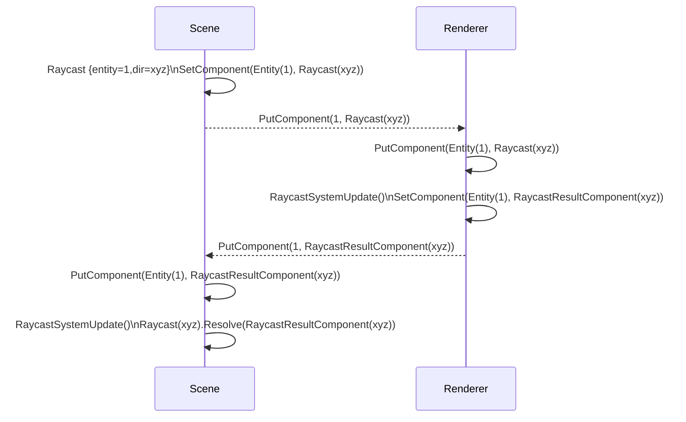

## Abstract

This document describes the protocol used to broadcast, synchronize and reach consensus about scenes' entities and components across differents part of the Decentraland explorer e.g. Renderer, Kernel and the Scene itself. A CRDT (stands for _conflict-free replicated data type_) is a combination of algorithms that ensures two actors will reach the same conflict-free state after processing the same set of messages. Regardless of the ordering.

## Need

<!--
Why is this ADR needed? Briefly describe the need motivating this proposed artifact to be created or work be done. What problem does it solve?
-->

As of SDK 1 to 6, imperative messages were sent from the scenes to the renderer. Those messages were assured to be ordered and complete (all of them are guaranteed to be delivered). Moreover, the imperative nature of that message generation required a high level of coupling between the scene and its runtime, including the state of the renderer.

### Limitations of current design

Other problems arised from this implementation, notably the lack of optimization of those messages. Since every message was unique, there was no simple way to "skip" messages when new messages were in the queue of processing. And that is due to the imperative nature of the messages and the statefulness of the design of the ECS itself at that moment. As an ilustration, the following messages require a state machine to be processed, i.e. we could not `AttachEntityComponent(E1, C1)` if both `Entity(E1)` and `Component(C1)` are not created and available.

```yaml
- CreateEntity(E1)
- AddEntityComponent(E1, "transform", componentData)
- CreateDisposableComponent(C1)
- UpdateDisposableComponent(C1, data)
- AttachEntityComponent(E1, C1)
- RemoveEntityComponent(E1, "transform")
```

That problem magnifies the "queue optimization" problem of the interpreter of messages, knowing which message can be dropped is a stateful process and thus, it requires almost the same computational capacity as processing the message directly.

### Impossible use cases

> TODO: Static scenes

> TODO: Synchronization of state over network

> TODO: Load parcels at a distance, then load the code. Shut down the code when moving away

> TODO: Edition mode

## Context, Reach & Prioritization

<!--
Discuss and go into detail about the subject in question. Make sure you cover:
- Why is this decision important
- The urgency of the decision
- Datapoints and related background information
- Vocabulary and key terms
-->

To serve content creators, enabling new use cases like State synchronization over network and overal great performance improvements, it was decided to look for an alternative to unleash the SDK from the statefulness of the protocol in a way that more tooling can be created independently from the implementation of the runtime and renderer.

A successful example that is used as datapoint is what can be created with the Builder. It is a wrapper on top of the SDK that stores entities in a JSON file. That JSON file represents the entities and components of the scene, enabling easy manipulation of the file. Then the builder creates the corresponding SDK `game.js` based on that tree of entities. One of the goals of this new CRDT protocol is to enable a state synchronization mechanism that enables the builder to be connected to a scene and the renderer (or remote renderer) without being an extra layer. That is so, to enable the creation of real-time edition tools on top of the SDK.

For this new design, some hard assumptions (or definitions) are considered:

- The whole SDK will be data oriented, implemented using an ECS - https://www.dataorienteddesign.com/dodbook/
- Entities are only numeric identifiers, not classes
- Components (and therefore entities) MUST be synchronizable
- Each instance of the runtime may have its own non-synchronized Components, i.e. some game-specific components like "CurrentTarget" or "Speed"

## Solution Space Exploration

<!--
### Sources of truth, introducing the transactor

Since CRDTs don't require consensus, a constant stream of operations needs to be synchronized among peers. Including initial states and partial states. That yields an exponential amount of "merge operations" and bottlenecks identifying the deltas. Those problems are multiplied by the amount of nodes that are synchronized. To prevent those errors, a "transactor" actor is added to the system. The "transactor" is a service that listens to changes of all peers, apply changes, compress them and then broadcasts changes to all peers. The "transactor" stores the snapshots of the states of the nodes.

- https://hal.inria.fr/file/index/docid/555588/filename/techreport.pdf
- https://docs.datomic.com/on-prem/overview/transactor.html
- https://crdt.tech/resources
-->

### CRDT

CRDTs (conflict-free replicated data types) are data types on which the same set of operations yields the same outcome, regardless of order of execution and duplication of operations. This allows data convergence without the need for consensus between replicas. In turn, this allows for easier implementation (no consensus protocol implementation) as well as lower latency (no wait-time for consensus).

Operations on CRDTs need to adhere [to the following rules][mixu]:

- Associativity `(a+(b+c)=(a+b)+c)`, so that grouping doesn't matter.
- Commutativity `(a+b=b+a)`, so that order of application doesn't matter.
- Idempotence `(a+a=a)`, so that duplication doesn't matter.

Data types as well as operations have to be specifically crafted to meet these rules. CRDTs have known implementations for counters, registers, sets, graphs, and others. Roshi implements a set data type, specifically the Last Writer Wins element set (LWW-element-set).

This is an intuitive description of the LWW-element-set:

- An element is in the set, if its most-recent operation was an add.
- An element is not in the set, if its most-recent operation was a remove.

A more formal description of a LWW-element-set, as informed by [Shapiro][shapiro], is as follows: a set S is represented by two internal sets, the add set A and the remove set R. To add an element e to the set S, add a tuple t with the element and the current timestamp t=(e, now()) to A. To remove an element from the set S, add a tuple t with the element and the current timestamp t=(e, now()) to R. To check if an element e is in the set S, check if it is in the add set A and not in the remove set R with a higher timestamp.

Roshi implements the above definition, but extends it by applying a sort of instant garbage collection. When inserting an element E to the logical set S, check if E is already in the add set A or the remove set R. If so, check the existing timestamp. If the existing timestamp is **lower** than the incoming timestamp, the write succeeds: remove the existing (element, timestamp) tuple from whichever set it was found in, and add the incoming (element, timestamp) tuple to the add set A. If the existing timestamp is higher than the incoming timestamp, the write is a no-op.

Below are all possible combinations of add and remove operations.
A(elements...) is the state of the add set. R(elements...) is the state of the remove set. An element is a tuple with (value, timestamp). add(element) and remove(element) are the operations.

| Original state | Operation   | Resulting state |
| -------------- | ----------- | --------------- |
| A(a,1) R()     | add(a,0)    | A(a,1) R()      |
| A(a,1) R()     | add(a,1)    | A(a,1) R()      |
| A(a,1) R()     | add(a,2)    | A(a,2) R()      |
| A(a,1) R()     | remove(a,0) | A(a,1) R()      |
| A(a,1) R()     | remove(a,1) | A(a,1) R()      |
| A(a,1) R()     | remove(a,2) | A() R(a,2)      |
| A() R(a,1)     | add(a,0)    | A() R(a,1)      |
| A() R(a,1)     | add(a,1)    | A() R(a,1)      |
| A() R(a,1)     | add(a,2)    | A(a,2) R()      |
| A() R(a,1)     | remove(a,0) | A() R(a,1)      |
| A() R(a,1)     | remove(a,1) | A() R(a,1)      |
| A() R(a,1)     | remove(a,2) | A() R(a,2)      |

For LWW-element-set, an element will always be in either the add or
the remove set exclusively, but never in both and never more than once. This
means that the logical set S is the same as the add set A.

Every key represents a set. Each set is its own LWW-element-set.

For more information on CRDTs, the following resources might be helpful:

- [The chapter on CRDTs][mixu] in "Distributed Systems for Fun and Profit" by Mixu
- "[A comprehensive study of Convergent and Commutative Replicated Data Types][shapiro]" by Mark Shapiro et al. 2011

[mixu]: http://book.mixu.net/distsys/eventual.html
[shapiro]: https://hal.inria.fr/inria-00555588

## Specification

The decided implementation is a LWW-Element-Set. In which the keys to identify the elements of the set is composed of `entityId+componentId` and the elements themselves are the serialized values of the components, that value serialization falls outside the scope of this ADR.

> TODO: Link to protobuf components ADR @leanmendoza

### Schema & Serialization

> TODO: Replace with final wire message

ProtocolBuffer is the selected serialization format for the EcsProtocol, the protocol should always be small enough to ensure that an efficient (cpu and memory-wise) encoder/decoder can be created. The `data` field of the message can be serialized in other more convenient formats.

```protobuf
message WireMessage {
    repeated ComponentOperation operations = 1;
    repeated Query query = 2;
    repeated Responses query_response = 3;
}

message ComponentOperation {
    int32 message_type = 1;     // PUT_COMPONENT | DELETE_COMPONENT
    int64 entity_id = 2;        // Entity number
    int64 component_number = 3; // ClassIdentifier number for the component kind

    // We use lamport timestamps to identify components and to track in which order
    // a client created them. The key for the lamport number is key=(entity_id,component_number)
    int64 timestamp = 4;

    // @optional
    // missing data means the component was deleted
    bytes data = 5;
}

//// deprecate
message Query {
    int32 message_type = 1; // QUERY
    int64 query_type = 2; // RAYCAST | ...?
    reserved 3;

    // Serialized query
    bytes data = 5;
}

```

#### Command Query Responsibility Segregation

In more than one case, it is required to get information from and back to the renderer i.e. Raycast. To do so, and to preserve the data-oriented approach, queries, commands and responses will be encoded as Components of the entities. Allowing the CRDT protocol to synchronize the state of the queries and at the same time, writing back the response of the query as other component of the same entity. That way, the renderer can take any amount of time to process the query since the whole process will be entirely decoupled in time by the CRDT protocol. On the ECS's end (the scene) a regular system may run every update tick to check if the response arrived and trigger the desired code path once it is there.



#### Synchronization rules

At the end of the day, a CRDT implementation is dead-simple. At it's core it has a function that decides which message is going to be processed against the current state. The proposed solution looks like this:

```typescript
type EntityComponentValue = {
  // serialization of the component value
  data: Uint8Array
  // lamport timestamp
  timestamp: number
}

function sendUpdate(entityId, componentId, value) {
  // ...
}

function processUpdate(entityId, componentId, newValue) {
  const currentValue = entities[entityId][componentId]
  if (currentValue.timestamp > newValue.timestamp) {
    // discardMessage() and send newer state to the sender
    // keep our current value
    sendUpdates(entityId, componentId, currentValue)
  } else if (currentValue.data > newValue.data) {
    // if lexicographically the currentValue is greater than the new
    // value, send newer state to the sender. keep our current value
    sendUpdates(entityId, componentId, currentValue)
  } else {
    entities[entityId][componentId] = newValue
  }
}
```

## RFC 2119 and RFC 8174

> The key words "MUST", "MUST NOT", "REQUIRED", "SHALL", "SHALL NOT", "SHOULD", "SHOULD NOT", "RECOMMENDED", "NOT RECOMMENDED", "MAY", and "OPTIONAL" in this document are to be interpreted as described in RFC 2119 and RFC 8174.
