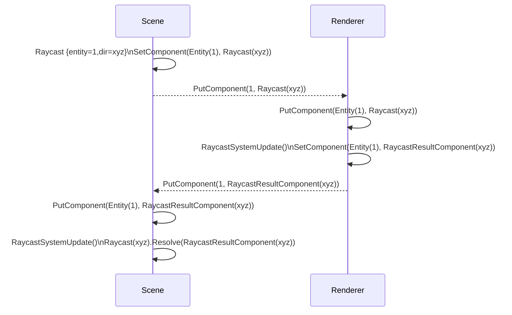

## Abstract

This document describes the protocol used to broadcast, synchronize and reach consensus about scenes' entities and components across differents part of the Decentraland explorer e.g. Renderer, Kernel and the Scene itself. A CRDT (stands for _conflict-free replicated data type_) is a combination of algorithms that ensures two actors will reach the same conflict-free state after processing the same set of messages. Regardless of the ordering.

## Need

<!--
Why is this ADR needed? Briefly describe the need motivating this proposed artifact to be created or work be done. What problem does it solve?
-->

As of SDK 1 to 6, imperative messages were sent from the scenes to the renderer. Those messages were assured to be ordered and complete (all of them are guaranteed to be delivered). Moreover, the imperative nature of that message generation required a high level of coupling between the scene and its runtime, including the state of the renderer.

### Limitations of current design

Other problems arised from this implementation, notably the lack of optimization of those messages. Since every message was unique, there was no simple way to "skip" messages when new messages were in the queue of processing. And that is due to the imperative nature of the messages and the statefulness of the design of the ECS itself at that moment. As an ilustration, the following messages require a state machine to be processed, i.e. we could not `AttachEntityComponent(E1, C1)` if both `Entity(E1)` and `Component(C1)` are not created and available.

```yaml
- CreateEntity(E1)
- AddEntityComponent(E1, "transform", componentData)
- CreateDisposableComponent(C1)
- UpdateDisposableComponent(C1, data)
- AttachEntityComponent(E1, C1)
- RemoveEntityComponent(E1, "transform")
```

That problem magnifies the "queue optimization" problem of the interpreter of messages, knowing which message can be dropped is a stateful process and thus, it requires almost the same computational capacity as processing the message directly.

### Impossible use cases

## Static Scenes & Load Parcels

Besides the limitation of the messages being sent, another one we faced was how the static scenes were implemented and how badly they performed.
No matter what kind of scene you have, for this scene to work in Decentraland, we need to download the game.js and eval that code to run it. Even though if it's only a static house with some trees or an empty road.
With the new approach of CRDTs, we can deploy a file containing the relation between the entities and components (CRDT State) and download only that file with the models instead of downloading the game.js and doing an eval of the code.
This way we can load parcels at a distance, without the need of the code, and when you are getting closer to the scene start running the code.

## Synchronization of state over network

SDK6 had a limitation when synchronizing components over the network for two reasons. The first was the limitation on messages and their poor implementation. The second was the resolution of conflicts when a component was modified on multiple clients.
All scenes run locally on each client, so to synchronize a component over the network, you will need to implement a way to send messages between clients and resolve conflicts if two clients modify the same component. All clients MUST see the same thing. So, how did we solve these conflicts? CRDTs are the answer.
A conflict-free replicated data type (CRDT) is a combination of algorithms that ensures two actors will reach the same conflict-free state after processing the same set of messages, regardless of the ordering. The main issue that CRDT tackles is the synchronization of state.
SDK7 and CRDTs implementation solve these issues out of the box, so the content creators don't have to worry about them.
With CRDTs, we can ensure a consistent state will be reached, regardless of the order of messages, as long as they arrive.
SDK7 will send and synchronize components through the wire without conflicts in the background out of the box.

> TODO: Edition mode

## Context, Reach & Prioritization

<!--
Discuss and go into detail about the subject in question. Make sure you cover:
- Why is this decision important
- The urgency of the decision
- Datapoints and related background information
- Vocabulary and key terms
-->

To serve content creators, enabling new use cases like State synchronization over network and overal great performance improvements, it was decided to look for an alternative to unleash the SDK from the statefulness of the protocol in a way that more tooling can be created independently from the implementation of the runtime and renderer.

A successful example that is used as datapoint is what can be created with the Builder. It is a wrapper on top of the SDK that stores entities in a JSON file. That JSON file represents the entities and components of the scene, enabling easy manipulation of the file. Then the builder creates the corresponding SDK `game.js` based on that tree of entities. One of the goals of this new CRDT protocol is to enable a state synchronization mechanism that enables the builder to be connected to a scene and the renderer (or remote renderer) without being an extra layer. That is so, to enable the creation of real-time edition tools on top of the SDK.

For this new design, some hard assumptions (or definitions) are considered:

- The whole SDK will be data oriented, implemented using an ECS - https://www.dataorienteddesign.com/dodbook/
- Entities are only numeric identifiers, not classes
- Components (and therefore entities) MUST be synchronizable
- Each instance of the runtime may have its own non-synchronized Components, i.e. some game-specific components like "CurrentTarget" or "Speed"

## Solution Space Exploration

<!--
### Sources of truth, introducing the transactor

Since CRDTs don't require consensus, a constant stream of operations needs to be synchronized among peers. Including initial states and partial states. That yields an exponential amount of "merge operations" and bottlenecks identifying the deltas. Those problems are multiplied by the amount of nodes that are synchronized. To prevent those errors, a "transactor" actor is added to the system. The "transactor" is a service that listens to changes of all peers, apply changes, compress them and then broadcasts changes to all peers. The "transactor" stores the snapshots of the states of the nodes.

- https://hal.inria.fr/file/index/docid/555588/filename/techreport.pdf
- https://docs.datomic.com/on-prem/overview/transactor.html
- https://crdt.tech/resources
-->

### CRDT

CRDTs (conflict-free replicated data types) are data types on which the same set of operations yields the same outcome, regardless of order of execution and duplication of operations. This allows data convergence without the need for consensus between replicas. In turn, this allows for easier implementation (no consensus protocol implementation) as well as lower latency (no wait-time for consensus).

Operations on CRDTs need to adhere [to the following rules][mixu]:

- Associativity `(a+(b+c)=(a+b)+c)`, so that grouping doesn't matter.
- Commutativity `(a+b=b+a)`, so that order of application doesn't matter.
- Idempotence `(a+a=a)`, so that duplication doesn't matter.

Data types as well as operations have to be specifically crafted to meet these rules. CRDTs have known implementations for counters, registers, sets, graphs, and others. Roshi implements a set data type, specifically the Last Writer Wins element set (LWW-element-set).

This is an intuitive description of the LWW-element-set:

- An element is in the set, if its most-recent operation was an add.
- An element is not in the set, if its most-recent operation was a remove.

A more formal description of a LWW-element-set, as informed by [Shapiro][shapiro], is as follows: a set S is represented by two internal sets, the add set A and the remove set R. To add an element e to the set S, add a tuple t with the element and the current timestamp t=(e, now()) to A. To remove an element from the set S, add a tuple t with the element and the current timestamp t=(e, now()) to R. To check if an element e is in the set S, check if it is in the add set A and not in the remove set R with a higher timestamp.

Roshi implements the above definition, but extends it by applying a sort of instant garbage collection. When inserting an element E to the logical set S, check if E is already in the add set A or the remove set R. If so, check the existing timestamp. If the existing timestamp is **lower** than the incoming timestamp, the write succeeds: remove the existing (element, timestamp) tuple from whichever set it was found in, and add the incoming (element, timestamp) tuple to the add set A. If the existing timestamp is higher than the incoming timestamp, the write is a no-op.

Below are all possible combinations of add and remove operations.
A(elements...) is the state of the add set. R(elements...) is the state of the remove set. An element is a tuple with (value, timestamp). add(element) and remove(element) are the operations.

| Original state | Operation   | Resulting state |
| -------------- | ----------- | --------------- |
| A(a,1) R()     | add(a,0)    | A(a,1) R()      |
| A(a,1) R()     | add(a,1)    | A(a,1) R()      |
| A(a,1) R()     | add(a,2)    | A(a,2) R()      |
| A(a,1) R()     | remove(a,0) | A(a,1) R()      |
| A(a,1) R()     | remove(a,1) | A(a,1) R()      |
| A(a,1) R()     | remove(a,2) | A() R(a,2)      |
| A() R(a,1)     | add(a,0)    | A() R(a,1)      |
| A() R(a,1)     | add(a,1)    | A(a,1) R()      |
| A() R(a,1)     | add(a,2)    | A(a,2) R()      |
| A() R(a,1)     | remove(a,0) | A() R(a,1)      |
| A() R(a,1)     | remove(a,1) | A() R(a,1)      |
| A() R(a,1)     | remove(a,2) | A() R(a,2)      |

For LWW-element-set, an element will always be in either the add or
the remove set exclusively, but never in both and never more than once. This
means that the logical set S is the same as the add set A.

Every key represents a set. Each set is its own LWW-element-set.

For more information on CRDTs, the following resources might be helpful:

- [The chapter on CRDTs][mixu] in "Distributed Systems for Fun and Profit" by Mixu
- "[A comprehensive study of Convergent and Commutative Replicated Data Types][shapiro]" by Mark Shapiro et al. 2011

[mixu]: http://book.mixu.net/distsys/eventual.html
[shapiro]: https://hal.inria.fr/inria-00555588

## Specification

The decided implementation is a LWW-Element-Set. In which the keys to identify the elements of the set is composed of `entityId+componentId` and the elements themselves are the serialized values of the components, that value serialization falls outside the scope of this ADR and it can be read [the ADR-123](https://adr.decentraland.org/adr/ADR-123).

### Entity definition

As `entityId` MUST BE unequivocal ids, their space of numbers has to be bounded, to avoid leaks. With a limited set of numbers, we need to version them without limiting the capacity of creating/destroying a major number of entities. Number and version would compound the `entityId` enabling the unequivocal id, the version avoids leaking and old reference to old entities.
With this, the proposed definition for the entity is:

1. A 32-bit unsigned number
2. The 16-bit most significant (highest part) is the `version`.
3. The 16-bit less significant (lowest part) is the `number`.

`[31..16][15..0] = [entity-version][entity-number]`

The functions to compound or decompound (in typescript):

```ts
const MAX_U16 = 0xffff
const MASK_UPPER_16_ON_32 = 0xff00

function fromEntityId(entityId: number) {
  return {
    number: (entity & MAX_U16) >>> 0,
    version: (((entity & MASK_UPPER_16_ON_32) >> 16) & MAX_U16) >>> 0,
  }
}

function toEntityId(entityNumber: number, entityVersion: number): Entity {
  return ((entityNumber & MAX_U16) | ((entityVersion & MAX_U16) << 16)) >>> 0
}
```

For specifying the old entities, a `Grow-only Set` is introduced with the operation `delete_entity(entityId)` which means a `add` to the mentioned G-Set. This operation automatically cleans the state in the LWW map, and if there is a query later for the given `entityId` the state is deduced (and not stored) as null, no matter the Lamport timestamp. As consequence, operations to LWW with `entityId` deleted (this means, which is `inside the G-set`) MUST BE ignored, resulting a null data for each component (again, not stored but deduced from `G-set`).

### Schema & Serialization

A flat serialization for these `CrdtMessages` is chosen, this enables a fast solution in combination with Transform flat serialized, which is the most synched component candidate.

The `c++` struct hast to be understood as contiguous:

```cpp
enum class CrdtMessageType: uint32_t {
  PUT_COMPONENT = 1,
  DELETE_COMPONENT = 2,
  DELETE_ENTITY = 3
};


struct CrdtMessageHeader {
  uint32_t length;
  CrdtMessageType type;
};

union Entity {
  uint32_t id;
  struct {
    uint16_t version;
    uint16_t number;
  } d;
}

struct PutComponentMessageBody {
  // key
  Entity entity;
  uint32_t componentId;
  // timestamp
  uint32_t lamport_timestamp;

  uint32_t data_length;

  // ... bytes[] with data_length size
};

struct DeleteComponentMessageBody {
  // key
  Entity entity;
  uint32_t componentId;
  // timestamp
  uint32_t lamport_timestamp;
};

struct DeleteEntityMessageBody {
  Entity entity;
};
```

#### Command Query Responsibility Segregation

In more than one case, it is required to get information from and back to the renderer i.e. Raycast. To do so, and to preserve the data-oriented approach, queries, commands and responses will be encoded as Components of the entities. Allowing the CRDT protocol to synchronize the state of the queries and at the same time, writing back the response of the query as other component of the same entity. That way, the renderer can take any amount of time to process the query since the whole process will be entirely decoupled in time by the CRDT protocol. On the ECS's end (the scene) a regular system may run every update tick to check if the response arrived and trigger the desired code path once it is there.



#### Synchronization rules

At the end of the day, a CRDT implementation is dead-simple. At it's core it has a function that decides which message is going to be processed against the current state. The proposed solution looks like this:

```typescript
type Entity = number
type ComponentId = number
type Components = Map<ComponentId, ComponentStorage>

type ComponentStorage = {
  data: Map<Entity, Uint8Array> // serialization of the component value
  timestamps: Map<Entity, number> // lamport timestamps
}

// simplified CRDT wire messages
type CrdtPutMessage = {
  componentId: number
  entityId: number
  data: Uint8Array
  timestamp: numver
}
type CrdtDeleteMessage = {
  componentId: number
  entityId: number
  timestamp: numver
}

const deletedEntitiesGrowOnlySet: Set<number> = new Set()

function sendUpdate(entity, componentId, value, timestamp) {
  // return new message with the lamport timestamp and data updated
  // so we can send it back to the transport
}

function processLwwUpdate(message: CrdtPutMessage | CrdtDeleteMessage) {
  // if an entities is deleted, it is safe to ignore any update
  if (deletedEntitiesGrowOnlySet.has(entity)) {
    return
  }

  // first look for the component's internal storage
  const component: ComponentStorage = components.get(message.componentId)

  // and then decide what to do
  const whatToDo = crdtRuleForCurrentState(message, component)
  /**
   * Options are
   * enum CrdtStateCompare {
   *   StateUpdatedData        <- incoming data wins over local
   *   StateUpdatedTimestamp   <- incoming timestamp wins over local
   *   StateOutdatedData       <- local data wins over incoming
   *   StateOutdatedTimestamp  <- local timestamp wins over incoming
   *   NoChanges               <- noop
   * }
   */

  switch (whatToDo) {
    case CrdtStateCompare.StateUpdatedData:
    case CrdtStateCompare.StateUpdatedTimestamp: {
      // change accepted
      component.timestamps.set(message.entityId, message.timestamp)
      if (message.data) {
        component.data.set(message.entityId, message.data) // put
      } else {
        component.data.remove(message.entityId) // delete
      }
    }
    case CrdtStateCompare.StateOutdatedTimestamp:
    case CrdtStateCompare.StateOutdatedData: {
      // send the corrective message
      const actualData = component.data.get(message.entityId)
      const actualTimestamp = component.timestamps.get(message.entityId)
      sendUpdate(
        message.entityId,
        message.componentId,
        actualData,
        actualTimestamp
      )
    }
  }
}

/**
 * This function compares lexicographically all bytes of both arrays.
 * If both arrays are the same, pick the bigger one in bytes.
 * @returns 0 if is the same data, 1 if left > right, -1 if right > left
 */
function compareData(left: Uint8Array, right: Uint8Array) {
  // At reference level
  if (left === right) return 0
  if (left === null && right !== null) return -1
  if (left !== null && right === null) return 1

  if (left.byteLength > right.byteLength) return 1
  if (left.byteLength < right.byteLength) return -1

  let res: number
  for (let i = 0; i < a.byteLength; i++) {
    res = a[i] - b[i]
    if (res !== 0) {
      return res > 0 ? 1 : -1
    }
  }

  // equal content
  return 0
}

function crdtRuleForCurrentState(
  message: CrdtPutMessage | CrdtDeleteMessage,
  component: ComponentStorage
): CrdtStateCompare {
  const { entityId, timestamp } = message
  const currentTimestamp = component.timestamps.get(entityId as Entity)

  // The received message is > than our current value, update our state.components.
  if (currentTimestamp === undefined || currentTimestamp < timestamp) {
    return CrdtStateCompare.StateUpdatedTimestamp
  }

  // Outdated Message. Resend our state message through the wire.
  if (currentTimestamp > timestamp) {
    // console.log('2', currentTimestamp, timestamp)
    return CrdtStateCompare.StateOutdatedTimestamp
  }

  // Deletes are idempotent
  if (message.type instanceof CrdtDeleteMessage && !data.has(entityId)) {
    return CrdtStateCompare.NoChanges
  }

  let currentDataGreater = 0

  if (component.data.has(entityId)) {
    const localData = component.data.get(engityId)
    currentDataGreater = dataCompare(localData, message.data || null)
  } else {
    currentDataGreater = dataCompare(null, message.data)
  }

  if (currentDataGreater === 0) {
    // Same data, same timestamp.
    return CrdtStateCompare.NoChanges
  } else if (currentDataGreater > 0) {
    // Current data is greater
    return CrdtStateCompare.StateOutdatedData
  } else {
    // Curent data is lower
    return CrdtStateCompare.StateUpdatedData
  }
}

function processDeleteEntity(entity) {
  deletedEntitiesGrowOnlySet.add(entity)
  removeAllComponentsFromEntity(entity)
  deleteEntity(entity)
}
```

## RFC 2119 and RFC 8174

> The key words "MUST", "MUST NOT", "REQUIRED", "SHALL", "SHALL NOT", "SHOULD", "SHOULD NOT", "RECOMMENDED", "NOT RECOMMENDED", "MAY", and "OPTIONAL" in this document are to be interpreted as described in RFC 2119 and RFC 8174.
