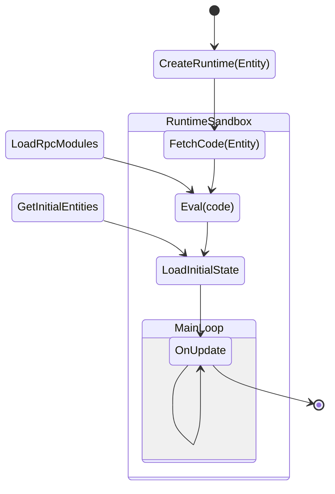
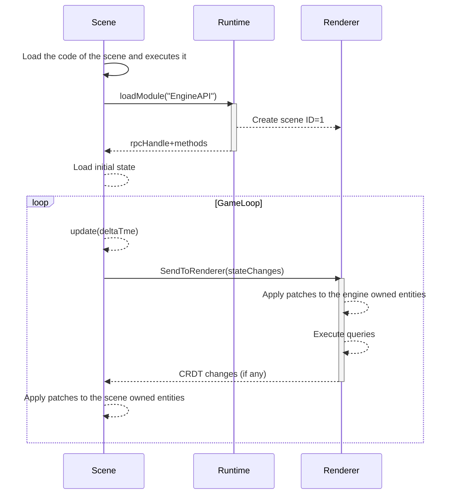

# Abstract

This ADR describes the outline of the "scene runtime" for Decentraland, it includes a minimum set of required environment functions to run a scene, including the formalization of the RPC protocol to load other parts i.e. the Rendering engine (Renderer from now on).

## What is a scene?

Decentraland Explorers (defined in [ADR-102](/adr/ADR-102) are often compared with operative systems that run programs. **A scene is a deployable JavaScript program** that controls a set of entities in-world, the user-interface, and also may add functionality to the Explorer. Those programs run in a sandboxed environment exposing a set of functions to enable the scene to communicate with other components like the Rendering engine.

### Loading scenes

The deployed scenes MUST comply with the Scene schema defined in [ADR-51](/adr/ADR-51). And the format used to represent the deployment is the one used in the content servers as defined in [ADR-80](/adr/ADR-80). Entities can be loaded as scenes if their metadata matches the `scene.json` schema. For the sake of simplicity in this specification, we are assuming a minimum `scene.json` in the shape of `{"main": "bin/scene.js"}` to illustrate how to load and run the code.

1. First the information of the entity is fetched, it includes the list of deployed files. Based on the entity information, the renderer and runtime will know how to resolve assets.
2. Then the runtime will create an isolated runtime environment for the program of the scene.
3. The runtime will use the entity information to fetch the code from `bin/scene.js` and run it. The mechanism to resolve files based on deployed entities is explained in detail in [ADR-79](/adr/ADR-79).
4. After that first eval, the scene may load the entities from the EngineAPI module, and it will start a main loop tight after.

### Program states & lifecycle



### Exposed functions

```ts
// loadModule instantiates a remote module
declare function loadModule(moduleName: string): Promise<ModuleDescriptor>

// the callRpc function takes a rpcHandle from loadModule result and a
// methodName from the same result, combined with a list of arguments
// it returns a promise executed in the remote module.
declare function callRpc(rpcHandle: string, methodName: string, args: any[]): Promise<ProxyModule>

declare type MethodDescriptor = { name: string }
declare type ModuleDescriptor = {
  rpcHandle: string
  methods: MethodDescriptor[]
}

// used to hook a callback to the main loop
declare function onUpdate(callback: (deltaTimeSeconds: number) => Promise<void>): void
```

### Loading RPC modules in the scenes

The scene runtime exposes two asynchronous functions `loadModule` and `callRpc`. Those are the key entrypoint to communicate the scenes with other modules like the renderer. The exposed modules are defined in the [protocol repository](https://github.com/decentraland/protocol/blob/main/proto/decentraland/kernel/apis/engine_api.proto).

> TODO: define and document naming conventions about code generation for modules

### Synchronizing scene's entities with the renderer

The scenes synchronize with the renderer via the `EngineAPI.SendToRenderer` RPC using the CRDT protocol defined in [ADR-117](/rpc/ADR-117). The renderer will keep a local copy of all the entities and components required for rendering. Those components are in their majority serialized using protobuf as defined in [ADR-123](/rpc/ADR-123).

The `EngineAPI.SendToRenderer` response includes a list of CRDT messages to be applied in the local scene, that is used to send back information from the renderer like the position of the player.



#### Pseudocode example of a scene

```typescript
const engineApi = await loadModule("EngineAPI")
async function sendToRenderer(crdtMessage: Uint8Array[]) {
  await callRpc(engineApi.rpcHandle, "SendToRenderer", [{ data: crdtMessage }])
}

// this is a lamport timestamp, required by the CRDT rules
let timestamp = 0

// entities are now numbers
const entityId = 1234

// component numbers, defined in .proto files
const transformId = 1
const rendererMeshId = 2

const transform = Transform.serialize({ position, rotation, scale })
const mesh = RendererMesh.serialize({ box: {} })

// now we are sending the component messages from the LWW-ElementSet
// this sets the transform & meshRenderer for the entity
const messagesBackFromRenderer = await sendToRenderer([
  CRDT.PutMessage(entityId, transformId, transform, timestamp++),
  CRDT.PutMessage(entityId, rendererMeshId, mesh, timestamp++),
])
```

### Hooking to the main loop

Among the functions exposed to the scene runtime, a special function is exposed to register a callback for the main loop. This function must be called only once, to pass on a callback used to run the main loop.

```ts
// The following example only illustrates an hypothetic scenario,
// since it is a low-level API and it shouldn't be used this way
let rotation = 0
onUpdate(async function (deltaTimeSeconds) {
  const speed = 0.001
  rotation += deltaTimeSeconds * speed
  updateEntityRotation(rotation)
  await sendUpdatesToRenderer()
})
```

> TODO: explain how to hook to other runtime events
