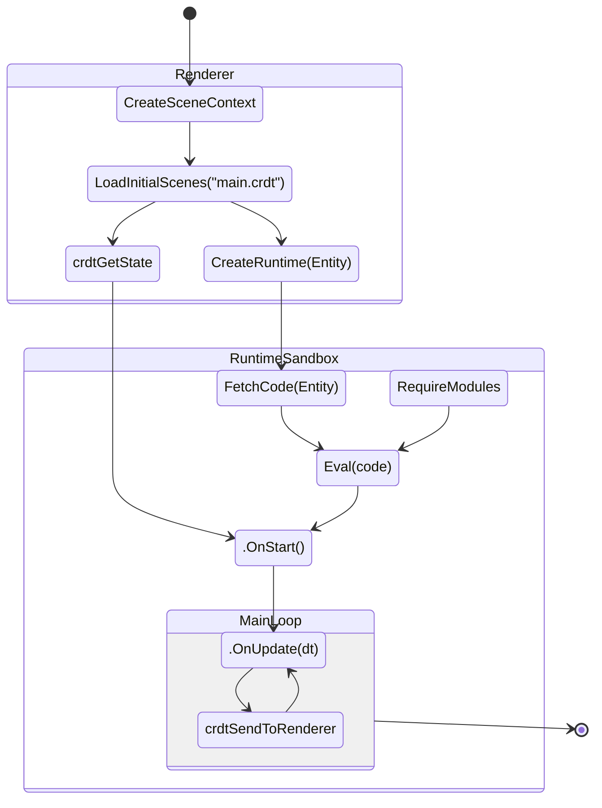
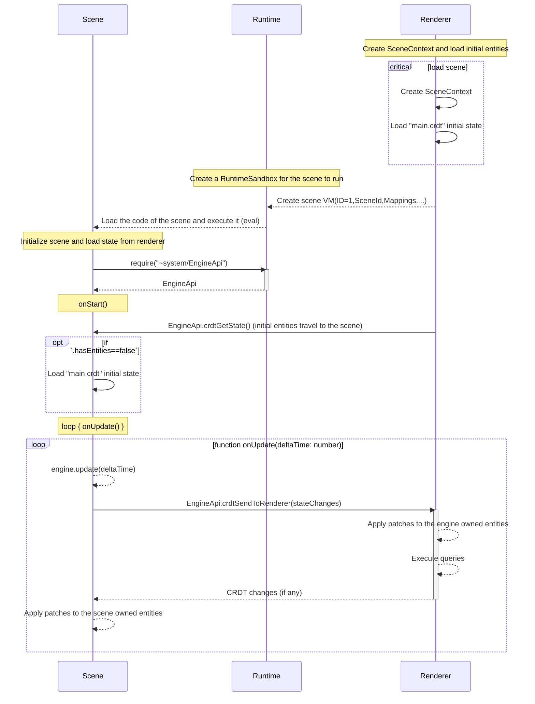

# Abstract

This ADR describes the outline of the "scene runtime" for Decentraland, it includes a minimum set of required environment functions to run a scene, including the formalization of the RPC protocol to load other parts i.e. the Rendering engine (Renderer from now on).

## What is a scene?

Decentraland Explorers (defined in [ADR-102](/adr/ADR-102) are often compared with operative systems that run programs. **A scene is a deployable JavaScript program** that controls a set of entities in-world, the user-interface, and also may add functionality to the Explorer. Those programs run in a sandboxed environment exposing a set of functions to enable the scene to communicate with other components like the Rendering engine.

### Loading scenes

The deployed scenes MUST comply with the Scene schema defined in [ADR-51](/adr/ADR-51). And the format used to represent the deployment is the one used in the content servers as defined in [ADR-80](/adr/ADR-80). Entities can be loaded as scenes if their metadata matches the `scene.json` schema. For the sake of simplicity in this specification, we are assuming a minimum `scene.json` in the shape of `{"main": "bin/scene.js"}` to illustrate how to load and run the code.

1. First the information of the entity is fetched, it includes the list of deployed files. Based on the entity information, the renderer and runtime will know how to resolve assets.
2. Then the runtime will create an isolated runtime environment for the program of the scene.
3. The runtime will use the entity information to fetch the code from `bin/scene.js` and run it. The mechanism to resolve files based on deployed entities is explained in detail in [ADR-79](/adr/ADR-79).
4. After that first eval, the scene may load the entities from the EngineAPI module, and it will start a main loop tight after.

### Program states & lifecycle



### Exposed functions and objects

The runtime for the SDK7 is compatible with [CommonJS](https://en.wikipedia.org/wiki/CommonJS)'s `require` to load RPC modules. This is so to enable a wide variety of bundlers to create compatible Decentraland scenes.

The exposed RPC modules are defined in the [protocol repository](https://github.com/decentraland/protocol/blob/main/proto/decentraland/kernel/apis/engine_api.proto).

> TODO: define and document naming conventions about code generation for modules

```ts
// `require` instantiates a proxy to a RPC module. Every exposed function
// of the module returns a promise.
// require must fail immediately if the moduleName is invalid or unknown,
// and it must return a Module or Proxy synchronously
function require(moduleName: string): Module

// Commonjs-compatible modules
const exports: Object
const module: {
  readonly exports: typeof exports
}

function setImmediate(fn: Function): void

```

#### Fetch & WebSocket API
- Only secure connection MUST be allowed for `Fetch API` and `WebSocket API` on production mode.
- This is the minimal implementation and it's a subset of Web API standard.
- The SDKs MUST expose this declaration and not the DOM types.

```ts
/// --- Fetch ---

type RequestRedirect = 'follow' | 'error' | 'manual'
type ResponseType = 'basic' | 'cors' | 'default' | 'error' | 'opaque' | 'opaqueredirect'

interface RequestInit {
  // Only string supported
  body?: string

  headers?: { [index: string]: string }
  method?: string
  redirect?: RequestRedirect

  // Decentraland Property
  timeout?: number
}

interface ReadOnlyHeaders {
  get(name: string): string | null
  has(name: string): boolean
  forEach(callbackfn: (value: string, key: string, parent: ReadOnlyHeaders) => void, thisArg?: any): void
}

interface Response {
  readonly headers: ReadOnlyHeaders
  readonly ok: boolean
  readonly redirected: boolean
  readonly status: number
  readonly statusText: string
  readonly type: ResponseType
  readonly url: string

  json(): Promise<any>
  text(): Promise<string>
}

declare function fetch(url: string, init?: RequestInit): Promise<Response>

/// --- WebSocket ---

interface Event {
    readonly type: string
}

interface MessageEvent extends Event {
  /**
   * Returns the data of the message.
   */
  readonly data: any
}

interface CloseEvent extends Event {
  readonly code: number
  readonly reason: string
  readonly wasClean: boolean
}

interface WebSocket {
  readonly bufferedAmount: number
  readonly extensions: string
  onclose: ((this: WebSocket, ev: CloseEvent) => any) | null
  onerror: ((this: WebSocket, ev: Event) => any) | null
  onmessage: ((this: WebSocket, ev: MessageEvent) => any) | null
  onopen: ((this: WebSocket, ev: Event) => any) | null
  readonly protocol: string
  readonly readyState: number
  readonly url: string
  close(code?: number, reason?: string): void
  send(data: string): void
  readonly CLOSED: number
  readonly CLOSING: number
  readonly CONNECTING: number
  readonly OPEN: number
}

declare var WebSocket: {
  prototype: WebSocket
  new (url: string, protocols?: string | string[]): WebSocket
  readonly CLOSED: number
  readonly CLOSING: number
  readonly CONNECTING: number
  readonly OPEN: number
}

```


### Loading initial state

It is recommended that scene creators via tooling create a CRDT dump of the initial state of the scene. This is so to enable many optimizations like:

- Enabling rendering of the world before the runtime is ready
- Enabling tooling to create WYSIWYG editors for scenes
- Enabling tooling to create scenes with a minimum of code
- Preventing bloating the scene's code with imperative code only to create the initial state

The runtime will load the initial state of the scene from the `main.crdt` file (if present). This file is a CRDT dump of the scene's initial state or generated by tooling. The runtime will load the file and apply the CRDT messages to the scene's state. This state will be sent to the scene using the initial `EngineApi.crdtGetState` RPC call, and if the `main.crdt` file was loaded, the field `EngineApi.crdtGetState().hasEntities` will be set to true.

#### Static entities

The `EngineApi.crdtGetState` must also return all the initial state of static entities like RootEntity and PlayerEntity. Details about static entities are described in [ADR-219](/adr/ADR-219).

#### Note on custom components

The `main.crdt` file may contain scene-owned components, defined in code. The renderer MAY ignore these components but the runtime MUST NOT. The runtime MUST send the components to the scene, because these are strictly necessary to ensure the well functioning of the scene.

### Synchronizing scene's entities with the renderer

The scenes synchronize with the renderer via the `EngineApi.crdtSendToRenderer` RPC using the CRDT protocol defined in [ADR-117](/adr/ADR-117). The renderer will keep a local copy of all the entities and components required for rendering. Those components are in their majority serialized using protobuf as defined in [ADR-123](/adr/ADR-123).

The `EngineApi.crdtSendToRenderer` response includes a list of CRDT messages to be applied in the local scene, that is used to send information back from the renderer like the position of the player.



### Runtime event handlers

The scene can hook up to certain events by adding functions to the `module.exports` variable. The functions that can be registered are:

- `onStart(): Promise<void> | void` is the first function to be called in a scene. It is recommended that all side-effects related to the initialization of a scene are performed inside the `onStart` function.
- `onUpdate(deltaTime: number): Promise<void> | void` is called every frame. It is in charge of the scene itself to run the frame and send/receive changes to the renderer

```ts
// The following example only illustrates an hypothetic scenario,
// since it is a low-level API and it shouldn't be used this way
let rotation = 0
export async function onUpdate(deltaTimeSeconds: number) {
  const speed = 0.001
  rotation += deltaTimeSeconds * speed
  updateEntityRotation(rotation)
  await sendUpdatesToRenderer()
}
```

> 💡 Since the runtime is compatible with [CommonJS](https://en.wikipedia.org/wiki/CommonJS), the event handler functions can be exported as `export function ...` and skip the `module.exports = ...` for convenience.

#### Pseudocode example of a scene

```typescript
const engineApi = require("~system/EngineApi")

// this is a lamport timestamp, required by the CRDT rules
let timestamp = 0

const position = Vector3.Zero()
const scale = Vector3.One()
const rotation = Quaternion.Identity()

// entities are now numbers
const entityId = 1234

// component numbers, defined in .proto files
const transformId = 1
const rendererMeshId = 2

const transform = Transform.serialize({ position, rotation, scale })
const mesh = RendererMesh.serialize({ box: {} })

// now we are sending the component messages from the LWW-ElementSet
// this sets the transform & meshRenderer for the entity
const messagesBackFromRenderer = await engineApi.crdtSendToRenderer([
  CRDT.PutMessage(entityId, transformId, transform, timestamp++),
  CRDT.PutMessage(entityId, rendererMeshId, mesh, timestamp++),
])

module.exports.onUpdate = function (deltaTime: number) {
  const transformId = 1
  position.x += deltaTime
  const transform = Transform.serialize({ position, rotation, scale })

  // now we are sending the component messages from the LWW-ElementSet
  // this sets the transform & meshRenderer for the entity
  const messagesBackFromRenderer = await engineApi.crdtSendToRenderer([
    CRDT.PutMessage(entityId, transformId, transform, timestamp++),
  ])
}
```
