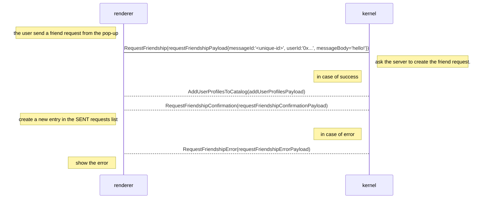
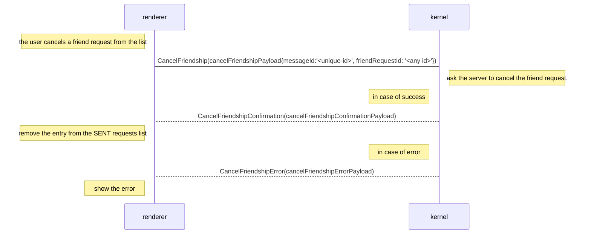
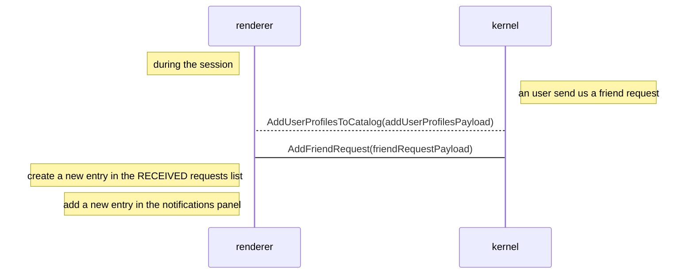
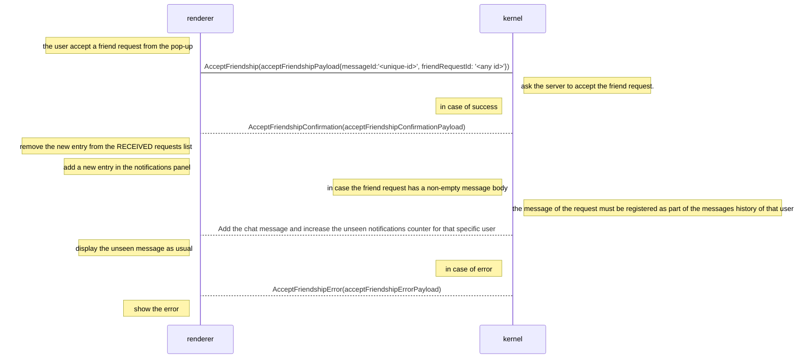
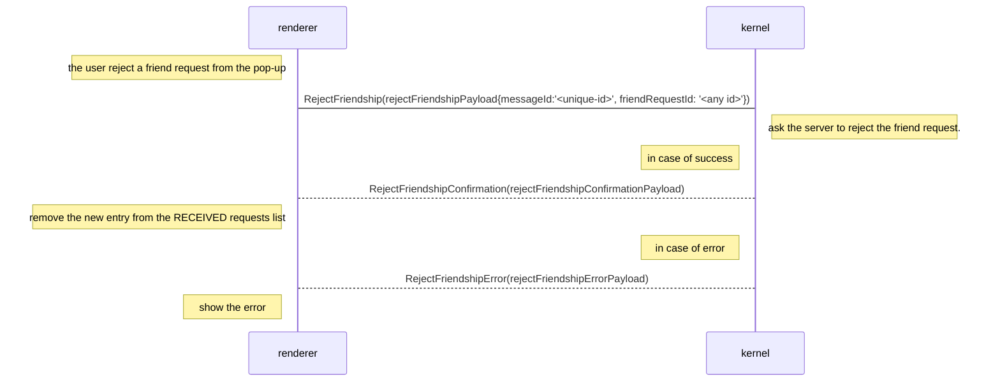
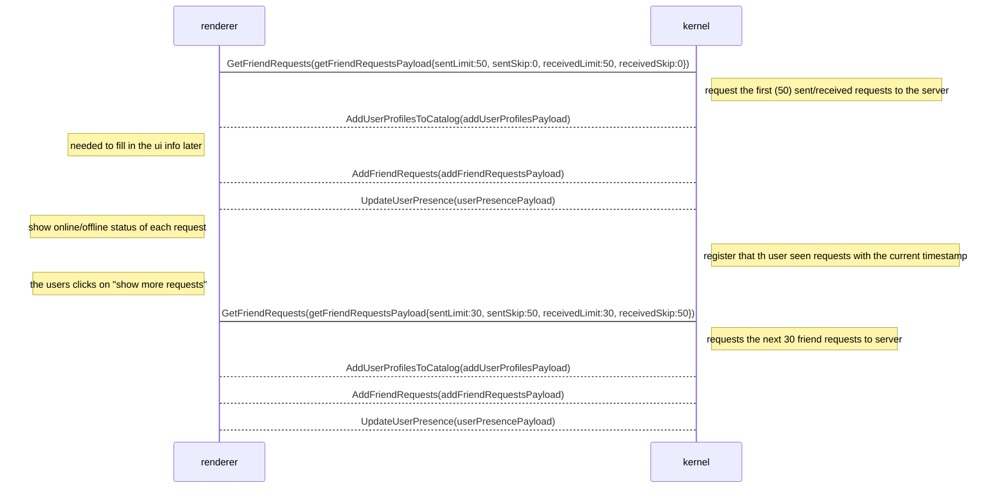

## Need
This is a technical proposal for the needs described here: [PRD: New Friend Requests](https://www.notion.so/PRD-New-Friend-Requests-188555225272448f91f3eea5e84f1cd3)

The intention of this document is:

- Identifying which teams will be involved and what responsibilities they’ll cover.
- Dividing the new functionality in smaller tasks that will be estimated accordingly in order to create a development roadmap.
- Finding possible corner cases in order to preemptively identify and solve them.
- Reaching a consensus between different affected teams in terms of defining the different functionalities and flows.

### Involved teams
This initiative will require a cross team effort that will include the following teams:

- Explorer: for the UI, UI functionalities and integration with Kernel.
- dServices: for the creation of new functionalities required such as obtaining the info of the received and sent friend requests from backend to kernel (dates, profile pictures, mutual friends, etc.)…

More in detail the different responsibilities will be covered in the analysis of each part of the feature. A tag to the respective team will be placed next to each functionality.

## Approach
For this to work we need to synchronize the information between the Renderer, Kernel and Matrix servers.

Due to the current architecture implemented in the backend side, the idea would be to use always Kernel as a bridge between the Renderer and the Matrix server. So any communication needed between both sides will be done through messages in Kernel↔Renderer.

In terms of needed communications, we have identified the next main dependencies between Client and Backend:

### Send a Friend Request


```
requestFriendshipPayload {
    messageId: string, // An unique id to handle the renderer<->kernel communication when the server send a response. Kernel must send back to the renderer the same messageId on the response.
    userId: string,
    messageBody: string
}
```

```
requestFriendshipConfirmationPayload{
    messageId: string,
    friendRequest: friendRequestPayload
}
```

```
requestFriendshipErrorPayload{
    messageId: string,
    errorCode: int (refer to listOfErrorCodes)
}
```

## Cancel a Friend Request


```
cancelFriendshipPayload {
    messageId: string,
    friendRequestId: string
}
```

```
cancelFriendshipConfirmationPayload{
    messageId: string,
    friendRequestId: string
}
```

```
cancelFriendshipErrorPayload{
    messageId: string,
    errorCode: int (refer to listOfErrorCodes)
}
```

## Receive a Friend Request


## Accept a Friend Request


```
acceptFriendshipPayload {
    messageId: string,
    friendRequestId: string
}
```

```
acceptFriendshipConfirmationPayload{
    messageId: string,
    friendRequestId: string
}
```

```
acceptFriendshipErrorPayload{
    messageId: string,
    errorCode: int (refer to listOfErrorCodes)
}
```

## Reject a Friend Request


```
rejectFriendshipPayload {
    messageId: string,
    friendRequestId: string
}
```

```
rejectFriendshipConfirmationPayload{
    messageId: string,
    friendRequestId: string
}
```

```
rejectFriendshipErrorPayload{
    messageId: string,
    errorCode: int (refer to listOfErrorCodes)
}
```

## Get Friend Request list
In this case we are modifying the payloads of the existing flow:


```
getFriendRequestsPayload {
    messageId: string,
    sentLimit:int: max amount of entries to receive
    sentSkip:int: the amount of sent requests to skip
    receivedLimit:int: max amount of entries to receive
    receivedSkip:int: the amount of received requests to skip
}
```

```
addFriendRequestsPayload {
    messageId: string,
    requestedTo: friendRequestPayload[],
    requestedFrom: friendRequestPayload[],
    totalReceivedFriendRequests: int, //total amount of friend requests received
    totalSentFriendRequests: int //total amount of friend requests sent
}
```

### Common Payloads
```
friendRequestPayload {
   friendRequestId: string,
   timestamp: long,
   from: string,
   to: string,
   messageBody: string
}
```

```
listOfErrorCodes: {
    tooManyRequestsSent = 0,
    notEnoughTimePassed = 1,
    blockedUser = 2,
    nonExistingUser = 3,
    invalidRequest = 4,
    unknown = 5
}
```
