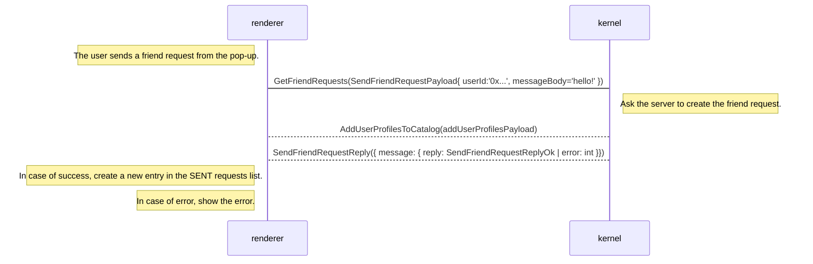
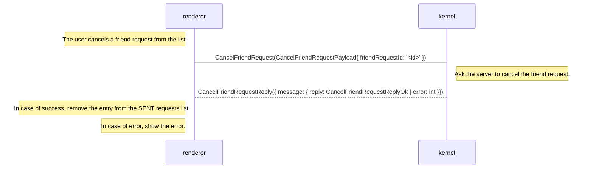
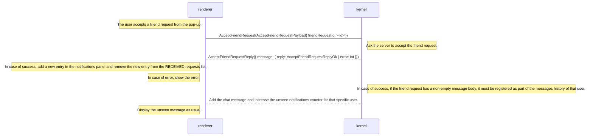
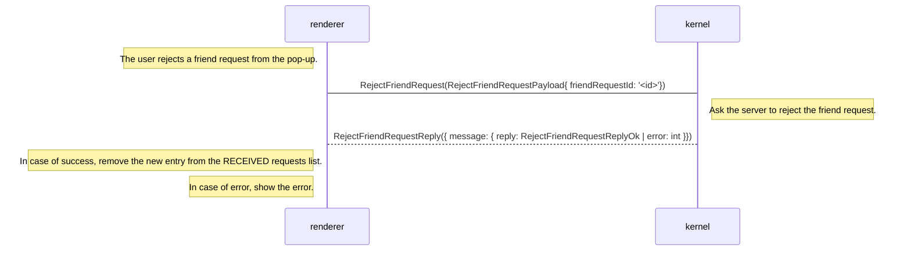
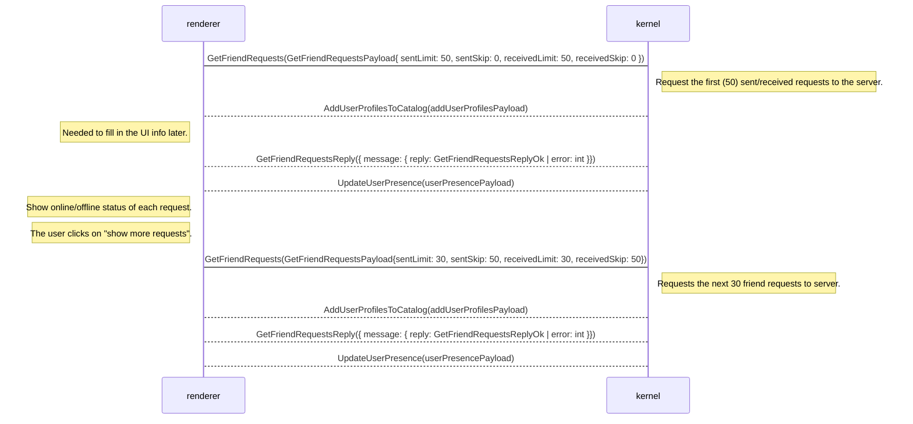

## Need
This is a technical proposal for the needs described here: [PRD: New Friend Requests](https://www.notion.so/PRD-New-Friend-Requests-188555225272448f91f3eea5e84f1cd3)

The intention of this document is:

- Identifying which teams will be involved and what responsibilities they’ll cover.
- Dividing the new functionality in smaller tasks that will be estimated accordingly in order to create a development roadmap.
- Finding possible corner cases in order to preemptively identify and solve them.
- Reaching a consensus between different affected teams in terms of defining the different functionalities and flows.

### Involved teams
This initiative will require a cross team effort that will include the following teams:

- Explorer: for the UI, UI functionalities and integration with Kernel.
- dServices: for the creation of new functionalities required such as obtaining the info of the received and sent friend requests from backend to kernel (dates, profile pictures, mutual friends, etc.).

In more detail the different responsibilities will be covered in the analysis of each part of the feature. A tag to the respective team will be placed next to each functionality.

## Approach
For this to work we need to synchronize the information between the Renderer, Kernel and Matrix servers.

Due to the current architecture implemented in the backend side, the idea would be to use always Kernel as a bridge between the Renderer and the Matrix server. So any communication needed between both sides will be done through messages in Kernel↔Renderer.

In terms of needed communications, we have identified the next main dependencies between Client and Backend:

## Send a Friend Request


```
SendFriendRequestPayload {
  string user_id = 1;
  string message_body = 2;
}
```

```
SendFriendRequestReplyOk {
  FriendRequestInfo friend_request = 1; // Friend request info on the request you've sent to a user
}
```

```
SendFriendRequestReply {
  oneof message {
    SendFriendRequestReplyOk reply = 1;
    FriendshipErrorCode error = 2;
  }
}
```

## Cancel a Friend Request


```
CancelFriendRequestPayload {
  string friend_request_id = 1;
}
```

```
CancelFriendRequestReplyOk {
  FriendRequestInfo friend_request = 1; // Friend request info on the request you've canceled
}
```

```
CancelFriendRequestReply {
  oneof message {
    CancelFriendRequestReplyOk reply = 1;
    FriendshipErrorCode error = 2;
  }
}
```

## Accept a Friend Request


```
AcceptFriendRequestPayload {
  string friend_request_id = 1;
}
```

```
AcceptFriendRequestReplyOk {
  FriendRequestInfo friend_request = 1;
}
```

```
AcceptFriendRequestReply {
  oneof message {
    AcceptFriendRequestReplyOk reply = 1;
    FriendshipErrorCode error = 2;
  }
}
```

## Reject a Friend Request


```
RejectFriendRequestPayload {
  string friend_request_id = 1;
}
```

```
RejectFriendRequestReplyOk {
  FriendRequestInfo friend_request = 1;
}
```

```
RejectFriendRequestReply {
  oneof message {
    RejectFriendRequestReplyOk reply = 1;
    FriendshipErrorCode error = 2;
  }
}
```

## Get Friend Request List
In this case we are modifying the payloads of the existing flow:


```
GetFriendRequestsPayload {
  int32 sent_limit = 1; // Max amount of entries of sent friend requests to request
  int32 sent_skip = 2; // The amount of entries of sent friend requests to skip
  int32 received_limit = 3; // Max amount of entries of received friend requests to request
  int32 received_skip = 4; // The amount of entries of received friend requests to skip
}
```

```
GetFriendRequestsReplyOk {
  repeated FriendRequestInfo requested_to = 1; // Friend request info on the requests you've sent to users
  repeated FriendRequestInfo requested_from = 2; // Friend request info on the requests you've received from users
  int32 total_received_friend_requests = 3; // Total amount of friend requests received
  int32 total_sent_friend_requests = 4; // Total amount of friend requests sent
}
```

```
GetFriendRequestsReply {
  oneof message {
    GetFriendRequestsReplyOk reply = 1;
    FriendshipErrorCode error = 2;
  }
}
```

## Common Payloads
```
FriendRequestInfo {
  string friend_request_id = 1;
  uint64 timestamp = 2;
  string from = 3;
  string to = 4;
  optional string message_body = 5;
}
```

```
FriendshipErrorCode {
  FEC_TOO_MANY_REQUESTS_SENT = 0; // Any uncategorized friend request related error
  FEC_NOT_ENOUGH_TIME_PASSED = 1;
  FEC_BLOCKED_USER = 2;
  FEC_NON_EXISTING_USER = 3;
  FEC_INVALID_REQUEST = 4;
  FEC_UNKNOWN = 5;
}
```
