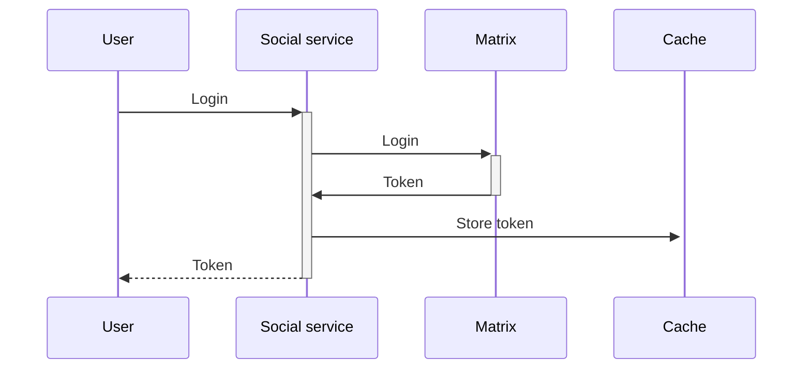
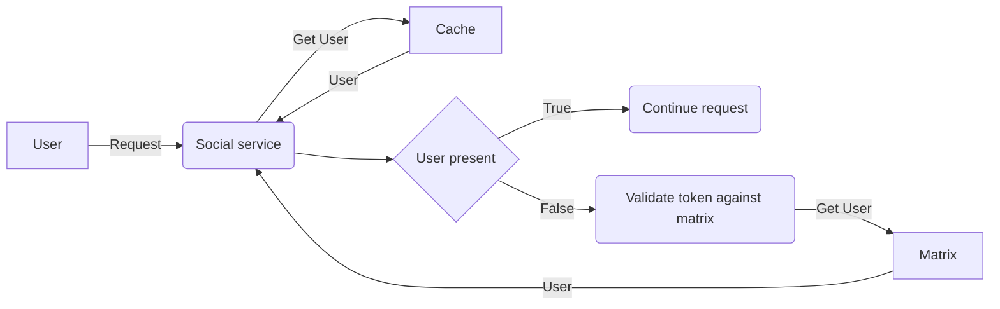

## Abstract

<!--
Insert here a brief paragraph summarizing the RFC in its current state.
This section shall provide an overview of whether this is a settled
decision, alternatives explored and a short summary of relevant
background information and key insights.
-->

As part of the social service initiative, users will need to authenticate themselves to interact with other users and to access their information correctly.
As part of the social service initiative users will need to be able to authenticate themselves to be able to interact with other users and be able to access their information correctly.
This RFC explores how to leverage the current Matrix authentication system to reuse it as the authentication system for the social service. It's important to notice that this proposal doesn't imply changing the login method (via authchain) nor the authentication system (JWT token managed by synapse), only leverages it for the social service usage.
In the future if we have our own authentication server built in-house or customized to our needs we might want to use it. 
The proposed solution requires storing the tokens in a in-memory Cache, to be able to identify the user by the token used.

## Approach

<!--
How do you intend on addressing the need?  Describe what you plan on
doing and the rationale behind the decisions you propose.  Then lay out
the plan of execution, in rough order of how the execution should take
place.  Include the rollout plan as well. (This is usually the longest
section of the RFC) Hint: don’t be afraid of posting illustrations! The
level of detail here has to be enough to give the reader  a clear
understanding of the solution - it is up to the writer to decide.
Further detail can be addressed to satisfy comments and increase clarity.
-->

The logging-in system for the social service needs to solve three problems:

1. Checking if the user is correctly authenticated (the token is valid)
1. Identifying who the user is (which userId does the token belong to)
1. Validating the user's permissions to perform a certain action (Authorization)

The first two problems are already solved by the current chat solution (Matrix), so we propose to leverage the existing implementation for simplicity and velocity in development. Matrix will be used as an authentication system where users will log in against their service. Then, each endpoint will validate against Matrix that the user is still using a valid token.

The service will have a distributed cache (without persistence) with user-to-token information, which will be used to obtain the user (once the token is validated) and to prevent hitting Matrix for every request.

The login flow will be the following:

Then each subsequent request will perform the following validation:

In this second workflow, the token life in the cache will be extended by what's defined in Matrix, thus preventing the user from using an invalid token.
If the token is expired and the user tries to use it again, the service will validate against Matrix, and if it's still valid, the user will be obtained again and re-stored in the Cache.

To validate the token against Matrix, an authenticated endpoint must be chosen. The endpoint needs to satisfy the following specifications:

- No to low impact on the database
- No to low usage from the client (to prevent overloading it even more)
Ideally tackled by a specific worker, so in case it's necessary, it would be easier to scale up

The endpoint that we have chosen is `_matrix/client/r0/pushrules/`, but could change if we find one that suits better.

## Benefit

This solution has two main benefits:

1. There's no need to create a new authorization/authentication service or system
1. The solution is completely seamless for the user and doesn't imply the persistence of tokens from the social service side

## Competition

<!--
What other options were considered? Give an honest treatment of why
these alternatives were not satisfactory. Identify the competition and
demonstrate that the competition is clearly understood. Include the
“what if we do nothing” alternative.
-->

### Implementing an authentication service

This is a great of if we ever want to stop using Matrix. We would be in control of everything, allowing to build login features as we deem necessary. Although this brings a lot of flexibility on login features, the biggest problem of this option is the cost of implementing everything from scratch, which is not necessary due to the current requirements.
