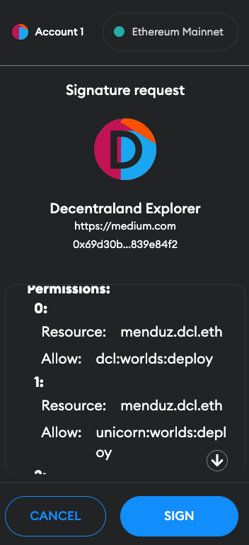
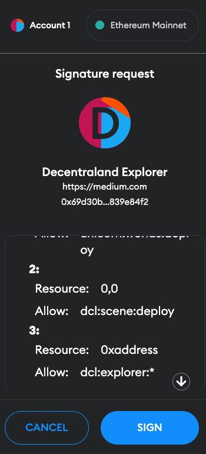

## Abstract

This document discusses the creation and use of ephemeral keys for signing
service requests or operations on behalf of users in the Decentraland platform.
It proposes the use of a set of permissions to be associated with the ephemeral
key in order to ensure that it can only be used for specific types of requests (
for e.g. profile deployments).

The document explores various options for specifying and reading these
permissions, including using a structure similar to Amazon's AWS IAM service and
using human-readable text that can also be machine-parsed. The goal of these
measures is to ensure that ephemeral keys are used in a way that follows the
principle of least privilege, and to allow users to sign keys that grant access
only to the specific types of operations they wish to authorize.

## Context, Reach & Prioritization

When signing in to Decentraland an ephemeral key is created and the user
signs it using Metamask / WalletConnect / etc. That ephemeral key is
then used by the Explorer to sign deployment requests on behalf of the user,
for example for profile updates.

The ephemeral key has an expiration date and can be used for signing any
kind of deployments on behalf of the user while the key is not expired. A
malicious user could attempt to use it for deploying other kind of entities
on behalf of the user, such as scenes in the Catalyst Network or a scene for
a World using a DCL name.

Following the principle of the least privilege it would be useful to be able
to grant the ephemeral key only the set of permissions that are required
for the purpose of the client using it.

* In case of Explorer, just deploying profiles should be enough.
* When using `dcl deploy` the only permissions
  required are for deploying scenes (or wearables? emotes?). Not needed for
  deploying profiles. However, in this case, no ephemeral key is used but
  rather the deployment is signed directly with the user wallet.

So this proposal is about extending the Auth Chain to support the creation
of the ephemeral key with a given set of permissions associated to it, and
that the server that receives those requests can validate that the user granted
access to the scopes required for the operation being requested. This way, the
user could sign the ephemeral key to only allow deployment of worlds under a
certain name but not deployment of profiles nor scenes in the Catalyst network.

## Solution Space Exploration

### Permission specification

Permissions must be specified when creating an ephemeral key. A simple and very
flexible way for this could be similar to how Amazon does it
in [AWS IAM](https://aws.amazon.com/iam/). In this case, it would consist of
a collection of a resource name and either an allow or deny expression.

For e.g.:

```yaml
Permissions:
  - resource: "my-dcl-name.dcl.eth"
    allow: "dcl:worlds:deploy"
  - resource: "0,0"
    allow: "dcl:scene:deploy"
  - resource: "0xaddress"
    allow: "dcl:explorer:*"
  - resource: "0xaddress"
    deny: "dcl:explorer:denied-operation"
```

The `resource` name must be an item referencing an entity of the domain that
the server knows. For e.g. for DCL Worlds, it can be a DCL name, while for
scene deployment in Genesis City it can be the coordinates of the land, or
for a profile deployment it can be the profile address.

The `allow` and `deny` elements are structured as follows:
`namespace:service-name:operation-name` or `namespace:service-name:*`.
The namespace is used to for prefixing all the services that belong to an
organization. For e.g., in Decentraland the prefix could be `dcl`. The
second part, the service name, refers to the service that this permission
declaration is intended for. It has to be unique for services within the
same namespace. The last part can be either a single operation name or a `*`
character meaning any possible operation for the service.

In the example above, resource `0xaddress` allows `dcl:explorer` to do any
operations except `denied-operation`. A single operation name always weighs
more than the wildcard operator, and hence takes precedence over it.

### Permission readability

One of the key points in the permission specification is that they must be
human-readable, because the user signing the creation of the ephemeral key needs
to be able to read it in plain text and understand what he is about to sign.

On the other hand, the text has to be machine parsable so that the server is
able to parse the message signed by the user that contains the permission
specification and be able to interpret it for allowing or disallowing the
operation request accordingly.

Here is a few options proposed for permission specification. Options 1 and 2
propose different payload options to be
signed, based
on [EIP-4361 Sign-In with Ethereum](https://eips.ethereum.org/EIPS/eip-4361).

Option 1: more yaml-like:

```text
Decentraland Login
Ephemeral address: 0x4f9c4Ff265357F937B14BCd1E5519f1537985301
Expiration: 2022-12-29T00:00:00.000Z

Permissions:
  - resource: "menduz.dcl.eth"
    allow:    "dcl:worlds:deploy"
  - resource: "menduz.dcl.eth"
    allow:    "unicorn:worlds:deploy"
  - resource: "0,0"
    allow:    "dcl:scene:deploy"
  - resource: "0xaddress"
    allow:    "dcl:explorer:*"
```

Option 2: yaml-like list of parsable phrases:

```text
Decentraland Login
Ephemeral address: 0x4f9c4Ff265357F937B14BCd1E5519f1537985301
Expiration: 2022-12-29T00:00:00.000Z

Permissions:
- allow "dcl:worlds:deploy" for menduz.dcl.eth
- allow "dcl:explorer:*" for 0xaddress
- deny "dcl:explorer:voice" for 0xaddress
- deny "dcl:explorer:voice2" for 0xaddress
- allow "unicorn:worlds:deploy" for menduz.dcl.eth
- allow "dcl:scene:deploy" for *
```

Option 3: Typed structured data

An alternative approach to permission specification would be to use structured
data signing, as defined in
[EIP-712 Typed structured data hashing and signing](https://eips.ethereum.org/EIPS/eip-712).

The follow snippet can be run in the browser console:

```javascript
let domain = [
    {name: "name", type: "string"},
    {name: "chainId", type: "uint256"}
]

let authChain = [
    {"name": 'content', "type": 'string'},
    {"name": 'ephemeralAddress', "type": 'string'},
    {"name": 'expiration', "type": 'string'},
    {"name": 'permissions', "type": 'string[]'},
]

let domainData = {
    name: "Decentraland Explorer",
    chainId: parseInt(window.ethereum.networkVersion, 10)
}

let message = {
    content: 'Decentraland Login',
    ephemeralAddress: '0x4f9c4Ff265357F937B14BCd1E5519f1537985301',
    expiration: '2022-12-29T00:00:00.000Z',
    permissions: [
        {
            resource: 'menduz.dcl.eth',
            allow: 'dcl:worlds:deploy'
        },
        {
            resource: 'menduz.dcl.eth',
            allow: 'unicorn:worlds:deploy'
        },
        {
            resource: '0,0',
            allow: 'dcl:scene:deploy'
        },
        {
            resource: '0xaddress',
            allow: 'dcl:explorer:*'
        },
    ]
}

let eip712TypedData = {
    types: {
        EIP712Domain: domain,
        AuthChain: authChain
    },
    domain: domainData,
    primaryType: "AuthChain",
    message: message
}

let signer = window.ethereum.selectedAddress
let data = JSON.stringify(eip712TypedData)

await window.ethereum.request({
    method: 'eth_signTypedData_v4',
    params: [signer, data],
    from: signer
})
```

And it generates a signature screen as follows (using Metamask):

|  |  |  |
|--------------------------------------------|--------------------------------------------|--------------------------------------------|

## Specification

The idea for the creation of the payload to be signed comes from
[EIP-4361 Sign-In with Ethereum](https://eips.ethereum.org/EIPS/eip-4361).

<!--
The technical specification should describe the syntax and semantics of ackaony 
new feature.
-->

The technical specification should describe the syntax and semantics of any new
feature.

## RFC 2119 and RFC 8174

> The keywords "MUST", "MUST NOT", "REQUIRED", "SHALL", "SHALL NOT", "
> SHOULD", "SHOULD NOT", "RECOMMENDED", "NOT RECOMMENDED", "MAY", and "OPTIONAL"
> in this document are to be interpreted as described in RFC 2119 and RFC 8174.
