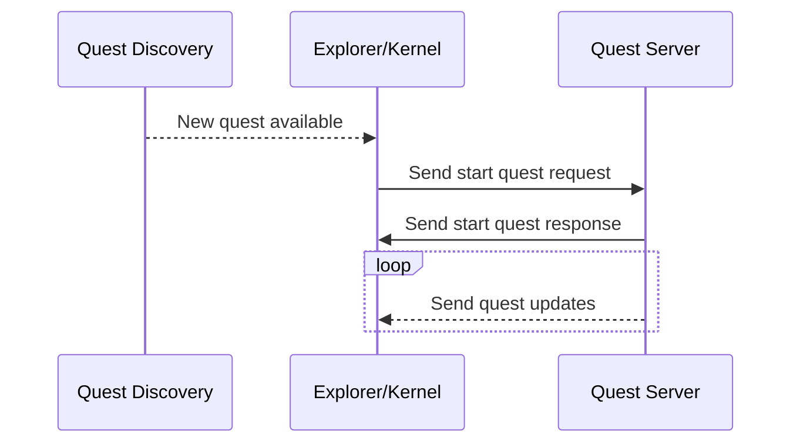
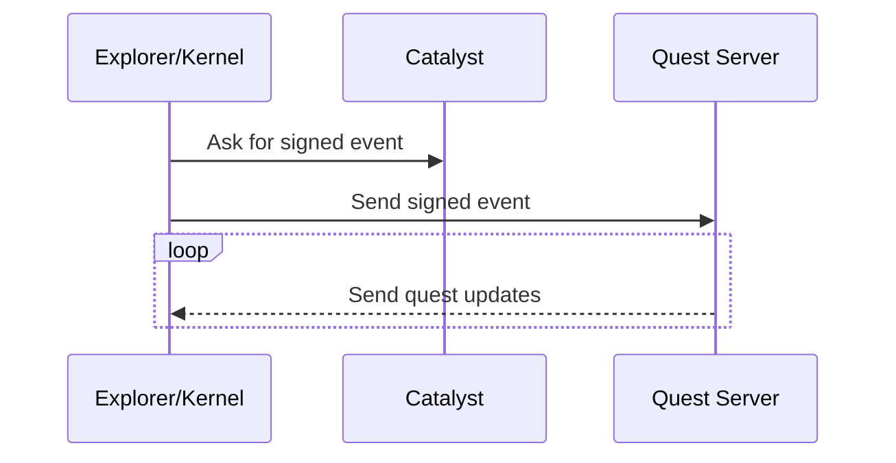
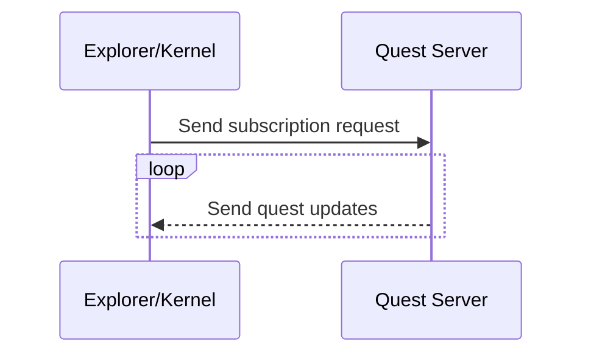
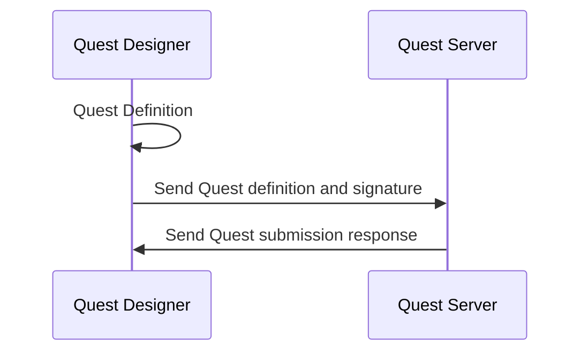
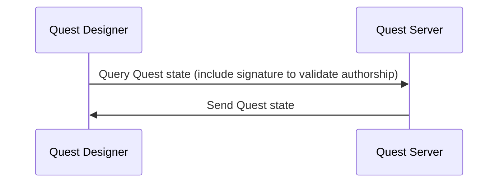

## Abstract

The Quests System is an important feature that facilitates users to explore the world, unlock achievements and potentially receive rewards. A quest is a series of steps or tasks that a user has to complete. Each step or task has an acceptance criteria to consider it as done. A quest designer has to define the steps and the order or the path to the end, so the quest is finished when those steps are completed.

## Context, Reach & Prioritization

Users use to complain that when they enter the world and after a certain time, they don't know what to do, or where to go and feel lost. This problem impacts directly the retention of the users and the time quality of the first steps in the platform.

Having a Quests System can solve part of the problem, giving users a reason to stay and have a nice time. This feature would also allow content creators to be creative and increase engagement.

The last sentence is important to remark on since it is one of the differences to any other Quest System you may know from video games, where the quests are defined by the owners or internal teams. In this case, there should be a focus on creating easy tools for quest designers.

On the other side, the system (backend) should be in charge of tracking and validating the progress and accepting new quest deployments.

Having said that, there are three well-known actors with corresponding components:
 - Users: Explorer and Kernel 
 - Designers: Visual tool and/or CLI
 - The System: Backend

For the sake of fast iteration and discovery, this document will explore the boundaries and scope of a Proof of Concept for the described Quests System.

## Solution Space Exploration

The following sections will describe what would be necessary and alternatives for this Proof of Concept, where designers can submit quests, users experience them and the system expose some metrics. 

### Quest definition

A Quest definition will include steps/tasks required for completion. It would be defined technically speaking as a graph, since it may have a non-linear complexity.

Defining a valid graph, as it may require some conditions:
- it should have only one start node.
- it should have at least one end node.  
- it may have cycles but not endless loops.
- it may have conditional nodes.

### Explorer

Minimal global UI for quest tracking and receive real-time notifications about the progress:

- Users should have a UI where to see the current quests (in progress) and the status. 
- Users should be able to cancel/drop a quest.
- Users should be able to discover public quests in World. (NPC Givers)

This UI may be developed using SDK and defining reusable UI components so every Explorer implementation should not implement custom UIs.

### Kernel

Communication with the system, notifying events that happen in world, and receiving updates, so the Explorer is up to date.

- Kernel should be responsible of receiving and notifying updates to Explorer.
- Kernel should be able to receive requests from Explorer to start a quest and ask for it to the System.
- Kernel should be able to notify in world events to the System, in order to make progress.

### Actions

A set of predefined actions may be provided to the designers and users, in order to define the Quests steps and make progress. 

- Location
- NPC Interaction
- Play Emote
- TBD

### Quest Designer

Build a tool/CLI to easily design Quests, without conflicting with existing definitions.

Using the predefined actions, the designer should be able to create a Quest definition with steps and requirements. The output of a quest definition is a graph which will be persisted in a convenient form.

### Backend

The Quests System will expose an API with convenient endpoints for Designers and Users. 

It also will process all events received from Explorer/Kernel sessions and make progress to corresponding Quest instances.

Users may ask for quests state and metrics, but completed Quests may be stored for a certain time if the system needs space or it may grow undefinetly.

- The system should be able to process all events in parallel, in order to make progress in corresponding Quests.
- The system should be able to accept connections and subscriptions to Quest instances.
- The system should be able to send updates to subscribed users.
- The system should be able to respond to Quests state requests.
- The system should expose metrics related to the Quests.

### Workflows: Quest User

- Start Quest

There would be several ways to discovery a Quest. The user may be interested to start any of them. 

- Track Progress 

Client should make progress by sending verified events

- Real time updates

Once the API is defined, the system may expose different ways to query quest states, one of them is to use some long living channel (let's say WebSockets).

### Workflows: Quest Designer 

- Deploy new quest or modify existing quest

When the quest definition is ready, the Quest Designer tool would be able to send the new or modified version to the Quest Server. The request should include the author signature.

- Retrieve quest stats

The quest author may be interested in the stats, how many users started, completed, and other information like starting and ending times.

## Specification

About the implementation and alternatives, each actor has some important decisions to explore.

### Communication between the System and Kernel

In order to receive real time updates, there are two options to handle the communication:
- Use a socket (peek any protocol like WebSocket, WebRTC, WebTransport, QUIC, etc) to keep posted on interested quests. 
- Use a HTTP polling mechanism.

### Quest Model persistence

When a Quest definition is deployed to the System, it should be persisted in some form, the alternatives are:
- Human Readable (JSON, toml, etc)
- Binary
No matter which format is, serialization/deserialization should be easy and fast and possible in any language.

Also, the location of the persisted quests is important, for example:
- Store in DB
- Store as a File (S3 or any shared instance)

### Quest Designer

Designing a quest should be a good experience, without friction and intuitive.

Asides from implementing a solution taking into account the possibility of visual edition and easy deployment, should also consider the accesibility of the interface i.e.:
- Create a hosted service where designers can access as a WebApp.
- Provide executables or guidelines to run the application.

Authenticating designers may be required, so the alternatives are:
- Use Decentraland Login and potentially add wallet validations to restrict deployments to land-owners or other conditions.
- Use Service custom authentication and API tokens.

### Backend

To provide a robust system, it should be scalable, easy to deploy and provide metrics.

Scalability must be thought from the beginning:
- Horizontal scaling: should exist communication between instances.
- Vertical scaling: may consider the possibility of service redeployment without down-time.

Easy to deploy:
- CI/CD
- Easy to follow and clear pipelines

Observability:
- Instrument application to collect logs, traces and metrics
- Domain related metrics
- Performance metrics

## RFC 2119 and RFC 8174

> The key words "MUST", "MUST NOT", "REQUIRED", "SHALL", "SHALL NOT", "SHOULD", "SHOULD NOT", "RECOMMENDED", "NOT RECOMMENDED", "MAY", and "OPTIONAL" in this document are to be interpreted as described in RFC 2119 and RFC 8174.

