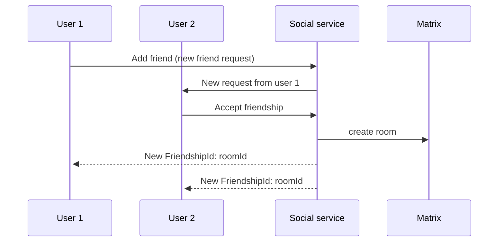
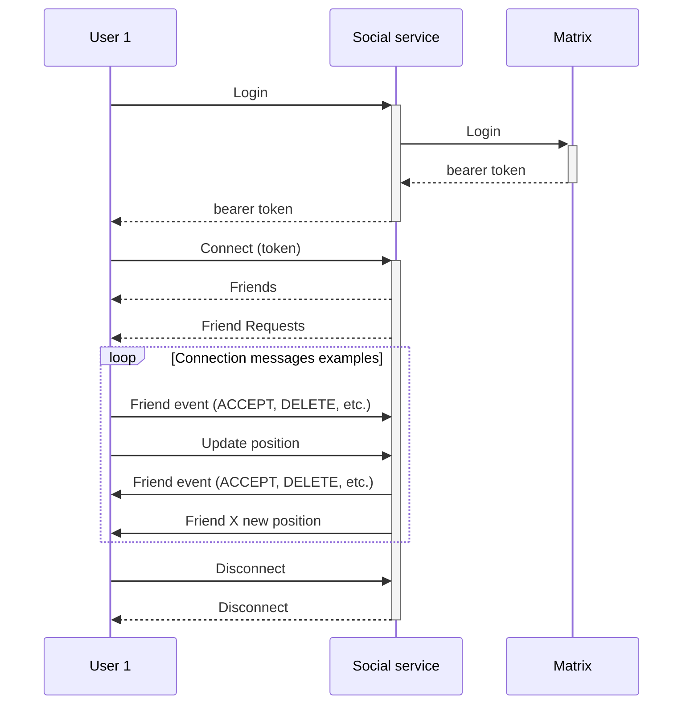
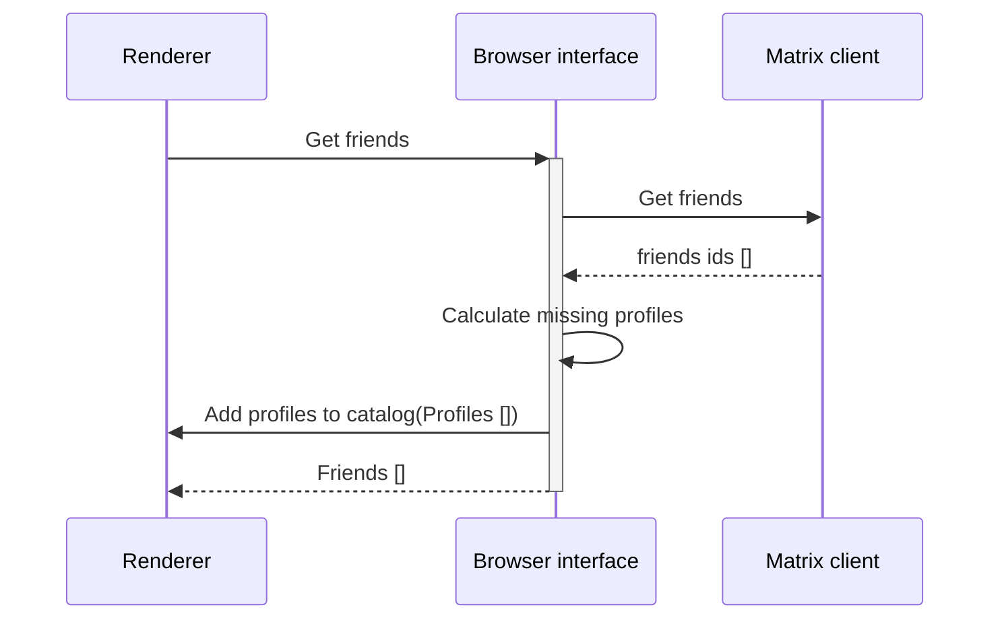
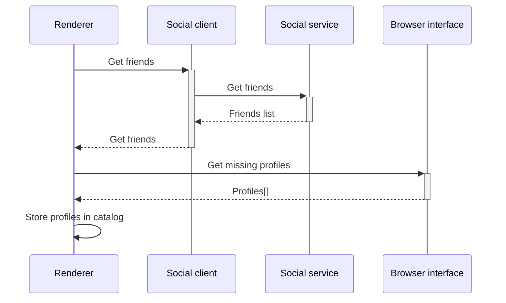

## Abstract

The goal of this milestone is to stop leveraging Matrix to handle friend requests amongst users. To do this the service will need to replace not only saving the friendship interactions, but will also need to have some mechanism to be able to notify in real time of the interactions to online users.

## Context, Reach & Prioritization

Currently all friendship events are being stored in both Matrix and the Social service, to avoid this duplication of information this RFC proposes to start handling friendship requests directly on the Social service and stop storing the information in Matrix. The benefits of this proposal include:

- Downscale the load on Matrix
  - The friendships events (Request, Accept, Delete, etc.)
  - Prevent creating rooms when a friendship hasn't been established
- Be able to apply friend request policies (i.e. prevent spamming, max amount of friends, blocking, etc.)
- Extend the friendship API to know the pending friend requests a user has

Also, this new approach will need to be able to notify the users in real-time about the new friendship events, to do this a communication system will need to be established between the client and the server either (the technical specification of this system will be explored later).

## Solution Space Exploration

There are two main approaches:

### Websocket / Long polling

Websocket inherently comes with the benefit of establishing a bidirectional connection, enabling more features for the future (i.e. presence). Another big plus of using websocket is that the client can leverage protobuff and RPC for communication between the server and the client.
On the other hand, Websocket + RPC implies that the Social server will need to be the first implementation of RPC-rust which is not yet a production tested product.

### Server Sent Event

This solution doesn't imply a constant connection between the server and the client and allows the existance of a notification system, it's cheap for the server and the client. The biggest problem with this solution is that there isn't an existent transport in unity for SSE, and in the future when presence is implemented there might need to be a big refactor and a replacement of the technology.

## Specification

Due to the benefits explained over the SSE solution, Websocket is the solution that will be further explored in this document.

The new flow for a friendship will be the following:

This implies that rooms in Matrix will not be created until the friendship is established. This does not make the opposite true, if the friendship ends the room won't be destroyed (to prevent the history from being lost).

Now, when a user logs in to decentraland, the friendship requests will also be obtained from the social service instead of the matrix sdk.

First, the client will need to login via HTTP, then establish a connection with the server, once correctly established, the server will then send two messages one with the current friends and another with the pending friend requests.

### Implementation

Given that Browser interface is going to be slowly migrated into unity's codebase directly, the implementation of this feature will be done directly on unity's side directly too. Since this feature includes friends and friend requests, all of the code needed to handle friends and friendship requests will also be moved to unity, decoupling the dependency on Browser interface. Still, channels, presence, and messaging will be on the Browser interface side, but within time they will also be migrated to unity and will be able to leverage the new communication system.

To prevent migrating all the code into unity renderer's code and adding a lot of logic, this ADR proposes to add a new library in C# that will handle of the logic around friendships and modify the logic in unity renderer to become more of an orchestrator of events. An example of a difference between current implementation and the proposal is the following:

#### Current:

#### Proposal:

