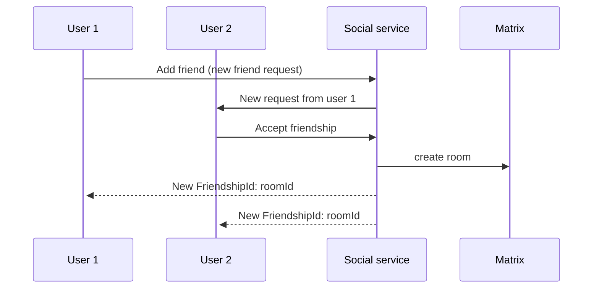
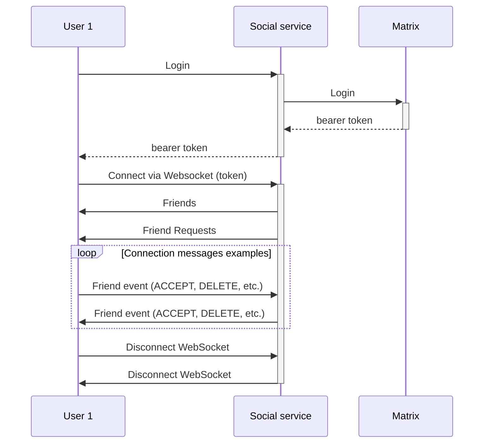
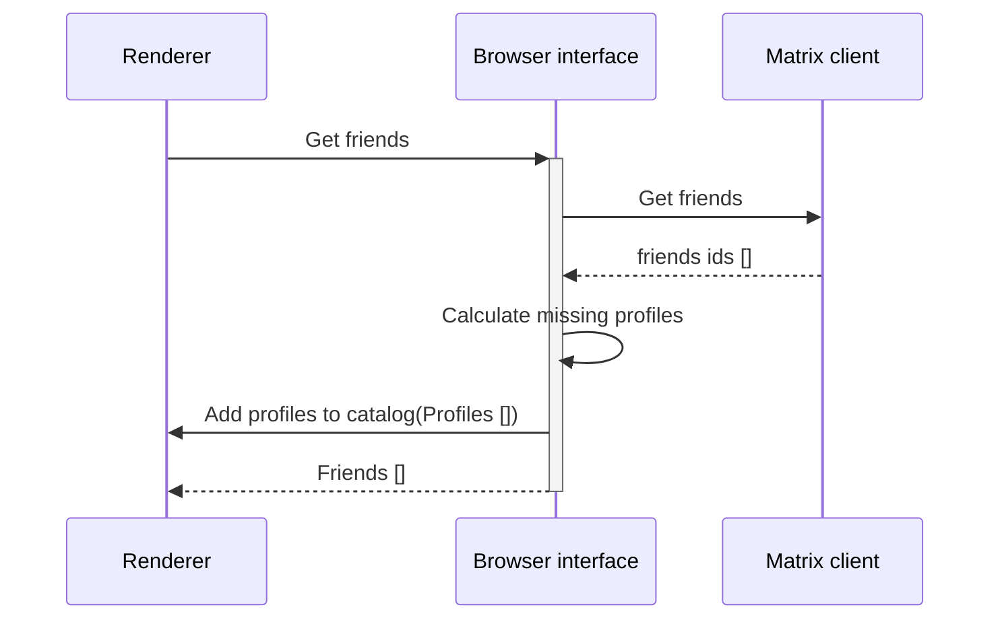
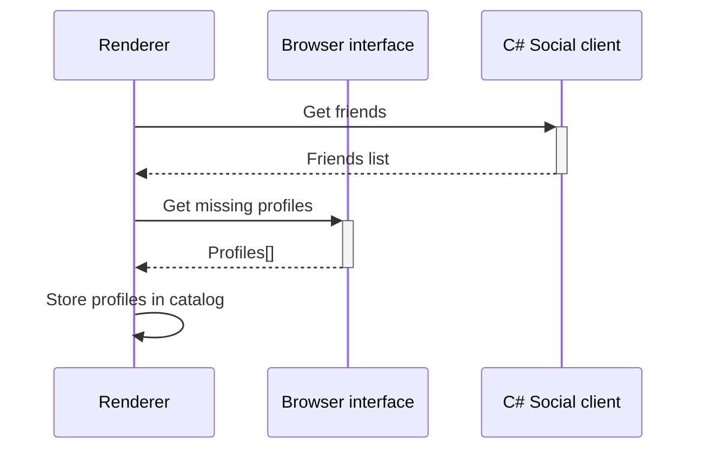

## Abstract

The goal of this milestone is to stop leveraging Matrix to handle friend requests amongst users. To achieve this, the service will need to not only save the friendship interactions but also have a mechanism to notify online users in real-time of the interactions.

## Context, Reach & Prioritization

Currently, all friendship events are being stored in both Matrix and the Social service, to avoid this duplication of information this RFC proposes to start handling friendship requests directly on the Social service and stop storing the information in Matrix. The benefits of this proposal include:

- Downscale the load on Matrix
  - The friendships events (Request, Accept, Delete, etc.)
  - Prevent creating rooms when a friendship hasn't been established
- Be able to apply friend request policies (i.e. prevent spamming, max amount of friends, blocking, etc.)
- Extend the friendship API to know the pending friend requests a user has

Also, this new approach will need to be able to notify the users in real-time about the new friendship events, to do this a communication system will need to be established between the client and the server either (the technical specification of this system will be explored later).

## Solution Space Exploration

There are two main approaches:

### Websocket / Long polling

Websocket inherently comes with the benefit of establishing a bidirectional connection, enabling more features for the future (i.e. presence). Another big plus of using WebSocket is that the client can leverage protobuff and RPC for communication between the server and the client.
On the other hand, Websocket + RPC implies that the Social server will need to be the first implementation of RPC-rust which is not yet a production-tested product.

### Server-Sent Event (SSE)

This solution doesn't imply a constant connection between the server and the client and allows the existence of a notification system, it's cheap for the server and the client. The biggest problem with this solution is that there isn't an existent transport in unity for SSE, and in the future when presence is implemented there might need to be a big refactor and a replacement of the technology.

## Specification

Due to the benefits explained over the SSE solution, Websocket is the solution that will be further explored in this document.

The new flow for a friendship will be the following:

This new flow implies that rooms in Matrix will not be created until the friendship is established. This does not make the opposite true, if the friendship ends the room won't be destroyed (to prevent the history from being lost).

Now, when a user logs in to decentraland, the friendship requests will also be obtained from the social service instead of the matrix sdk.

First, the client will need to log in via HTTP. Then, establish a connection with the server. Once correctly established, the server will then send two messages: one with the current friends and another with the pending friend requests.

## Implementation

### Unity Renderer changes

Given that Browser Interface is going to be slowly migrated into Unity's codebase, the implementation of this feature will also be done directly on Unity's side. To reduce the dependency on Browser Interface, the code responsible for handling friends and friend requests will be moved to Unity as part of this feature's implementation. However, channels, presence, and messaging will remain on the Browser Interface side for now. Over time, these features will also be migrated to Unity and will be able to take advantage of the new communication system

To prevent migrating all of the code into Unity Renderer's code and adding a lot of logic, this ADR proposes adding a new C# library to handle the logic around friendships. The logic in Unity Renderer would be adjusted to focus on event orchestration rather than handling all of the logic directly.

An example of a difference between the current implementation and the proposal is the following:

#### Current:

#### Proposal:

In this example, there are two main responsibilities of the flow:

1. Obtaining the friendships list
1. Storing the profiles in the catalog (to be able to render those friends)

In the first example, it is the Browser Interface's responsibility to identify which profiles are missing and then send this information to Unity. This makes the Browser Interface the information orchestrator. In the new approach, Unity Renderer would take on this role of information orchestration. 

### Browser interface changes

This new structure will also require changes on the Browser Interface side. First, all of the friendship logic will be deleted, except for the necessary state to ensure that channels and messaging code continue to function without any issues. This will involve deleting the interactions with Unity around storing the friendships, friendship requests, and the logic for fetching profile information before sending the friends.

The biggest impact on the Browser interface side will be in the Friends sagas, in the functions `refreshFriends`, and `handleIncomingFriendshipUpdateStatus`, and all the logic for the client configuration will be migrated to the new implementation on the renderer's side.

## Risk analysis

Description of risk — Summary description of the risk—easy to understand.

Probability of occurrence — Estimate the probability that this risk will materialize (HIGH-MEDIUM-LOW).

Severity — The intensity of undesirable impact on the project—if the risk materializes (HIGH-MEDIUM-LOW)..

Action — The contingent response if the risk materializes.

Loss Size — Given in hours or days, this is a measure of the negative impact on the project.

Risk Exposure — Given in hours or days, this is a product of probability and loss size.

Priority (optional) — This is either an independent ranking or the product of probability and severity. Typically, a higher-severity risk with high probability has higher relative priority (1-3) 1 being the higher.

| Description of risk                                                                | Probability of occurrence                       | Severity | Mitigation                                                                                                                                                                    | Loss Size                                                                                                                                                   | Risk Exposure | Priority |
| ---------------------------------------------------------------------------------- | ----------------------------------------------- | -------- | ----------------------------------------------------------------------------------------------------------------------------------------------------------------------------- | ----------------------------------------------------------------------------------------------------------------------------------------------------------- | ------------- | -------- |
| Rust-RPC can’t handle the expected load                                            | Low                                             | High     | Invest time in developing the framework to make it more performant                                                                                                            | If this problem gets to prod, users might be impacted by not receiving all expected messages. Or in the worst case, take down the social service altogether | Medium        | 1        |
| Rust RPC has internal bugs                                                         | Medium                                          | High     | Invest time in developing the framework to reduce bugs                                                                                                                        | If this problem gets to prod, users might be impacted by not receiving all expected messages. Or in the worst case, take down the social service altogether | High          | 1        |
| Difficulties integrating the new C# library into Unity-renderer                    | Medium (first-time something like this is done) | Low      | Invest more in development time and involvement from the Unity team                                                                                                           | This has no impact on the user. But can have a big impact on delaying the project                                                                           | Low           | 2        |
| Unkown internal dependency on Browser-interface around the Friends sagas/selectors | Medium/Low                                      | High     | Depending on the type of dependency, this can either imply more migration to C#, or a refactor internally in Browser-interface that can have a big impact in development time | This can be mitigated with a good testing plan, to prevent missing an existing use case.                                                                    | Low           | 2        |
