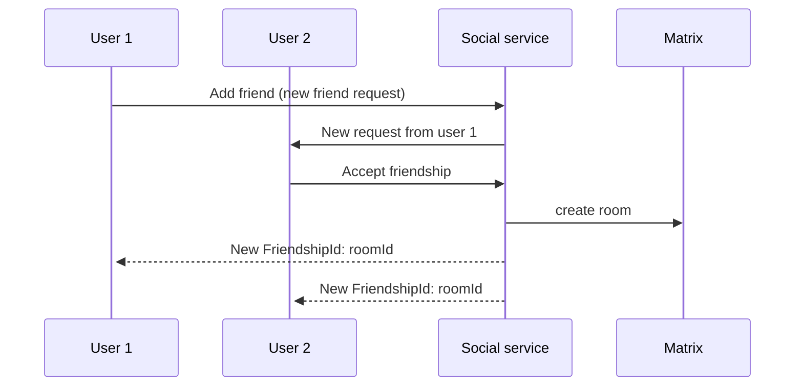

## Abstract

The goal of this milestone is to stop leveraging Matrix to handle friend requests amongst users. To do this the service will need to replace not only saving the friendship interactions, but will also need to have some mechanism to be able to notify in real time of the interactions to online users.

## Context, Reach & Prioritization

Currently all friendship events are being stored in both Matrix and the Social service, to avoid this duplication of information this RFC proposes to start handling friendship requests directly on the Social service and stop storing the information in Matrix. The benefits of this proposal include:

- Downscale the load on Matrix
  - The friendships events (Request, Accept, Delete, etc.)
  - Prevent creating rooms when a friendship hasn't been established
- Be able to apply friend request policies (i.e. prevent spamming, max amount of friends, blocking, etc.)
- Extend the friendship API to know the pending friend requests a user has

Also, this new approach will need to be able to notify the users in real-time about the new friendship events, to do this a communication system will need to be established between the client and the server either (the technical specification of this system will be explored later).

## Solution Space Exploration

There are two approaches:

- Websocket / Long polling

  - Pros:
    - Bidirectional communication
    - Enables easy implementation of online status the future
    - Enables usage of protobuff for communication (to prevent serialization of JSON)
  - Cons:
    - Allocates resources on the server
    - Will depend on the Rust RPC implementation

- Server Sent Event
  - Pros:
    - Almost no resources allocated in the server
    - Handles efficiently a low load of messages like the friendship events
  - Cons:
    - In the future if presence or messaging need to be implemented, this will need to change for another solution

## Specification

<!--
The technical specification should describe the syntax and semantics of any new feature.
-->
The new flow for a friendship will be the following:

This implies that rooms in Matrix will not be created until the friendship is established. This does not make the opposite true, if the friendship ends the room won't be destroyed (to prevent the history from being lost).

Now, when a user logs in to decentraland, the friendship requests will also be obtained from the social service instead of the matrix sdk.

