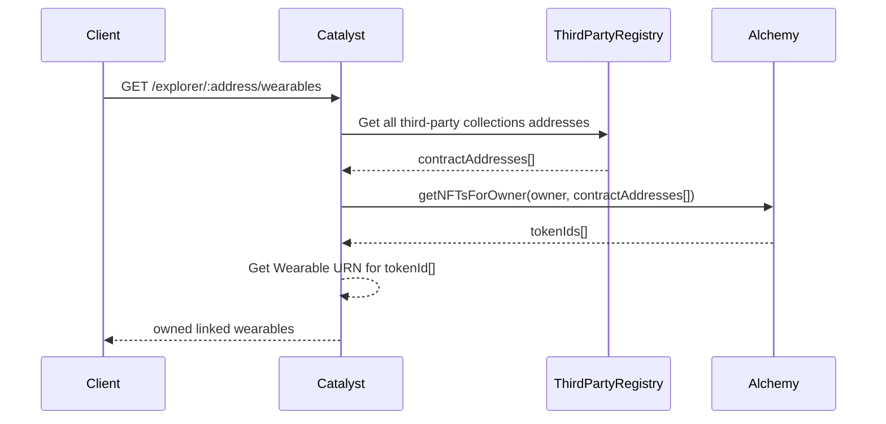

## Abstract

This decision aims to enhance the LinkedWearables system by addressing slow ownership verification and content creation challenges. Currently, reliance on third-party APIs for NFT ownership verification leads to delays and lacks historical validation during Catalyst synchronization.

## Context, Reach & Prioritization

To foster greater adoption and streamline the cost and maintenance of LinkedWearables, it is necessary to implement a new process and architecture capable of adapting to the demand while preventing any potential performance issues for the client. Additionally, it will enhance the user experience by allowing users to view all their LinkedWearables directly on the backpack, without needing to pre-select collections from a dropdown menu.

## Decision

LinkedWearables in Decentraland are wearables exclusively granted to owners of specific NFTs. While the wearables themselves cannot be traded, the underlying NFTs can. Verifying ownership of these wearables necessitated a third-party API. To streamline this process, a new system of URNs for LinkedWearables and wearable metadata will be introduced. These URNs and metadata will comprehensively describe both the Decentraland wearable and its corresponding NFT, enabling on-chain verification of NFT ownership, thereby eliminating the reliance on third party APIs.

Furthermore, the relationship between Decentraland Wearables and their associated NFT collection items will be recorded within the wearable entity's metadata. This ensures that when a LinkedWearable is submitted to the Catalyst node, it includes details about the represented NFT collections items.

This decision eliminates the need for third parties to implement and maintain API resolvers and utilizes decentralized mechanisms for both content storage and ownership validation.

### LinkedWearable Deployments

When uploading a LinkedWearable to a Catalyst node, the pointer URN and the mapping configuration between the Decentraland wearable and the NFT collection items must be specified.

**Wearables Pointers for Linked Wearables Deployments**:
The new URN system maintains the existing LinkedWearables pointer when deploying a new linked wearable, allowing seamless migration of old content to the new LinkedWearable system. The previous entity will become inactive and be replaced by the updated version. A critical addition is the mapping of the wearable to its associated NFT collection items, which must be included in the wearable entity during deployment. Several use cases for this mapping are outlined below, with more detailed information available in the [schemas repository](https://github.com/decentraland/schemas/blob/main/src/platform/item/linked-wearable-mappings.ts).

 - **Wearable pointer**: `urn:decentraland:matic:collections-thirdparty:[third-party-name]:[collection-name]:[item-name]`
   - **thid-party-name**: Name of the third party 
   - **collection-name**: Name of the Decentraland Wearables collection 
   - **item-name**: Name of the Wearable 

**Wearables Mappings**: 
A Decentraland wearable can be linked to one or multiple NFT collection items, meaning that ownership of the specified NFTs grant the user access to the corresponding wearable in Decentraland. The term `mapping` describes the relationship between a Decentraland wearable and its associated NFTs, resulting in several possible use cases described below.

A Decentraland wearable is granted to a user who:
- Owns a specific NFT collection item
- Owns any item from the specified NFT collections
- Owns any item from a list of items within a specified NFT collection
- Owns any item from a range of items within a specified NFT collection

The mappings configuration supports lists of contracts by chain and multiple sets of collection items, as long as the sets do not overlap with each other in the same collection. This flexibility can accommodate any use case required by a third party. A Decentraland wearable can be linked/mapped to single or multiple items across one or many NFT collections on different chains.

The examples below are mapping configurations within a wearable entity that represent various use cases. This information is sent to the Catalyst during the deployment of the wearable entity. 

- **Owns a specific NFT collection item**: the user owning the item with id `1` in the NFT collection `0x1234567890abcdef1234567890abcdef12345678` on `matic` will be granted with this wearable
```code:json     
  {
    "mappings": {
      "matic": {        
        "0x1234567890abcdef1234567890abcdef12345678": [
          {
            "type": "single",
            "id": "1"
          }
        ]
      }
    }
  }
 ```
 - **Owns any item from the specified NFT collections**: Any user who owns an item from the collection `0xabcdefabcdefabcdefabcdefabcdefabcdef12345678` on `mainnet` will be granted this wearable.
 ``` 
  {
    "mappings": {
      "mainnet": {
        "0xabcdefabcdefabcdefabcdefabcdefabcdef12345678": [
          {
            "type": "any"
          }
        ]
      }
    }
  }
  ```
  - **Owns any item from a list of items within a specified NFT collection**: Any user who owns an item with the ids `3`, `5`, `6`, or `9` from the collection `0x9876543210abcdef9876543210abcdef98765432` on `matic` will be granted with this wearable.
  ```
  {
    "mappings": {
      "matic": {
        "0x9876543210abcdef9876543210abcdef98765432": [
          {
            "type": "multiple",
            "ids": ["3", "5", "7", "9"]            
          }
        ]
      }
    }
  }
``` 
- **Owns any item from a range of items within a specified NFT collection**: Any user who owns an item with an id between `10` and `20` from the collection `0xabcdefabcdefabcdefabcdefabcdefabcdefabcdef` on `mainnet` will be granted with this wearable.
```
  {
    "mappings": {
      "mainnet": {
        "0xabcdefabcdefabcdefabcdefabcdefabcdefabcdef": [
          {
            "type": "range",
            "from": "10",
            "to": "20"
          }
        ]
      }
    }
  }
```

- **Owns items from different collections**: Any user who owns an item with an id between `100` and `200`, or the specific ids `203`, `207`, and `233` from the collection `0x1234567890abcdef1234567890abcdef12345678` on `matic`, or any user who owns any item from the collection `0xabcdefabcdefabcdefabcdefabcdefabcdef12345678` on `mainnet`, will be granted this wearable

```
  {
    "mappings": {
      "matic": {
        "0x1234567890abcdef1234567890abcdef12345678": [
          {
            "type": "range",
            "from": "100",
            "to": "200"
          },
          {
            "type": "multiple",
            "ids": ["203", "207", "233"]
          }
        ]
      },
      "mainnet": {
         "0xabcdefabcdefabcdefabcdefabcdefabcdef12345678": [
          {
            "type": "any"
          }
        ]
      }
    }
  }
```

### Profile and Outfits Deployments

The LinkedWearable entity represents sets of NFT collection items, but users own individual NFTs within those collections. When users interact with the wearable to equip it in their profile or outfit, they do so with a single item from the collection. To facilitate this, an extended URN is used to identify the specific item a user is interacting with. This extended URN begins with the identification of the wearable, as stated in the previous section, and continues with the data that identifies the NFT collection item granting the wearable. This information allows the Catalyst node to perform on-chain validations, verifying that the user's wallet owns the NFT associated with the wearable.

*The use of extended URNs for the individuals items management is documented on [ADR-244](https://adr.decentraland.org/adr/ADR-244).*

- **LinkedWearables URN in a Profile or Outfit Entity**: `urn:decentraland:matic:collections-thirdparty:[third-party-name]:[collection-name]:[item-name]:[chain]:[contract]:[tokenId]`
   - **chain**: Chain where the NFT collection contract is hosted 
   - **contract**: Address of an ERC-721 or ERC-1155 collection contract 
   - **tokenId**: collection item id 

Example URN: `urn:decentraland:matic:collections-thirdparty:adidas:summer2024:red-hoodie:matic:0xba0c9cf4da821dba98407cc4f9c11f6c7a5f9bbc:1`

With the information from the URN, the collection contract at address `0xba0c9cf4da821dba98407cc4f9c11f6c7a5f9bbc` on `matic`, can be queried to verify if the user equipping the wearable owns the item with id `1`.

### Third Party Registry 

When a third party is registered, a record is added to the third party's smart contract. This record must now include the list of NFT collection contracts and their corresponding chains for which the third party will create wearables. This information is essential for the Catalyst nodes to create a backpack endpoint, retrieve all NFTs owned by a wallet across those collections, and identify any corresponding linked wearables for those NFT items.

### Catalyst 

The Catalyst node will expose an endpoint `GET /explorer/:address/wearables`, which will retrieve all owned wearables for a given wallet, including all LinkedWearables owned by that wallet, as specified in this ADR. Below is a sequence diagram illustrating the general implementation concept for retrieving all wearables for the backpack, with a focus on the LinkedWearables use case.


*When the client requests the owned wearables for a specific user, Catalyst nodes can query the third-party registry contract to obtain a list of all available NFT collection contracts that provide wearables to their holders. Using this contract information, the Catalyst node can leverage a third-party service like Alchemy to retrieve the list of token IDs owned by a wallet across these contracts. This data can then be cross-referenced with the existing wearables mappings for those collections to identify which token IDs correspond to wearables, allowing the Catalyst node to return the extended URN for each wearable.*

## Deadline

Once the new implementation of LinkedWearables is fully supported, there will be a migration period to re-upload all existing LinkedWearables with the necessary mapping information. A deadline will be established for this migration. After the migration period ends and the deadline is reached, the old Third Party Resolvers API will no longer be used by the Catalyst nodes.

Date: TBD

## Consequences

- Third parties will no longer need to pay for the development and maintenance of an API to verify NFT ownership and the associated wearables.
- Retrieving a profile or batch of profiles from the Catalyst node will no longer be affected by slow third-party resolvers.
- Old third-party wearables need to be updated by the third parties to include the mapping information, or after the deadline, they will stop working, and their NFT holders won't be able to retrieve their wearables.
- There is a dependency on the Alchemy API or similar third-party services to query which NFT items a user owns from a collection. - Only the chains supported by these services can be used. This dependency could be replaced or expanded to add support for more chains as they become available in the market. 
