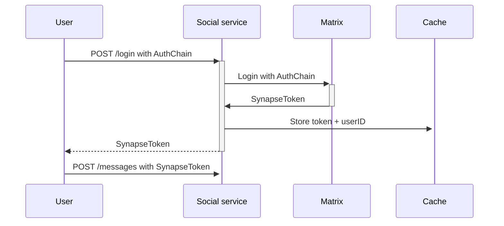
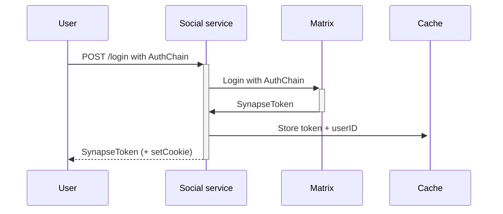
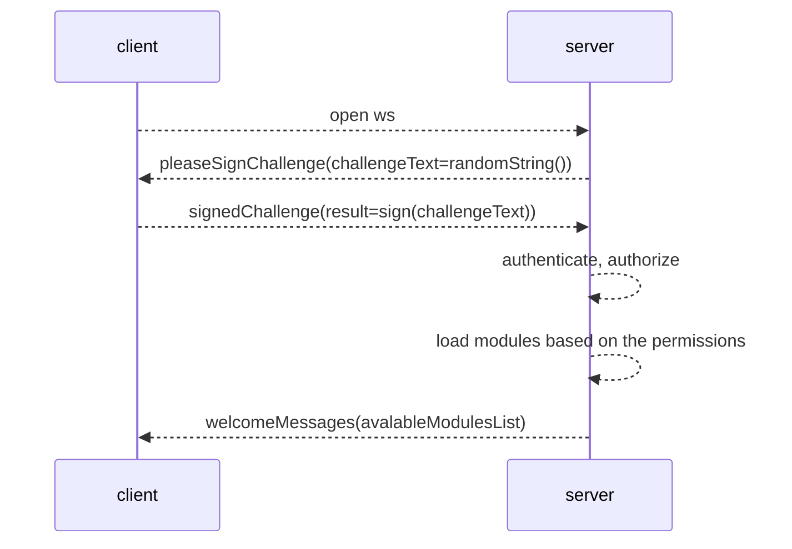

---
layout: adr
adr: 203
title: Authentication Mechanism for Friendship WebSocket Service
date: 2023-03-31
status: Review
type: RFC
spdx-license: CC0-1.0
authors:
  - Julieta11
  - agusaldasoro
  - jmoguilevsky
  - lauti7
  - guidota
  - 2fd
  - kuruk-mm
  - moliva
  - menduz
---

## Abstract

The objective of this document is to define the Mechanism that the Friendship WebSocket Server will use to authenticate their users.

This document contains the analysis of different solutions for authenticating a client and managing the token required for Authentication in a WebSocket Server. Each solution will be evaluated based on its pros and cons and their cost, including aspects such as scalability, security, and complexity. 

All the proposed solutions here are thought as part of an exhaustive analysis of the Authentication section of [Social Service M2](/adr/ADR-189). Anyway, the investigation done in this document can be the starting point for anyone at Decentraland who is creating a WebSocket Server.

## Context, Reach & Prioritization

Authentication will be done using the same mechanism as Matrix, meaning that the user needs to send an `AuthChain` to login, leveraging the work in [Social Service Authentication](/adr/ADR-143).

In the current flow for the Chat in Matrix, the user is responsible for obtaining the Token, and then sending it on every HTTP Rest request made to the server when using the chat, for example sending a message:



Once the token is received, the service queries Synapse to retrieve the corresponding `user_id` and handles all queries using that user's credentials. To prevent overloading Synapse, that information is cached in Redis.

This document focuses on possible solutions for authenticating the user with the Matrix Auth Mechanism.

Note: The usage of Synapse is meant to be deprecated, but in the maintime the Social Service needs the Synapse credentials in order to create rooms and send messages.

## Solution Space Exploration

The solutions are categorized according to the client flow for obtaining the token:

1. The Client obtains the token before creating the WebSocket connection.
2. The Client obtains the token before sending a message to the Service.
3. The Client logins against the service, and the SynapseToken is not sent to the final user.


### Solution 1: The Client obtains the token before creating the WebSocket connection

Using the already mentioned flow, the user obtains the Token from the request to the social server `POST /login` Rest HTTP endpoint. 



In this solution group, the connection will only be stablished when it's iniciated with a valid token.

#### Solution 1: Authenticate the WebSocket Connection

To prioritize minimizing requests to Redis and Synapse while taking advantage of an open connection to send the token only once and not having to send it with each message, a possible solution is to authenticate the WebSocket connection when it is opened. This way, only one WebSocket connection with the server is allowed when authenticated, and if no token is sent or it is incorrect, the connection is closed.

To achieve this, the client that opens the connection must send the Authentication Token via a header:

- The client must make an HTTP request to the server with the Authentication header to request an upgrade to a WebSocket connection.
- The server validates the token, and if it is correct, allows the connection to be upgraded to a WebSocket connection and keeps the connection open. If the token is incorrect, the connection is closed.
- With the connection open, the client can send messages as desired without having to send the token again.

The native browser client does not allow headers to be added when creating a WebSocket connection. Therefore, the proposed solution is to use cookies when using browser:

- The client obtains the token through the social service HTTP endpoint `/login`, where the response includes the header `Set-Cookie: friendships-Authorization=<Token>; Domain=social.decentraland.org`.
- Then, when the client initializes the WebSocket, since the cookie is configured, the header `Cookie: friendships-Authorization=<Token>` is sent, and the server validates the token and obtains the user_id for the entire connection.
Example of proto file:

```proto
service FriendshipsService {
  rpc GetFriends(google.protobuf.Empty) returns (stream Users) {}
}
```

**Advantages**

- Sends the request to Redis/Synapse only once
- Does not allow more than one connection per user (prevents simple DOS)
- No need to send the token as part of the message

**Disadvantages**

- The client must support cookies or be able to send the Authorization header.
- There is currently so much struggle while mixing cookies and WebSockets. It is not a straight forward implementation in _most_ languages
- [AuthChain](https://docs.decentraland.org/contributor/auth/authchain/) signatures is the unequivocal way to authenticate user in Decentraland, the `/login` endpoint would have to use the AuthChain anyways. Diverging from the canonical mechanism wouldn't be sensible on this scenario.
- Authenticating the transport (ws via cookie) would not enable change of transports. Even though the case of changing WS is unlikely going to happen, it is the same as TLS vs Application layer security
- Native implementations of WS do not handle cookies correctly, using an RPC would make it way easier to implement other clients.
- Security implications of what stealing the tokens can cause. 

### Solution 2: The Client obtains the token before sending a message to the service

#### 2.a: Use a login message

To send the token, this solution proposes to expand the current `.proto` definition with a mandatory login message that must be sent as the first message when establishing a WebSocket connection. The client sends its token in this message, and the service validates it against Synapse to obtain the corresponding `user_id`. This `user_id` remains the same throughout the connection for all subsequent messages, taking advantage of the established WebSocket connection.

Example of proto file:

```proto
service FriendshipsService {
  rpc Login(Token) returns (google.protobuf.Empty) {}
  rpc GetFriends(google.protobuf.Empty) returns (stream Users) {}
}
```

**Advantages**

- Takes advantage of the existing state and connection (establishes a relation one to one from connection to user, anyway this have some drawbacks explained in the disadvantages section).
- Saves sending the token in the payload for each message (only a few bytes), avoiding the need to fetch it from Redis.
- If a new connection with the same token/user_id arrives, the previous connection can be closed. This is a simple way to avoid DoS.

**Disadvantages**

- The information is stored in memory, which may be a replication of what is in Redis.
- [dcl-rpc](https://github.com/decentraland/rpc-rust) needs to be expanded to allow connection identification and specific information storage. Currently, a global context is stored for the entire service, but a way to identify the client (there is no IP address or socket, only user_id) needs to be found. Additionally, `dcl-rpc` currently does not expose the connection because it is abstracted.
- Client-side logic is more complex, as it must ensure that the first message sent is the login message.
- As the service has a state, then it makes it more complex to scale horizontally, as a new login is required when reconnecting with another node, even using the same token.
- WebSockets support automatic reconnection, in this case, if the server restarts and loses the memory state and reconnects to the user, then the login information will be lost.

#### Solution 2.b: the login message is sent by the Server

This solution is analogue to 1.a but the message for the login is sent by the server, so the client must respond with the token. This way the logic for the client-side will be simpler. The rest of the analysis remains the same.

#### Solution 2.c: include the token on each message

Each message sent to the service includes the token as part of the payload. The client must send the token with each message, and the service validates it against Synapse to obtain the corresponding `user_id`.

Example of proto file:

```proto
service FriendshipsService {
  rpc GetFriends(Token) returns (stream Users) {}
}
```

**Advantages**

- Implementation is simpler, as there is no custom logic on the client side, and reconnections do not require handling.
- Stateless.
- More compatible if the service is migrated to HTTP.
- Supports automatic reconnection or node switching (via Load Balancer) without requiring a new login.

**Disadvantages**

- The token must be sent with each message, even when the connection is persistent. Anyway, the definition of the proto is a stream, so the message will be sent once and open to hear new updated.
- The message signature in the `.proto` file is modified to receive the token as a parameter, so migrating to another .proto definition that excludes that field should be handled correctly.
- If multiple tokens for different users arrive on the same connection or multiple connections for the same user exist, it becomes more difficult to handle DoS attacks (with the same token and different IP) since connections cannot be rejected if they are for the same user.
- Validation of token against Synapse or Redis is required for each received message.

### Solution 2.d: Hybrid Model

Use a login message to obtain the FriendshipToken, a JWT generated by the service that combines the `matrix_token` and `user_id`. Each message requires the FriendshipToken, which eliminates the need to query Redis.

If the client sends a message other than the login message, such as `GetFriends`, the service will respond with `Unauthorized`. If a connection is established and no login message is received within a certain time frame, the connection will be closed.

Example of proto file:

```proto
service FriendshipsService {
  rpc Login(SynapseToken) returns (FriendshipToken) {}
  rpc GetFriends(FriendshipToken) returns (stream Users) {}
}
```

**Advantages**

- Avoids querying Redis since the JWT is generated by the same server, and validation of the JWT is sufficient to obtain the `synapse_token` and `user_id`.
- Stateless.
- Compatible if we want to migrate it to HTTP.
- Supports automatic reconnection or node change (through Load Balancer for example) without forcing a reconnection.

**Disadvantages**

- The implementation is a bit more complex as an additional authentication system and the generation of a JWT by the server is required.
- If the user changes their token, the `FriendshipToken` must be regenerated. This can generate a bit more overhead on the server.
- If the user has multiple tokens (for example, on different devices), then they would have to manually close all connections.
- If the server crashes, all generated tokens are lost, and clients would have to generate new tokens again.


### Solution 3: The Client logins against the service, and the Synapse Token is not sent to the final user

Although the client must continue to obtain the Synapse token as long as they need to send messages through the chat, it is somewhat confusing and clutters the protocol for them to have to manually handle a Synapse token, as it is an external dependency.

For this reason, this proposal seeks to obfuscate the token so that the user logs in with Synapse through the Friendships WebSocket Server, and the server internally handles the token and `user_id` mapping, storing it in the connection. Then, all messages are sent without any parameters.

This solution is analogous to `2.b` but obscuring the Synapse Token.





```protobuf
syntax = "proto3";
package decentraland.bff;

message GetChallengeRequest {
  string address = 1;
}

message GetChallengeResponse {
  string challenge_to_sign = 1;
  bool already_connected = 2;
}

message SignedChallenge {
  string auth_chain_json = 1;
}

message WelcomePeerInformation {
  string peer_id = 1;

  // list of available modules in this BFF
  repeated string available_modules = 2;
}

service BffAuthenticationService {
  rpc GetChallenge(GetChallengeRequest) returns (GetChallengeResponse) {}
  rpc Authenticate(SignedChallenge) returns (WelcomePeerInformation) {}
}
```

**Advantages**
- This has a clear advantage of not needing to store a second token, only making use of the already available auth chain to authenticate the users.
- It will also enable interoperability with the [scoped permissions for auth chains](https://github.com/decentraland/adr/pull/162/files)
- Since the authentication service already stores a matrix token for the user, signing the challenge would be the only required thing to make internal use of that token without leaking it to the user

**Disadvantages**
- The information is stored in memory, which may be a replication of what is in Redis.
- [dcl-rpc](https://github.com/decentraland/rpc-rust) needs to be expanded to allow connection identification and specific information storage. Currently, a global context is stored for the entire service, but a way to identify the client (there is no IP address or socket, only user_id) needs to be found. Additionally, `dcl-rpc` currently does not expose the connection because it is abstracted.
- As the service has a state, then it makes it more complex to scale horizontally, as a new login is required when reconnecting with another node, even using the same token.
- WebSockets support automatic reconnection, in this case, if the server restarts and loses the memory state and reconnects to the user, then the login information will be lost.
- An implementation for dcl-crypto in Rust needs to be done to support this use case.

## Conclusion

Explored solutions are:
- 1: Authenticate the WebSocket Connection
- 2.a: Use a login message
- 2.b: the login message is sent by the Server
- 2.c: include the token on each message
- 2.d: Hybrid Model
- 3: The Client logins against the service, and the Synapse Token is not sent to the final user

The primary disadvantages associated with the solution using cookies (`1: Authenticate the WebSocket Connection`) are due to native libraries that do not ensure header management when initiating a WebSocket connection. While there are different solutions for current clients that work, there is not guarantee the flexibility of this solution for future clients. Furthermore, the benefits of this solution are not significant enough to justify the effort required for implementation. The community typically opts for a solution more similar to the second group when authentication is required in a WebSocket.

One of the most straightforward solutions to replace in the future is the `2.c: include the token on each message` solution. Since that solution is minimally intrusive, the implementation cost is low, and there is no cost associated with its removal.

Ideally, the solution should follow an upgrade format initiated by the client, whereby the server asks the client the credentials like AuthChain or the Authentication Token. If the message requesting the token is not received, the service terminates the communication, similar to the HTTP or TLS handshake. Solutions within this category include:
- `2.a: Use a login message`
- `2.b: the login message is sent by the Server`
- `3: The Client logins against the service`

Among those solutions, the benefit of implementing the third one is that the Synapse Token is opaque to the client, making it something internal that can be removed in the future if Synapse dependency is removed. Anyway, the cost of implementing that solution today implies many changes in new dcl libraries like `rpc-rust` and `decentraland-crypto-rust` which may imply a risk for a project as big as Social Service M2.

For the Scope of the Social Service M2 Project, the decision is to implement the `2.c` solution, which will handle the authentication individually on each message, as it is cheaper the implement and the focus and effort is in the robustness and availability of a new WebSocket Server implemented in Rust that is thought to replace the dependency to Synapse when managing friendships and request friendships. The `2.c` solution does not represent any security risk or concern, as the Synapse Token is already stored on the local storage of the client, and as it will be validated on every message the behavior will be analog to what exists today.

In this line, the idea is to revise this solution after Social Service M2 is released and then decide if better Authentication management can be done (like implementing the `3` solution). So, the `.proto` definition used to manage the friendships in the Social Service for M2 is for internal use only, and the release will be marked as beta. The token in each message is strictly "optional" in the .proto from day-0, that would make it "always removable".
