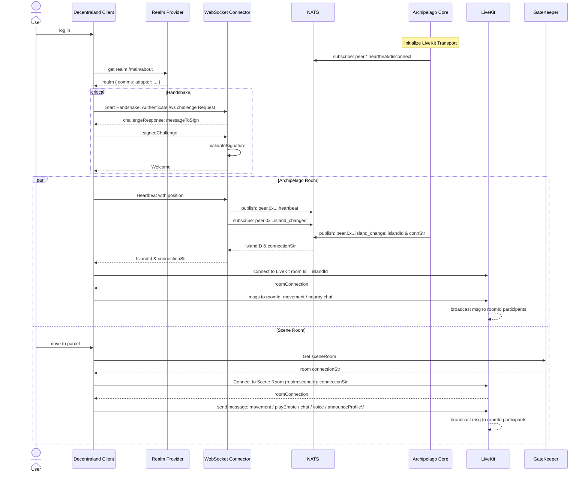
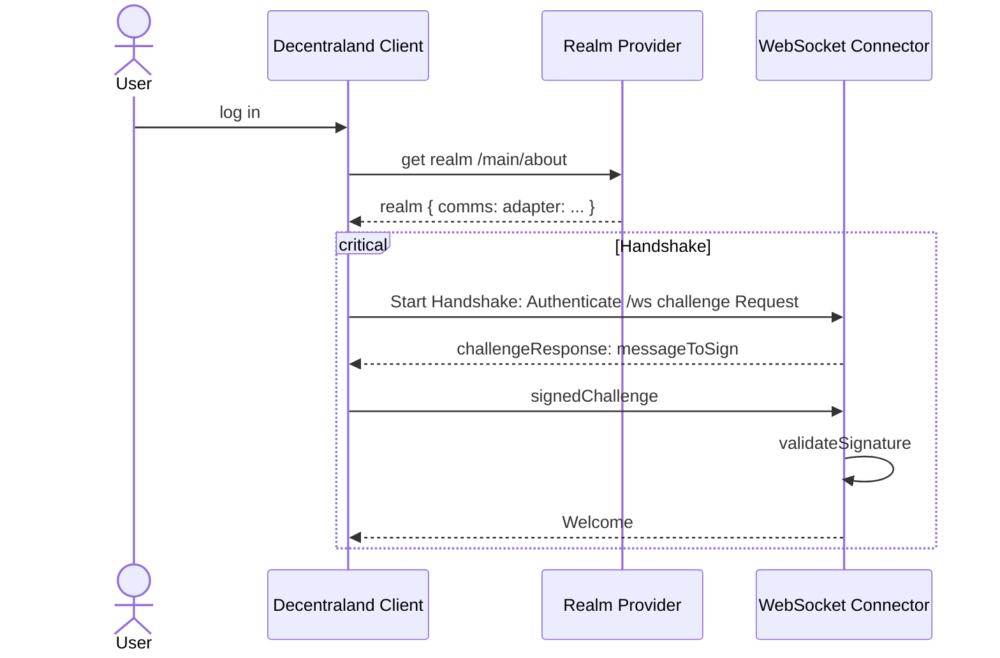
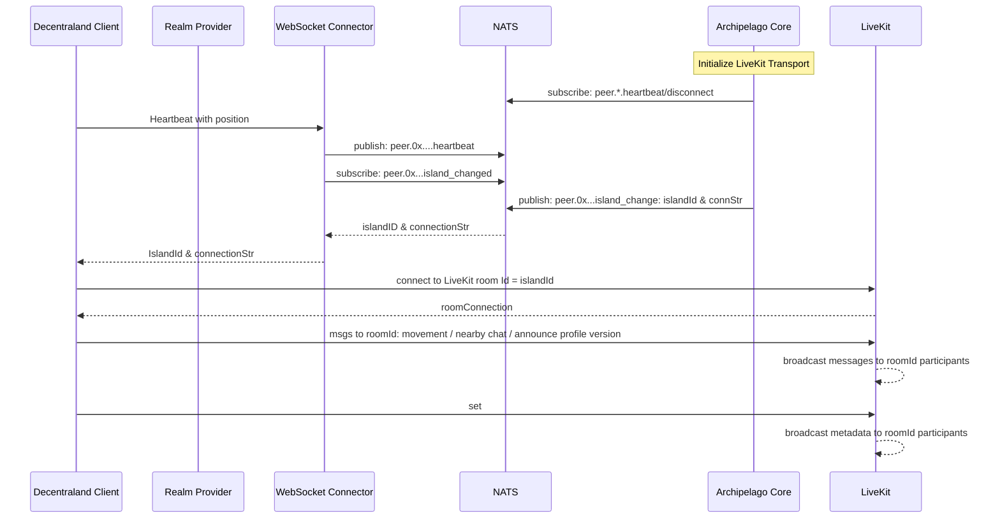
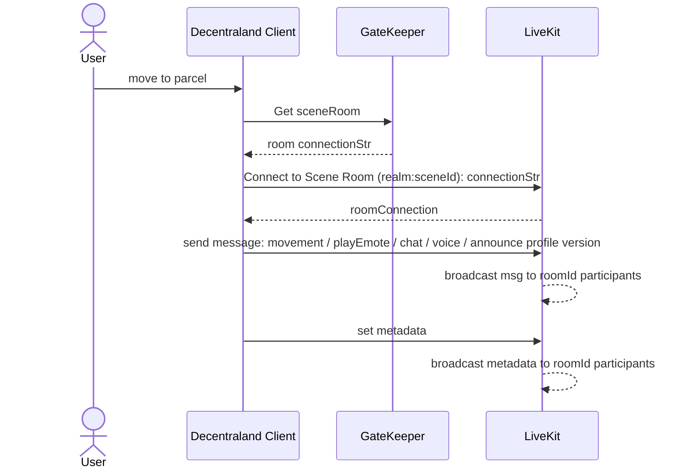
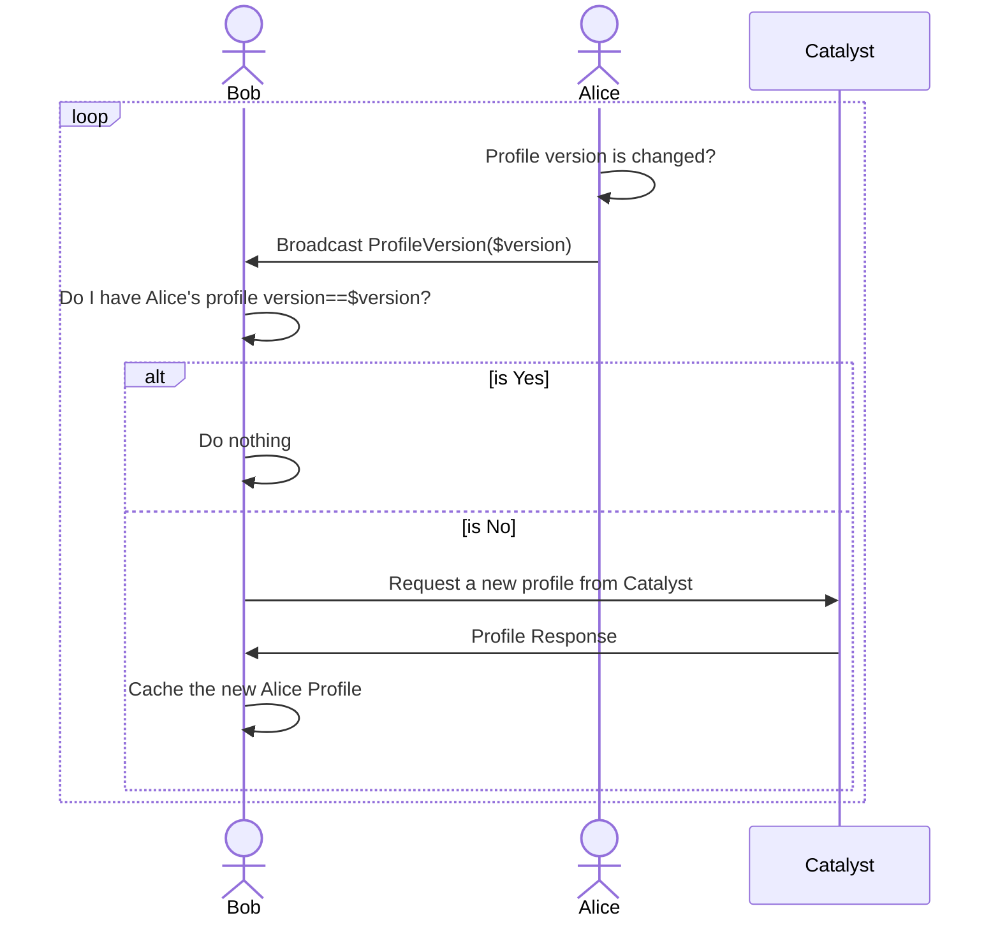
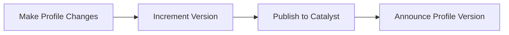
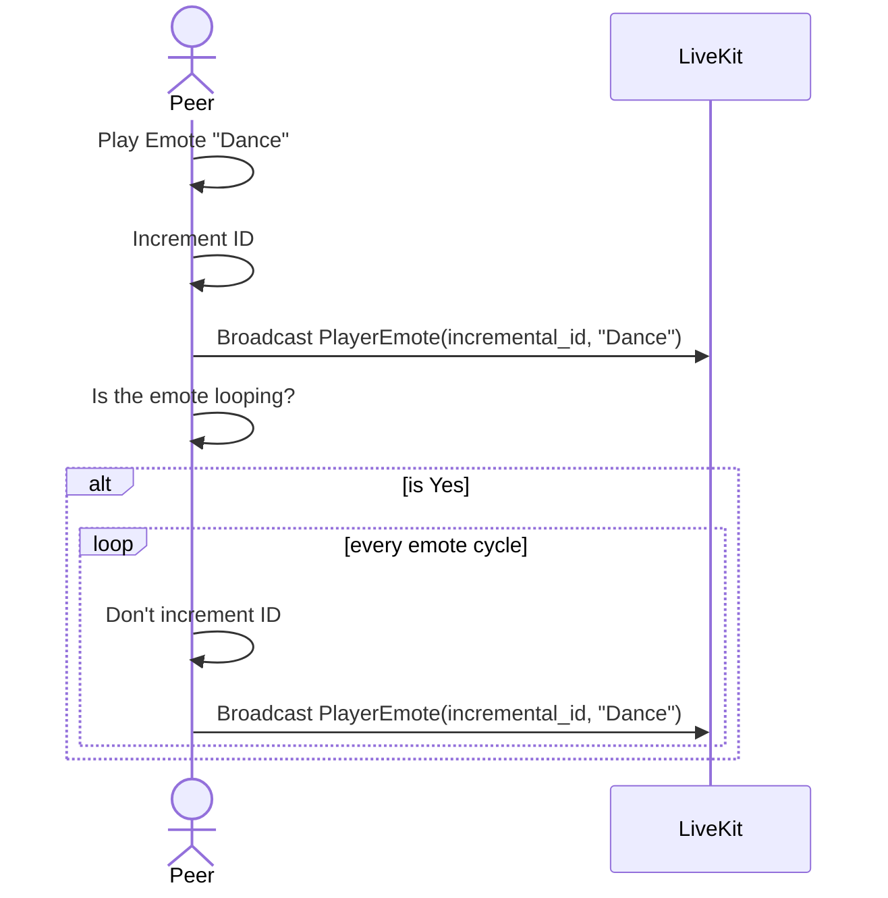

## Abstract

The current Decentraland client communication protocol effectively supports user scaling but has inherent design limitations that restrict certain functionalities in Genesis City, such as content casting for in-world streaming, serverless multiplayer experiences, and being able to handle scene-hosted events with speaker moderators. This ADR explores the architectural decisions behind a new communication protocol designed to overcome these limitations. 

## Context, Reach & Prioritization 
The new architecture, incompatible with the existing implementation ([comms-v3](https://github.com/decentraland/protocol/tree/main/proto/decentraland/kernel/comms/v3), [unity-renderer](https://github.com/decentraland/unity-renderer/tree/dev/browser-interface/packages/shared/comms)), will be deployed in a forthcoming client version and become the new standard.The objective is to incorporate the following functionalities without overburdening the client implementation with additional complexities, while maintaining the ability to stream the world and visualize users in surrounding areas. This entails:

- **Enable Content Casting**: Facilitate voice and video streaming in a scene, even when multiple clusters (islands) of users are present.
- **Authorization Management**: Empower scene owners or their authorized third parties to manage content casting and moderate voice chat accessibility within a scene.
- **Consistency**: Ensure consistent perception of avatars/users within a scene, including scene state, content casting, and proximity of avatars.
- **Scalability**: Retain a clustering mechanism to ensure efficient crowd management when islands reach maximum occupancy.
- **Message Handling**: Effectively manage the influx of messages received by peers within a cluster, preventing congestion and data transfer inefficiencies.
- **Uniform Communication Transport**: Maintain consistency across all environments (in-world, DCL editor, etc.) to ensure uniform features and behaviors.


## Decision

### Archipelago Background 
The communications system in Decentraland relies on the [Archipelago protocol](https://github.com/decentraland/archipelago-workers), which clusters users into `islands` based on their positions. An island is essentially a group of users, and the communication between them happens within this group. The islands are not static; they are dynamically recalculated in real time as users move.

To handle scalability, the Archipelago protocol allows islands to overlap when the user limit of an island is reached, ensuring that large groups of users in the same area are still supported. The maximum number of users per island can be adjusted to optimize client performance by balancing how many avatars the client can render without degrading rendering performance. The protocol uses several heuristics to manage island behavior—such as calculating the center of an island, assigning users to islands, creating new islands based on user distance from the center, shifting the island center as users move, and merging islands when necessary.

The Archipelago protocol scales efficiently due to its dynamic island calculations and users grouping, but a key limitation is that scenes have no direct authority over the communication channel. This prevents features like managing speaker permissions, streaming content to members of a cluster, or sharing metadata such as the states of objects within a scene. If scene-specific data were tied to the island, the island could shift its center to a different scene, leading to conflicts in data consistency or permissions, as the island's dynamic nature might affect scene control.

### Solution 

Maintain the current Archipelago implementation while establishing a new scene room connection specific to the active scene. The Archipelago channel should be reserved solely for receiving avatar positions, profile update notifications, and nearby chat messages with the objective to be able to interact with users beyond the limits of a scene. All communications, including voice chat, scene objects state, and streams, will be shared within the scene channel. 
This new model grants scene owners authority over the communication channel, allowing them to share content streams, share object states or handling speakers, providing a consistent experience for all users visiting the scene.

At any given moment, a user can maintain up to two connections: one with the current scene and another with the island. When the scene changes, the existing connection to the previous scene should be closed, and a new connection to the current scene must be established. 


In the illustrated scenario, Peers 1, 2, and 3 are connected to the scene room `E1`. Additionally, Peer 1 establishes a connection to the island `I1`, while Peers 2 and 3 are linked to the island `I2`. This example serves as a simplified illustration. Users may be far apart within the same scene, but this aims to demonstrate that if a peer is at the edge of a scene, they will be able to see other players who are not within the scene but are within viewing range. On the other hand, the scene channel will be there to share consistent data among the visitors, like a stream of video on a texture or the state of an object like a door that can be opened or closed besides also sharing information about the users visiting the scene. Below are more details about the illustrated example:

**Peer1**:
- Can see, share the scene state, view the streaming, communicate via audio, and chat with `Peer2` and `Peer3` since they are in the same scene room `E1`.
- Can also see and chat with `Peer4` since they are in the same island, `I1`.
- Won't see or can interact with `Peer5` and `Peer6`.

**Peer2**:
- Can see, share the scene state, view the streaming, communicate via audio, and chat with `Peer3` and `Peer1`through the scene room `E1`.
- Can also see and chat with `Peer5` and `Peer6` since they are in the same island, `I2`.
- Won't see or can interact with `Peer4`.

**Peer3**:
- Can see, share the scene state, view the streaming, communicate via audio, and chat with `Peer2` and `Peer1` through the scene room `E1`.
- Can also see and chat with `Peer5` and `Peer6` since they are in the same island, `I2`.
- Won't see or can interact with `Peer4`.

**Peer4**:
 - Can see and chat with `Peer1` because they are in the same island, `I1`.
 - Won't see or can interact with `Peer2`, `Peer3`, `Peer5` and `Peer6`.

**Peer5**:
 - Can see and chat with `Peer2`, `Peer3`, and `Peer6` since they are in the same island, `I2`.
 - Won't see or can interact with `Peer1` and `Peer4`.

**Peer6**:
 - Can see and chat with `Peer2`, `Peer3`, and `Peer5` since they are in the same island, `I2`.
 - Won't see or can interact with `Peer1` and `Peer4`.


The table below outlines the information that will be communicated through each channel.

| Protocol Messages| island           | scene-room        |
|------------------|------------------|------------------|
| Positions/Movements| ✅               | ✅               |
| Profile Events   | ✅               | ✅               |
| Voice            |                  | ✅               |
| Cast Stream      |                  | ✅               |
| Scene State      |                  | ✅               |
| Nerby Chat       | ✅               | ✅               |

> Note: The Scene State (CRDT State) is serverless and shared directly between peers, with no data stored on any server. Connected peers hold the state and share it with others in real-time. For more information, see the CRDTs [ADR-117](https://adr.decentraland.org/adr/ADR-117).

#### Design Considerations 

The establishment of the connection with the island remains unchanged, as that portion of the protocol is the same. The key difference lies in the types of messages sent through the channel. To establish a connection with a scene-room, a new service called [Gatekeeper](https://github.com/decentraland/comms-gatekeeper/) will be introduced to manage token permissions for the transport layer ([LiveKit](https://livekit.io/)). Only one scene room can be active at a time, as a user can only be present in one scene at any given moment. The scene room operates similarly to the communication service implementation used in worlds, where each scene has its own dedicated room. The Gatekeeper service will also allow scene owners to create authorizations for users, which will be reflected in the LiveKit token. This capability will enable them to moderate voice interactions and data streams within the scene effectively.

 

### Archipelago Workers

- **[Realm Provider](https://github.com/decentraland/realm-provider/)**: This small service is responsible for delivering a realm description in accordance with [ADR-110](https://adr.decentraland.org/adr/ADR-110). It specifies the list of services required to connect to Decentraland and provides the communications adapter, which points to the Archipelago workers stack.
- **WebSocket connector**: Entry Point for the Communications Backend. This component exposes the WebSocket defined in the `commsAdapter` section of the realm description and in accordance with [ADR-180 Communication protocol](https://adr.decentraland.org/adr/ADR-180). Connected users send their positions through this channel and receive an Archipelago island ID, along with the necessary settings to connect to the LiveKit room (transport) where island messages will be exchanged with the cluster of users.
- **Core**: Implements all Archipelago heuristics to calculate and assign an island to a user based on their position.
- **Stats**: A service that exposes users' positions and islands to display realm statistics, providing insights into hot scenes and identifying where crowds are gathering.
- **[NATS](https://nats.io/)**: Message broker to exchange information between services. 

### Comms Gatekeeper

The **[Comms Gatekeeper](https://github.com/decentraland/comms-gatekeeper)** service serves as the guardian of LiveKit tokens, controlling access to scene rooms. It processes signed fetch requests from clients and generates tokens that provide entry to LiveKit rooms designated for specific scenes or worlds. In the initial version of this implementation, this functionality is managed by this external service to reduce interference with existing services. However, the scene-room gatekeeping for LiveKit will be migrated to Archipelago **Core**, which already holds the necessary LiveKit keys to grant access to island rooms. 

The gatekeeper was designed as a straightforward microservice with a singular responsibility, intentionally kept separate from the Archipelago core, which is tasked solely with assigning islands to users. However, since the Archipelago core also holds the keys to LiveKit, there is an overlap in gatekeeping responsibilities. By merging these functionalities, we can simplify the architecture and eliminate redundancy, streamlining the overall system. Furthermore, the gatekeeper service currently under development not only safeguards LiveKit but also offers APIs and functionalities for the scene admin smart item, which manages the user streaming experience in Decentraland. Once the gatekeeping functionality is transitioned to the Core service, the gatekeeper can be repurposed to function as the scene admin smart item server or as a dedicated streaming access service.


> Note: Room Limits: The transport layer (LiveKit) does not impose a strict limit on the number of participants in a single room. The real constraint comes from the end user’s bandwidth and the client’s ability to process data efficiently to render nearby players. In Archipelago, islands are capped at a maximum of 100 players, a limitation originally introduced to prevent performance degradation when rendering large numbers of avatars simultaneously. With the new implementation, clients will receive data from up to 100 players through Archipelago, but the scene room currently has no predefined limit. Clients are free to define rendering strategies and possible limits or optimizations, e.g. render the closest N users and dynamically adjusting based on proximity. 

## General Connection Flow 
The user logs into the platform, retrieves a realm description, and initiates a connection handshake with the backend. In parallel, the user establishes both the Archipelago connection and the scene connection to begin exchanging information with other users connected across different clusters.




## Sequence Diagram Breakdown 

#### 1. Handshake 



#### 2. Archipelago Island 




#### 3. Scene Room



## Metadata

Metadata is supplementary data which is static or rarely changed, and is aimed to complement Protocol Messages per peer-basis (only one instance of metadata is set per LiveKit user at a time). Thus, the optimal usage of bandwidth is ensured as transmitting of non-changed data is prevented. 
Metadata is provided in `JSON` format, and can be extended as Decentraland Client develops over time.

Metadata is set via [setMetadata](https://docs.livekit.io/client-sdk-js/classes/LocalParticipant.html#setMetadata) method of the LiveKit Client SDK every time any of metadata components are changed.
Metadata is written to both Scene and Island rooms.

Every component is described in detail in the corresponding section of the Protocol Message it compliments.

## Protocol Messages  

The protocol messages for profiles, positions, and updates have been optimized for client performance, aiming to minimize data transmission through the channels. In this new implementation, profiles' data is no longer sent through the island and is instead retrieved from the Catalyst network. When a user updates their profile, a notification is sent, and the updated profile is downloaded from the servers. This approach ensures that avatar impersonation is prevented, as the signed profile is retrieved from a trusted Catalyst node.

### Profile Announcement 

Before a remote peer is able to see another peer a profile version should be announced. This action is mandatory, if the version is not announced, the remote client is unable to visualize any other messages.

**Communication Diagram**



```protobuf
message AnnounceProfileVersion {
  uint32 profile_version = 1;
}
```

`AnnounceProfileVersion` is sent to both `Island` and `Scene` rooms.
The profile version should match the version sent to the catalyst.

The process on the client looks like following:



**Metadata**

To ensure that peers will be able to retrieve the updated profile version from the correct Catalyst, `lambdasEndpoint` should be set in `Metadata`.
It is equal to the `lambdas.publicUrl` received from `/about` response.
It is sufficient to set this data only once per user session as it does not change while the session is active.

`lambdasEndpoint` is optional and can be omitted: in this case it's not guaranteed that the profile received on a peer end will reflect the most recent changes, as it may take time to propagate profile changes through all available Catalysts.

```
{
  ...
  "lambdasEndpoint": <serverAbout.lambdas.publicUrl>,
  ...
}
```

### Player Emote

```protobuf
message PlayerEmote {
  uint32 incremental_id = 1;
  string urn = 2;
}
```

`PlayerEmote` is sent to both `Island` and `Scene` rooms.

This message is used to notify other peers that a user is performing an emote. The `incremental_id` is a monotonic counter that grows with every sent message.
- `incremental_id`: A monotonic counter that grows with every sent message. It is used for messages deduplication 
- `urn`: The Uniform Resource Name (URN) of the emote being performed.

**Looping Emotes Replication**

For a looping emote this message should be replicated every cycle to ensure its visibility for a newly joined peer.



> Note: when a peer joins a room they will miss information about emotes currently being played. If an emote is looping they will receive it with the next message

### Movement (Compressed)

```protobuf
message MovementCompressed {
  int32 temporal_data = 1; // bit-compressed: timestamp + animations 
  int64 movement_data = 2; // bit-compressed: position + velocity 
}
```

`Movement` message is used to synchronize character position in the world and its animation state. The animation state is fully driven by a sender, a recipient does not infer anything on its own but fully follows the state received from another peer.

This is a complex message that encodes all possible states of a player in a compressed format. Thus, the client keeps reasonable amount of data being transferred.

`MovementCompressed` is sent to both `Island` and `Scene` rooms.

#### Compression algorithms

**Float quantization**

The goal of quantization is to preserve the original `value` with the given accuracy which is defined by:
- `minValue` - the minimum value that can be represented
- `maxValue` - the maximum value that can be represented
- `sizeInBits` - the number of bits used to represent the value, the higher the number the higher the accuracy

When the value is quantized it is compressed to the range `[0, 2^sizeInBits - 1]` and then decompressed back to the original value.

```csharp
        public static int Compress(float value, float minValue, float maxValue, int sizeInBits)
        {
            int maxStep = (1 << sizeInBits) - 1;
            float normalizedValue = (value - minValue) / (maxValue - minValue);
            return Mathf.RoundToInt(Mathf.Clamp01(normalizedValue) * maxStep);
        }
        
        public static float Decompress(int compressed, float minValue, float maxValue, int sizeInBits)
        {
            float maxStep = (1 << sizeInBits) - 1f;
            float normalizedValue = compressed / maxStep;
            return (normalizedValue * (maxValue - minValue)) + minValue;
        }
```

#### Data breakdown

For every property it is vital to define `minValue` and `maxValue` as close as possible to the practical range as it will increase the accuracy of the transmitted value within a fixed `sizeInBits`

**temporal_data**:

| Bits position | Description                                                                                                                                                                                                   |
|---------------|---------------------------------------------------------------------------------------------------------------------------------------------------------------------------------------------------------------|
| 0 - 14        | **Timestamp**: used for interpolation<br/>TIMESTAMP_QUANTUM = 0.02f<br/>TIMESTAMP_BITS = 15                                                                                                                   |
| 15 - 16       | **Movement Kind**: Represents one of the movement states in the binary format:<br/>00 = IDLE<br/>01 = WALK<br/>10 = JOG<br/>11 = RUN                                                                          |
| 17            | **Sliding Bit**: is set when the avatar is sliding according to the animations                                                                                                                                |
| 18            | **Stunned Bit**: is set when the avatar is stunned (after a long jump)                                                                                                                                        |
| 19            | **Long Jump Bit**                                                                                                                                                                                             |
| 20            | **Falling Bit**                                                                                                                                                                                               |
| 21            | **Long Falling Bit**                                                                                                                                                                                          |
| 22 - 27       | **Rotation around Y-axis**<br/>Sent explicitly to identify cases when the avatar rotates without movement<br/>Uses Float Quantization algorithm:<br/>`minValue = 0`<br/>`maxValue = 360`<br/>`sizeInBits = 6` |
| 28 - 29       | Two bits to identify the velocity tier                                                                                                                                                                        |


Timestamp encoding:

The TimestampEncoder algorithm implements a circular buffer for encoding and decoding timestamps to fit within a fixed bit-length constraint.

- Key Concepts:

  - Uses a circular buffer with a size defined by `2^TIMESTAMP_BITS * TIMESTAMP_QUANTUM`.
  - Normalizes timestamps within the buffer range during encoding.
  - Handles buffer wraparound during decoding to maintain continuity.

```csharp
        private const float WRAPAROUND_THRESHOLD = 0.75f;
        
        private int steps => 1 << settings.TIMESTAMP_BITS; // 2^TIMESTAMP_BITS
        private int mask => steps - 1;

        public float BufferSize => steps * settings.TIMESTAMP_QUANTUM;
        
        public int Compress(float timestamp)
        {
            float normalizedTimestamp = timestamp % BufferSize; // Normalize timestamp within the round buffer
            return Mathf.RoundToInt(normalizedTimestamp / settings.TIMESTAMP_QUANTUM) % steps;
        }

        public float Decompress(long data)
        {
            float decompressedTimestamp = (int)(data & mask) * settings.TIMESTAMP_QUANTUM % BufferSize;
            float adjustedTimestamp = decompressedTimestamp + timestampOffset;

            // Adjust to buffer wraparound
            if (adjustedTimestamp < lastOriginalTimestamp - (BufferSize * WRAPAROUND_THRESHOLD))
            {
                timestampOffset += BufferSize;
                adjustedTimestamp += BufferSize;
            }

            lastOriginalTimestamp = adjustedTimestamp;
            return adjustedTimestamp;
        }
```

**movement_data**:

Compression parameters of movement are based on the velocity of the avatar, and they are split into 3 tiers. Splitting provides higher accuracy if the avatar is moving slowly.
Each tier defines the following values:
- `MAX_SPEED` - speed (not a vector) threshold for the tiered settings, measured in meters per second
- `XZ_BITS` - number of bits used to represent the X and Z components of the position relative to the parcel
- `Y_BITS` - number of bits used to represent the Y component of the absolute position
- `VELOCITY_BITS` - number of bits used to represent each component of the velocity

Defined tiers:

| Tier | MAX_SPEED | XZ_BITS | Y_BITS | VELOCITY_BITS |
|------|-----------|---------|--------|---------------|
| 0    | 4         | 10      | 13     | 4             |
| 1    | 12        | 8       | 13     | 6             |
| 2    | 50        | 8       | 13     | 6             |

`50 m/s` is a theoretical speed limit for the avatar, and it is not expected to be reached in practice.

In order to select the right tier they should be sorted by `MAX_VELOCITY` and the first one that does not exceed the current speed should be selected. There always should be one upper-most tier defined which will be selected if the speed exceeds the last defined tier.

To properly decode `movement_data` settings must be shared between clients.

`PARCEL_SIZE = 16 (m)` is a constant that defines the size of the parcel in meters. Parcel has a square shape.

`PARCEL_BITS = 17` is a constant that defines the number of bits used to represent the parcel index. `17` bits are enough to encode the whole Genesis City.

`Y_MAX = 200` is a constant that defines the practical maximum height the avatars can reach in the world.

| Bit Position                                                                                                            | Description                                                                                                                       |
|-------------------------------------------------------------------------------------------------------------------------|-----------------------------------------------------------------------------------------------------------------------------------|
| 0 - (PARCEL_BITS - 1)                                                                                                   | **Parcel Index**: Linearized parcel index                                                                                         |
| PARCEL_BITS - (PARCEL_BITS + XZ_BITS - 1)                                                                               | **X Relative Position**:<br/> Uses Float Quantization:<br/>`minValue = 0`<br/>`maxValue = PARCEL_SIZE`<br/>`sizeInBits = XZ_BITS` |
| (PARCEL_BITS + XZ_BITS) - (PARCEL_BITS + 2 * XZ_BITS - 1)                                                               | **Z Relative Position**:<br/> Uses Float Quantization:<br/>`minValue = 0`<br/>`maxValue = PARCEL_SIZE`<br/>`sizeInBits = XZ_BITS` |
| (PARCEL_BITS + 2 * XZ_BITS) - (PARCEL_BITS + 2 * XZ_BITS + Y_BITS - 1)                                                  | **Y Absolute Position**:<br/> Uses Float Quantization:<br/>`minValue = 0`<br/>`maxValue = Y_MAX`<br/>`sizeInBits = Y_BITS`        |
| (PARCEL_BITS + 2 * XZ_BITS + Y_BITS) - (PARCEL_BITS + 2 * XZ_BITS + Y_BITS + VELOCITY_BITS - 1)                         | **X Velocity**:<br/> Uses Velocity Compression:<br/>`minValue = 0`<br/>`maxValue = MAX_SPEED`<br/>`sizeInBits = VELOCITY_BITS`    |
| (PARCEL_BITS + 2 * XZ_BITS + Y_BITS + VELOCITY_BITS) - (PARCEL_BITS + 2 * XZ_BITS + Y_BITS + 2 * VELOCITY_BITS - 1)     | **Y Velocity**:<br/> Uses Velocity Compression:<br/>`minValue = 0`<br/>`maxValue = MAX_SPEED`<br/>`sizeInBits = VELOCITY_BITS`    |
| (PARCEL_BITS + 2 * XZ_BITS + Y_BITS + 2 * VELOCITY_BITS) - (PARCEL_BITS + 2 * XZ_BITS + Y_BITS + 3 * VELOCITY_BITS - 1) | **Z Velocity**:<br/> Uses Velocity Compression:<br/>`minValue = 0`<br/>`maxValue = MAX_SPEED`<br/>`sizeInBits = VELOCITY_BITS`    |

**Parcel Linearization**

```csharp      
        public int MinX => MAP_SIZE.MIN_PARCEL.x - terrainData.borderPadding;
        public int MinY => MAP_SIZE.MIN_PARCEL.y - terrainData.borderPadding;
        public int MaxX => MAP_SIZE.MAX_PARCEL.x + terrainData.borderPadding;
        public int MaxY => MAP_SIZE.MAX_PARCEL.y + terrainData.borderPadding;
        
        public int Encode(Vector2Int parcel) =>
            parcel.x - MinX + ((parcel.y - MinY) * width);

        public Vector2Int Decode(int index) =>
            new ((index % width) + MinX, (index / width) + MinY);
```

`terrainData.borderPadding = 2`.

`MAP_SIZE` should be determined based on the realm `/about` response:

- It should be inferred from the node `configurations.map.sizes` if it's not empty:
```json
{
  "configurations": {
    "map": {
      "sizes": [
        {
          "left": -150,
          "top": 150,
          "right": 150,
          "bottom": -150
        },
        {
          "left": 62,
          "top": 158,
          "right": 162,
          "bottom": 151
        },
        {
          "left": 151,
          "top": 150,
          "right": 163,
          "bottom": 59
        }
      ]
    }
  }
}
```

   The corresponding minimum and maximum from all array elements must be considered as the `MAP_SIZE`.

- Otherwise, `MAP_SIZE` should be inferred from the parcels of the scenes listed in `configurations.scenesUrn` node:
```json
      
{ 
    "scenesUrn": [
      "urn:decentraland:entity:bafkreigtsjzulx4mx2myoh74kjqezffaujtn5ae4tfzy4regpcaofw2hhe?=&baseUrl=https://worlds-content-server.decentraland.org/contents/"
    ]
}
```
   Parcels for each scene are defined in the `scene.json` file and retrieved from the `/content/` endpoint:
```json
{
  "metadata": {
      "scene": {
        "parcels": [
          "-19,-7"
        ],
        "base": "-19,-7"
      }
    }
}
```
   As each scene can contain multiple parcels and there can be multiple "scenesUrn" elements, minimum and maximum coordinates from all of them approximated by the rectangular shape must be considered as `MAP_SIZE`


**Velocity Compression**

```csharp
        private static int CompressedVelocity(float velocity, int range, int sizeInBits)
        {
            int withoutSignBits = sizeInBits - 1;
            float absVelocity = Mathf.Abs(velocity);
            int compressed = FloatQuantizer.Compress(absVelocity, 0, range, withoutSignBits);
            compressed <<= 1;
            compressed |= NegativeSignFlag(velocity);
            return compressed;
        }

        private static float DecompressedVelocity(int compressed, int range, int sizeInBits)
        {
            bool negativeSign = (compressed & 1) == 1;
            int withoutSign = compressed >> 1;
            int withoutSignBits = sizeInBits - 1;
            float decompressed = FloatQuantizer.Decompress(withoutSign, 0, range, withoutSignBits);
            if (negativeSign) decompressed *= -1;
            return decompressed;
        }
```

`CompressedVelocity`:
- Takes a float velocity, a range, and bit size as inputs.
- Calculates the absolute value of the velocity and quantizes it into an integer representation using a specified range and bit precision (excluding the sign bit).
- Encodes the sign of the original velocity into the least significant bit (LSB).
- Returns a compressed integer representing both the magnitude and sign.

`DecompressedVelocity`:
- Takes a compressed integer, a range, and bit size as inputs.
- Extracts the sign information from the LSB and shifts the remaining bits to isolate the magnitude.
- Decompresses the magnitude back to a float using the original range and precision.
- Restores the original sign of the velocity and returns the decompressed value.

These functions achieve efficient storage and retrieval of signed floating-point velocities by encoding the sign in the LSB and compressing the magnitude with quantization.

### Movement

```protobuf
message Movement {
  // command number
  float timestamp = 1;
  // world position
  float position_x = 2;
  float position_y = 3;
  float position_z = 4;
  // velocity
  float velocity_x = 5;
  float velocity_y = 6;
  float velocity_z = 7;
  // animations
  float movement_blend_value = 8;
  float slide_blend_value = 9;
  bool is_grounded = 10;
  bool is_jumping = 11;
  bool is_long_jump = 12;
  bool is_long_fall = 13;
  bool is_falling = 14;

  bool is_stunned = 15;
  
  float rotation_y = 16;
}
```

Uncompressed `Movement` message can be used for debugging purposes, and it is optional to implement.
It represents right the same values as the compressed version but without quantization and other compression techniques.

Implementing this message is not sufficient to be compatible with this version of comms as its processing can be fully disabled in the production mode. To ensure full functionality we should implement `MovementCompressed` as a main way to pass the data between clients

### Chat Message

```protobuf
message Chat {
  string message = 1;
  double timestamp = 2;
}
```

Chat message is used to send text messages to all peers connected to the same room as we are. `Chat` message is sent to both `Island` and `Scene` rooms.

- Can contain emojis
- Receiver should deduplicate messages received from both `Island` and `Scene` rooms from the same sender
- `timestamp` is total seconds since Unix Epoch (UTC), used to properly order messages in the chat history
- Messages with the following symbols are ignored as they are used as control symbols in the previous client:
  - '␐'
  - '␆'
  - '␑'

### Scene Message

```protobuf
message Scene {
  string scene_id = 1;
  bytes data = 2;
}
```

`Scene` message is used to synchronize the state of the scene (Network Entities) between peers. `Scene` message is sent to the `Scene` room only.

- `data` can contain a big chunk of arbitrary data
- `scene_id` is used to identify the scene in case multiple ones are connected to the same LiveKit room (e.g. in a custom world/realm)

#### `data` breakdown:

| Bit Position | Description                                                                                     |
|--------------|-------------------------------------------------------------------------------------------------|
| 0 - 7        | **Message Type Byte**:<br/>1 - `String`, Message is encoded as a `UTF8` string<br/>2 - `Binary` |
| 8 - END      | **Message Itself**: must be transmitted directly to the scene code itself                       |


## Deadline

Date: Q4 2025

## Consequences

- The protocol and architecture for the communication services will undergo significant changes with this implementation. This means that users connecting through clients built on the previous version of the protocol will not be able to interact with those using clients on this new version. 
- Voice chat will be routed through the scene room. If one user is on a road and another is on the floor, each in different scenes, they won’t be able to hear each other. This decision was made to give the scene owners the control over the voice chat on their scenes. 
- Duplicated messages, such as positions, profiles, and text chats, may be transmitted across both island and scene rooms. This can lead to inefficient data transfer; however, it can be optimized on the client side by adjusting the message frequency for each channel based on the number of active connections. This design trade-off was necessary to meet all the criteria and enable visualization and interaction with users both within the scene and near its boundaries.
- LiveKit rooms will be protected by a Gatekeeper, which will oversee token permissions, empowering scene owners to manage access within their environments effectively. This setup allows Decentraland Cast to connect seamlessly to scene rooms, enabling the sharing of streams and management of speakers.
- The scene room could become a bottleneck during periods of high user influx. To address this challenge, the system can scale by implementing broadcasting across multiple rooms, which will require design and rigorous testing to ensure effectiveness.
- The extensibility of this model supports new use cases. The cast application could evolve into a comprehensive show management system, facilitating the orchestration of events. Additionally, a new party-mode could be created through a dedicated channel via the Gatekeeper, enabling communication features within private user groups.
