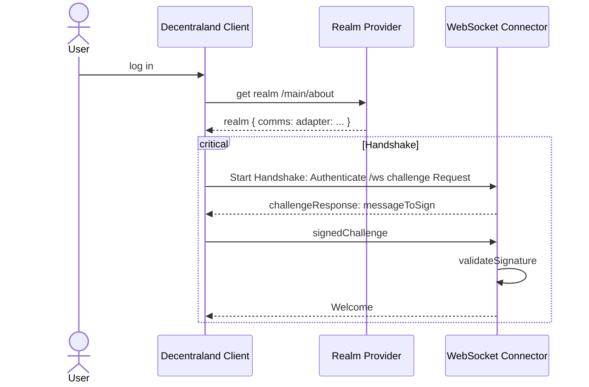
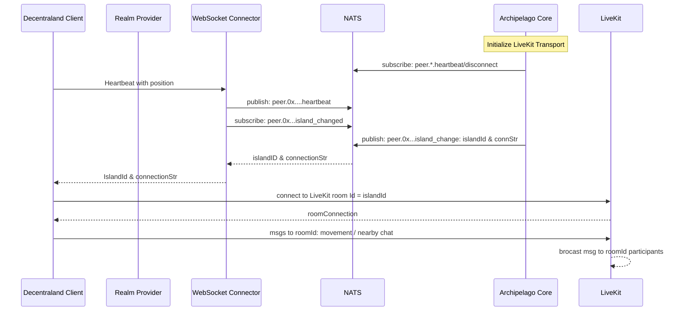
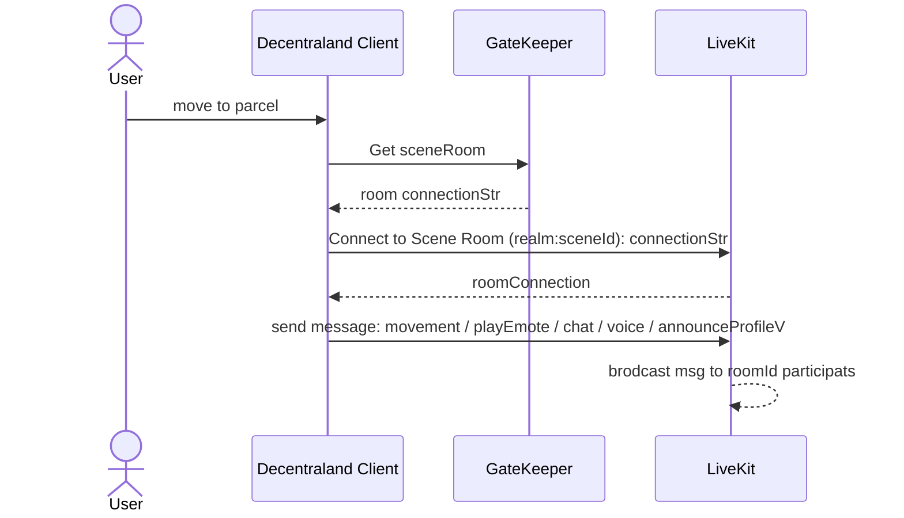

## Abstract

The current Decentraland client communication protocol effectively supports user scaling but has inherent design limitations that restrict certain functionalities in Genesis City, such as content casting for in-world streaming, serverless multiplayer experiences, and being able to handle scene-hosted events with speaker moderators. This ADR explores the architectural decisions behind a new communication protocol designed to overcome these limitations. 

## Context, Reach & Prioritization 
The new architecture, incompatible with the existing implementation ([comms-v3](https://github.com/decentraland/protocol/tree/main/proto/decentraland/kernel/comms/v3), [unity-renderer](https://github.com/decentraland/unity-renderer/tree/dev/browser-interface/packages/shared/comms)), will be deployed in a forthcoming client version and become the new standard.The objective is to incorporate the following functionalities without overburdening the client implementation with additional complexities, while maintaining the ability to stream the world and visualize users in surrounding areas. This entails:

- **Enable Content Casting**: Facilitate voice and video streaming in a scene, even when multiple clusters (islands) of users are present.
- **Authorization Management**: Empower scene owners or their authorized third parties to manage content casting and moderate voice chat accessibility within a scene.
- **Consistency**: Ensure consistent perception of avatars/users within a scene, including scene state, content casting, and proximity of avatars.
- **Scalability**: Retain a clustering mechanism to ensure efficient crowd management when islands reach maximum occupancy.
- **Message Handling**: Effectively manage the influx of messages received by peers within a cluster, preventing congestion and data transfer inefficiencies.
- **Uniform Communication Transport**: Maintain consistency across all environments (in-world, DCL editor, etc.) to ensure uniform features and behaviors.

## Decision

### Archipelago Background 
The communications system in Decentraland relies on the [Archipelago protocol](https://github.com/decentraland/archipelago-workers), which clusters users into `islands` based on their positions. An island is essentially a group of users, and the communication between them happens within this group. The islands are not static; they are dynamically recalculated in real time as users move.

To handle scalability, the Archipelago protocol allows islands to overlap when the user limit of an island is reached, ensuring that large groups of users in the same area are still supported. The maximum number of users per island can be adjusted to optimize client performance by balancing how many avatars the client can render without degrading rendering performance. The protocol uses several heuristics to manage island behavior—such as calculating the center of an island, assigning users to islands, creating new islands based on user distance from the center, shifting the island center as users move, and merging islands when necessary.

The Archipelago protocol scales efficiently due to its dynamic island calculations and users grouping, but a key limitation is that scenes have no direct authority over the communication channel. This prevents features like managing speaker permissions, streaming content to members of a cluster, or sharing metadata such as the states of objects within a scene. If scene-specific data were tied to the island, the island could shift its center to a different scene, leading to conflicts in data consistency or permissions, as the island's dynamic nature might affect scene control.

### Solution 

Maintain the current Archipelago implementation while establishing a new scene room connection specific to the active scene. The Archipelago channel should be reserved solely for receiving avatar positions, profile update notifications, and nearby chat messages with the objective to be able to interact with users beyond the limits of a scene. All communications, including voice chat, scene objects state, and streams, will be shared within the scene channel. 
This new model grants scene owners authority over the communication channel, allowing them to share content streams, share object states or handling speakers, providing a consistent experience for all users visiting the scene.

In the illustrated scenario, Peers 1, 2, and 3 are connected to the scene room `E1`. Additionally, Peer 1 establishes a connection to the island `I1`, while Peers 2 and 3 are linked to the island `I2`. This example serves as a simplified illustration. Users may be far apart within the same scene, but this aims to demonstrate that if a peer is at the edge of a scene, they will be able to see other players who are not within the scene but are within viewing range. On the other hand, the scene channel will be there to share consistent data among the visitors, like a stream of video on a texture or the state of an object like a door that can be opened or closed besides also sharing information about the users visiting the scene. 

The table below outlines the information that will be communicated through each channel.

| Protocol Messages| island           | scene-room        |
|------------------|------------------|------------------|
| Positions/Movements| ✅               | ✅               |
| Profile Events   | ✅               | ✅               |
| Voice            |                  | ✅               |
| Cast Stream      |                  | ✅               |
| Scene State      |                  | ✅               |
| Nerby Chat       | ✅               | ✅               |

#### Design Considerations 

The establishment of the connection with the island remains unchanged, as that portion of the protocol is the same. The key difference lies in the types of messages sent through the channel. To establish a connection with a scene-room, a new service called [Gatekeeper](https://github.com/decentraland/comms-gatekeeper/) will be introduced to manage token permissions for the transport layer ([LiveKit](https://livekit.io/)). Only one scene room can be active at a time, as a user can only be present in one scene at any given moment. The scene room operates similarly to the communication service implementation used in worlds, where each scene has its own dedicated room. The Gatekeeper service will also allow scene owners to create authorizations for users, which will be reflected in the LiveKit token. This capability will enable them to moderate voice interactions and data streams within the scene effectively.

- **[Realm Provider](https://github.com/decentraland/realm-provider/)**: This small service is responsible for delivering a realm description in accordance with [ADR-110](https://adr.decentraland.org/adr/ADR-110). It specifies the list of services required to connect to Decentraland and provides the communications adapter, which points to the Archipelago workers stack.
- **WebSocket connector**: Entry Point for the Communications Backend. This component exposes the WebSocket defined in the `commsAdapter` section of the realm description and in accordance with [ADR-180 Communication protocol](https://adr.decentraland.org/adr/ADR-180). Connected users send their positions through this channel and receive an Archipelago island ID to which they will be connected and the required settings to connect to the LiveKit room (transport) where the island messages will be exchanged with the cluster of users.
- **Core**: Implements all Archipelago heuristics to calculate and assign an island to a user based on their position.
- **Stats**: A service that exposes users' positions and islands to display realm statistics, providing insights into hot scenes and identifying where crowds are gathering.
- **[NATS](https://nats.io/)**: Message broker to exchange information between services. 

**Rom Limits**: The transport layer (LiveKit) does not impose a strict limit on the number of participants in a single room. The real constraint comes from the end user’s bandwidth and the client’s ability to process data efficiently to render nearby players. In Archipelago, islands are capped at a maximum of 100 players, a limitation originally introduced to prevent performance degradation when rendering large numbers of avatars simultaneously.
With the new implementation, clients will receive data from up to 100 players through Archipelago, but the scene room currently has no predefined limit. Clients are free to define rendering strategies and possible limits or optimizations, e.g. render the closest N users and dynamically adjusting based on proximity. 

## General Connection Flow 
The user logs into the platform, retrieves a realm description, and initiates a connection handshake with the backend. In parallel, the user establishes both the Archipelago connection and the scene connection to begin exchanging information with other users connected across different clusters.

## Sequence Diagram Breakdown 

#### 1. Handshake 

#### 2. Archipelago Island 

#### 3. Scene Room

## Protocol Messages  

The protocol messages for profiles, positions, and updates have been optimized for client performance, aiming to minimize data transmission through the channels. In this new implementation, profiles' data is no longer sent through the island and is instead retrieved from the Catalyst network. When a user updates their profile, a notification is sent, and the updated profile is downloaded from the servers. This approach ensures that avatar impersonation is prevented, as the signed profile is retrieved from a trusted Catalyst node.

TBD 

## Deadline

Date: TBD

## Consequences

- The protocol and architecture for the communication services will undergo significant changes with this implementation. This means that users connecting through clients built on the previous version of the protocol will not be able to interact with those using clients on this new version. 
- Voice chat will be routed through the scene room. If one user is on a road and another is on the floor, each in different scenes, they won’t be able to hear each other. This decision was made to give the scene owners the control over the voice chat on their scenes. 
- Duplicated messages, such as positions, profiles, and text chats, may be transmitted across both island and scene rooms. This can lead to inefficient data transfer; however, it can be optimized on the client side by adjusting the message frequency for each channel based on the number of active connections. This design trade-off was necessary to meet all the criteria and enable visualization and interaction with users both within the scene and near its boundaries.
- LiveKit rooms will be protected by a Gatekeeper, which will oversee token permissions, empowering scene owners to manage access within their environments effectively. This setup allows Decentraland Cast to connect seamlessly to scene rooms, enabling the sharing of streams and management of speakers.
- The scene room could become a bottleneck during periods of high user influx. To address this challenge, the system can scale by implementing broadcasting across multiple rooms, which will require design and rigorous testing to ensure effectiveness.
- The extensibility of this model supports new use cases. The cast application could evolve into a comprehensive show management system, facilitating the orchestration of events. Additionally, a new party-mode could be created through a dedicated channel via the Gatekeeper, enabling communication features within private user groups.