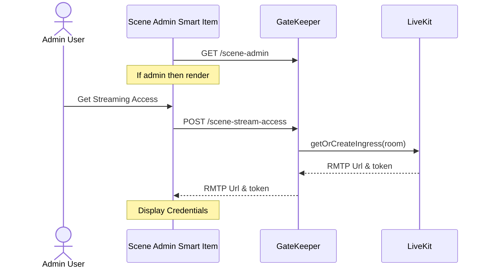
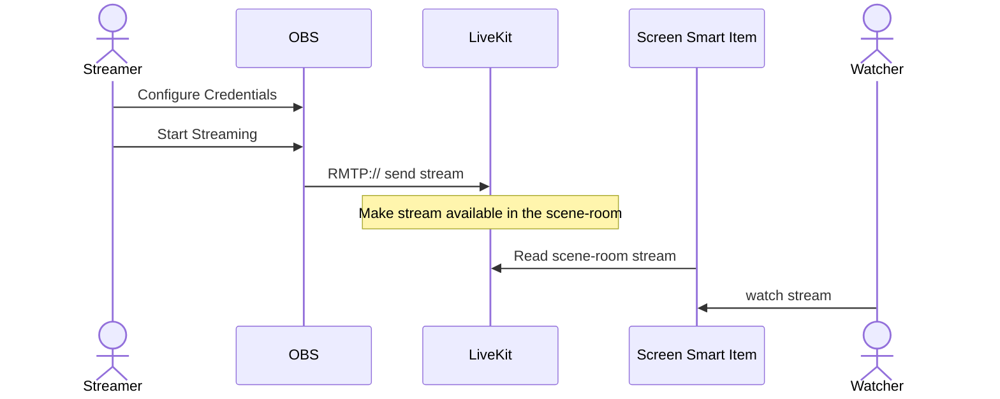

## Abstract

The current implementation of [Decentraland Cast](https://cast.decentraland.org/), which offers a Meet-like experience for streaming, presents several limitations that restrict accessibility and functionality for users. Primarily, it is confined to World scenes due to the old communications architecture, lacks support for the Decentraland Reference Client v2.0. Additionally, it is limited to the cast web application and does not integrate with widely used tools such as OBS, Zoom, or Streamyard that rely on RMTP protocol or m3u8 files. This document explores the new architecture necessary to enable streaming in Genesis City for all users, as well as support for RTMP protocol.

## Context, Reach & Prioritization 

Decentraland is a social platform where streaming for events plays a crucial role in enhancing social interactions within the ecosystem. LAND owners and creators should have the capability to not only broadcast audio and video streams to the screens in their scenes but also to moderate the audio to prevent disruptions during events. The new communications architecture introduces a communication channel tied directly to the scene (the scene-room), which means it can be governed by the authority of the LAND owner. This model empowers LAND owners with greater control over communications within their domain, allowing them to manage interactions effectively. It can be leveraged to publish streaming content and provide admin moderators to assist during live events. 

## Decision 

With the implementation of the new communications architecture outlined in [ADR-204](https://adr.decentraland.org/adr/ADR-204), a bounded scene communication channel has been established that can be used to broadcast streams to all users within the scene. Additionally, the introduction of the [scene admin smart item](https://decentraland.org/blog/announcements/decentraland-updates-fresh-features-and-fixes/#scene-admin-smart-item) empowers LAND owners and creators to appoint admins who can access a new user interface. This interface already provides controls for managing various elements, including videos playing, sending announcement messages, and activating other smart items.

By combining the scene communication channel with the scene admin smart item, this administration tool can be enhanced to not only manage video playback but also oversee streaming access to the scene. The transport layer, LiveKit, supports [Ingress](https://docs.livekit.io/home/ingress/overview/), which allows us to inject a stream into a LiveKit room using RTMP or m3u8 playlists. The scene admin smart item displays a UI only for users who are administrators of the scene. This administration panel can be used to reveal sensitive information, such as the Decentraland RTMP URL and access tokens required for streaming. The scene admins can share the RMTP credentials to external streamers to broadcast content using popular tools like OBS, Zoom, or any other RTMP-compatible or m3u8 streaming application. Finally, the Decentraland runtime will need to retrieve the stream from the LiveKit room and make it available for display on the corresponding scene texture so that all users present in the scene can enjoy it.

To implement this streaming architecture effectively, several workflows and implications must be addressed.

### Scene Admins

Initially, in the first version of the scene admin smart item, admins were stored in memory; however, they now need to be stored in a database within the comms-gatekeeper. As of today, the comms-gatekeeper is the ideal location for storing admin information, as it manages and validates access to the scene-rooms in LiveKit. Scene admins will have authority over the communication channel, enabling them to create streaming access and moderate user activity. 
A wallet will be recognized as the admin of a scene under specific conditions: 
- if the scene is a World and the wallet is the owner of the NAME where the world is deployed or if the owner of the NAME has granted streaming permissions to the wallet. 
- if the scene is located in Genesis City and the wallet owns the LAND, possesses LAND operator rights, has an active LAND rental contract, or has a LAND lease. 
Furthermore, a scene admin can grant admin access to a wallet for a specific scene where the granter has admin permissions.
The gatekeeper will provide the CRUD API for the scene Admins and perform all the required ownership validations. 

### Streaming Key 

In the first workflow, a scene admin enters a scene where they have admin permissions and generates the streaming keys to use or share with a streamer for publishing content via the RTMP protocol.

 

### Streaming Content 

Once an admin obtains the streaming credentials for RTMP, they can share these with the streamer. Below is an outline of how the streaming workflow would work:

### Streaming channel policies 

The streaming feature was specifically designed for hosting live events rather than playing online videos in an endless loop, as this would lead to inefficient use of network resources and the computing power required to process videos via the real-time messaging protocol when this can be done in other ways. To prevent misuse of the transport, bandwidth, and processing capabilities, policies are necessary regarding streaming keys and the maximum duration for streaming sessions. 

For context, each scene has a single streaming key, which serves as the access key to the scene room. All administrators have access to the streaming credentials and can refresh the token as needed. It is important to note that if the token has already been shared and is subsequently refreshed, the previous token will become invalid. 

- Streaming keys will expire four days after their creation. They are designed for use during events, and this expiration policy helps prevent orphaned keys from lingering in the system.

- A streaming session cannot last longer than four hours. This limitation is in place to avoid situations where a video or stream runs in an infinite loop. Streams can be started or stopped as needed, but no single session should exceed four hours in duration.

To keep users informed about important events, the Comms Gatekeeper—responsible for managing LiveKit and overseeing streaming keys—will be integrated into the notifications system. It will send notifications to all scene administrators in the following scenarios:

- When the streaming key has expired
- When the streaming key has been refreshed, rendering the previous version invalid
- When a streaming session begins within the scene

## Deadline

Date: TBD

## Consequences

This will introduce new functionality that enables seamless streaming of content into any scene through the available communication channel. Only the owners or their designated users will have the authority to manage streaming access, empowering them to control communications within their scenes. 

On the other hand, administrators will have all the essential tools needed to effectively moderate the event while remaining fully engaged in the experience without the need to jump to other applications. 