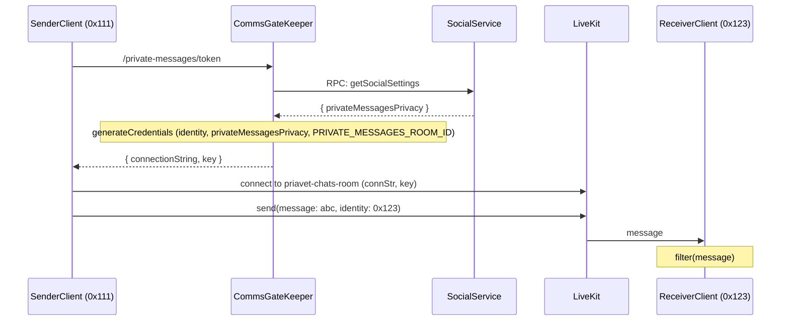

## Abstract

The implementation of new version of the Decentraland reference client does not integrate with the previous Matrix System, which was used for managing private chats and channels. Matrix has proven to be a costly solution, necessitating complex infrastructure deployment and the maintenance of a large database for relatively simple use cases. This ADR explores the development of a private chat system that utilizes the existing integration with LiveKit as the transport layer, relying on its Selective Forwarding Unit (SFU) to efficiently deliver messages to specific users.

## Context, Reach & Prioritization 

Decentraland is a real-time social platform, where a text chat system is essential for facilitating social interactions. This design is specifically tailored for live, real-time experiences rather than asynchronous, persistent communications.

## Decision 

LiveKit serves as the existing communications transport through which the client exchanges data packets and text messages between players. Its current limitation for `~nearby` chat lies in the boundries of the scene room and having a different connection for each scene. This limitation prevents players in different scenes who are friends from using the connection to send private messages to each other. While the ability to send text messages exists, what's missing is a persistent connection that remains intact despite user movement, allowing for continuous exchange of text messages.

The decision is to establish a new persistent connection specifically for private messaging between players. This connection will remain active regardless of whether users are connected to a particular archipelago island or scene room. Every user in Decentraland will have access to this LiveKit room connection, enabling any client to send messages to a target user. Messages in this room will always be directed to a specific user, identified by their wallet identity and the LiveKit SFU will be in charge of the rely of messages for the targeted user. 

To establish this new connection to the chat room, clients will utilize the comms gatekeeper service's new endpoint, `/private-messages/token`. This endpoint works similarly to `/get-scene-adapter`, requiring a signedFetch request. It will return a LiveKit connection string and token, enabling the specific user to connect to the private chat room. 

When a user enters a chat room, the [comms-gatekeeper](https://github.com/decentraland/comms-gatekeeper) queries the [Social Service](https://github.com/decentraland/social-service-ea/) for the user's privacy message settings. These settings are used to construct the user's metadata within the room, and they can only be modified through the comms-gatekeeper. If a user changes their privacy settings—such as switching to communicate only with friends—the Social Service notifies the comms-gatekeeper, prompting an update to the user's metadata. Consequently, if a conversation involves an unknown user, and they adjust their settings to restrict communication to friends, the social service updates this change, causing the recipient to perceive the user as disconnected.

### Client responsabilities: 

While the backend provides the infrastructure for connecting to the dedicated chat room, the client implementation carries the crucial task of maintaining one-to-one chat functionality and respecting user-defined social settings.

#### Send Messages 

**Targeted Messaging**: The client is responsible for sending private messages directly to a specified identity or wallet. LiveKit SFU will use this identity to deliver the message to the target user instead of broadcasting a message to the room. In case a message does not have a target users, LiveKit SFU will broadcast the messages to the entire room.

#### Receive Messages 

**Privacy Settings Management**: User privacy settings are controlled via the Social Service through an RPC call. These settings determine who is permitted to communicate with the user. There are two possible configurations: one allows private messages from any user on the platform, while the other restricts private messages to only those who are friends. On the other hand, social settings also have a flag to allow users to view messages received from blocked users but this is up to the client and it is not currently used. 

[Protocol Message: Social Setttings](https://github.com/decentraland/protocol/blob/ce7a4ebfc094f4764c5182b0e41d3ebc72e7a17d/proto/decentraland/social_service/v2/social_service_v2.proto#L237)
```message SocialSettings {
  PrivateMessagePrivacySetting private_messages_privacy = 1;
  BlockedUsersMessagesVisibilitySetting blocked_users_messages_visibility = 2;
}
```

**Message Filtering**: When messages are received, the client must filter them according to the user's privacy settings. If a message comes from a guest user and the recipient has configured their settings to accept messages only from friends, the message should be discarded. Since received messages do not specify a target field with the identity, it's not possible to determine if they were broadcasted or intentionally directed to the recipient. Therefore, the filter applies to all incoming messages based on the user's social settings. Even if a user manages to broadcast spam through the private chat room, it cannot be directly detected. The system must rely on social settings to decide whether a message should be displayed to the user or not.




> NOTE: To support friend, the client must maintain continuous communication with the social service to stay updated on friendship statuses and any changes. This includes actions such as a user blocking or unblocking another, or accepting or rejecting a friendship request. These updates, in combination with the privacy settings, will determine if messages are displayed to users.

As a chat system, this design presents certain flaws. By obtaining a user's identity, it becomes technically feasible to programmatically generate spam messages and send them to the private chat room. Additionally, messages from blocked users may still reach the target user client but must be discarded by the client itself. There is no control over the LiveKit SFU to provent these scenarios. However, from an implementation perspective, it's straightforward for the client to establish another LiveKit room connection, similar to how scene rooms are created ([ADR-204](https://adr.decentraland.org/adr/ADR-204)). This approach utilizes the existing protocol messages to facilitate private messaging and does not require new third-party or backend services, making it a lightweight implementation that can be further developed in the future as needed. 

## Deadline

Date: Q4 2025

## Consequences 

Private chat will be supported exclusively through this new model, with no persistence of chats in external systems like Matrix, which is set to be deprecated. This design is intended for real-time communication within the platform. While clients may implement caching strategies to display messages to users, no data will be stored server-side. Clients can utilize existing mechanisms to connect to LiveKit rooms and use the already implemented protocol messages to send private messages.