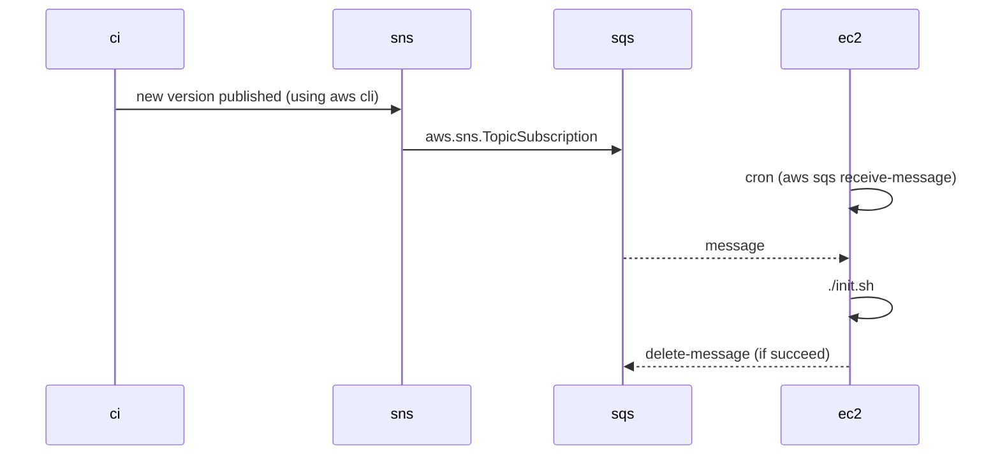

Since catalyst servers are bound to a persistent volumes, a deployment schema where we delete the machine and create another (new) one is not a viable choice without downtime.

Instead, we will use the catalyst-owner/init.sh script to update the current version in every machine. To know where to update we will create two SNS topics that will be redirected to SQS queues (one for each deployment):

- `arn:aws:sns:us-east-1:619079673649:decentraland-catalyst-stable-version` for stable and tagged releases (official versions)

- `arn:aws:sns:us-east-1:619079673649:decentraland-catalyst-latest-version` for master branch versions (dev)

Every deployment will have a 1 minute crontab to pull messages of its own SQS

1. Create an SNS topic to publish new versions of the catalysts

2. In each catalyst deployment (EC2)  

   1. create also an SQS

   2. subscribe that SQS to the SNS topic

   3. crontab to consume the SQS in each deployment

## Links

- Properly receive SQS messages with `aws cli` https://advancedweb.hu/how-to-use-the-aws-sqs-cli-to-receive-messages/

- Create SQS with pulumi https://www.pulumi.com/docs/reference/pkg/aws/sqs/queue/

- Subscribe SQS to SNS with pulumi: https://www.pulumi.com/docs/reference/pkg/aws/sns/topicsubscription/

