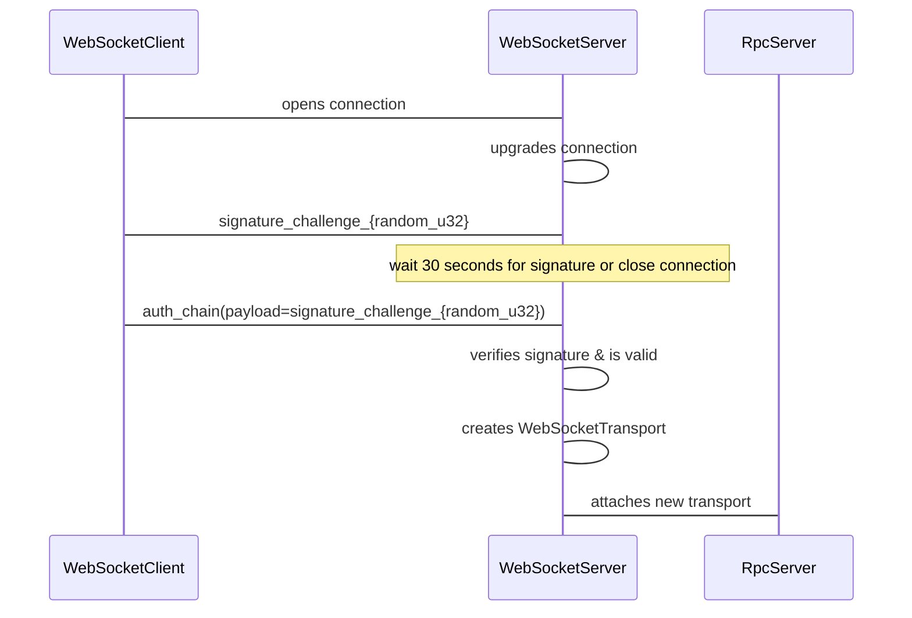
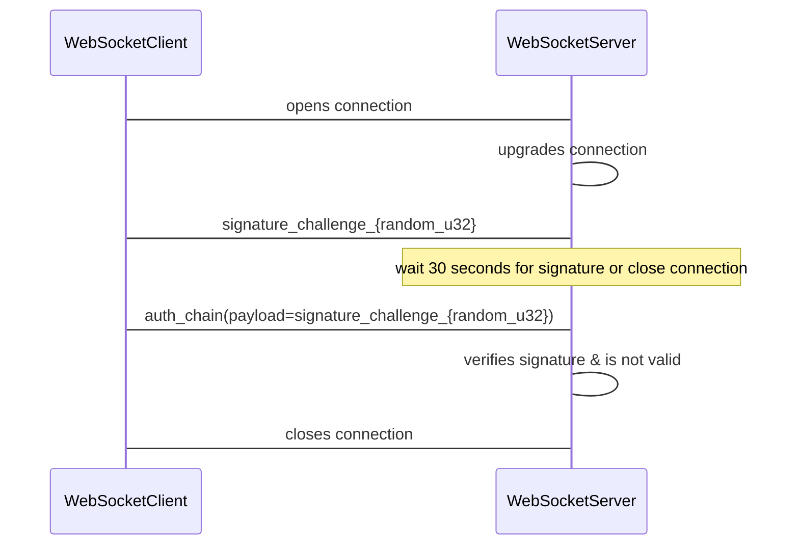

## Abstract

The objective of this document is to present the mechanism that the Quests RPC Service will use to authenticate their users.

The Quest RPC Service is the service that will be used in-world by scenes, and explorer to send events about user's progress, get state updates for each active quest, and get information about the quests that the user is involved. 

## Context, Reach & Prioritization

The Quest RPC Service needs a way to validate who is the user that is requesting to connect to the service in order to identify who is sending the events about progress on a quest or trying to subscribe to quests' updates. The transport protocol for the service is WebSockets. 

The Quest RPC Service will be requested by scenes and explorer as long as the user take part in a at least one quest. The way the service use to identify users to store the information about user's quests progress and relating this information to a user is by their Ethereum Address. 

The [Quest RPC Service](https://github.com/decentraland/quests/tree/main/crates/server/src/rpc) is written in Rust and using the [dcl-rpc](https://github.com/decentraland/rpc-rust) crate. 

## Specification

The solution proposed in this document is to use the [Decentraland's AuthChain concept](https://docs.decentraland.org/contributor/auth/authchain/), [dcl-crypto](https://github.com/decentraland/decentraland-crypto-rust) crate, and a signature challenge after the connection upgrading. 

Once the client opens the connection to the server, the server will send the signature challenge which consists of a text message with a random unsigned 32-bit number (`"signature_challenge_{random_u32}"`). Then, it will wait 30 seconds for the client to send a response back to the server. The client's response must be the [AuthChain](https://docs.decentraland.org/contributor/auth/authchain/) containing the signed sent signature challenge. If 30 seconds elapse without receiving the signature challenge or if the [AuthChain](https://docs.decentraland.org/contributor/auth/authchain/) signature of the message sent by the client is not a valid one, then the connection will be closed by the server. 

If the [AuthChain](https://docs.decentraland.org/contributor/auth/authchain/) signature is valid, then the server will create a [WebSocketTransport](https://docs.rs/dcl-rpc/latest/dcl_rpc/transports/index.html) and attach it to the [RpcServer](https://docs.rs/dcl-rpc/latest/dcl_rpc/server/index.html)

The happy-path of this solution is: 

The unhappy-path of this solution is: 

