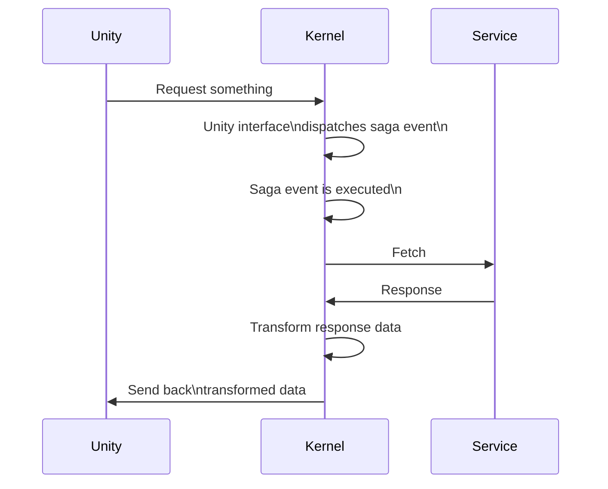
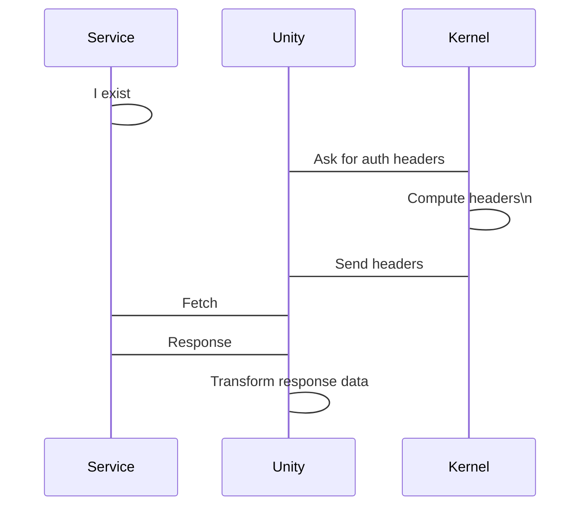

## Context and Problem Statement

As of today, kernel and unity have huge dependencies in business logic: sagas in TS, requests are made in TS, and everything is used from Unity.

That generates coupling between technologies and teams, generating blockers and planning problems.

## Current state

Currently, Kernel has the responsibilities of handling all the requests to outside services and the business logic that translates the request responses to some format that is palatable by Unity.

In a normal feature, this flow usually looks like this:



This flow is generally true for most of the sagas. 

## Proposed improvement

Some of the rationales of the current flow are:

- From Unity there's no support for signed requests
- From Unity there's no support for wallet interactions

It's argued that those features should still be supported from Kernel side,
but only through low level interfaces. If we do this, we could move most of the
sagas code to Unity and only delegate to kernel what can't be done due to wasm target limitations.

With this in mind, Kernel only responsibilities should be:

- Take care of the scenes SDK pipeline (workers, scene messages, etc)
- Provide a low level interface for ethereum interactions
- Provide a low level interface for the retrieval of signed headers 
- Provide a low level interface for catalyst, comms, the graph, etc. interactions
- Basically, anything that can't be done from Unity

In the current state, having to track down so much logic split in two projects and different languages raises the entry bar.

This new direction should give more ownership to the Unity team. Also, it will strongly streamline the onboarding for new contributors because more can be done with the Unity know-how, and Unity currently has the biggest number of contributors and codebase size of explorer.

### New flow example

From Unity's side, we should create a new layer of abstraction that sits behind our bridge classes.

```x-dot
digraph G {
    "Back-end requester" -> Bridge -> Feature
}
```

We should create one requester per feature type, and the naming and style of those classes should be unified. Keeping the Bridge interfaces should serve as adapter in case we need to change the requester or move some functionality back to kernel in a worst case scenario.

Let's explore how this would work fetching to the quest or builder nodes:



## Considered Options

* Continue as it is today

* Go for this proposal ✅

## Decision Outcome

* Go for this proposal ✅

### Actionables

- When starting development on new features, aim for this approach from the get-go
- Features that are already advanced in development or finished will be refactored gradually
- We will start by exposing signed requests and migrating the quests feature saga

New features for the ECS/SDK will have the common product process (RFC, roadmap, backlog, refinement). Alvaro will gather together the team when necessary to discuss implementation of new changes to the SDK.

CLI should be handled in the same way as the kernel and SDK developments.

## Participants

- Alvaro
- Brian
- Mendez
- Nico Chamo
