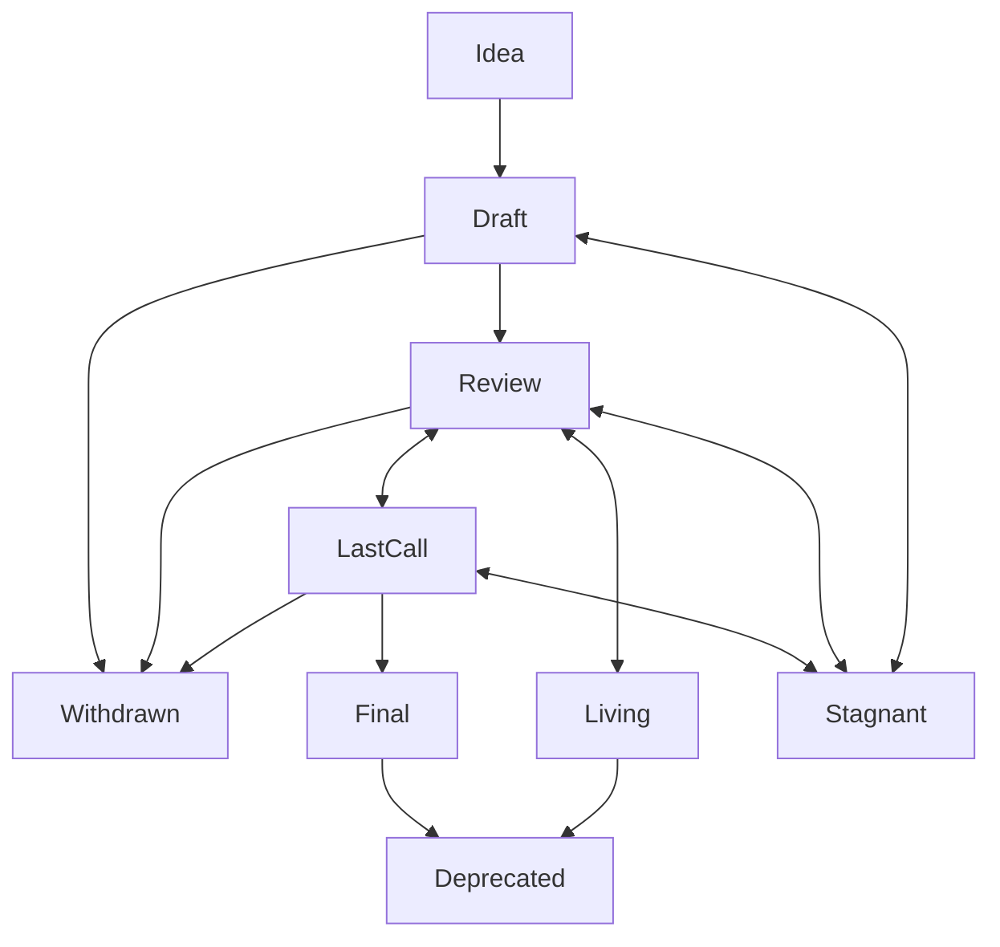

## Abstract

This ADR proposes introducing a new **Deprecated** status for ADRs that are no longer relevant due to changes in Decentraland’s architecture, protocol, clients, or feature set. The goal is to improve clarity by distinguishing between ADRs that were once implemented and valid but are now outdated, versus those that were never accepted or implemented.

## Context, Reach & Prioritization

Currently, the available status options include **Withdrawn** and **Stagnant**. However, these do not effectively communicate the state of ADRs that were once implemented but have since become obsolete due to changes in technology or product strategy.

The **Withdrawn** status implies that an ADR was abandoned or deemed incorrect before implementation, while **Stagnant** is used for ADRs that were never finalized or have been inactive for too long. Neither status accurately reflects the state of ADRs that were previously accepted and implemented but are now outdated.

Introducing a **Deprecated** status will:

- Clearly identify ADRs that have been rendered obsolete due to changes in protocol or feature sets.
- Preserve the historical context of past decisions while indicating that they are no longer applicable.
- Reduce confusion among developers and stakeholders regarding the current relevance of ADRs.

## Solution Space Exploration

### Option 1: Continue Using the Existing Statuses
- **Pros**: No change to the current workflow.
- **Cons**: Does not address the confusion between ADRs that were valid but are now outdated versus those that were never fully accepted.

### Option 2: Introduce a New **Deprecated** Status (Chosen Solution)
- **Pros**: Provides clear differentiation between ADRs that were previously implemented and those that were abandoned. Enhances clarity in documentation.
- **Cons**: Requires updating existing ADRs and adding a new status to the lifecycle.

### Chosen Solution

Introduce a new **Deprecated** status for ADRs that are no longer relevant but were once actively used and implemented.

## Specification

### Updated ADR States



The full list of ADR states will now include:

- **Idea**: An idea that is pre-draft, not tracked in the ADR repository.
- **Draft**: The first formally tracked stage of an ADR in development.
- **Review**: The ADR is ready for peer review.
- **Last Call**: Final review window before the ADR is marked as Final.
- **Final**: The ADR is accepted as a standard and is in use.
- **Stagnant**: ADRs that are inactive for over 6 months in Draft, Review, or Last Call.
- **Withdrawn**: The ADR was abandoned or rejected and will not be pursued further.
- **Living**: The ADR is designed to be continually updated and does not reach finality (e.g., ADR-1).
- **Deprecated**: The ADR was once Final and implemented but is now outdated or no longer relevant due to protocol changes.

### Deprecated State Requirements

- An ADR marked as **Deprecated** MUST include a **Deprecation Reason** section explaining why it is no longer relevant.
- If applicable, it should provide links to newer ADRs that supersede it.

### Example Deprecation Notice

```markdown
**Notice**: This ADR has been marked as **Deprecated** as of 2024-11-15 due to the deprecation of the old Decentraland client. Refer to [ADR-123: Updated Client Architecture](/adr/ADR-123) for more information.
