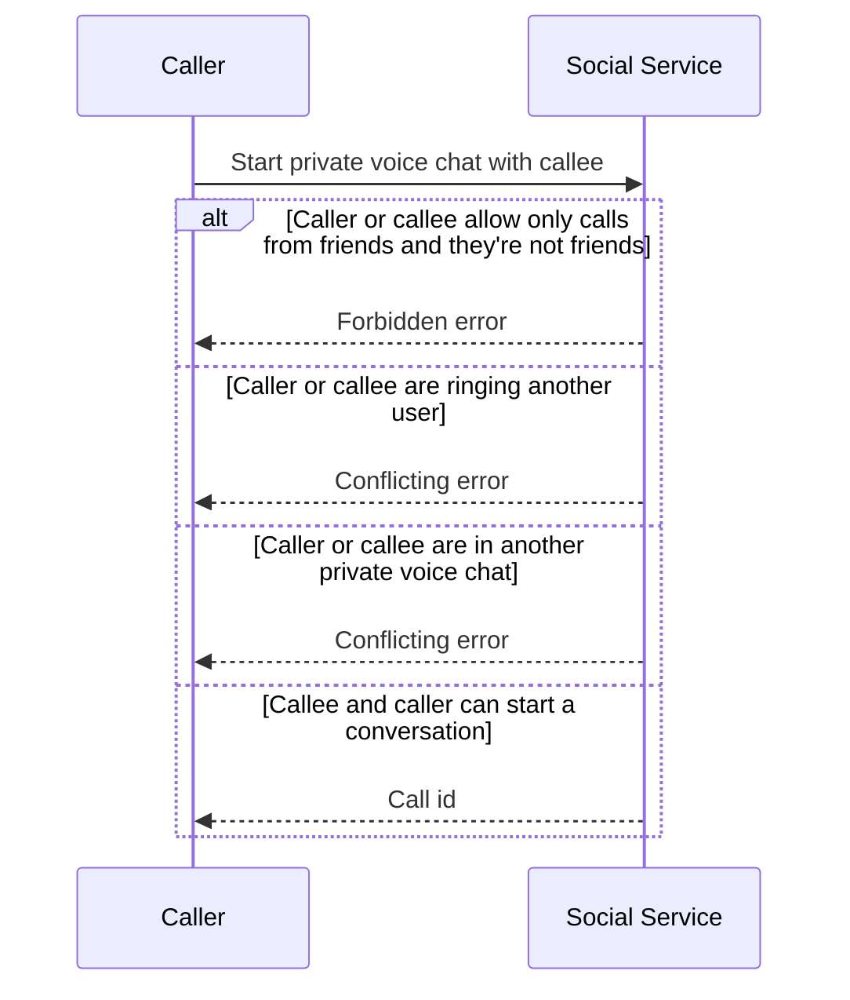
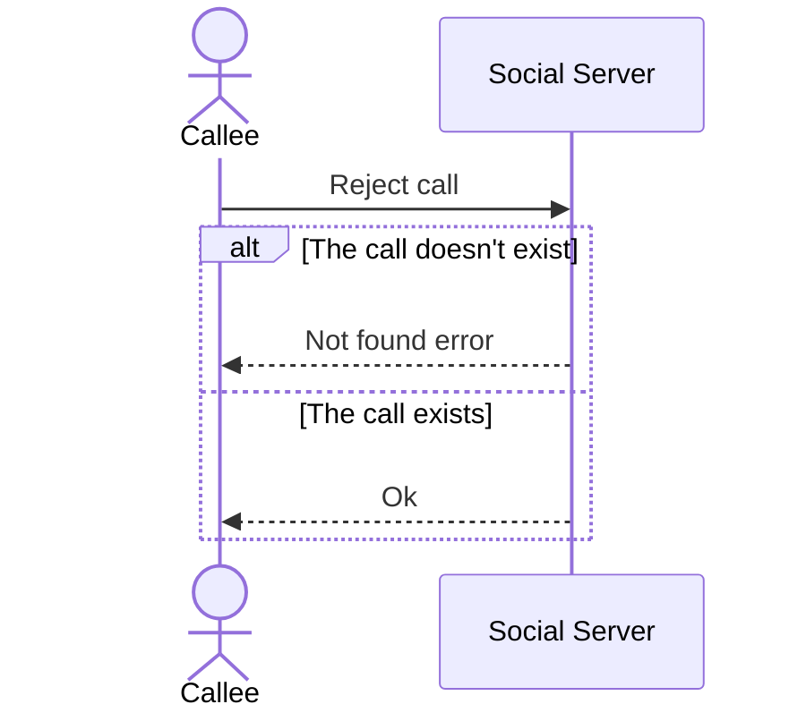
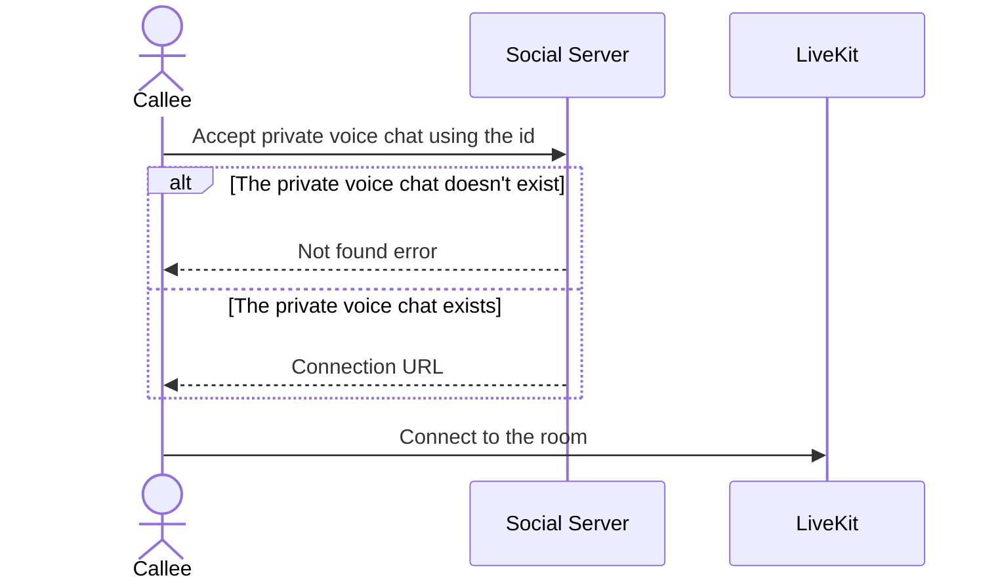
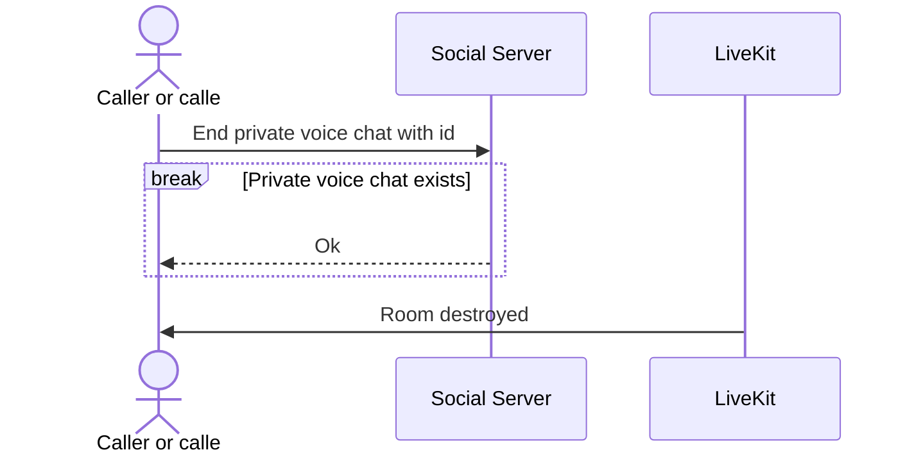
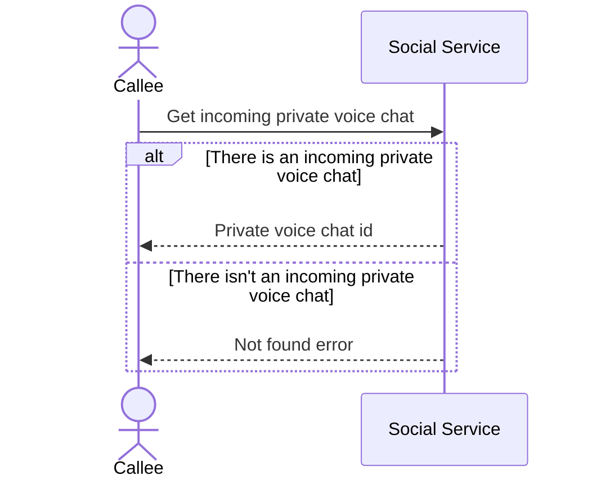
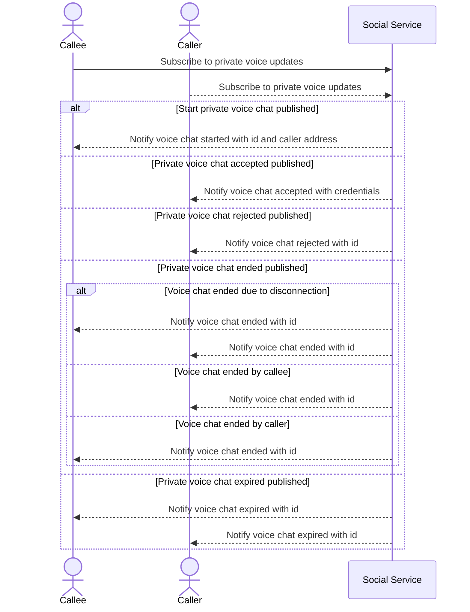

## Abstract

This specification defines the private voice chat protocol, designed to provide voice communication between two users in the Explorer, simulating a two person call.

## Context

After having had the voice chat for nearby users in previous versions of Decentraland, the need of having private voice conversations between users was identified as an important feature.

In this new feature, a user (now on called the **caller**) is able to ring another user (from now on the **callee**), which initiates the call flow.
The callee has the capability of rejecting this call or accepting it and the caller can cancel the process at any time.
If the callee chooses to reject it or the caller cancels it, the ringing process will end, notifying the caller about the decision the callee made.
Case contrary, by accepting the call, the callee and the caller will both receive tokens to connect to the real time service that will facilitate the call ([LiveKit](https://livekit.io/) at the time of this ADR).
Both users can end the call at any time, which will result in the other user being disconnected from the call.

The feature considers a some restrictions, with the aim to improve the user experience, that need to be enforced:

- A user can't participate in more than one private voice chat simultaneously.
- A user can't be ringing or receiving a call from multiple users simultaneously.
- A user can't start a private voice chat with another user if at least one of them has their privacy settings set to _only friends_ and they are not friends.
- A user can't be initiate a call or receive a call from be someone if they're not connected.

Following the user restrictions mentioned above, there are some restrictions for the voice chat that are required to be enforced as well:

- A ringing private voice chat can't be ringing for an indeterminate amount of time, they must be expired.
- A private voice chat where one of the users didn't connect for an expected amount of time must not exist
- A private voice chat where one of the users disconnected, due to connectivity issues, for an expected amount of time must not exist
- A private voice chat where one of the users disconnected willingly must not exist.

All of these restrictions are enforced either through the Social Services or the Comms Gatekeeper, through private voice chat updates or through LiveKit actions respectively.

## Specification

This section specifies the interaction between the Explorer and the Social Service for the purposes of ringing someone, receiving voice chat updates and using LiveKit for
the real time voice communication interactions.

### Starting a private voice chat

Starting a private voice chat is done by performing the `StartPrivateVoiceChat` RPC call with the callee address to the Social Service.
If the start process is successful, that is, it complies with the requirements mentioned in the _Context_ section, the ringing process is started.

It must be taken into consideration that this is an asynchronous flow, meaning that if the start process is successful, it will return immediately with a call id.
This call ID can be used to identify the call and end it (if the user wants to). The callee will be notified through the updates subscription mechanism mentioned in the _Subscribing private voice chats updates_ section.

Here's the interaction flow of the Explorer and the Social Service:



The RPC call is specified in the protocol as:

```protobuf
message StartPrivateVoiceChatPayload {
  User callee = 1;
}

message StartPrivateVoiceChatResponse {
  message Ok {
    string call_id = 1;
  }

  oneof response {
    Ok ok = 1;
    InternalServerError internal_server_error = 2;
    ConflictingError conflicting_error = 4;
    ForbiddenError forbidden_error = 5;
  }
}

rpc StartPrivateVoiceChat(StartPrivateVoiceChatPayload) returns (StartPrivateVoiceChatResponse) {}
```

### Rejecting a private voice chat

Rejecting a private voice chat is done by performing the `RejectPrivateVoiceChat` RPC call to the Social Service with the call id of the ringing voice chat.
If successful, it will return without errors and will end the ringing process. The caller will be notified through the updates subscription mechanism mentioned in the _Subscribing private voice chats updates_ section.

Here's the interaction flow of the Explorer and the Social Service:



The RPC call is specified in the protocol as:

```protobuf
message RejectPrivateVoiceChatPayload {
  string call_id = 1;
}

message RejectPrivateVoiceChatResponse {
  message Ok {
    string call_id = 1;
  }

  oneof response {
    Ok ok = 1;
    InternalServerError internal_server_error = 2;
    NotFoundError not_found = 4;
  }
}

rpc RejectPrivateVoiceChat(RejectPrivateVoiceChatPayload) returns (RejectPrivateVoiceChatResponse) {}
```

### Accepting a private voice chat

Accepting a private voice chat is done by performing the `AcceptPrivateVoiceChat` RPC call to the Social Service with the call id of the ringing voice chat.
If successful, it will return return the connection url, which is crafted using the LiveKit connection URL and the token to connect to the LiveKit room.
Case contrary, the voice chat must be finished in the client, as this means that the voice chat was either expired or cancelled.

This process will result in the caller will be notified through the updates subscription mechanism mentioned in the _Subscribing private voice chats updates_ section with the connection URL as well.

Upon receiving the connection URL, the client must connect to the LiveKit room using any implementation of the LiveKit's client. To communicate via voice, users must publish audio tracks in the room and process the audio tracks for which they're already subscribed. Check the [LiveKit's documentation](https://docs.livekit.io/home/) on how to do this.

Here's the interaction flow of the Explorer and the Social Service:



The RPC call is specified in the protocol as:

```protobuf
message AcceptPrivateVoiceChatPayload {
  string call_id = 1;
}

message AcceptPrivateVoiceChatResponse {
  message Ok {
    string call_id = 1;
    PrivateVoiceChatCredentials credentials = 2;
  }

  oneof response {
    Ok ok = 1;
    InternalServerError internal_server_error = 2;
    NotFoundError not_found = 4;
    ForbiddenError forbidden_error = 5;
  }
}

rpc AcceptPrivateVoiceChat(AcceptPrivateVoiceChatPayload) returns (AcceptPrivateVoiceChatResponse) {}
```

### Ending a private voice chat

Ending a private voice chat can be done through the Social Service in any of their states (ringing or on going) or through LiveKit if the user is already on an on going private voice chat.

#### Ending a private voice chat through the Social Service

Ending a private voice chat is done by performing the `EndPrivateVoiceChat` RPC call with the call id of the voice chat.
A voice chat can be ended at any state by any of the participants, but the callee should use the reject operation if they want to reject a private voice chat.
This process will result in the caller will be notified through the updates subscription mechanism mentioned in the _Subscribing private voice chats updates_ section with the call id that is being terminated.

This RPC call can be used in two different states of a private voice chat:

1. The voice chat is in the ringing state.
2. The user is in an on going private voice chat (connected to LiveKit).

For each of these states the client must react to them in the following way:

- In the first case, the ringing process must be ended.
- In the second case, the voice chat must be ended by issuing a voluntarily disconnection from LiveKit.

Here's the interaction flow of the Explorer and the Social Service:



```protobuf
message EndPrivateVoiceChatPayload {
  string call_id = 1;
}

message EndPrivateVoiceChatResponse {
  message Ok {
    string call_id = 1;
  }

  oneof response {
    Ok ok = 1;
    InternalServerError internal_server_error = 2;
    NotFoundError not_found = 3;
  }
}

rpc EndPrivateVoiceChat(EndPrivateVoiceChatPayload) returns (EndPrivateVoiceChatResponse) {}
```

#### Ending a private voice chat through LiveKit

An on going LiveKit private voice chat can be ended by issuing a voluntarily disconnection from the room.
This action is monitored by our services and will result in the LiveKit room being destroyed.

The client must be listening to the LiveKit room events to detect the disconnection reaction.
In this case, the reason for the disconnection will be set as the destruction of the room, which the client must treat as the end of the private voice chat.

### Getting incoming private voice chats

At least for now, we can't know if a user is connecter or not to the Social Service, therefore we can't strictly enforce the requirement to prevent users from starting private voice chats with disconnected users.
To circumvent this issue, the Explorer must request the client for any incoming private voice chats the user has when connecting to the Social Service.
This call is done through the `GetIncomingPrivateVoiceChatRequest` RPC call.

Here's the interaction flow of the Explorer and the Social Service:



The RPC call is specified in the protocol as:

```protobuf
message GetIncomingPrivateVoiceChatRequestResponse {
  message Ok {
    User caller = 1;
    string call_id = 2;
  }

  oneof response {
    Ok ok = 1;
    NotFoundError not_found = 2;
    InternalServerError internal_server_error = 3;
  }
}

rpc GetIncomingPrivateVoiceChatRequest(google.protobuf.Empty) returns (GetIncomingPrivateVoiceChatRequestResponse) {}
```

### Subscribing private voice chats updates

Subscribing to the private voice chats updates stream is critical for the voice chat flow to work.
This subscription is done by performing the `SubscribeToPrivateVoiceChatUpdates` RPC call to the Social Service.
Both the callee and the caller need to be subscribed. We recommend this subscription to be done upon connecting to the client.

Here's the interaction flow of the Explorer and the Social Service:



Each update implies performing a different action, here is an explanation on how to act upon receiving them:

- **Voice chat started**: A caller started a conversation with the user. Start the ringing process in the client by using the address of the caller retrieved from the update and store the call id in case the user decides to reject or accept the private voice chat.
- **Private voice chat accepted**: The callee accepted the private voice chat. Check that the call id coming with the update belongs to the private voice chat the caller created and then, connect to the LiveKit room using the connection url which comes with the update as well.
- **Private voice chat ended**: The caller or the callee ended the private voice chat. If the user is connected to LiveKit, issue a disconnection and end the voice chat. If the user has not connected yet, end the ringing process. This update can come from the intentional process of ending a call or from any of the users disconnecting from the Social Service.
- **Private voice chat expired**: The callee didn't answer the voice chat request. End the ringing process in the client.

The RPC call is specified in the protocol as:

```protobuf
message PrivateVoiceChatUpdate {
  string call_id = 1;
  PrivateVoiceChatStatus status = 2;
  optional User caller = 3;
  optional User callee = 4;
  optional PrivateVoiceChatCredentials credentials = 5;
}

rpc SubscribeToPrivateVoiceChatUpdates(google.protobuf.Empty) returns (stream PrivateVoiceChatUpdate) {}
```

### Recovering from a disconnection

Any user connected to a LiveKit room can experience an abrupt disconnection due to connectivity issues.
Our services will be monitoring the connection and disconnection of users from rooms.
If a user were to be abruptly disconnected from the room as wasn't able to re-connect for a period of time, our service will issue the room to destroyed.
Any users in the room will be disconnected with the room destroyed reason, which they must handle and act upon it, ending the voice chat.

## RFC 2119 and RFC 8174

> The key words "MUST", "MUST NOT", "REQUIRED", "SHALL", "SHALL NOT", "SHOULD", "SHOULD NOT", "RECOMMENDED", "NOT RECOMMENDED", "MAY", and "OPTIONAL" in this document are to be interpreted as described in RFC 2119 and RFC 8174.
