## Abstract

This specification defines the updated friend request protocol for Decentraland,
replacing the previous implementation described in
[ADR-137](https://adr.decentraland.org/adr/ADR-137-new-friend-request.md).
The new protocol leverages the existing Social Service infrastructure and follows
the established patterns for real-time communication, providing a more robust and
maintainable solution for managing friendship relationships between users.

## Context

The original friend request implementation described in ADR-137 was designed to work
with Matrix as the underlying communication system. However, as outlined in
[ADR-208](https://adr.decentraland.org/adr/ADR-208-private-chat.md), Decentraland
has moved away from Matrix due to its complexity and cost. The current Social
Service implementation provides a more efficient and scalable solution for managing
social interactions.

This updated protocol leverages the existing Social Service infrastructure, which
already handles friendship management through the `UpsertFriendship` RPC call and
real-time updates via WebSocket subscriptions. The implementation follows the same
patterns established for private voice chats in
[ADR-284](https://adr.decentraland.org/adr/ADR-284-private-voice-chat.md).

## Specification

This section specifies the interaction between the Explorer and the Social Service
for managing friend requests, following the established patterns for real-time
communication.

### Sending a Friend Request

Sending a friend request is done by performing the `UpsertFriendship` RPC call with
the `request` action to the Social Service. The request includes the target user's
address and an optional message.

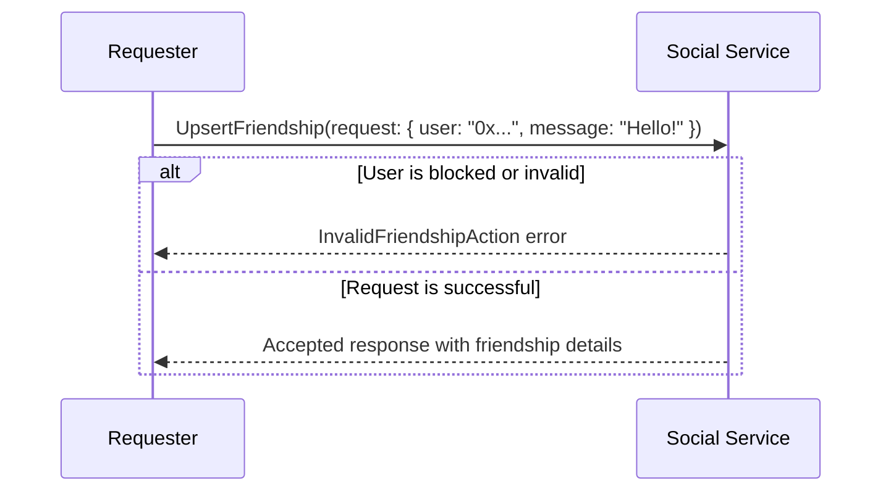

The RPC call is specified in the protocol as:

```protobuf
message UpsertFriendshipPayload {
  message RequestPayload {
    User user = 1;
    optional string message = 3;
  }

  oneof action {
    RequestPayload request = 1;
    AcceptPayload accept = 2;
    RejectPayload reject = 4;
    DeletePayload delete = 5;
    CancelPayload cancel = 6;
  }
}

message UpsertFriendshipResponse {
  message Accepted {
    string id = 1;
    int64 created_at = 2;
    FriendProfile friend = 3;
    optional string message = 4;
  }

  oneof response {
    Accepted accepted = 1;
    InvalidFriendshipAction invalid_friendship_action = 2;
    InternalServerError internal_server_error = 3;
    InvalidRequest invalid_request = 4;
  }
}

rpc UpsertFriendship(UpsertFriendshipPayload) returns
(UpsertFriendshipResponse) {}
```

### Accepting a Friend Request

Accepting a friend request is done by performing the `UpsertFriendship` RPC call
with the `accept` action to the Social Service with the requester's address.

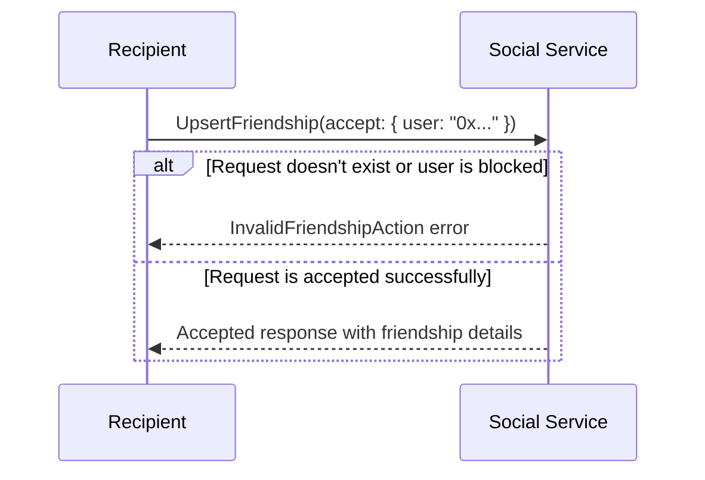

### Rejecting a Friend Request

Rejecting a friend request is done by performing the `UpsertFriendship` RPC call
with the `reject` action to the Social Service with the requester's address.

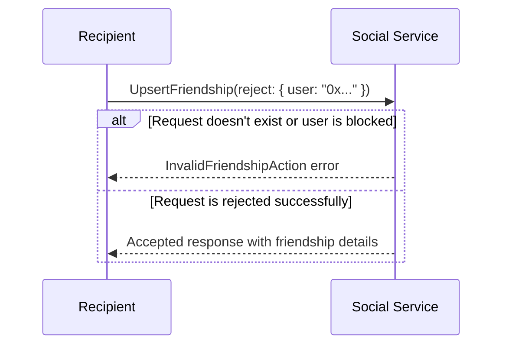

### Canceling a Friend Request

Canceling a sent friend request is done by performing the `UpsertFriendship` RPC
call with the `cancel` action to the Social Service with the recipient's address.

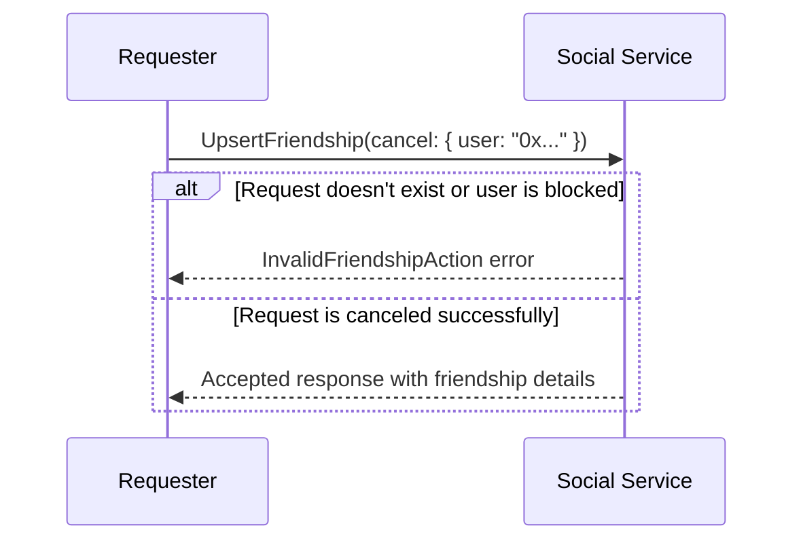

### Deleting a Friendship

Deleting an existing friendship is done by performing the `UpsertFriendship` RPC
call with the `delete` action to the Social Service with the friend's address.

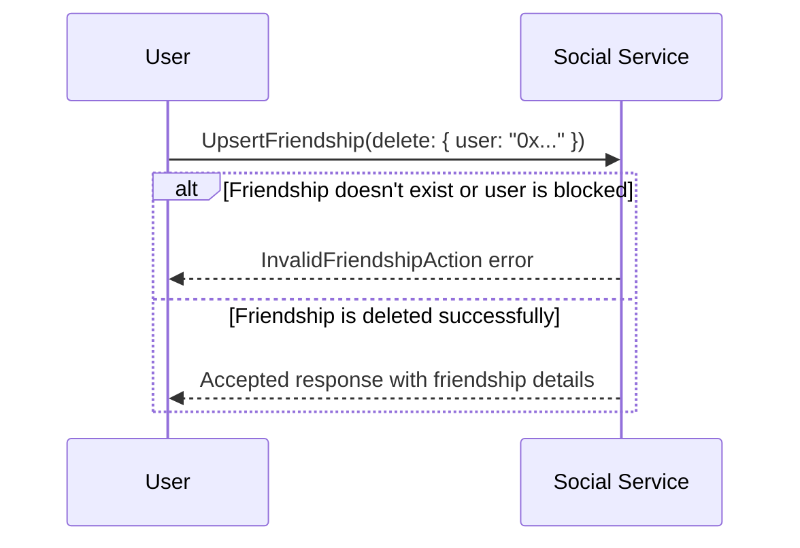

### Getting Friend Requests

Retrieving pending friend requests is done through separate RPC calls for sent and
received requests.

#### Getting Pending Friend Requests

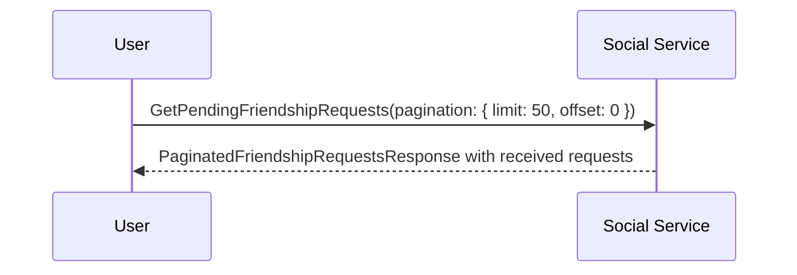

```protobuf
message GetFriendshipRequestsPayload {
  optional Pagination pagination = 1;
}

message PaginatedFriendshipRequestsResponse {
  oneof response {
    FriendshipRequests requests = 1;
    InternalServerError internal_server_error = 2;
  }
  optional PaginatedResponse pagination_data = 3;
}

rpc GetPendingFriendshipRequests(GetFriendshipRequestsPayload) returns
(PaginatedFriendshipRequestsResponse) {}
```

#### Getting Sent Friend Requests

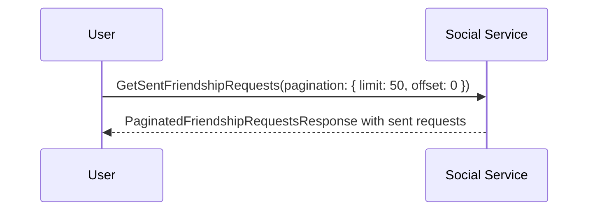

```protobuf
rpc GetSentFriendshipRequests(GetFriendshipRequestsPayload) returns
(PaginatedFriendshipRequestsResponse) {}
```

### Getting Friendship Status

Checking the friendship status between two users is done by performing the
`GetFriendshipStatus` RPC call.

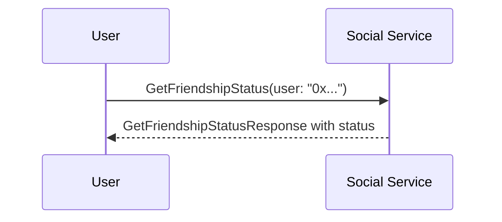

```protobuf
message GetFriendshipStatusPayload {
  User user = 1;
}

enum FriendshipStatus {
  REQUEST_SENT = 0;
  REQUEST_RECEIVED = 1;
  CANCELED = 2;
  ACCEPTED = 3;
  REJECTED = 4;
  DELETED = 5;
  BLOCKED = 6;
  NONE = 7;
  BLOCKED_BY = 8;
}

message GetFriendshipStatusResponse {
  message Ok {
    FriendshipStatus status = 1;
    optional string message = 2;
  }

  oneof response {
    Ok accepted = 1;
    InternalServerError internal_server_error = 2;
    InvalidRequest invalid_request = 3;
  }
}

rpc GetFriendshipStatus(GetFriendshipStatusPayload) returns
(GetFriendshipStatusResponse) {}
```

### Subscribing to Friendship Updates

Subscribing to friendship updates is critical for real-time friend request
management. This subscription is done by performing the
`SubscribeToFriendshipUpdates` RPC call to the Social Service.

```mermaid
sequenceDiagram
  participant U1 as User 1
  participant U2 as User 2
  participant SS as Social Service

  U1->>SS: Subscribe to friendship updates
  U2->>SS: Subscribe to friendship updates

  alt Friend request sent
    SS-->>U2: FriendshipUpdate(request: {
        friend: {...},
        created_at: 123,
        message: "Hello!",
        id: "...",
        status: REQUEST_SENT
    })
  else Friend request accepted
    SS-->>U1: FriendshipUpdate(accept: { user: "0x..." })
  else Friend request rejected
    SS-->>U1: FriendshipUpdate(reject: { user: "0x..." })
  else Friend request canceled
    SS-->>U2: FriendshipUpdate(cancel: { user: "0x..." })
  else Friendship deleted
    SS-->>U1: FriendshipUpdate(delete: { user: "0x..." })
    SS-->>U2: FriendshipUpdate(delete: { user: "0x..." })
  else User blocked
    SS-->>U1: FriendshipUpdate(block: { user: "0x..." })
    SS-->>U2: FriendshipUpdate(block: { user: "0x..." })
  end
```

```protobuf
message FriendshipUpdate {
  message RequestResponse {
    FriendProfile friend = 1;
    int64 created_at = 2;
    optional string message = 3;
    string id = 4;
  }
  message AcceptResponse { User user = 1; }
  message RejectResponse { User user = 1; }
  message DeleteResponse { User user = 1; }
  message CancelResponse { User user = 1; }
  message BlockResponse { User user = 1; }

  oneof update {
    RequestResponse request = 1;
    AcceptResponse accept = 2;
    RejectResponse reject = 3;
    DeleteResponse delete = 4;
    CancelResponse cancel = 5;
    BlockResponse block = 6;
  }
}

rpc SubscribeToFriendshipUpdates(google.protobuf.Empty) returns
(stream FriendshipUpdate) {}
```

### Blocking and Unblocking Users

The protocol also supports blocking and unblocking users, which affects friend
request functionality.

#### Blocking a User

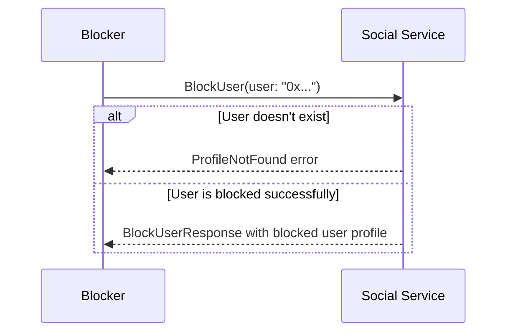

```protobuf
message BlockUserPayload {
  User user = 1;
}

message BlockUserResponse {
  message Ok {
    BlockedUserProfile profile = 1;
  }

  oneof response {
    Ok ok = 1;
    InternalServerError internal_server_error = 2;
    InvalidRequest invalid_request = 3;
    ProfileNotFound profile_not_found = 4;
  }
}

rpc BlockUser(BlockUserPayload) returns (BlockUserResponse) {}
```

#### Unblocking a User

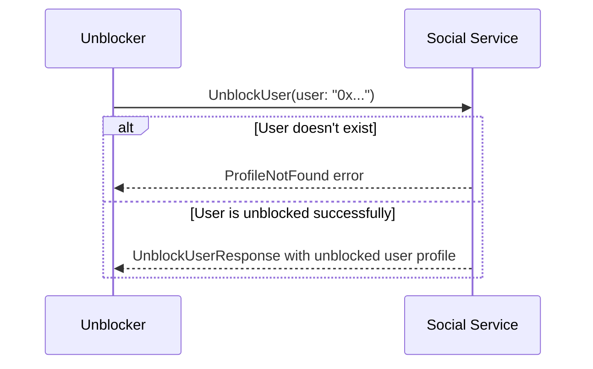

```protobuf
message UnblockUserPayload {
  User user = 1;
}

message UnblockUserResponse {
  message Ok {
    BlockedUserProfile profile = 1;
  }

  oneof response {
    Ok ok = 1;
    InternalServerError internal_server_error = 2;
    InvalidRequest invalid_request = 3;
    ProfileNotFound profile_not_found = 4;
  }
}

rpc UnblockUser(UnblockUserPayload) returns (UnblockUserResponse) {}
```

#### Subscribing to Block Updates

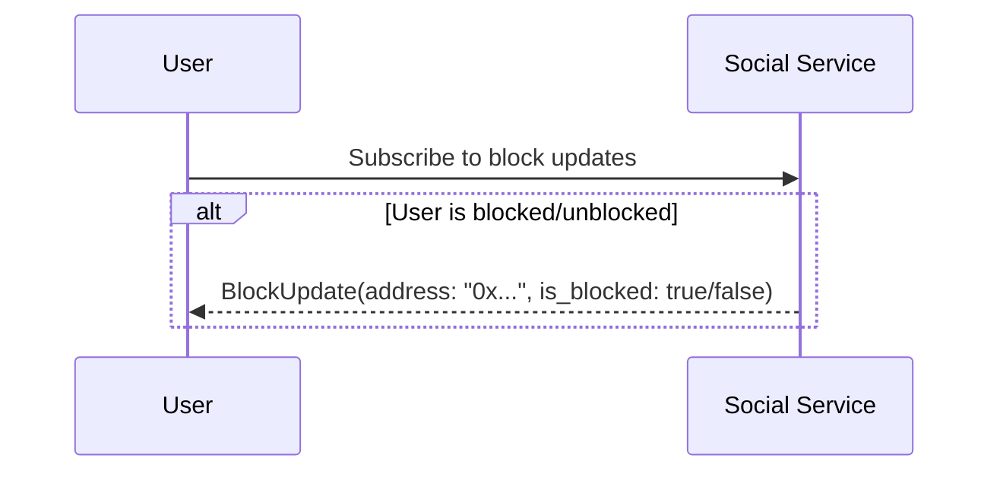

```protobuf
message BlockUpdate {
  string address = 1;
  bool is_blocked = 2;
}

rpc SubscribeToBlockUpdates(google.protobuf.Empty) returns
(stream BlockUpdate) {}
```

## Client Responsibilities

The client implementation carries the crucial task of maintaining friend request
functionality and respecting user-defined social settings.

### Real-time Updates Management

The client must maintain a subscription to friendship updates to receive real-time
notifications about friend request changes. This subscription should be established
upon connecting to the Social Service and maintained throughout the session.

### Error Handling

The client must handle various error scenarios gracefully:

- **InvalidFriendshipAction**: Display appropriate error messages when friendship
  actions are not allowed (e.g., blocked users, invalid requests)
- **InternalServerError**: Implement retry logic for server errors
- **InvalidRequest**: Validate input data before sending requests
- **ProfileNotFound**: Handle cases where target users don't exist

### State Management

The client must maintain local state for:

- Pending friend requests (both sent and received)
- Current friends list
- Blocked users list
- Friendship status with other users

### Privacy Settings Integration

The client must respect user privacy settings when displaying friend requests and
managing friendships. This includes:

- Filtering blocked users from friend request lists
- Preventing actions with blocked users
- Respecting privacy settings for private messages (as defined in ADR-208)

## Migration from ADR-137

This updated protocol replaces the previous implementation described in ADR-137.
Key changes include:

1. **Unified RPC Interface**: All friendship actions now use the `UpsertFriendship`
   RPC call with different action types
2. **Real-time Updates**: WebSocket-based subscription system replaces the previous
   notification mechanism
3. **Enhanced Error Handling**: More specific error types and better error handling
4. **Blocking Support**: Integrated blocking functionality that affects friend
   request behavior
5. **Privacy Integration**: Better integration with privacy settings and social
   features

## RFC 2119 and RFC 8174

> The key words "MUST", "MUST NOT", "REQUIRED", "SHALL", "SHALL NOT",
> "SHOULD", "SHOULD NOT", "RECOMMENDED", "NOT RECOMMENDED", "MAY", and
> "OPTIONAL" in this document are to be interpreted as described in RFC 2119
> and RFC 8174.
