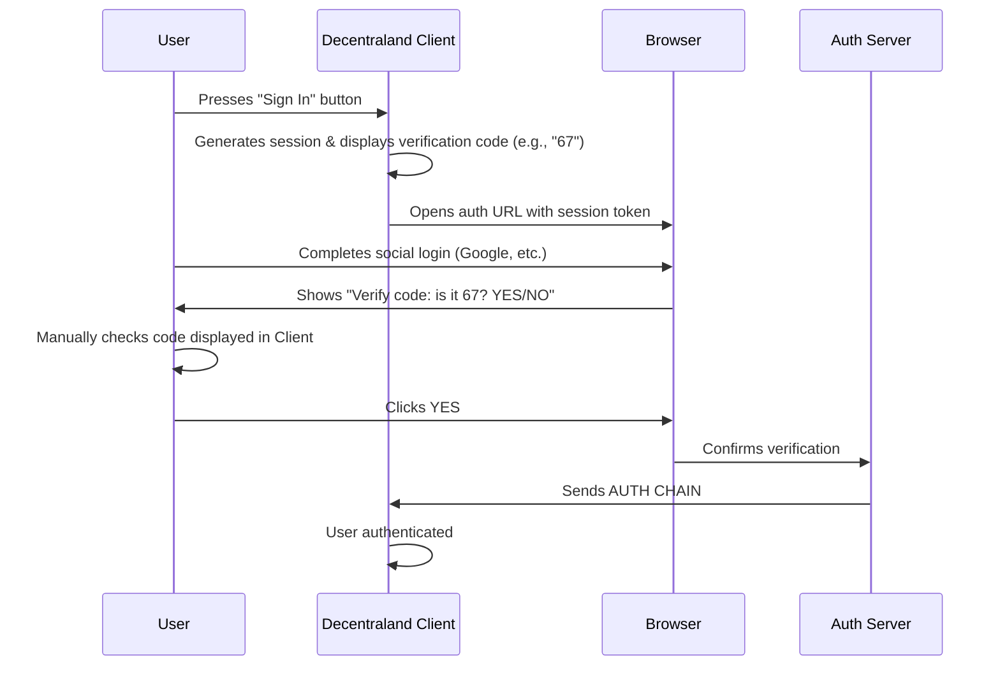
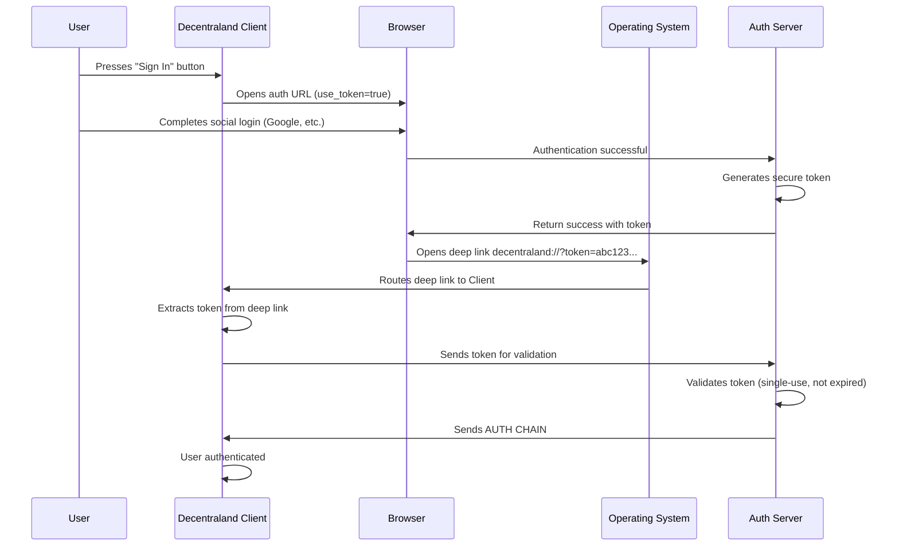

## Abstract

This ADR proposes adding a new opt-in alternative to the current verification code mechanism in Decentraland's sign-in flow: a more secure deep link token verification approach. The current system requires users to manually verify a code displayed in the client matches the one shown during web-based social login, which contributes to a high entry flow drop rate and is vulnerable to session hijacking attacks when authentication URLs are shared. The proposed deep link approach uses OS-level protocol handling to ensure tokens are delivered only to the local client, preventing impersonation attacks while significantly improving user experience by eliminating the manual verification step. This streamlined flow aims to reduce user abandonment during onboarding. The existing verification code mechanism will remain as the default authentication method, with the deep link flow available via an explicit `use_token=true` parameter.

## Context, Reach & Prioritization

### Current Sign-in Flow

The existing Decentraland sign-in process works as follows:

1. User presses "Sign In" button in the Decentraland client
2. Client generates a session and displays a verification code (e.g., "67")
3. Client automatically opens the browser with the authentication URL
4. User completes social login (Google, etc.) in the browser
5. Website displays a confirmation screen: "Verify code, is it 67 correct? YES/NO"
6. User manually checks the code displayed in the client and confirms in the browser
7. Upon confirmation, the server sends the AUTH CHAIN to the client
8. The AUTH CHAIN enables cryptographic signing capabilities within Decentraland



### User Experience Issues

The current verification code flow has significant user experience friction:

- **Multiple context switches**: Users must switch between the Decentraland client and web browser multiple times
- **Manual verification step**: Users must manually read and confirm the verification code, adding cognitive load
- **Confusing for new users**: The verification process is not intuitive, especially for first-time users
- **High entry flow drop rate**: The complex multi-step process results in a high drop-off rate during onboarding

This friction contributes to a **high entry flow drop rate**, where users abandon the sign-in process before completion, negatively impacting user acquisition and retention. Reducing this friction is critical for improving the onboarding experience and reducing user abandonment.

### Security Vulnerability: Session Hijacking via URL Sharing

The current implementation is vulnerable to **URL-based session fixation/hijacking attacks**. If a user shares the authentication URL with another person (intentionally or accidentally), that person can:

1. Open the shared URL
2. Complete their own social login
3. Confirm the verification code (which they can see in the original user's client if they have access, or simply guess/brute force since it's a short numeric code)
4. Receive the AUTH CHAIN intended for the original user
5. Successfully impersonate the original user with full signing privileges

This vulnerability exists because:
- The authentication state is tied to a URL that can be transferred
- The verification code provides weak security (short numeric, manually verified)
- No cryptographic binding between the web session and the local client
- The server has no way to verify the person completing authentication is the same as the person who initiated it

### Why This Decision Is Important

This decision addresses two critical issues:

**1. User Experience and Onboarding**

The current entry flow has a high drop rate, meaning many users abandon the sign-in process before completion. This negatively impacts:

- **User acquisition**: Potential new users leave before experiencing Decentraland
- **Platform growth**: High friction prevents the platform from reaching its full potential
- **First impressions**: Complex onboarding creates a poor initial experience
- **Conversion rates**: Users who start the sign-in process don't complete it

Improving the sign-in flow is essential for reducing abandonment and growing the Decentraland community.

**2. Security**

The AUTH CHAIN grants critical capabilities within Decentraland, including the ability to sign transactions and perform actions on behalf of a user's identity. A successful impersonation attack could allow malicious actors to:

- Perform unauthorized actions in-world
- Sign fraudulent transactions
- Damage user reputation and trust in the platform
- Compromise the integrity of the Decentraland ecosystem

## Solution Space Exploration

### Option 1: Keep Verification Code (Default Method)

**Description**: Continue to use the current verification code system as the default authentication method.

**Benefits**:
- Users are already familiar with the flow
- Works across all platforms without protocol handler requirements
- Provides compatibility for all environments
- No breaking changes for existing implementations
- Stable and proven authentication mechanism

**Drawbacks**:
- Vulnerable to session hijacking attacks when URLs are shared
- Manual verification step required
- Weaker security model compared to deep linking

**Status**: This option WILL remain as the default authentication method. The new deep link approach will be available as an opt-in alternative via the `use_token=true` parameter.

### Option 2: Deep Link Token Verification (Proposed - To Be Implemented)

**Description**: Implement a new authentication flow using OS-level deep link protocol handling as an alternative to the verification code.

**Flow**:
1. User presses "Sign In" button in the Decentraland client
2. Client automatically opens the browser with the authentication URL (with `use_token=true` parameter)
3. User completes social login on website
4. Server generates a secure token
5. Website opens deep link: `decentraland://?token=<secure_token>`
6. Operating system routes the deep link to the registered Decentraland client application
7. Client receives the token via the deep link
8. Client sends the token to the server
9. Server validates the token and returns the AUTH CHAIN



**Benefits**:
- **Eliminates impersonation attacks**: Even if the web URL is shared, the deep link token is delivered only to the local machine's registered application
- **OS-level security**: Deep link protocol handlers are managed by the operating system and cannot be intercepted over the network
- **Two-channel verification**: Combines web authentication (social login) with local client verification (deep link)
- **Significantly improved user experience**:
  - No manual verification code step required
  - Eliminates context switching between client and browser
  - Streamlined one-way flow from browser to client
  - Reduces cognitive load on users
- **Reduced entry flow drop rate**: Simpler, more intuitive flow reduces user abandonment during onboarding
- **Cryptographic security**: Can use long, random tokens instead of short numeric codes
- **Same-machine guarantee**: Deep links only work on the machine where both the browser and client are running

**Drawbacks**:
- Requires deep link protocol handler registration
- May have different behavior across platforms (desktop vs. mobile)
- Needs fallback mechanism for environments where deep links don't work

**Security Analysis**: This approach is fundamentally more secure because:
- Deep links are handled by the OS, not the web browser or network layer
- Even if an attacker intercepts the web session, they cannot receive the deep link token on their machine
- The token can be a cryptographically secure random string (e.g., 256-bit) instead of a 2-digit code
- Provides proof that the person who authenticated on the web is on the same machine as the client

### Option 3: IP-Based Verification (Additional Security Measure)

**Description**: Add server-side validation that the web session and client connection originate from the same IP address as an extra security layer.

**Benefits**:
- Simple to implement
- No client-side changes required
- Provides additional protection against remote attacks
- Works transparently alongside other authentication methods

**Drawbacks**:
- Ineffective for users behind NAT, VPNs, or proxies
- Can give false negatives (legitimate users rejected)
- Can give false positives (multiple users behind same IP)
- Doesn't protect against local attacks (attacker on same network)
- Not a complete solution on its own

**Status**: This is an optional additional security measure that MAY be implemented alongside Option 2 to provide defense-in-depth, but should NOT be relied upon as the primary security mechanism.

### Recommended Solution

**Implement Option 2 (Deep Link Token Verification) as an opt-in alternative authentication method** (via `use_token=true` parameter), while **keeping Option 1 (Verification Code) as the default authentication method**. **Option 3 (IP-Based Verification) MAY be added as an additional security layer** for defense-in-depth.

## Specification

### Deep Link Token Verification Flow

The key words "MUST", "MUST NOT", "REQUIRED", "SHALL", "SHALL NOT", "SHOULD", "SHOULD NOT", "RECOMMENDED", "NOT RECOMMENDED", "MAY", and "OPTIONAL" in this document are to be interpreted as described in RFC 2119 and RFC 8174.

#### 1. Authentication Initiation

The client MUST generate or receive an authentication session URL that the user opens in their web browser.

#### 2. Social Login

The web application MUST:
- Present social login options (Google, etc.)
- Complete the authentication flow with the chosen provider
- NOT send the AUTH CHAIN immediately after successful login

#### 3. Deep Link Token Generation

Upon successful social login, the server MUST:
- Generate a cryptographically secure random token (RECOMMENDED: at least 128 bits of entropy)
- Store the token temporarily with an association to:
  - The authenticated user identity
  - The original session identifier
  - Creation timestamp (for expiration)
  - Source IP address (optional, for additional verification)
- Set token expiration (RECOMMENDED: 5 minutes maximum)

#### 4. Deep Link Invocation

The web application MUST:
- Construct a deep link URL: `decentraland://?token=<secure_token>`
- Attempt to open the deep link using the browser's protocol handler mechanism
- Display user-friendly instructions if the deep link fails to open

#### 5. Client Token Reception

The Decentraland client MUST:
- Register the `decentraland://` protocol handler with the operating system
- Handle incoming deep link requests
- Extract the token parameter from the URL
- Validate the token format before sending to server

#### 6. Server Token Validation and AUTH CHAIN Delivery

The server MUST:
- Receive the token from the client
- Validate that:
  - The token exists and has not expired
  - The token has not been used previously (single-use)
  - (Optional) The client IP matches the web session IP (within reasonable tolerance)
- Generate and return the AUTH CHAIN for the authenticated user
- Invalidate the token immediately after successful use
- Log any validation failures for security monitoring

The server SHOULD implement rate limiting on token validation attempts to prevent brute force attacks.

#### 7. Error Handling

The client SHOULD handle the following error cases:
- Token expired: Display message prompting user to restart authentication
- Token invalid: Display message indicating authentication failure
- Network error: Retry with exponential backoff
- Deep link not received within timeout (e.g., 30 seconds): Prompt user to retry or use fallback

### Default Behavior and Opt-in Mechanism

The system SHALL use the verification code flow as the default authentication method. The deep link token verification flow SHALL be opt-in via a query parameter:

```
https://auth.decentraland.org/login?session=<id>&use_token=true
```

**Default behavior (no parameter or `use_token=false`)**:
- Use the verification code flow
- Display verification code in client
- Require manual confirmation on web

**Opt-in behavior (`use_token=true`)**:
- Use the deep link token verification flow
- No verification code displayed
- Automatic token delivery via deep link
- The system SHOULD display helpful messaging if deep link fails, allowing the user to retry or fall back to verification code flow

### IP-Based Additional Verification

As an additional security layer, the server MAY verify that the IP address of the client requesting the AUTH CHAIN matches (or is reasonably close to) the IP address from which the social login was completed.

The server SHOULD:
- Allow for reasonable IP variance (same /24 subnet for IPv4)
- Handle IPv6 appropriately
- Consider mobile network transitions
- Log mismatches but not necessarily reject (depends on risk tolerance)
- Provide configuration options for strictness level

### Platform Considerations

#### Desktop Platforms (Windows, macOS, Linux)

- Deep link protocol handlers MUST be registered during client installation
- The client SHOULD handle cases where the protocol handler registration fails or is blocked by security software
- The client SHOULD test the protocol handler on startup and warn the user if it's not properly registered

#### Mobile Platforms (iOS, Android)

- Mobile implementations MUST use platform-specific deep linking mechanisms (Universal Links on iOS, App Links on Android)
- The system SHOULD handle cases where the mobile browser and Decentraland app are on different devices
- The system SHOULD provide QR code fallback for cross-device authentication scenarios

#### Web-Only Environments

For web-based explorers or environments where a native client is not available, alternative authentication mechanisms MUST be provided (outside the scope of this ADR).

### Security Considerations

1. **Token Entropy**: Tokens MUST have sufficient entropy to prevent guessing attacks (minimum 128 bits)
2. **Token Expiration**: Tokens MUST expire within a short timeframe (RECOMMENDED: 5 minutes)
3. **Single Use**: Tokens MUST be invalidated immediately after use or failed validation attempt
4. **Rate Limiting**: Server MUST implement rate limiting on token validation endpoints
5. **Secure Transport**: All token transmission MUST occur over secure channels (HTTPS, secure WebSocket)
6. **Audit Logging**: All authentication attempts, successes, and failures SHOULD be logged for security monitoring

### Migration Path

1. Implement deep link token verification as an opt-in feature via `use_token=true` parameter
2. Keep verification code flow as the default authentication method
3. Monitor adoption rates and gather user feedback on the deep link flow
4. Collect metrics on deep link success/failure rates across different platforms
5. Based on adoption and stability metrics, evaluate whether to make deep link the default in a future ADR
6. Continue maintaining verification code flow for backwards compatibility and edge cases

## RFC 2119 and RFC 8174

> The key words "MUST", "MUST NOT", "REQUIRED", "SHALL", "SHALL NOT", "SHOULD", "SHOULD NOT", "RECOMMENDED", "NOT RECOMMENDED", "MAY", and "OPTIONAL" in this document are to be interpreted as described in RFC 2119 and RFC 8174.
