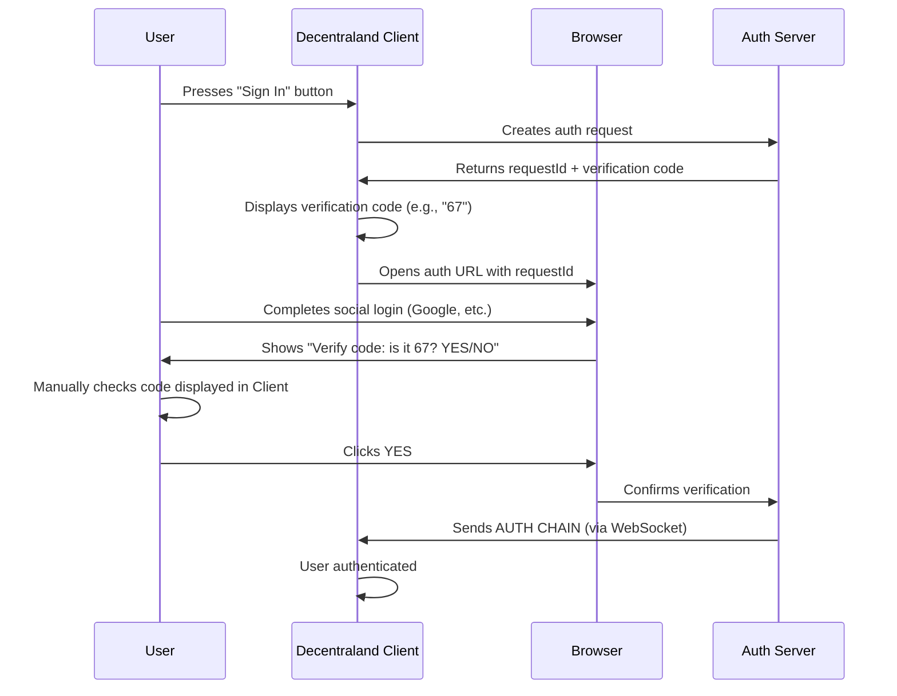
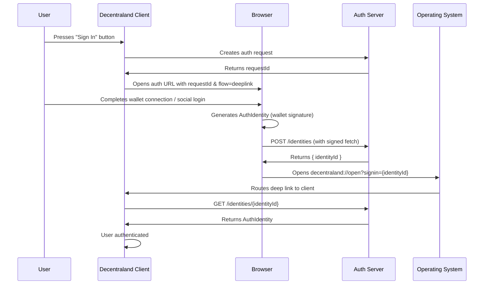
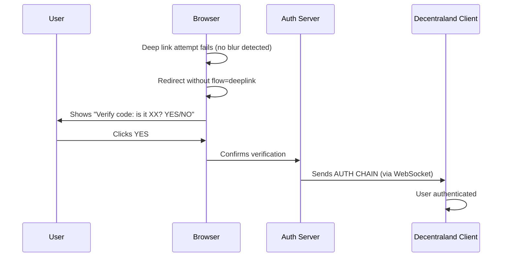

## Abstract

This ADR proposes a new authentication flow for Decentraland that simplifies the sign-in process by using deep links to deliver the user's AuthIdentity back to the client. Instead of requiring users to manually verify a code, the auth website stores the AuthIdentity on the server and redirects the user back to the client via a deep link containing an identity retrieval token. The client then fetches the complete identity from the server. If the deep link fails (e.g., client not installed), the flow falls back to the existing verification code mechanism.

## Context, Reach & Prioritization

### Current Authentication Flow

The existing Decentraland sign-in process works as follows:

1. User presses "Sign In" button in the Decentraland client
2. Client creates a request on the auth server and displays a verification code (e.g., "67")
3. Client automatically opens the browser with the authentication URL
4. User completes social login (Google, etc.) or wallet connection in the browser
5. Website displays a confirmation screen: "Verify code, is it 67 correct? YES/NO"
6. User manually checks the code displayed in the client and confirms in the browser
7. Upon confirmation, the server sends the AUTH CHAIN to the client via WebSocket
8. The AUTH CHAIN enables cryptographic signing capabilities within Decentraland



### User Experience Issues

The current verification code flow has significant user experience friction:

- **Multiple context switches**: Users must switch between the Decentraland client and web browser multiple times
- **Manual verification step**: Users must manually read and confirm the verification code, adding cognitive load
- **Confusing for new users**: The verification process is not intuitive, especially for first-time users
- **High entry flow drop rate**: The complex multi-step process results in a high drop-off rate during onboarding

### Security Vulnerability: Session Hijacking via URL Sharing

The current implementation is vulnerable to **URL-based session fixation/hijacking attacks**:

1. Malicious user presses "Sign In" on their Decentraland client
2. Malicious user's client generates a session and displays a verification code
3. Malicious user sends the authentication URL to a legitimate user (social engineering)
4. Legitimate user opens the URL and completes their social login
5. Legitimate user sees "Verify code: is it [code]? YES/NO" and clicks YES
6. Server sends the AUTH CHAIN to the **malicious user's client**
7. Malicious user's client is now authenticated with the **legitimate user's identity**

This vulnerability exists because:
- The authentication state is tied to a URL that can be transferred
- Anyone who completes the social login gets their identity bound to the client that generated the URL
- No cryptographic binding between the web session and the specific client/user who should authenticate

## Solution Space Exploration

### Option 1: Deep Link with Identity Storage (Proposed)

Use deep links to return the user to the client after authentication, with the identity stored server-side for retrieval. Falls back to verification code if deep link fails.

**Benefits**:
- Eliminates manual verification step for users with the client installed
- More secure: deep links are delivered only to the local machine
- Seamless user experience
- Backwards compatible with verification code fallback

**Security Model**:
- Identity stored with signed fetch - only the identity owner can store their identity
- Short-lived identifiers (15 minutes)
- Single-use retrieval (identity deleted after fetch)
- Deep links cannot be intercepted over the network

### Option 2: Direct Identity in Deep Link (Rejected)

Embed the entire AuthIdentity in the deep link URL.

**Why rejected**:
- AuthIdentity is too large for URL parameters
- Exposes sensitive cryptographic material in URLs
- URL logging would leak credentials
- No server-side validation possible

## Specification

### Proposed Authentication Flow



### Fallback to Verification Code

If the deep link fails to open (detected via browser blur event timeout), the auth website removes the `flow=deeplink` parameter and redirects to the standard verification code flow:



### API Endpoints

#### POST /identities

Stores an AuthIdentity for later retrieval. Protected by signed fetch authentication.

**Request**:
```json
{
  "identity": {
    // AuthIdentity object from @dcl/crypto
  }
}
```

**Headers**:
- Must include signed fetch headers as per Decentraland authentication standards

**Response** (200 OK):
```json
{
  "identityId": "uuid-v4",
  "expiration": "2025-12-11T12:05:00Z"
}
```

**Error Responses**:
- 401 Unauthorized: Invalid or missing signed fetch headers
- 400 Bad Request: Invalid identity format

#### GET /identities/{identityId}

Retrieves a stored AuthIdentity. Single-use - identity is deleted after successful retrieval.

**Response** (200 OK):
```json
{
  "identity": {
    // AuthIdentity object
  }
}
```

**Error Responses**:
- 404 Not Found: Identity not found or already retrieved
- 410 Gone: Identity expired

### Deep Link Format

```
decentraland://open?signin={identityId}
```

Where `identityId` is the UUID returned from the POST /identities endpoint.

### Client Implementation

The client MUST:
1. Register handler for `decentraland://` protocol with the operating system
2. When initiating sign-in, open the auth URL with `flow=deeplink` parameter
3. Listen for incoming deep links with `signin` query parameter
4. When receiving a `signin` deep link:
   - Extract the `identityId` from the URL
   - Fetch the identity from `GET /identities/{identityId}`
   - Store the retrieved AuthIdentity locally
   - Complete the authentication flow

The client SHOULD:
- Continue listening on WebSocket for verification code flow as fallback
- Show loading state while fetching identity
- Handle network errors gracefully with retry option
- Display meaningful error if identity retrieval fails

### Web Application Implementation

The auth website MUST:
1. Detect `flow=deeplink` query parameter
2. When `flow=deeplink` is present:
   - Skip the verification code confirmation screen
   - After successful wallet connection/social login, generate AuthIdentity
   - POST identity to `/identities` endpoint with signed fetch
   - Attempt to open deep link `decentraland://open?signin={identityId}`
3. Detect if deep link was successful (browser blur event)
4. If deep link fails, fall back to verification code flow

The auth website SHOULD:
- Show countdown before auto-opening deep link (e.g., 5 seconds)
- Provide manual "Open in App" button
- Display clear messaging about what's happening

### Deep Link Detection

The auth website detects whether the deep link was successful using the browser blur technique:

1. Add a `blur` event listener to the window
2. Create a hidden iframe with the deep link URL
3. Wait for a short timeout (e.g., 500ms)
4. If `blur` event fired, the app was launched successfully
5. If no `blur` event, fall back to verification code flow

```typescript
const launchDeepLink = (url: string): Promise<boolean> => {
  return new Promise(resolve => {
    let appDetected = false

    const handleBlur = () => {
      appDetected = true
    }

    window.addEventListener('blur', handleBlur)

    const iframe = document.createElement('iframe')
    iframe.style.display = 'none'
    iframe.src = url
    document.body.appendChild(iframe)

    setTimeout(() => {
      window.removeEventListener('blur', handleBlur)
      document.body.removeChild(iframe)
      resolve(appDetected)
    }, 500)
  })
}
```

### Security Considerations

#### Identity Storage Security

1. **Signed Fetch Validation**: The server MUST validate signed fetch headers to ensure only the identity owner can store their identity.

2. **Short Expiration**: Stored identities MUST expire within 15 minutes.

3. **Single Use**: Identities MUST be deleted immediately after successful retrieval.

4. **UUID Generation**: Identity IDs MUST be cryptographically random UUIDs (v4) to prevent guessing.

#### Transport Security

1. All API communications MUST use HTTPS.
2. Deep links are handled by the OS and cannot be intercepted over the network.

#### Why Deep Links Prevent Session Hijacking

Even if an attacker shares their auth URL with a victim:
1. The victim completes authentication on **their own machine**
2. The deep link `decentraland://open?signin={id}` opens on the **victim's machine**
3. The victim's local Decentraland client receives the identity
4. The attacker's client never receives anything

The deep link is routed by the **victim's operating system** to the **victim's local application**, not over the network to the attacker.

### Opt-in Mechanism

This flow is activated by including `flow=deeplink` in the auth URL:

```
https://auth.decentraland.org/auth/requests/{requestId}?flow=deeplink
```

When this parameter is present:
- The verification code step is skipped
- The auth website generates and stores the identity
- A deep link is used to return the user to the client
- If deep link fails, falls back to verification code flow

### Error Handling

The web application SHOULD handle:

1. **Identity storage failure**: Display error message, allow retry
2. **Deep link failed**: Automatically fall back to verification code flow
3. **App not installed**: Fall back to verification code flow

The client SHOULD handle:

1. **Identity retrieval failure**: Show error with option to restart auth flow
2. **Identity expired**: Show error, user needs to re-authenticate
3. **Network errors**: Retry with exponential backoff

## RFC 2119 and RFC 8174

The key words "MUST", "MUST NOT", "REQUIRED", "SHALL", "SHALL NOT", "SHOULD", "SHOULD NOT", "RECOMMENDED", "NOT RECOMMENDED", "MAY", and "OPTIONAL" in this document are to be interpreted as described in RFC 2119 and RFC 8174.
