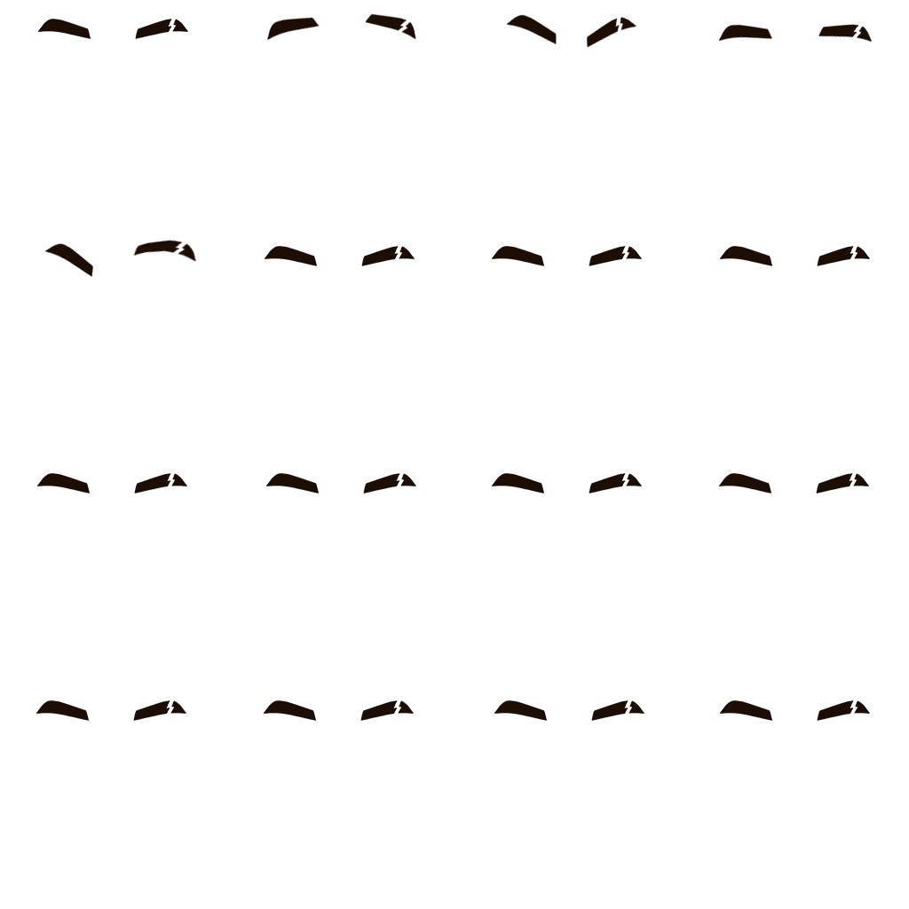
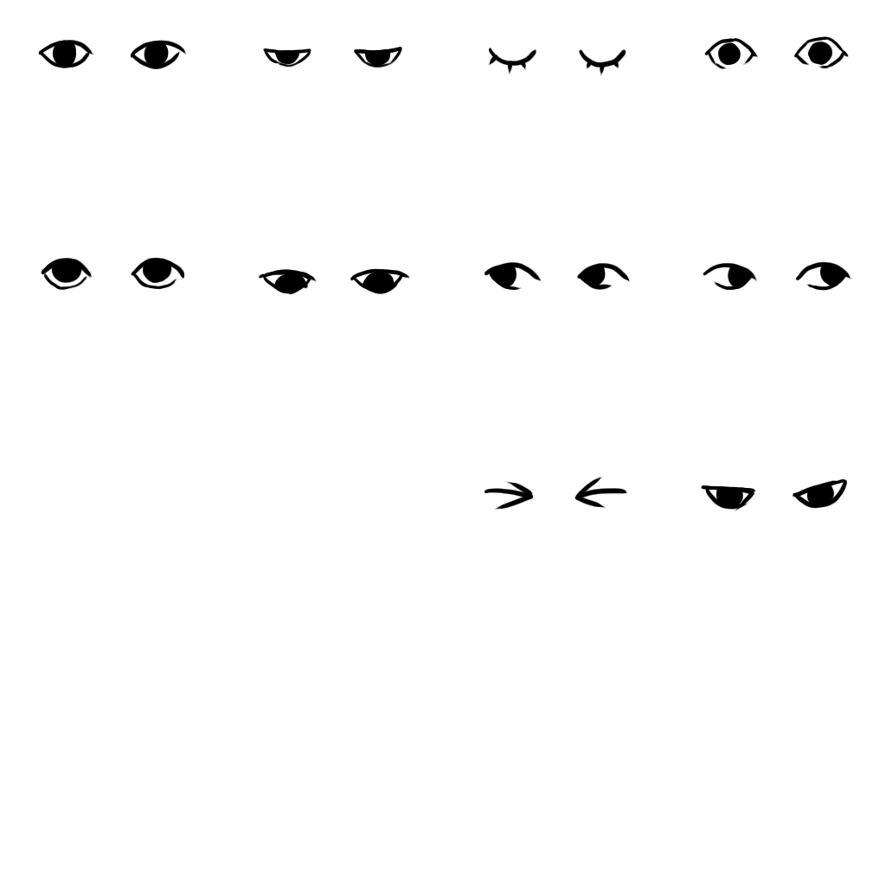
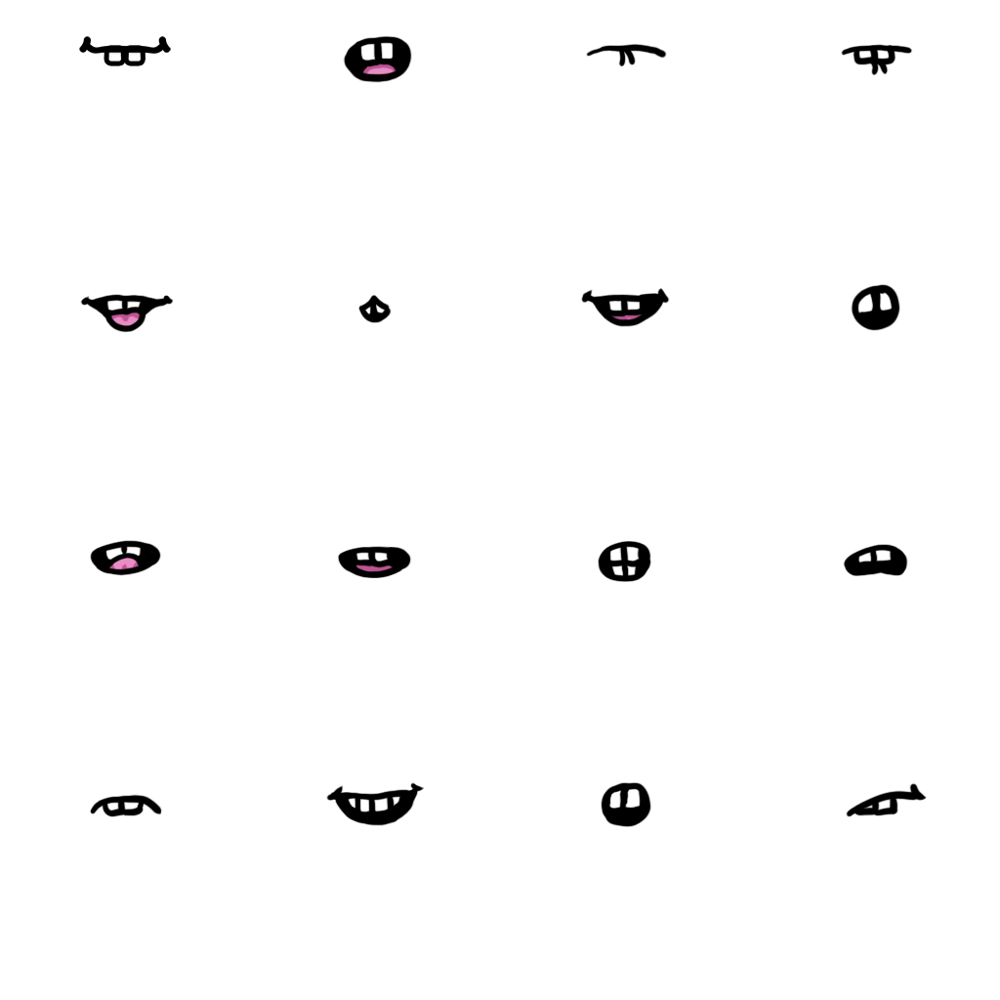
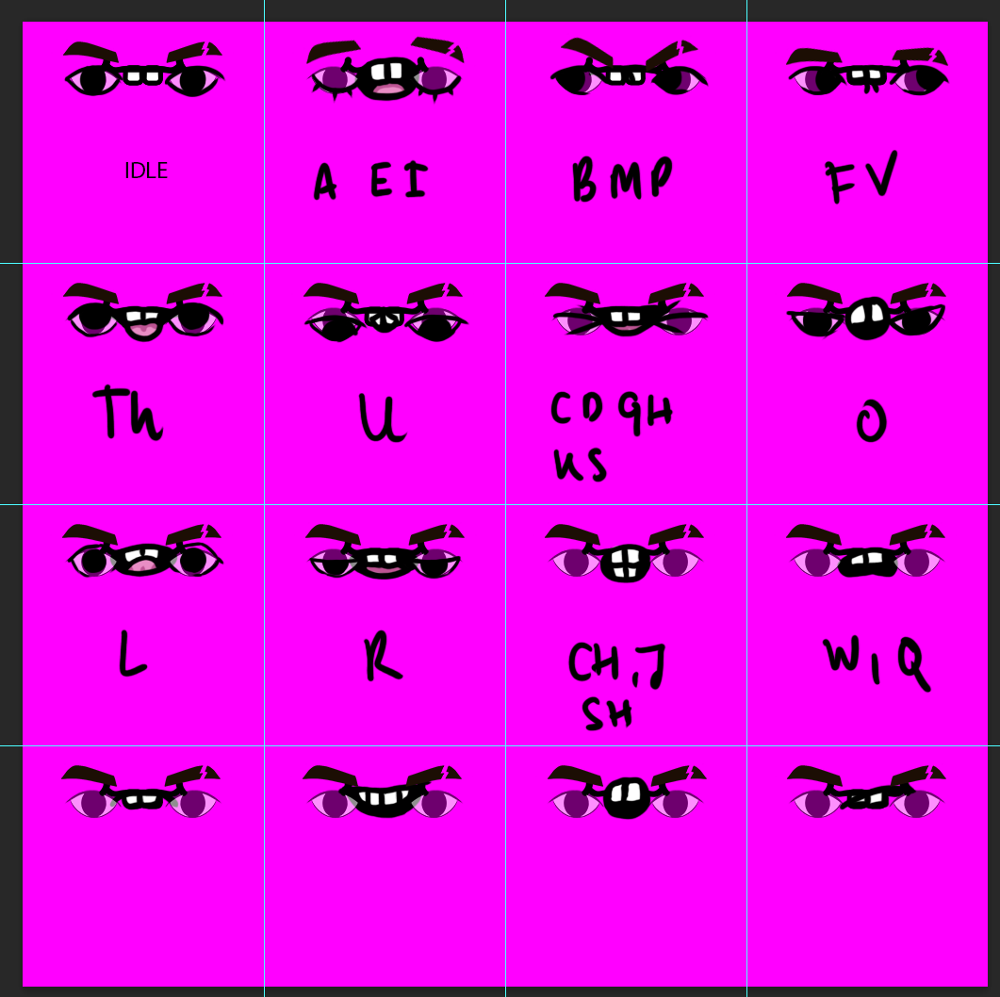

## Abstract

This ADR defines a 2D facial expression system for Decentraland avatars. The system replaces the current single-tile facial feature textures (eyebrows, eyes, mouth) with 4×4 sprite atlases, enabling per-feature expression selection, automatic blinking, and mouth lip-sync driven by chat and voice input. A predefined set of expressions, accessible through an expressions wheel, lets players combine eyebrow/eye/mouth indices into recognizable faces. Only the individual feature indices are propagated through the network; combined expressions and local-only behaviours (blink, lip-sync) are not synchronized. The wearable asset schema is extended to declare atlas-compatible facial textures, and the Builder is updated to detect atlas textures and offer per-tile selectors.

## Context, Reach & Prioritization

Decentraland avatars currently render facial features (eyebrows, eyes, mouth) as static 256×256 single-tile textures. Avatars do not blink, do not move their mouth when chatting or speaking through voice, and have no way to express emotion. This makes avatars feel rigid and uncanny in what is otherwise an immersive 3D experience.

This standard affects:

- The Explorer (Unity) — local avatar rendering, remote avatar rendering, login / backpack preview.
- The Builder — wearable upload and editing flow.
- The Marketplace — base wearables compatibility.
- Wearable creators — atlas authoring conventions.

The system is **2D only** for this version. 3D facial features are explicitly out of scope and may be addressed in a future revision; the system is designed so that swapping the 2D back-end for a 3D one does not require schema or protocol changes.

**Vocabulary:**

- **Facial feature:** One of the three configurable face elements: eyebrows, eyes, or mouth.
- **Atlas:** A 1024×1024 texture containing a 4×4 grid of 256×256 sprites, each representing one variation of a facial feature.
- **Tile / Sprite index:** The 0–15 index identifying a single sprite within an atlas.
- **Expression:** A combination of three tile indices — one per facial feature — that defines a complete face.
- **Blink:** A local, automatic eye animation cycling through wide-open → half-closed → closed → back, on a randomized timer.
- **Lip-sync:** Local mapping from text characters or voice phonemes to mouth tile indices, animating the mouth while a player chats or speaks.

## Solution

### Face Features Atlas

Each facial feature texture is extended from a 256×256 single tile to a 1024×1024 texture containing a 4×4 grid of 256×256 sprites. Each sprite represents one variation of that feature.







Tile indices are read **left-to-right, top-to-bottom** (0 = top-left, 15 = bottom-right).

**Eyebrows atlas (rows 1–4):**

| 0 — Down       | 1 — Surprised | 2 — Frown      | 3 — Scared     |
| -------------- | ------------- | -------------- | -------------- |
| 4 — Left Up    | 5 — Right Up  | 6 — Unassigned | 7 — Unassigned |
| 8 — Unassigned | 9 — Unassigned | 10 — Unassigned | 11 — Unassigned |
| 12 — Unassigned | 13 — Unassigned | 14 — Unassigned | 15 — Unassigned |

**Eyes atlas (rows 1–4):**

| 0 — Half Closed | 1 — Closed     | 2 — Wide Open    | 3 — Shut Tight   |
| --------------- | -------------- | ---------------- | ---------------- |
| 4 — Look Up     | 5 — Look Down  | 6 — Look Left    | 7 — Look Right   |
| 8 — Wink Left   | 9 — Wink Right | 10 — Suspicious  | 11 — Unassigned  |
| 12 — Unassigned | 13 — Unassigned | 14 — Unassigned | 15 — Unassigned |

**Mouth atlas (rows 1–4):**

| 0 — A, E, I, R   | 1 — J, CH, SH    | 2 — B, M, P     | 3 — F           |
| ---------------- | ---------------- | --------------- | --------------- |
| 4 — D, C, Z, L   | 5 — U, O, W      | 6 — G, H, K, S, Q | 7 — Unassigned  |
| 8 — Smile        | 9 — Happy        | 10 — Sad        | 11 — Angry      |
| 12 — Scared      | 13 — Suspicious  | 14 — Unassigned | 15 — Unassigned |

Tiles marked **Unassigned** are reserved for future expansion and MUST be left blank by base wearables. Third-party wearables MAY populate them.

### Blink

The avatar blinks automatically using a sequence of three eye sprites: wide open → half closed → closed → half closed → wide open. The system MUST be parameterized with:

- `blinkIntervalMin`, `blinkIntervalMax` — randomized time window between blinks.
- `blinkDuration` — total duration of one blink cycle.

Blink is a **local** feature. It MUST NOT be synchronized to other players over the network.

A future emote-wheel item MAY trigger a network-propagated blink or wink; that gesture is a separate emote and is out of scope for this ADR.

### Mouth and Lip-Sync

Mouth animation is driven by mapping characters or phonemes to mouth tile indices in the atlas. The mapping uses a small set of mouth shapes (≈ 7 positions) covering the phonetic groups defined in the mouth atlas table above.

Two input sources drive lip-sync:

1. **Text chat:** when a player sends a chat message, their avatar animates the mouth by stepping through the tile sequence corresponding to the message characters.
2. **Voice chat / voice streams:** the active voice signal is analysed for phonemes (or amplitude-based heuristics in the absence of phoneme detection) and the mouth is animated accordingly. This MUST also work with community voice streams and the upcoming proximity voice feature.

Lip-sync is **local-only** and MUST NOT be synchronized over the network. Each Explorer instance computes the mouth animation for the avatars it renders based on the chat and voice signals it already receives.

The system MUST expose tunable parameters for:

- Consonant duration.
- Vowel duration.
- Transition / interpolation time between mouth positions.

### Facial Expressions

A **facial expression** is defined as a tuple of three tile indices:

```json
{
  "eyebrowsIndex": 0,
  "eyesIndex": 2,
  "mouthIndex": 8
}
```

The Explorer MUST provide a set of predefined expressions — fixed combinations of indices — accessible by name (e.g. `happy`, `sad`, `angry`, `surprised`).

In addition, players MUST be able to set each feature index independently to compose custom expressions.

Facial expressions are the only part of this system that propagates over the network. See the **Network** section.

### Expressions Wheel

A radial UI similar to the existing emote wheel exposes facial expressions to the player.

Behaviour:

- Up to **10 slots**. Slots MAY be bound to predefined expressions or to specific feature-index overrides.
- Pressing **`Y` + a number key** triggers the corresponding slot directly without opening the wheel.
- Clicking a slot inside the wheel applies the expression but **does not** auto-close the wheel — players close it via the close button or by clicking outside it. This differs from the emote wheel.

This UX divergence from the emote wheel is intentional: facial expressions are persistent state on the avatar, not a one-shot animation, so users typically want to try several before committing.

### Network

Only the three feature indices (`eyebrowsIndex`, `eyesIndex`, `mouthIndex`) are propagated over the network. Specifically:

- When a player changes any individual feature index, the new index MUST be broadcast.
- When a player applies a predefined expression, the resulting **resolved indices** MUST be broadcast — not the expression name. Predefined expression names are a client-side convenience and MUST NOT appear in the wire protocol.
- When a remote player joins the scene, their current three indices MUST be included in their initial avatar state so other players see the correct face on arrival.

Local-only state (blink phase, lip-sync animation) MUST NOT be propagated.

#### Wire Protocol

A new message MUST be added to the rfc4 comms protocol ([decentraland/protocol — `proto/decentraland/kernel/comms/rfc4/comms.proto`](https://github.com/decentraland/protocol/blob/main/proto/decentraland/kernel/comms/rfc4/comms.proto)) to carry the facial expression state.

The payload is exactly **3 bytes**, one per facial feature, packed in a fixed order:

| Byte offset | Field            | Type   | Range  | Meaning                              |
| ----------- | ---------------- | ------ | ------ | ------------------------------------ |
| 0           | `eyebrowsIndex`  | uint8  | 0–15   | Tile index in the eyebrows atlas     |
| 1           | `eyesIndex`      | uint8  | 0–15   | Tile index in the eyes atlas         |
| 2           | `mouthIndex`     | uint8  | 0–15   | Tile index in the mouth atlas        |

Although the valid range is 0–15 (4 bits per feature), each index occupies a full byte to keep the payload byte-aligned, trivially extensible (atlases can grow beyond 4×4 in a future revision without a protocol break), and cheap to read on the receiving side.

Proposed proto definition:

```proto
// Facial expression state.
// Each field is a 0-based tile index into the corresponding 4x4 facial-feature atlas
// (see ADR-317). Values outside 0-15 MUST be ignored by receivers in this version.
message FacialExpression {
  uint32 eyebrows_index = 1;
  uint32 eyes_index     = 2;
  uint32 mouth_index    = 3;
}
```

> Note: protobuf has no `uint8`. The three indices are encoded as `uint32` on the wire (varint-encoded, so each value below 128 takes a single byte), which is what corresponds to the "3 bytes per feature index" payload in practice. The exact field number assignments and the parent oneof / packet wrapper in `comms.proto` are deferred to the protocol PR.

**Send semantics:**

- Senders MUST emit a `FacialExpression` message whenever any of the three indices changes.
- Senders MUST NOT emit a `FacialExpression` message at a fixed tick rate; this is **edge-triggered**, not periodic. Blink and lip-sync are local and never trigger a send.
- Senders SHOULD coalesce multiple changes within a short window (e.g. while the user is browsing the expressions wheel) into a single message carrying the final state, to avoid flooding the comms channel.

**Receive semantics:**

- Receivers MUST apply the three indices to the corresponding remote avatar atomically.
- Indices outside 0–15 MUST be clamped or the message dropped — implementation choice — and a warning logged.
- The last-received `FacialExpression` for a peer is the authoritative current state. Newly joining players obtain the current state through the standard avatar-state catch-up path used for other profile-derived avatar fields; the exact mechanism is defined by the comms architecture ([ADR-204](/adr/ADR-204)) and is not redefined here.

### Asset Schema

**The wearable metadata schema does NOT change.** No new fields, no new schema version, no migration. Compatibility with the facial expression system is signalled purely through a **texture naming convention** in the wearable's JSON definition.

A facial-feature wearable declares itself expression-compatible by adding two new textures to its asset definition:

- `<base>_expression` — the 1024×1024 atlas containing the 4×4 grid of feature sprites (eyebrows / eyes / mouth, depending on the wearable category).
- `<base>_expression_mask` — the matching coloring mask atlas. Same 4×4 layout as `_expression`, used by the renderer to apply per-tile coloring (e.g. hair / eye / lip color) to the active sprite.

`<base>` is the wearable's existing texture base name; the suffixes `_expression` and `_expression_mask` are the load-bearing part of the convention.

**Detection rules:**

1. The Explorer MUST scan the wearable's JSON definition for textures whose names end in the suffix `_expression`. Match is case-sensitive on the suffix.
2. For each matching texture, the Explorer MUST also locate the corresponding `_expression_mask` texture (same `<base>`). Both MUST be present for the wearable to be considered expression-compatible.
3. If both textures are present, the wearable is expression-compatible: blink, lip-sync, and tile-index selection apply.
4. If neither is present, the wearable is treated as a **legacy single-tile** facial feature and rendered as today (no expression variation, no blink, no lip-sync for that feature).
5. If only one of the two is present, the wearable MUST be treated as legacy and a warning SHOULD be logged — this signals a malformed asset.

Because the signal lives in the texture filename inside the wearable's JSON definition, no backend, validator, or schema-version change is required. Existing wearables that do not adopt the convention keep working unchanged.

### Documentation

Creator-facing documentation MUST be updated to:

- Describe the eyebrow / eyes / mouth atlas layout and tile-index mapping.
- Provide downloadable PSD templates with the atlas grid, tile guides, and example art.



## No Goes

The following are explicitly **out of scope** for this version:

- **3D facial features.** This system is 2D only. The 2D-vs-3D abstraction lives behind a single facial-feature interface so that a future 3D backend can plug in without protocol or schema changes.
- **Network-propagated blink or wink.** Blink is local-only. A propagated wink may later be implemented as an emote, separately from this system.
- **Per-character voice phoneme synchronization across the network.** Lip-sync is computed locally from received chat and voice streams.

## RFC 2119 and RFC 8174

> The key words "MUST", "MUST NOT", "REQUIRED", "SHALL", "SHALL NOT", "SHOULD", "SHOULD NOT", "RECOMMENDED", "NOT RECOMMENDED", "MAY", and "OPTIONAL" in this document are to be interpreted as described in RFC 2119 and RFC 8174.