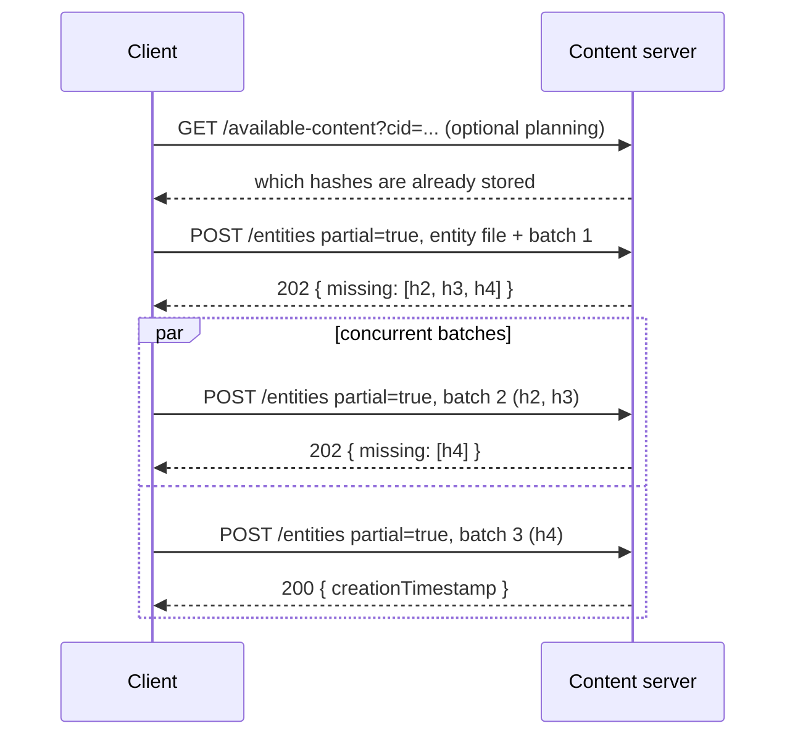

## Abstract

This ADR defines how a client deploys a scene whose content is too large for a single request, by splitting it across several `POST /entities` requests. Each request carries the multipart field `partial=true` and a subset of the files. The signed entity ID identifies the upload, so there is no session creation or explicit commit step. The server answers `202` with the hashes it still needs until the last one arrives, then validates and publishes the scene in that same request and answers `200`. Uploads that target overlapping parcels coexist instead of evicting each other; which one ends up live is decided at publication by entity timestamp order. Staged content is private to the receiving server until publication and is never synchronized. The protocol applies to Catalyst content servers and to the Worlds content server.

## Context, Reach & Prioritization

A deployment is a single multipart `POST /entities` request carrying the entity file, its auth chain and every content file that is not already stored (see [ADR-45](/adr/ADR-45) and [ADR-51](/adr/ADR-51)). The infrastructure in front of the Decentraland content servers times out requests larger than roughly 200 MB, so large scenes cannot be deployed at all, and a transient failure near the end of a large upload forces the creator to send everything again.

Partial deployments fix both problems. Content is sent in bounded batches, a failed batch is retried on its own, and progress survives dropped connections, client restarts and server restarts until the upload expires.

This affects every deployment client (the Creator Hub, the SDK CLI and `dcl-catalyst-client`) and both content server implementations. Clients need one protocol that behaves the same way against a Catalyst and a Worlds server, so the rules are specified here instead of per implementation.

Vocabulary:

- **Upload**: the staged state of one entity, identified by its entity ID, between its first partial request and publication or expiry.
- **Batch**: one partial `POST /entities` request.
- **Completing request**: the request after which every content file referenced by the entity is stored.
- **Publication**: the entity becoming live, exactly as a regular deployment would.

## Solution Space Exploration

**Explicit sessions.** A `POST /uploads` endpoint returning an upload ID, followed by `PUT` requests per file and a final commit. This adds endpoints, a second identifier and a separate commit failure mode. The signed entity ID already identifies the upload and already proves the signer's intent, so a separate session ID adds nothing.

**One pending upload per parcel set.** The first implementations let a newer upload on overlapping parcels replace an older one and discard its staged content. Two creators, or one creator with two tabs, could keep evicting each other, and an upload's progress could vanish between two batches. That forced clients to re-check their own state on every batch. It was replaced by the coexistence model below, which bounds abuse with explicit quotas instead of eviction.

**Chunked single files.** Splitting individual files across requests would remove the per-file size limit, but it requires byte-range assembly and partial-hash state on the server. Files stay atomic; a single file must fit in one request.

**Chosen: entity-keyed batches.** The existing endpoint gains one field. Uploads are keyed by the signed entity ID, coexist within quotas, and publish on the completing request. A server without support rejects the first multi-batch request instead of misbehaving silently.

## Specification

### Scope

1. Partial deployments apply to scene entities only. Servers MUST reject a partial request for any other entity type with `400`.
2. The entity ID MUST be an IPFS v2 (CIDv1) hash.
3. Regular single-request deployments are unchanged. A server that implements this ADR MUST keep accepting them.

### Request

A batch is a regular multipart `POST /entities` request with these fields:

| Field | Required | Description |
| --- | --- | --- |
| `entityId` | Yes | The entity ID. Identifies the upload. |
| `authChain` | Yes | The auth chain signing `entityId`, exactly as in a regular deployment. Sent on every batch. |
| `partial` | Yes | The literal string `true`. |
| `<entityId>` file | First batch | The entity file. The original signer MAY omit it on later batches while the upload is live; any other signer MUST include it. |
| `<hash>` files | No | Content files, keyed by their content hash. Any subset of the entity's content. |

Rules:

1. Each file field name MUST be the file's content hash. The server MUST reject a batch where a file does not hash to its field name.
2. The server MUST reject files that the entity does not reference.
3. A file MUST NOT be split across batches.
4. Clients SHOULD keep each request under 100 MiB of file bytes, which leaves margin under the infrastructure's request ceiling.
5. A batch MAY contain no content files, for example a first batch that carries only the entity file.

### Responses

| Status | Body | Meaning | Client action |
| --- | --- | --- | --- |
| `200` | `{ creationTimestamp, ...serviceFields }` | The entity is published, by this request or an earlier one. | Done. |
| `202` | `{ missing: string[] }` | The files in this batch are stored; the entity is not published. `missing` lists the content hashes the server still needs. | Upload the hashes in `missing`. |
| `400` | Error body | Terminal: validation failure, expired upload, a newer entity already live on these parcels, missing permission at publication, or a quota rejection (upload count, staged bytes, byte rate). | Stop. Do not retry the same entity. |
| `408` | Error body | The server's processing deadline elapsed. Staged files persist. | Retry the batch. |
| `409` | Error body | Worlds only: the parcel replacement authorization changed while publishing. | Retry the batch. |
| `429` | Error body, `Retry-After` header | Catalyst only: the per-pointer deployment rate limit, or another deployment in progress on the same pointers. Staged files persist. | Wait at least `Retry-After`, then retry. |
| `5xx` / network error | — | Transient. Staged files persist. | Retry with exponential backoff. |

Rules:

1. A `202` acknowledges storage, not publication. Clients MUST NOT report success on `202`.
2. `missing` is authoritative for this upload. Clients MUST upload the hashes it lists, including hashes they skipped because a global availability check (`/available-content`) reported them present. Clients MAY use `/available-content` to plan the first batch only.
3. Servers MUST send `Retry-After` with every `429`.
4. A `200` body MUST contain `creationTimestamp`. Each server MAY add its own fields (Worlds adds a preview message).

### Upload lifecycle

1. **Admission.** The first batch creates the upload. The server runs every validation that does not depend on content completeness: entity structure, signature, metadata, scene rules, deployment permission, entity freshness and size budgets. Freshness is measured once, at admission: the entity timestamp MUST be within the server's regular deployment freshness window of the moment the upload is admitted, not of each later batch.
2. **Staging.** Each batch stores its files and answers `202` with what is still missing. Batches for the same upload MAY be sent concurrently. The server serializes batches for one entity; batches for different entities proceed in parallel.
3. **Completion.** The batch after which every referenced file is stored runs the full deployment validation against current state, then publishes the entity and answers `200`. Deployment permission is checked again here against current ownership, so a creator who lost the land or name during the upload is rejected with `400`.
4. **Replay.** When the original signer repeats the completing request, or sends any batch for an already-published entity, the server answers `200` with the original `creationTimestamp`. It never publishes the entity again, including when it has since been replaced or undeployed. Catalyst servers answer this for as long as the deployment is recorded; Worlds servers keep a completion receipt for a configurable period (default 24 hours). Servers MAY answer other signers with `200` or `400`.
5. **Expiry.** An upload expires a fixed time after admission (default 24 hours). Batches do not extend it. A batch for an expired upload answers `400`; the client MUST create a new entity with a fresh timestamp and signature.

### Overlapping uploads

1. Uploads targeting overlapping parcels MUST coexist. A server MUST NOT discard or replace an upload because another one overlaps it.
2. Publication follows entity ordering: the entity with the greater `timestamp` is newer, and ties are broken by the greater entity ID. A completing request whose entity is older than an entity already live on any of its parcels MUST be rejected with `400`. The order in which uploads complete never lets an older entity overwrite a newer one.
3. A server MAY reject a new upload at admission when a newer entity is already live on its parcels, so the client learns before sending content.

### Quotas

Servers MUST bound staging with quotas and MUST keep an expired upload charged, both its upload slot and its bytes, until its content is physically deleted. Both servers use these defaults, and operators MAY configure them:

| Quota | Default |
| --- | --- |
| Uploads per account, including expired uploads awaiting cleanup | 10 |
| Staged bytes per account | 1 GiB |
| Staged bytes per server | 50 GiB |
| Accepted batch bytes per account per minute, retries included | 512 MiB |
| Upload lifetime | 24 hours |

A batch that would exceed a quota is rejected with `400` before any of its files are stored. The byte rate uses a fixed one-minute window per account, so retrying within the same window cannot succeed. Per-scene size limits are the same as for regular deployments and are checked from the first batch, before any content beyond the limit is stored.

### Visibility and synchronization

1. Staged content and pending uploads MUST NOT appear in entity queries, pointers, snapshots or the synchronization protocol ([ADR-52](/adr/ADR-52), [ADR-103](/adr/ADR-103)). Only published entities are synchronized.
2. An upload exists only on the server that received it. Clients MUST send every batch of an upload to the same server.
3. Staged content files MAY be reported as present by `/available-content`, since they are stored.

### Client algorithm

A conforming client:

1. Computes the entity's content hashes and MAY query `/available-content` to skip files already stored.
2. Fails before uploading if any file it must send is larger than its batch size, since files cannot be split.
3. Packs the files to send into batches of at most the batch size.
4. Sends the first batch with the entity file and waits for its response, so the upload exists before concurrent batches arrive.
5. Sends the remaining batches with bounded concurrency and treats the first `200` as the result.
6. If every batch answered `202` and none answered `200`, sends the hashes from the latest `missing` list and repeats until a `200` or a terminal error.
7. Retries `408`, `409`, `429`, `5xx` and network failures with exponential backoff, never waiting less than `Retry-After`.
8. Stops on `400` and surfaces the server's error.

### Compatibility

A server that does not implement this ADR ignores `partial` and validates the first batch as a regular deployment. If that batch contains every missing file it succeeds as a regular deployment; otherwise it answers `400` for the missing content. Clients MAY treat that `400` as "partial deployments not supported" and fall back to a regular deployment when the scene fits in one request.

### Open questions

1. Feature detection currently relies on the `400` described in Compatibility. A positive signal, such as a field in the server's `/about` response, would let clients choose the protocol before uploading.
2. Quota rejections are `400`, so the reference client treats them as terminal and abandons the upload even when waiting would succeed, as with the byte rate window. Both servers could move them to `429` with `Retry-After` together in a later revision.

## RFC 2119 and RFC 8174

> The key words "MUST", "MUST NOT", "REQUIRED", "SHALL", "SHALL NOT", "SHOULD", "SHOULD NOT", "RECOMMENDED", "NOT RECOMMENDED", "MAY", and "OPTIONAL" in this document are to be interpreted as described in RFC 2119 and RFC 8174.
