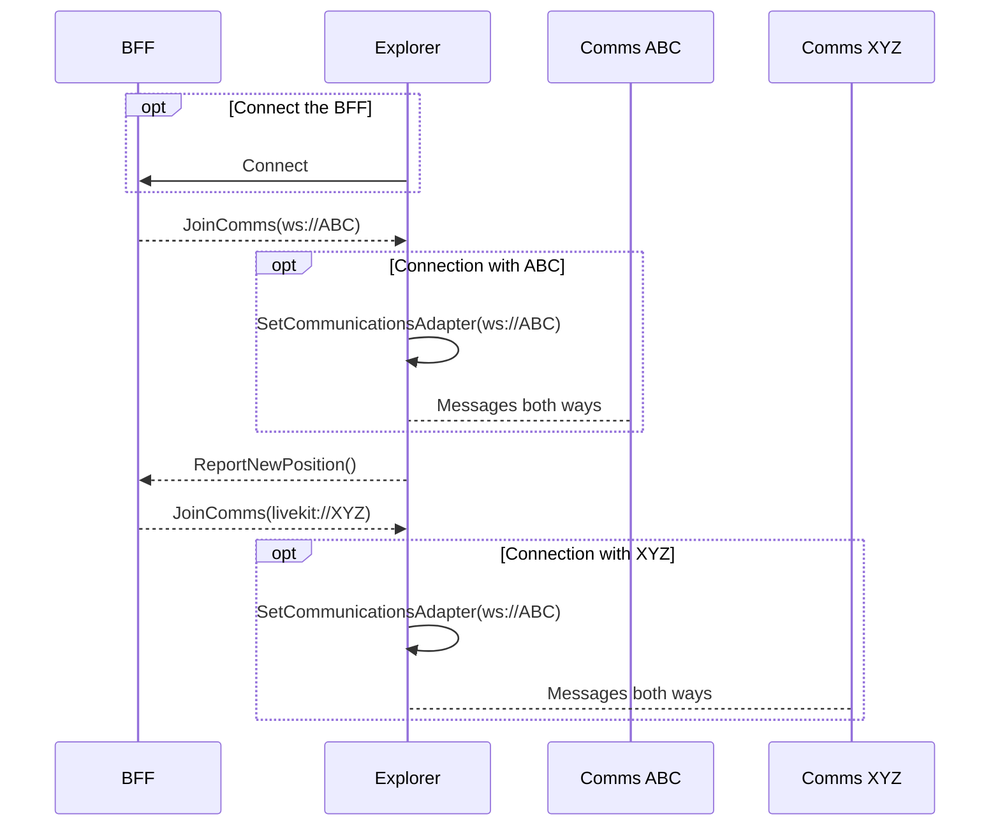

## Abstract

This document describes the minimum communications interface to be used with any Decentraland Explorer. The content of this ADR is based on the results of the implementation of RFC-4 and RFC-5. The communications interface has some characteristics:
- Connects with multiple peers, each peer is identified by their unique Ethereum address
- Peers can't have two connections to the same comms interface
- The interface must be able to send and receive messages from these peers
- Has to validate the addresses in order to trust them
- The actual implementation of the interface is swappable at runtime (changing realms, islands, rooms, private servers, etc).
- At minimum, the interface must ensure broadcast capabilities with all peers. 1-to-1 optimizations are possible but should be transparent to the interface.
- The `.send` can be hinted to be RELIABLE (must ensure all messages are delivered)

The actual proposed code interface has events and methods. Typescript will be used to illustrate the behavior. The `Emmiter` is assumed to be [mitt](https://www.npmjs.com/package/mitt)

```typescript
interface MinimumCommunicationsAdapter {
  /**
   * The .send method is used to send information to all the peers
   * connected to this adapter. The hints can be used to tweak the
   * default behavior of the adapter.
   */
  send(data: Uint8Array, hints: SendHints): void
  /**
   * The .connect() method resolves when the connection with the
   * adapter was successful and it is ready to send and receive
   * messages.
   */
  connect(): Promise<void>
  /**
   * The .disconnect() method can optionally receive an error that will
   * be bubbled up in the DISCONNECTED event. It should be used to
   * notify the user about possible network errors and to help with the
   * UX of the explorer.
   */
  disconnect(error?: Error): Promise<void>

  /**
   * Event emitter (mitt) with all the events produced by the adapter.
   */
  events: Emmiter<{
    DISCONNECTION: AdapterDisconnectedEvent
    PEER_DISCONNECTED: PeerDisconnectedEvent
    message: AdapterMessageEvent
    error: Error
  }>
}

type SendHints = { reliable: boolean }

// DISCONNECTION
type AdapterDisconnectedEvent = {
  // Whether or no the reason of disconnection was that we logged in on
  // a different session
  kicked: boolean
  // Optional error
  error?: Error
}

// PEER_DISCONNECTED
type AdapterDisconnectedEvent = {
  // The ethereum address of the disconnected peer
  address: string
}

// message
type AdapterMessageEvent = {
  // The ethereum address of the sender
  address: boolean
  data: Uint8Array
}
```

This interface was designed with extensibility in mind and abstracting all the necessary functions to make Decentraland work. The communications protocol that is transferred using this Adapter is defined in the [RFC-4](/rfc/RFC-4).

## Lifecycle of an Adapter

The session of Decentraland may be rather stateful, the explorer depends on content servers, feature flags, blockchain nodes and TheGraph nodes and lastly the communication servers or schemas themselves. To handle that complexity, a stateful CommunicationsDirector is used. In practice, the BFF (link) implements a service in charge of the functions of the CommunicationsDirector, the BFF connects the positions with Archipelago and then forwards the JoinComms messages to the Explorer.

Among its functions, the CommunicationsDirector receives a live stream of information about the position of each connected peer and thanks to that, server-side optimizations can be performed i.e. [real-time clustering of users in Islands (ADR-35)](/adr/ADR-35).

It is important to notice that the Communications Adapter and the CommunicationsDirector should have decoupled lifecycles.

The CommunicationsDirector by itself DOES NOT provide any communications capabilities as the adapter would do, but instead it sends information about which Adapter should be connected at all times. The Explorer MUST listen to this stream of "JoinComms(connectionString)" to create and connect the adapters.

Therefore, we can infer that during a CommunicationsDirector session, one or multiple adapters can be configured, allowing only one at once. The down-to-earth example of this is the Islands behavior, in which walking from one physical location to another connects us first with a group of people (island1) in the first location and then to a different group (island2) in the second location.



### Implementation suggestions using sagas

```typescript
function* program() {
  yield fork(communicationsDirectorMainLoop)
  yield fork(communicationsAdapterMainLoop)
}

function* communicationsDirectorMainLoop() {
  let director: CommunicationsDirector

  while (true) {
    const newCatalystEvent = yield take(SET_NEW_CATALYST_URL)

    // disconnect previous adapter
    yield director?.disconnect()

    director = new CommunicationsDirector(
      newCatalystEvent.directorService
    )
    positionsObservable.on('position', pos =>
      director.notifyPosition(pos)
    )
    director.on('setCommunicationsAdapter', (url) => {
      yield put(SET_COMMS_ADAPTER(url))
    })
  }
}

function* communicationsAdapterMainLoop() {
  let communicationsAdapter: MinimumCommunicationsAdapter

  while (true) {
    const newAdapterEvent = yield take(SET_COMMS_ADAPTER)

    // disconnect previous adapter
    yield communicationsAdapter?.disconnect()
    unbindCommsMessages(communicationsAdapter)

    communicationsAdapter =
      createCommunicationsAdapter(newAdapterEvent.url)

    bindCommsMessages(communicationsAdapter)
  }
}
```