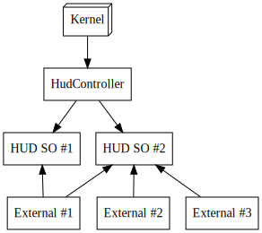

# Custom UI modes for builder in world

## Context and Problem Statement

When switching in and out of the builder in world, we need some way to switch the hide/show state of arbitrary UI elements of the explorer.

Right now, the show/hide interface responsibility is defined within the `HUDController` class.

Currently, `HUDController` has the following responsibilities:

**Kernel <> renderer bridge**

Kernel sends messages directly to this class for interaction

**HUD Factory**

Self-explanatory. Related to instancing the actual HUD elements.

**HUD Initialization**

Sometimes, special initialization should be performed after the HUDs are instanced.

**HUD Composite**

The references to the instanced HUD components are stored in this class.

<!--
```dot
digraph G {

	subgraph cluster_0 {
		#style=filled;
		#color=lightgrey;
		node [style=filled shape=rect];
        a0 -&gt; a1 -&gt; a2;
		label = "HUDController";
    }

	start -&gt; a0;

    a0 [label="Bridge"]
    a1 [label="Factory"]
    a2 [label="Composite"]
    a3 [label="HUD Elements" shape=rect]

    edge [dir="back"]
    a2 -&gt; a3

	start [label="Kernel" shape=box3d];
}
```
-->


## Use cases

**Show/hide of UI elements**

Despite `HUDController` existing interface for showing/hiding any HUD element, a lot of times this functionality can't be used because of how this class assembly is referencing every other HUD assembly.

Most of the times we are faced with cyclic assembly references issues and we are forced to work around this issue.

**Inter-HUD interaction**

In some cases, we want a composite architecture, where one HUD depends on the state of the others.

For instance, when implementing the private chat window we had to write callbacks on `HUDController` itself to be able to wire the back button to the opening of the friends tab. This broke the encapsulation and made the HUD flow harder to follow.

There are more examples of this kind of responsibility bloat [here](https://github.com/decentraland/explorer/blob/56a5478e004d8a6e678d75cd4b4132c18d33d8de/unity-client/Assets/Scripts/MainScripts/DCL/Controllers/HUD/HUDController.cs#L457).

## Considered options

**Distribute the different HUDController responsibilities to individual systems**

This implies a refactor and is the most likely solution that would take care of our use cases niftly, however it would take a bit of design and coding work, because `HUDController` is pretty intertwined with our current kernel <> renderer communication and the HUD system foundation.

<!--
```dot
digraph G {


	start -&gt; a0 -&gt; a1 -&gt; a2;

    a0 [label="HUD Bridge" shape=rect]
    a1 [label="HUD Factory" shape=rect]
    a2 [label="HUD Composite" shape=rect]
	start [label="Kernel" shape=box3d];

    edge [dir="back"]

    a2 -&gt; e0
    a2 -&gt; e1
    a2 -&gt; e2
    e0 [label="External #1"]
    e1 [label="External #2"]
    e2 [label="External #3"]
}
```
-->


**Move the HUD status responsibility to individual ScriptableObjects**

This would allow an easy approach to handle the show/hide use case. However, it doesn't fix the issue for Inter-HUD interaction. The idea is to have a single SO for HUD element, and then suscribe from them in `HUDController`.

Note that this solution places even more responsibility burden on `HUDController`, however it does so in a way that should easy to handle and move around later when we get to the root improvement.

<!--
```dot
digraph G {
    node [shape=rect]

    a0 [label="HudController" ]
    so1 [label="HUD SO #1"]
    so2 [label="HUD SO #2"]
	start [label="Kernel" shape=box3d];

    ext0 [label="External #1"]
    ext1 [label="External #2"]
    ext2 [label="External #3"]

	start -&gt; a0;

    a0 -&gt; so1
    a0 -&gt; so2

    edge [dir="back"]
    so1 -&gt; ext0
    so2 -&gt; ext0

    so2 -&gt; ext1
    so2 -&gt; ext2
}
```
-->



## Decision

We agreed upon implementing the ScriptableObjects solution as a first stage, and then perform the responsibility segregation redesign on the `HUDController` class later.

## Status

Accepted.

## Consequences

HUDs will be able to be toggled from any part of the project quite easily. `HUDController` will still suffer from having many responsibilities, however, the decentralized approach of the solution will keep the tech debt manageable

## Participants

Date: 2020-11-02

- Brian

- Adrian
