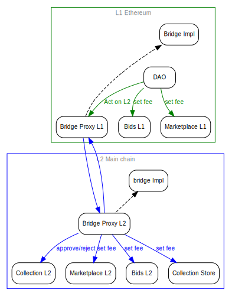

# L1 & L2 Governance Smart Contracts Architecture

## Context and Problem Statement

For L1, Decentraland has a DAO where people, part of the community, can vote and make decisions from basic signaling to executing an on-chain action.

Decentraland needs to scale and give a better experience to its users by using an L2 (second layer).

Users will interact with the same set of smart contracts like the Marketplace and Bid in L1, and new

ones like the upcoming store for collections' primary sales. Every smart contract which uses MANA but, not only, has

protocol parameters that must be managed by some kind of governance.

So far, DAO voting power is based on the user's wrapped MANA and LAND balance in **L1**.

This document presents alternatives on how to manage governance in L2.

## Alternatives

### Alternative 1: DAO (exact) replication in L2

- Decentraland will deploy an Aragon Organization in L2.

- Users will act as in L1.

- Signaling and on-chain actions will happen as in L1.

### Alternative 2: Govern L2 from L1 - Governance Box

- Decentraland will create a mechanism to transmit off and on-chain decisions to the L2 by using **a bridge**.

#### Use cases

- A user creates a vote on L1 to change the fee on the Marketplace in L2.

- The vote has passed and is ready to be enacted.

- The vote enactment transaction will end up sending the _set fee_ message to the L1 bridge. The L1 bridge will forward the message to the L2 bridge, who will set the fee on the Marketplace in L2.

<!--
```dot
// 
digraph {
    rankdir=TB
    graph [fontname = "arial", fontsize="10", color="grey", fontcolor="grey"]
    node [fontname = "arial",fontsize="10", shape="box", style="rounded"]
    edge [fontname = "arial",color="blue", fontcolor="black",fontsize="10"]

    subgraph clusterL1 {
        color=green
        label="L1 Ethereum"
        marketplace_l1 [label="Marketplace L1"]
        bid_l1 [label="Bids L1"]
        bridge_proxy_l1 [label="Bridge Proxy L1"]
        bridge_l1 [label="Bridge Impl"]
        dao [label="DAO"]

        edge [fontname = "arial",color="blue", fontcolor=green, fontsize="10"];
        bridge_proxy_l1 -&gt; bridge_l1 [style=dashed, color=black]
        dao -&gt; marketplace_l1  [color=green, label="set fee"]
        dao -&gt; bid_l1  [color=green, label="set fee"]
        dao -&gt; bridge_proxy_l1 [color=green, fontColor="green", label="Act on L2"]
    }

     subgraph clusterL2 {
        color=blue
        label="L2 Main chain"
        collection_l2 [label="Collection L2"]
        marketplace_l2 [label="Marketplace L2"]
        bid_l2 [label="Bids L2"]
        bridge_proxy_l2 [label="Bridge Proxy L2"]
        bridge_l2 [label="bridge Impl"]
        store_l2 [label="Collection Store"]

        edge [fontname = "arial",color="blue", fontcolor=blue,fontsize="10"];
        bridge_l2 -&gt; bridge_proxy_l2 [dir=back, style=dashed,color=black]
        bridge_proxy_l2 -&gt; marketplace_l2 [color=blue, label="set fee"]
        bridge_proxy_l2 -&gt; bid_l2  [color=blue, label="set fee"]
        bridge_proxy_l2 -&gt; collection_l2  [color=blue, label="approve/reject"]
        bridge_proxy_l2 -&gt; store_l2  [color=blue, label="set fee" ]
    }

    bridge_proxy_l1 -&gt; bridge_proxy_l2
    bridge_proxy_l2 -&gt; bridge_proxy_l1

    edge[ style = invis ]
    bridge_l1 -&gt; { dao, marketplace_l1 }
    {dao marketplace_l1 bid_l1 bridge_proxy_l1 bridge_l1 } -&gt; bridge_l2
}
```
-->



### Alternative 3: Govern L2 from L1 - Governance Branches

- Decentraland will create a mechanism to transmit off and on-chain decisions to the L2 by using **bridges**.

#### Use cases

##### UC1

- A user creates a vote on L1 to change the fee on the Marketplace in L2.

- The vote has passed and is ready to be enacted.

- The vote enactment transaction will end up sending the _set fee_ message to the L1 Marketplaces Management bridge. The L1 Marketplaces Management bridge will forward the message to the L2 Marketplaces Management bridge, who will set the fee on the Marketplace in L2.

##### UC2

- A user creates a vote on L1 to reject a collection in L2.

- The vote has passed and is ready to be enacted.

- The vote enactment transaction will end up sending the _reject collection_ message to the L1 Collections Management bridge. The L1 Collections Management bridge will forward the message to the L2 Collections Management bridge, who will reject the desired collection.

<!--
```dot
// 
digraph {
    rankdir=TB
    graph [fontname = "arial", fontsize="10", color="grey", fontcolor="grey"]
    node [fontname = "arial",fontsize="10", shape="box", style="rounded"]
    edge [fontname = "arial",color="blue", fontcolor="black",fontsize="10"]

    subgraph clusterL1 {
        color=green
        label="L1 Ethereum"

        dao [label="DAO"]
        marketplace_l1 [label="Marketplace L1"]
        bid_l1 [label="Bids L1"]
        bridge_marketplaces_management_proxy_l1 [label="Bridge\n Marketplaces Management\n Proxy L1"]
        bridge_marketplaces_management_l1 [label="Bridge\n Marketplaces Management\n Impl"]
        bridge_collections_management_proxy_l1 [label="Bridge\n Collections Management\n Proxy L1"]
        bridge_collections_management_l1 [label="Bridge\n Collections Management\n Impl"]

        edge [fontname = "arial",color="blue", fontcolor=green,fontsize="10"];
        bridge_marketplaces_management_l1 -&gt; bridge_marketplaces_management_proxy_l1 [dir=back, style=dashed, color=black]
        bridge_collections_management_l1 -&gt; bridge_collections_management_proxy_l1 [dir=back, style=dashed, color=black]
        dao -&gt; bridge_marketplaces_management_proxy_l1 [color=green,fontColor="green", label="Act on L2"]
        dao -&gt; bridge_collections_management_proxy_l1 [color=green,fontColor="green", label="Act on L2"]
        dao -&gt; marketplace_l1  [color=green, label="set fee"]
        dao -&gt; bid_l1  [color=green, label="set fee"]
    }

     subgraph clusterL2 {
        color=blue
        label="L2 Main chain"

        bridge_marketplaces_management_proxy_l2 [label="Bridge\n Marketplaces Management\n Proxy L2"]
        bridge_marketplaces_management_l2 [label="Bridge\n Marketplaces Management\n Impl"]
        bridge_collections_management_proxy_l2 [label="Bridge\n Collections Management\n Proxy L2"]
        bridge_collections_management_l2 [label="Bridge\n Collections Management\n Impl"]
        collection_l2 [label="Collection L2"]
        marketplace_l2 [label="Marketplace L2"]
        bid_l2 [label="bids L2"]
        store_l2 [label="Collection Store"]

        edge [fontname = "arial",color="blue", fontcolor=blue,fontsize="10"];
        bridge_marketplaces_management_proxy_l2 -&gt; bridge_marketplaces_management_l2 [style=dashed, color=black]
        bridge_collections_management_proxy_l2 -&gt; bridge_collections_management_l2 [style=dashed, color=black]
        bridge_marketplaces_management_proxy_l2 -&gt; marketplace_l2 [color=blue, label="set fee"]
        bridge_marketplaces_management_proxy_l2 -&gt; bid_l2  [color=blue, label="set fee"]
        bridge_marketplaces_management_proxy_l2 -&gt; store_l2  [color=blue, label="set fee" ]
        bridge_collections_management_proxy_l2 -&gt; collection_l2  [color=blue, label="approve/reject"]
    }

    bridge_marketplaces_management_proxy_l1 -&gt; bridge_marketplaces_management_proxy_l2
    bridge_marketplaces_management_proxy_l2 -&gt; bridge_marketplaces_management_proxy_l1
    bridge_collections_management_proxy_l1 -&gt; bridge_collections_management_proxy_l2
    bridge_collections_management_proxy_l2 -&gt; bridge_collections_management_proxy_l1

    edge[ style = invis ]
    { bridge_marketplaces_management_l1 bridge_collections_management_l1 } -&gt; { dao, marketplace_l1 }
    { bridge_marketplaces_management_proxy_l1 bid_l1  } -&gt; { bridge_marketplaces_management_proxy_l2 bridge_collections_management_proxy_l2 }
    { marketplace_l2 bid_l2 store_l2 collection_l2 } -&gt; { bridge_marketplaces_management_l2 bridge_collections_management_l2  }
}
```
-->


## Decision Outcome

### Alternative 1

#### Pros

- N/A

### Cons

- A lot of MANA locked on each layer.

- Voting Power divided between layers that can not be summed for on-chain voting.

### Implications

- Users will need to transfer MANA between layers and wrap it before a proposal started.

- Users won't be able to use all the voting power together.

- LAND and Estate smart contracts along with their bridges should be deployed in L2 to be used as voting power.

- Votes will be cheaper in L2 than L1.

### Alternative 2 ✅ ✅

### Pros

- Users will have all their voting power in L1.

### Cons

- Risky by transmitting all the messages by the same bridge. A smart contract upgrade and a marketplace fee change will go to the same smart contract.

### Implications

- Votes must still happen in L1.

### Alternative 3 ✅ (Could be an iteration from alternative 2)

### Pros

- Users will have all their voting power in L1.

- We can have different implementations on each bridge.

### Cons

- N/A

### Implications

- Votes must still happen in L1.

- Clear execution paths.

## Open Questions

- **Do we want to have a DAO in L2?**: No.

- **Does it work with snapshots?**: Depends on Aragon releases. It should be alternatives 2 or 3, voting power should be in L1.

- **Comparison between gas prices between alternatives**: Probably alternative 3 is marginally cheaper due to lack of checks.

  Alternative 1 is completely different in nature and is hard to compare.

- **What are the use cases for L2**: Use cases are similar to what we have in L1 (marketplace fees, collections, moderation).

- **Should we consider gas costs for the user in the decision framework?**

  - This document doesn't take into account user prices.

  - We should wait to see the release from Aragon (govern with snapshot) to evaluate possibilities, there is not much we can do to make L1 voting cheaper.

  - There are alternatives for frequent voting (i.e. collections) using a group with privileges in L2 (committee).

  - Unfrequent voting (like marketplace fees and committee members changes) can be kept in L1, while frequent voting (collection moderation) can happen in L2.
