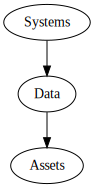
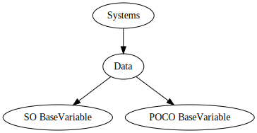

# 2020-11-05 - Unity data store architecture

## Context and Problem Statement

In many use cases, we have a lot of data that needs to be accesed on almost a project-wide (or module-wide) scope.

This need brought us to define a standarized approach for data storage. 

This approach should cover the following use cases:

* Maintenance ease: new fields should be easy to add, modify and retrieve.

* Need to know when specific data points change to react accordingly.

* Cyclic assembly references prevention. Data as a leaf node of the dependency graph.

* Easy to mock.

In the current state, this kind of necessity is covered by a few static classes wrapped around Unity `ScriptableObjects`.

Each of field of the static class is a variant of a custom `BaseVariable` type. 

The `BaseVariable` wraps around a value and gives us `OnChange` events.
```csharp
public static class CommonScriptableObjects
{
    private static Vector3Variable playerUnityPositionValue;
    public static Vector3Variable playerUnityPosition => GetOrLoad(ref playerUnityPositionValue, "ScriptableObjects/PlayerUnityPosition");

    private static Vector3Variable playerWorldPositionValue;
    public static Vector3Variable playerWorldPosition => GetOrLoad(ref playerWorldPositionValue, "ScriptableObjects/PlayerWorldPosition");

    private static Vector3Variable playerUnityEulerAnglesValue;
    public static Vector3Variable playerUnityEulerAngles => GetOrLoad(ref playerUnityEulerAnglesValue, "ScriptableObjects/PlayerUnityEulerAngles");

    private static Vector3Variable playerUnityToWorldOffsetValue;
    ...
}
```

Using `ScriptableObject` instances like this has the following boons:

- As they are serialized assets, they can be referenced from scenes, another assets, etc.

- We can look up their value from Unity editor to debug.

- When working with artists and designers, we can give them a tool to parametrize certain values.

However, we are looking at these downsides too:

- Serialized assets means that each field is going to take space on our Unity bundle. Small space, but still.

- Having hardcoded paths on the static class. Not very maintainable as moving assets around can break the code.

- Having to wrap every access in a `GetOrLoad` call that internally uses `Resources.Load`. This has a bit of overhead that we could prevent.

## Considered Options

### ScriptableObject-based data storage

We have a data storage of `BaseVariables` that inherit from `ScriptableObject` (SO). Adding a new field would involve adding a new asset to the project and wire a new `GetOrLoad` call with the resource path, as we are doing now.

<!--
```dot
# Find examples at https://graphviz.org/gallery/
digraph G {
Systems-&gt;Data
Data-&gt;Assets
}
```
-->


### Boundary agnostic data storage

We have a data storage of `BaseVariables` that are either an interface or a plain old C# object (POCO). On the side, we have a specific ScriptableObject-based `BaseVariable` implementation. This will give us the versatility of choosing between POCO and the `ScriptableObject` version on a per-use basis. 

<!--
```dot
# Find examples at https://graphviz.org/gallery/
digraph G {


Systems-&gt;Data
Data-&gt;Assets
Data-&gt;Data_State

Data_State [label="POCO BaseVariable"]
Assets [label="SO BaseVariable"]
}
```
-->


## Decision Outcome

We choose to be boundary agnostic because this will give us the versatility of using the best approach for any situation. We discussed that in case of going for POCO and needing an SO later, the need refactoring work would be very low.

By choosing to deliberately use a data store pattern, we can name it accordingly and define the system responsibilities in a more direct way than we have now.

Also, we have the added benefit of a more cohesive design between Kernel and Unity, because Kernel already has the redux data store concept. 

## Participants

- Alex

- Santi

- Pato

- Pravus

- Brian
